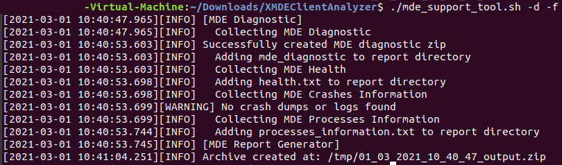

# macOS 및 Linux에서 클라이언트 분석기 실행

**적용 대상:**
- [엔드포인트용 Microsoft Defender](https://go.microsoft.com/fwlink/p/?linkid=2146631)

## GUI 시나리오를 통해 분석기 실행

1. [XMDE 클라이언트 분석기](https://aka.ms/XMDEClientAnalyzer) 도구를 조사해야 하는 macOS 또는 Linux 컴퓨터로 다운로드합니다.

   > [!NOTE]
   > 위의 링크에서 다운로드한 'XMDEClientAnalyzer.zip'의 현재 SHA256 해시: '34C7F043211575544BB2C9CE30AB0998172066E44CD51E1CA018EDE9C96AB834'.

2. 컴퓨터의 콘텐츠 XMDEClientAnalyzer.zip 추출합니다.

3. 터미널 세션을 열고 디렉터리를 추출된 위치로 변경한 후 다음을 실행합니다.

   `./mde_support_tool.sh -d`

   > [!NOTE]
   > Linux에서 스크립트 실행 권한이 없는 경우 먼저 실행해야 합니다.
   >
   > `chmod a+x mde_support_tool.sh`

## 터미널 또는 SSH 시나리오를 사용하여 분석기 실행

관련 컴퓨터로 터미널 또는 SSH를 열고 다음 명령을 실행합니다.

1. `wget --quiet -O XMDEClientAnalyzer.zip https://aka.ms/XMDEClientAnalyzer`

2. `unzip -q XMDEClientAnalyzer.zip`

3. `cd XMDEClientAnalyzer`

4. `chmod +x mde_support_tool.sh`

3. 루트가 아닌 사용으로 실행하여 필요한 pip 및 lxml 구성 요소를 설치합니다. `./mde_support_tool.sh`

4. 실제 진단 패키지를 수집하고 결과 보관 파일을 생성하기 위해 루트로 다시 실행합니다. `./mde_support_tool.sh -d`

> [!NOTE]
> - Linux의 경우 분석기에서 결과 출력을 생성하려면 'lxml'이 필요합니다. 설치되지 않은 경우 분석기는 아래 python 패키지에 대한 공식 리포지토리에서 이를 페치하려고 시도합니다. <https://files.pythonhosted.org/packages/\*/lxml\*.whl>
> 
> - 또한 이 도구는 현재 Python 버전 3 이상을 설치해야 합니다.
>
> - Python 3을 사용할 수 없는 컴퓨터 또는 lxml 구성 요소를 페치할 수 없는 컴퓨터의 경우 요구 사항이 없는 이진 기반 버전의 분석기를 다운로드할 수 있습니다. [XMDE 클라이언트](https://aka.ms/XMDEClientAnalyzerBinary) 분석기 이진
>
> - 장치가 프록시 뒤에 있는 경우 프록시 서버를 환경 변수로 mde_support_tool.sh 스크립트에 전달할 수 있습니다. 예: `https_proxy=https://myproxy.contoso.com:8080 ./mde_support_tool.sh"`

예제:

추가 구문 도움말:

**-h** \# 도움말 
\# 도움말 메시지 표시

**성능** \# 성능 
\# 요구 시 재현할 수 있는 성능 문제를 분석하기 위한 광범위한 추적을 수집합니다. 를 `--length=<seconds>` 사용하여 벤치마크 기간을 지정합니다.

**-o** \# 출력 
\# 결과 파일의 대상 경로 지정

**-nz** \# No-Zip 
\# 설정된 경우 결과 보관 파일 대신 디렉터리가 만들어집니다.

**-f** \# Force 
\# 대상 경로에 출력이 이미 있는 경우 덮어써야 합니다.

## macOS 및 Linux의 결과 패키지 콘텐츠

- report.html

  설명: 분석기 스크립트가 컴퓨터로 실행될 수 있는 결과 및 지침을 포함할 기본 HTML 출력 파일입니다.

- mde_diagnostic.zip

  설명: 두 [macOS에서](/windows/security/threat-protection/microsoft-defender-atp/mac-resources#collecting-diagnostic-information) *mdatp* 진단 만들기를 실행하면 생성되는 동일한 진단 출력

  또는

  [Linux](/windows/security/threat-protection/microsoft-defender-atp/linux-resources#collect-diagnostic-information)

- mde.xml

  설명: 실행 중 생성되고 html 보고서 파일을 작성하는 데 사용되는 XML 출력입니다.

- Processes_information.txt

  설명: 시스템에서 끝점 관련 프로세스에 대해 실행 중인 Microsoft Defender의 세부 정보를 제공합니다.

- Log.txt

  설명: 데이터 수집 중에 화면에 작성된 동일한 로그 메시지를 포함

- Health.txt

  설명: *mdatp* 상태 명령을 실행하면 표시되는 기본 상태 출력과 동일합니다.

- Events.xml

  설명: HTML 보고서를 구축할 때 분석기에서 사용하는 추가 XML 파일입니다.

- Auditd_info.txt

  설명: Linux OS에 대한 감사된 서비스 및 관련 구성 [요소에](/windows/security/threat-protection/microsoft-defender-atp/linux-support-events) 대한 세부 정보

- perf_benchmark.tar.gz

  설명: 성능 테스트 보고서입니다. 성능 매개 변수를 사용하는 경우 이 매개 변수만 볼 수 있습니다.
