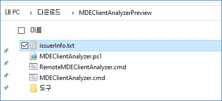
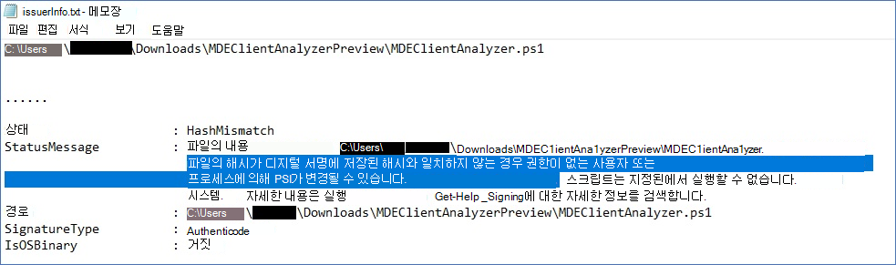

# <a name="run-the-client-analyzer-on-windows"></a>Windows에서 클라이언트 분석기 실행

**적용 대상:**
- [엔드포인트용 Microsoft Defender](https://go.microsoft.com/fwlink/p/?linkid=2146631)


1. [MDE 클라이언트](https://aka.ms/mdatpanalyzer) 분석기 도구를 조사해야 Windows 컴퓨터로 다운로드합니다.

2. 컴퓨터의 콘텐츠 MDEClientAnalyzer.zip 추출합니다.

3. 승격된 명령줄을 열기:
    1. **시작**(으)로 이동하고 **cmd** 를 입력하십시오.
    2. **명령 프롬프트** 을(를) 마우스 오른쪽 버튼으로 클릭하고 **관리자**(으)로 실행을 선택합니다.

4. 다음 명령을 입력하고 **Enter** 를 누릅니다.

   ```dos
   HardDrivePath\MDEClientAnalyzer.cmd
   ```

   **HardDrivePath를 도구가 추출된 경로로 바 대체합니다. 예를 들면 다음과 같습니다.**

   ```dos
   C:\Work\tools\MDATPClientAnalyzer\MDEClientAnalyzer.cmd
   ```

위 외에도 라이브 응답을 사용하여 분석기 지원 로그를 [수집하는 옵션도 있습니다.](troubleshoot-collect-support-log.md)

> [!NOTE]
> Windows 10, Windows Server 2019 이상 OS 버전 또는 Windows 11 클라이언트 분석기 스크립트는 호출된 실행 파일을 호출하여 클라우드 서비스 URL에 대한 연결 테스트를 `MDEClientAnalyzer.exe` 실행합니다.
>
> Windows 8.1, Windows Server 2016 또는 이전 OS 버전에서 클라이언트 분석기 스크립트는 CnC(명령 및 제어) URL에 대한 연결 테스트를 실행하기 위해 호출된 실행 파일로 호출하고 사이버 데이터 채널 URL에 대한 Microsoft Monitoring Agent 연결 도구로 `MDEClientAnalyzerPreviousVersion.exe` `TestCloudConnection.exe` 호출합니다.


분석기에 포함된 모든 PowerShell 스크립트 및 모듈은 Microsoft에서 서명합니다.
파일이 수정된 경우 분석기는 다음 오류와 함께 종료될 것으로 예상됩니다.


이 오류가 표시되어 있는 경우 issuerInfo.txt 파일에 대한 자세한 정보가 표시됩니다.




수정 후의 MDEClientAnalyzer.ps1 예시:




## <a name="result-package-contents-on-windows"></a>결과 패키지 콘텐츠가 Windows

> [!NOTE]
> 캡처된 정확한 파일은 다음 요인에 따라 변경될 수 있습니다.
>
> - 분석기가 실행되는 창의 버전입니다.
> - 컴퓨터의 이벤트 로그 채널 가용성
> - 센서의 EDR 상태입니다(컴퓨터가 아직 온보드되어 있지 않은 경우 센스가 중지됨).
> - 고급 문제 해결 매개 변수를 분석기 명령과 함께 사용한 경우

기본적으로 언팩되지 않은 MDEClientAnalyzerResult.zip 파일에는 다음 항목이 포함되어 있습니다.

- MDEClientAnalyzer.htm

  이 파일은 컴퓨터의 분석기 스크립트가 실행할 수 있는 결과 및 지침을 포함하는 기본 HTML 출력 파일입니다.

- SystemInfoLogs \[ 폴더\]
  - AddRemovePrograms.csv

    설명: 레지스트리에서 수집된 x64 OS 소프트웨어에 설치된 x86 소프트웨어 목록입니다.

  - AddRemoveProgramsWOW64.csv

    설명: 레지스트리에서 수집된 x64 OS 소프트웨어에 설치된 x86 소프트웨어 목록입니다.

    - CertValidate.log

      설명: [CertUtil을](/windows-server/administration/windows-commands/certutil)호출하여 실행된 인증서 해지의 자세한 결과입니다.

    - dsregcmd.txt

      설명: [dsregcmd를 실행한 결과입니다.](/azure/active-directory/devices/troubleshoot-device-dsregcmd) 컴퓨터의 Azure AD 상태에 대한 세부 정보를 제공합니다.

    - IFEO.txt

      설명: 머신에 구성된 이미지 [파일 실행](/previous-versions/windows/desktop/xperf/image-file-execution-options) 옵션 출력

    - MDEClientAnalyzer.txt

      설명: 분석기 스크립트 실행에 대한 세부 정보가 표시된 자세한 텍스트 파일입니다.

    - MDEClientAnalyzer.xml

      설명: 분석기 스크립트 결과를 포함하는 XML 형식입니다.

    - RegOnboardedInfoCurrent.Json

      설명: 레지스트리에서 JSON 형식으로 수집된 등록된 컴퓨터 정보입니다.

  - RegOnboardingInfoPolicy.Json

    설명: 레지스트리에서 JSON 형식으로 수집된 등록 정책 구성입니다.

    - SCHANNEL.txt

      설명: 레지스트리에서 수집된 컴퓨터와 같이 머신에 적용된 [SCHANNEL](/windows-server/security/tls/manage-tls) 구성에 대한 세부 정보입니다.

    - SessionManager.txt

      설명: 세션 관리자 특정 설정이 레지스트리에서 수집됩니다.

    - SSL_00010002.txt

      설명: 레지스트리에서 수집된 컴퓨터로 적용된 [SSL](/windows-server/security/tls/manage-tls) 구성에 대한 세부 정보입니다.

- EventLogs [Folder]

  - utc.evtx

    설명: DiagTrack 이벤트 로그 내보내기

  - senseIR.evtx

    설명: 자동화된 조사 이벤트 로그 내보내기

  - sense.evtx

    설명: 센서 기본 이벤트 로그 내보내기

  - OperationsManager.evtx

    설명: Microsoft Monitoring Agent 로그 내보내기


## <a name="see-also"></a>참고 항목

- [클라이언트 분석기 개요](overview-client-analyzer.md)
- [클라이언트 분석기 다운로드 및 실행](download-client-analyzer.md)
- [Windows에서 고급 문제 해결을 위한 데이터 수집](data-collection-analyzer.md)
- [분석기 HTML 보고서 이해](analyzer-report.md)
