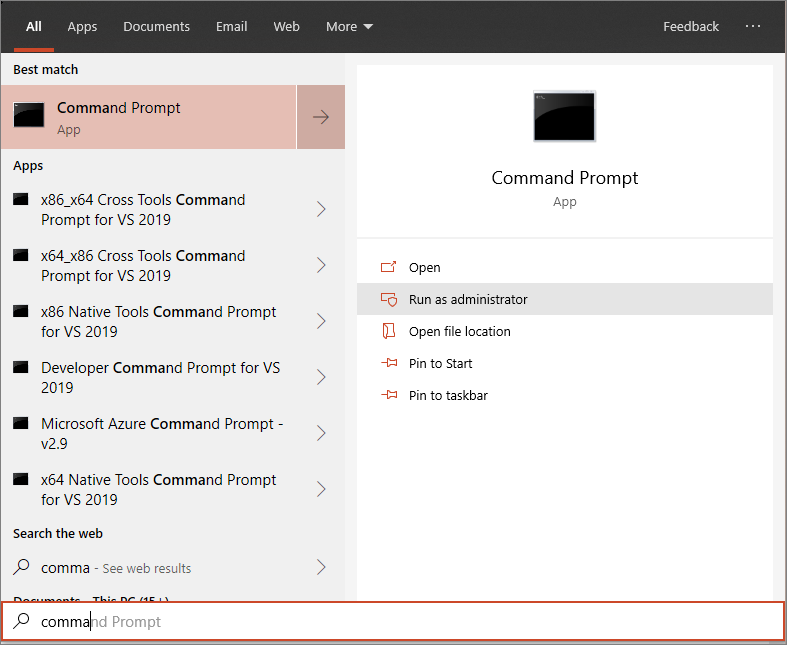

# <a name="run-a-detection-test-on-a-newly-onboarded-microsoft-defender-for-endpoint-device"></a>새로 온보딩된 엔드포인트 디바이스용 Microsoft Defender에서 검색 테스트 실행

[!INCLUDE [Microsoft 365 Defender rebranding](../../includes/microsoft-defender.md)]


**적용 대상:**
- 지원 Windows 10 버전
- Windows Server 2012 R2
- Windows Server 2016
- Windows 서버, 버전 1803
- Windows Server, 2019
- [엔드포인트용 Microsoft Defender](https://go.microsoft.com/fwlink/?linkid=2154037)
- [Microsoft 365 Defender](https://go.microsoft.com/fwlink/?linkid=2118804)

> 엔드포인트용 Microsoft Defender를 경험하고 싶으신가요? [무료 평가판을 신청하세요.](https://signup.microsoft.com/create-account/signup?products=7f379fee-c4f9-4278-b0a1-e4c8c2fcdf7e&ru=https://aka.ms/MDEp2OpenTrial?ocid=docs-wdatp-exposedapis-abovefoldlink)

온보딩 디바이스는 끝점용 Microsoft Defender 서비스에 장치를 추가하는 방법입니다. 디바이스에서 서비스에 신호를 보고할 수 있습니다.

장치가 서비스에 성공적으로 추가된 것이 전체 배포 프로세스에서 중요한 단계입니다.

## <a name="verify-onboarding-using-a-detection-test"></a>검색 테스트를 사용하여 온보더링 확인

새로 온보딩된 장치에서 다음 PowerShell 스크립트를 실행하여 끝점용 Defender 서비스에 올바르게 보고하고 있는지 확인합니다.

1. 폴더 만들기: 'C:\test-MDATP-test'.
2. 디바이스에서 상승된 명령줄 프롬프트를 열고 스크립트를 실행합니다.

   1. **시작**(으)로 이동하고 **cmd** 를 입력하십시오.

   1. 명령 **프롬프트를 마우스 오른쪽 단추로 클릭하고** **관리자 권한으로 실행을 선택합니다.**

      

3. 프롬프트에서 다음 명령을 복사하여 실행합니다.

   ```powershell
   powershell.exe -NoExit -ExecutionPolicy Bypass -WindowStyle Hidden $ErrorActionPreference = 'silentlycontinue';(New-Object System.Net.WebClient).DownloadFile('http://127.0.0.1/1.exe', 'C:\\test-MDATP-test\\invoice.exe');Start-Process 'C:\\test-MDATP-test\\invoice.exe'
   ```

명령 프롬프트 창이 자동으로 닫히게 됩니다. 성공하면 검색 테스트가 완료된 것으로 표시하고 약 10분 후 온보드 장치에 대한 새 경고가 포털에 표시됩니다.

## <a name="related-topics"></a>관련 항목

- [그룹 정책을 통한 Windows 10 장치 온보딩](configure-endpoints.md)
- [서버 온보드](configure-server-endpoints.md)
- [끝점 온보딩 문제에 대한 Microsoft Defender 문제 해결](/microsoft-365/security/defender-endpoint/troubleshoot-onboarding)
