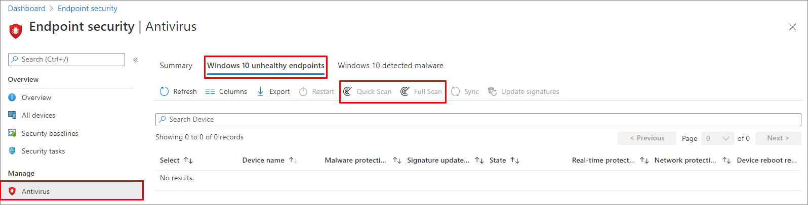

# <a name="configure-and-run-on-demand-microsoft-defender-antivirus-scans"></a>요청 기반 Microsoft Defender 바이러스 백신 검사 구성 및 실행

**적용 대상:**

- [엔드포인트용 Microsoft Defender](/microsoft-365/security/defender-endpoint/)

개별 끝점에서 필요한 경우 검색을 실행할 수 있습니다. 이러한 검사는 즉시 시작하며 위치 또는 유형과 같은 검사에 대한 매개 변수를 정의할 수 있습니다. 검색을 실행할 때 빠른 검사, 전체 검사 및 사용자 지정 검사의 세 가지 유형 중에서 선택할 수 있습니다. 대부분의 경우 빠른 검색을 사용 합니다. 빠른 검사는 레지스트리 키 및 알려진 시작 폴더와 같이 시스템으로 시작하기 위해 등록된 맬웨어가 있을 수 있는 모든 Windows 검색합니다.

파일을 열고 닫을 때 그리고 사용자가 폴더를 탐색할 때마다 파일을 검토하는 실시간 보호와 함께 빠른 검사가 시스템 및 커널 수준 맬웨어로 시작되는 맬웨어를 강력한 보호하는 데 도움이 됩니다. 대부분의 경우 빠른 검사만으로 충분하며 예약된 검사 또는 요구 시 검사에 권장되는 옵션입니다. [검사 유형에 대해 자세히 알아보시다.](schedule-antivirus-scans.md#quick-scan-full-scan-and-custom-scan)

> [!IMPORTANT]
> Microsoft Defender 바이러스 백신 로컬 검색을 수행할 때 [LocalSystem](/windows/win32/services/localsystem-account) 계정의 컨텍스트에서 실행됩니다. 네트워크 검사의 경우 디바이스 계정의 컨텍스트를 사용합니다. 도메인 장치 계정에 공유에 액세스할 수 있는 적절한 권한이 없는 경우 검사가 작동하지 않습니다. 디바이스에 액세스 네트워크 공유에 대한 사용 권한이 있는지 확인합니다.

## <a name="use-microsoft-endpoint-manager-to-run-a-scan"></a>검색 Microsoft Endpoint Manager 실행

1. Microsoft Endpoint Manager 관리 센터()로 [https://endpoint.microsoft.com](https://endpoint.microsoft.com) 이동하여 로그인합니다.

2. 끝점 **보안 바이러스 백신** \> **을 선택 합니다.**

3. 탭 목록에서 Windows 10 끝점 또는 Windows 11 끝점을 **선택합니다.** 

4. 제공된 작업 목록에서  빠른 검사(권장) 또는 전체 검사 **를 선택합니다.**

   [](images/mem-antivirus-scan-on-demand.png#lightbox)

> [!TIP]
> 검색 기능을 사용하여 Microsoft Endpoint Manager 자세한 내용은 맬웨어 방지 및 방화벽 작업: 필요한 경우 검색을 수행하는 [방법을 참조하세요.](/configmgr/protect/deploy-use/endpoint-antimalware-firewall#how-to-perform-an-on-demand-scan-of-computers)

## <a name="use-the-mpcmdrunexe-command-line-utility-to-run-a-scan"></a>명령줄 mpcmdrun.exe 사용하여 검사 실행

다음 매개 `-scan` 변수를 사용합니다.

```console
mpcmdrun.exe -scan -scantype 1
```

전체 검사 시작 또는 경로 정의를 포함하여 도구 및 추가 매개 변수를 사용하는 방법에 대한 자세한 내용은 mpcmdrun.exe [명령줄](command-line-arguments-microsoft-defender-antivirus.md)도구를 사용하여 Microsoft Defender 바이러스 백신.

## <a name="use-microsoft-intune-to-run-a-scan"></a>검색 Microsoft Intune 사용하여 검사 실행

1. Microsoft Endpoint Manager 관리 센터()로 [https://endpoint.microsoft.com](https://endpoint.microsoft.com) 이동하여 로그인합니다.

2. 사이드바에서 장치 **모든** 장치를 선택하고 스캔할 \>  장치를 선택합니다.

3. **...를 선택합니다. 추가 .** 옵션에서 빠른  검사(권장) 또는 전체 **검사 를 선택합니다.**

## <a name="use-the-windows-security-app-to-run-a-scan"></a>앱 Windows 보안 사용하여 검사 실행

개별 [끝점에서](microsoft-defender-security-center-antivirus.md) Windows 보안 실행에 대한 지침은 Windows 보안 앱에서 검사 실행을 참조하세요.

## <a name="use-powershell-cmdlets-to-run-a-scan"></a>PowerShell cmdlet을 사용하여 검사 실행

다음 cmdlet을 사용 합니다.

```PowerShell
Start-MpScan
```

PowerShell과 함께 PowerShell을 사용하는 방법에 대한 자세한 Microsoft Defender 바이러스 백신 [PowerShell cmdlet을](use-powershell-cmdlets-microsoft-defender-antivirus.md) 사용하여 Microsoft Defender 바이러스 백신 [및 Defender cmdlet](/powershell/module/defender/)구성 및 실행을 참조하세요.

## <a name="use-windows-management-instruction-wmi-to-run-a-scan"></a>WMI(Windows 관리 명령)를 사용하여 검사 실행

이 [ **클래스의 Start**](/previous-versions/windows/desktop/defender/start-msft-mpscan) 메서드를 MSFT_MpScan **사용합니다.**

허용되는 매개 변수에 대한 자세한 내용은 [WMIv2](/previous-versions/windows/desktop/defender/windows-defender-wmiv2-apis-portal) API Windows Defender 참조하세요.
