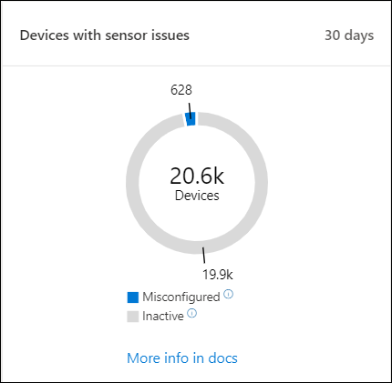

# Microsoft Defender 보안 센터 보안 작업 대시보드Microsoft Defender Security Center Security operations dashboard

[!INCLUDE [Microsoft 365 Defender rebranding](../../includes/microsoft-defender.md)]

**적용 대상:****Applies to:**
- [엔드포인트용 Microsoft DefenderMicrosoft Defender for Endpoint](https://go.microsoft.com/fwlink/?linkid=2154037)

>끝점용 Microsoft Defender를 경험하고 싶나요?Want to experience Microsoft Defender for Endpoint? [무료 평가판에 등록합니다.Sign up for a free trial.](https://www.microsoft.com/microsoft-365/windows/microsoft-defender-atp?ocid=docs-wdatp-secopsdashboard-abovefoldlink) 

보안 **작업 대시보드는** 끝점 검색 및 응답 기능이 표시되어 있는 위치입니다.The **Security operations dashboard** is where the endpoint detection and response capabilities are surfaced. 검색된 위치를 간략하게 개요하고 대응 조치가 필요한 위치를 강조합니다.It provides a high level overview of where detections were seen and highlights where response actions are needed. 

대시보드에 다음 스냅숏이 표시됩니다.The dashboard displays a snapshot of:

- 활성 경고Active alerts
- 위험에 노출된 장치Devices at risk
- 센서 상태Sensor health
- 서비스 상태Service health
- 매일 보고하는 장치Daily devices reporting
- 활성 자동화 조사Active automated investigations
- 자동화된 조사 통계Automated investigations statistics
- 위험에 노출된 사용자Users at risk
- 의심스러운 활동Suspicious activities

경고 및 장치를 탐색하고 조사하여 의심스러운 활동이 네트워크에서 발생된 경우 해당 컨텍스트를 이해하는 데 도움이 될 수 있도록 신속하게 확인할 수 있습니다.You can explore and investigate alerts and devices to quickly determine if, where, and when suspicious activities occurred in your network to help you understand the context they appeared in.

보안 **작업 대시보드에서는** 장치에서 중요한 이벤트 또는 동작을 쉽게 식별할 수 있도록 집계된 이벤트를 볼 수 있습니다.From the **Security operations dashboard** you will see aggregated events to facilitate the identification of significant events or behaviors on a device. 또한 세부적인 이벤트와 낮은 수준의 표시기를 드릴다운할 수 있습니다.You can also drill down into granular events and low-level indicators.

또한 조직의 전반적인 상태를 시각적으로 확인할 수 있는 클릭 가능한 타일도 있습니다.It also has clickable tiles that give visual cues on the overall health state of your organization. 각 타일에는 해당 개요에 대한 자세한 보기가 열립니다.Each tile opens a detailed view of the corresponding overview.

## 활성 경고Active alerts
타일에서 네트워크에서 지난 30일 동안의 전체 활성 경고 수를 볼 수 있습니다.You can view the overall number of active alerts from the last 30 days in your network from the tile. 경고는 신규 및 진행 **중으로** **그룹화됩니다.**Alerts are grouped into **New** and **In progress**.

각 그룹은 해당 경고 심각도 수준으로 더 하위 분류됩니다.Each group is further sub-categorized into their corresponding alert severity levels. 각 경고 링 내부의 경고 수를 클릭하여 해당 범주 큐의 정렬된 보기(신규 또는 진행 **중)를 확인합니다.**Click the number of alerts inside each alert ring to see a sorted view of that category's queue (**New** or **In progress**).

자세한 내용은 [경고 개요를 참조하세요.](alerts-queue.md)For more information see, [Alerts overview](alerts-queue.md).

각 행에는 경고 심각도 범주와 경고에 대한 간단한 설명이 포함됩니다.Each row includes an alert severity category and a short description of the alert. 경고를 클릭하여 자세한 보기를 볼 수 있습니다.You can click an alert to see its detailed view. 자세한 내용은 [Endpoint 경고에 대한 Microsoft Defender](investigate-alerts.md) 조사 및 경고 [개요를 참조하세요.](alerts-queue.md)For more information see,  [Investigate Microsoft Defender for Endpoint alerts](investigate-alerts.md) and [Alerts overview](alerts-queue.md).

## 위험에 노출된 장치Devices at risk
이 타일은 활성 경고가 가장 많은 장치 목록을 보여줍니다.This tile shows you a list of devices with the highest number of active alerts. 각 디바이스에 대한 총 경고 수는 장치 이름 옆에 있는 원으로 표시되고 타일의 맨 끝에 심각도 수준별로 추가 분류됩니다(각 심각도 표시줄 위에 마우스를 다가 레이블을 확인합니다).The total number of alerts for each device is shown in a circle next to the device name, and then further categorized by severity levels at the far end of the tile (hover over each severity bar to see its label).

디바이스의 이름을 클릭하여 해당 장치에 대한 세부 정보를 확인합니다.Click the name of the device to see details about that device. 자세한 내용은 Microsoft Defender for Endpoint Devices 목록에서 장치 [조사를 참조하세요.](investigate-machines.md)For more information see, [Investigate devices in the Microsoft Defender for Endpoint Devices list](investigate-machines.md).

타일 맨  위에 있는 장치 목록을 클릭하여 활성 경고 수별로 정렬된 장치 목록으로 바로 이동하면 됩니다.You can also click **Devices list** at the top of the tile to go directly to the **Devices list**, sorted by the number of active alerts. 자세한 내용은 Microsoft Defender for Endpoint Devices 목록에서 장치 [조사를 참조하세요.](investigate-machines.md)For more information see, [Investigate devices in the Microsoft Defender for Endpoint Devices list](investigate-machines.md).

## 센서 문제가 있는 장치Devices with sensor issues
센서 **문제가 있는 장치** 타일은 끝점용 Microsoft Defender 서비스에 센서 데이터를 제공하는 개별 장치의 능력에 대한 정보를 제공합니다.The **Devices with sensor issues** tile provides information on the individual device’s ability to provide sensor data to the Microsoft Defender for Endpoint service. 주의가 필요한 장치 수를 보고하고 문제가 있는 장치를 식별하는 데 도움이 됩니다.It reports how many devices require attention and helps you identify problematic devices.

서비스에 올바르게 보고하지 않는 장치 수에 대한 정보를 제공하는 두 가지 상태 표시기가 있습니다.There are two status indicators that provide information on the number of devices that are not reporting properly to the service:
- **잘못 구성되었습니다.** 이러한 장치는 센서 데이터를 부분적으로 끝점용 Microsoft Defender 서비스에 보고할 수 있으며 수정해야 하는 구성 오류가 있을 수 있습니다.**Misconfigured** – These devices might partially be reporting sensor data to the Microsoft Defender for Endpoint service and might have configuration errors that need to be corrected.
- **비활성** - 지난 달에 7일 이상 끝점용 Microsoft Defender 서비스에 보고를 중지한 장치.**Inactive** - Devices that have stopped reporting to the Microsoft Defender for Endpoint service for more than seven days in the past month.

그룹을 클릭하면 선택에 따라 필터링된 장치 목록으로 연결됩니다.When you click any of the groups, you’ll be directed to devices list, filtered according to your choice. 자세한 내용은 센서 상태 확인 [및](check-sensor-status.md) 장치 [조사를 참조하세요.](investigate-machines.md)For more information, see [Check sensor state](check-sensor-status.md) and [Investigate devices](investigate-machines.md).

## 서비스 상태Service health
서비스 **상태 타일은** 서비스가 활성화되어 있는지 또는 문제가 있는지 알려합니다.The **Service health** tile informs you if the service is active or if there are issues.

서비스 상태의 자세한 내용은 Endpoint 서비스 상태 [확인을 참조하세요.](service-status.md)For more information on the service health, see [Check the Microsoft Defender for Endpoint service health](service-status.md).

## 매일 보고하는 장치Daily devices reporting
일별 장치 **보고 타일은** 지난 30일 동안 매일 보고되는 장치 수를 나타내는 막대 그래프를 보여줍니다.The **Daily devices reporting** tile shows a bar graph that represents the number of devices reporting daily in the last 30 days. 그래프의 개별 막대 위에 마우스를 대면 매일 보고하는 장치의 정확한 수를 볼 수 있습니다.Hover over individual bars on the graph to see the exact number of devices reporting in each day.

## 활성 자동화 조사Active automated investigations
활성 자동화 조사 타일에서 네트워크에서 지난 30일 동안의 전체 자동화된 조사 수를 볼 **수** 있습니다.You can view the overall number of automated investigations from the last 30 days in your network from the **Active automated investigations** tile. 조사는 보류 중인 **작업,** 장치 대기 및 실행 중으로 **그룹화됩니다.** Investigations are grouped into **Pending action**, **Waiting for device**, and **Running**.

## 자동화된 조사 통계Automated investigations statistics
이 타일은 지난 7일 동안의 자동화된 조사와 관련된 통계를 보여줍니다.This tile shows statistics related to automated investigations in the last seven days. 완료된 조사 수, 성공적으로 재구성된 조사 수, 조사가 시작되는 데 걸리는 평균 대기 시간, 경고를 수정하는 데 걸리는 평균 시간, 조사된 경고 수 및 일반적인 수동 조사에서 저장된 자동화 시간 수가 표시됩니다.It shows the number of investigations completed, the number of successfully remediated investigations, the average pending time it takes for an investigation to be initiated, the average time it takes to remediate an alert, the number of alerts investigated, and the number of hours of automation saved from a typical manual investigation. 

자동화된 **조사,** 재구성된 조사 및 조사된 알림을 클릭하여 해당  범주별로 필터링된 조사 페이지로 이동할 수 있습니다.  You can click on **Automated investigations**, **Remediated investigations**, and **Alerts investigated** to navigate to the **Investigations** page, filtered by the appropriate category. 이를 통해 컨텍스트에서 자세한 조사 분석 내용을 볼 수 있습니다.This lets you see a detailed breakdown of investigations in context.

## 위험에 노출된 사용자Users at risk
타일은 가장 활발한 경고가 있는 사용자 계정 목록과 높음, 보통 또는 낮은 경고에 표시될 수 있는 경고 수를 보여줍니다.The tile shows you a list of user accounts with the most active alerts and the number of alerts seen on high, medium, or low alerts. 

사용자 계정을 클릭하여 사용자 계정에 대한 세부 정보를 볼 수 있습니다.Click the user account to see details about the user account. 자세한 내용은 사용자 계정 [조사를 참조하세요.](investigate-user.md)For more information see [Investigate a user account](investigate-user.md).

>끝점용 Microsoft Defender를 경험하고 싶나요?Want to experience Microsoft Defender for Endpoint? [무료 평가판에 등록합니다.Sign up for a free trial.](https://www.microsoft.com/microsoft-365/windows/microsoft-defender-atp?ocid=docs-wdatp-secopsdashboard-belowfoldlink)

## 관련 항목Related topics
- [끝점 포털용 Microsoft Defender 이해Understand the Microsoft Defender for Endpoint portal](use.md)
- [포털 개요Portal overview](portal-overview.md)
- [위협 요소 & 관리 대시보드 보기View the Threat & Vulnerability Management dashboard](tvm-dashboard-insights.md)
- [위협 분석 대시보드 보기 및 권장 완화 작업 수행View the Threat analytics dashboard and take recommended mitigation actions](threat-analytics.md)
