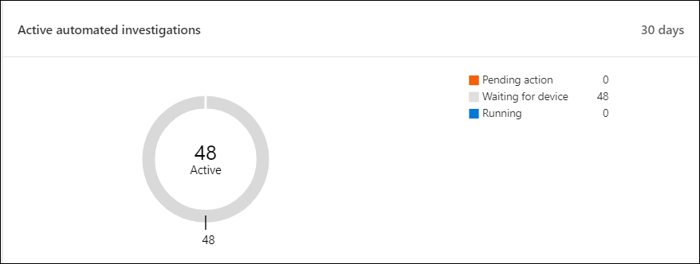
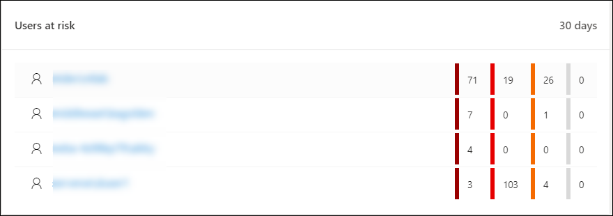

# Microsoft Defender 보안 센터 보안 작업 대시보드

[!INCLUDE [Microsoft 365 Defender rebranding](../../includes/microsoft-defender.md)]

**적용 대상:**
- [엔드포인트용 Microsoft Defender](https://go.microsoft.com/fwlink/?linkid=2154037)

> 엔드포인트용 Microsoft Defender를 경험하고 싶으신가요? [무료 평가판을 신청하세요.](https://signup.microsoft.com/create-account/signup?products=7f379fee-c4f9-4278-b0a1-e4c8c2fcdf7e&ru=https://aka.ms/MDEp2OpenTrial?ocid=docs-wdatp-secopsdashboard-abovefoldlink)

보안 **작업 대시보드는** 끝점 검색 및 응답 기능이 표시되어 있는 위치입니다. 검색된 위치를 간략하게 개요하고 대응 조치가 필요한 위치를 강조합니다.

대시보드에 다음 스냅숏이 표시됩니다.

- 활성 경고
- 위험에 노출된 장치
- 센서 상태
- 서비스 상태
- 매일 보고하는 장치
- 활성 자동화 조사
- 자동화된 조사 통계
- 위험에 노출된 사용자
- 의심스러운 활동

경고 및 장치를 탐색하고 조사하여 의심스러운 활동이 네트워크에서 발생된 경우 해당 컨텍스트를 이해하는 데 도움이 될 수 있도록 신속하게 확인할 수 있습니다.

보안 **작업 대시보드에서는** 장치에서 중요한 이벤트 또는 동작을 쉽게 식별할 수 있도록 집계된 이벤트를 볼 수 있습니다. 또한 세부적인 이벤트와 낮은 수준의 표시기를 드릴다운할 수 있습니다.

또한 조직의 전반적인 상태를 시각적으로 확인할 수 있는 클릭 가능한 타일도 있습니다. 각 타일에는 해당 개요에 대한 자세한 보기가 열립니다.

## 활성 경고

타일에서 네트워크에서 지난 30일 동안의 전체 활성 경고 수를 볼 수 있습니다. 경고는 신규 및 진행 **중으로** **그룹화됩니다.**

각 그룹은 해당 경고 심각도 수준으로 더 하위 분류됩니다. 각 경고 링 내부의 경고 수를 클릭하여 해당 범주 큐의 정렬된 보기(신규 또는 진행 **중)를 확인합니다.**

자세한 내용은 [경고 개요를 참조하세요.](alerts-queue.md)

각 행에는 경고 심각도 범주와 경고에 대한 간단한 설명이 포함됩니다. 경고를 클릭하여 자세한 보기를 볼 수 있습니다. 자세한 내용은 [Endpoint 경고에 대한 Microsoft Defender](investigate-alerts.md) 조사 및 경고 [개요를 참조하세요.](alerts-queue.md)

## 위험에 노출된 장치

이 타일은 활성 경고가 가장 많은 장치 목록을 보여줍니다. 각 디바이스에 대한 총 경고 수는 장치 이름 옆에 있는 원으로 표시되고 타일의 맨 끝에 심각도 수준별로 추가 분류됩니다(각 심각도 표시줄 위에 마우스를 다가 레이블을 확인합니다).

디바이스의 이름을 클릭하여 해당 장치에 대한 세부 정보를 확인합니다. 자세한 내용은 Microsoft Defender for Endpoint Devices 목록에서 장치 [조사를 참조하세요.](investigate-machines.md)

타일 맨  위에 있는 장치 목록을 클릭하여 활성 경고 수별로 정렬된 장치 목록으로 바로 이동하면 됩니다. 자세한 내용은 Microsoft Defender for Endpoint Devices 목록에서 장치 [조사를 참조하세요.](investigate-machines.md)

## 센서 문제가 있는 장치

센서 **문제가 있는 장치** 타일은 끝점용 Microsoft Defender 서비스에 센서 데이터를 제공하는 개별 장치의 능력에 대한 정보를 제공합니다. 주의가 필요한 장치 수를 보고하고 문제가 있는 장치를 식별하는 데 도움이 됩니다.

서비스에 올바르게 보고하지 않는 장치 수에 대한 정보를 제공하는 두 가지 상태 표시기가 있습니다.

- **잘못 구성:** 이러한 장치는 센서 데이터를 부분적으로 끝점용 Microsoft Defender 서비스에 보고하고 수정해야 하는 구성 오류가 있을 수 있습니다.
- **비활성:** 지난 달에 7일 이상 Microsoft Defender for Endpoint 서비스에 대한 보고를 중지한 장치입니다.

그룹을 클릭하면 선택에 따라 필터링된 장치 목록으로 연결됩니다. 자세한 내용은 센서 상태 확인 [및](check-sensor-status.md) 장치 [조사를 참조하세요.](investigate-machines.md)

## 서비스 상태

서비스 **상태 타일은** 서비스가 활성화되어 있는지 또는 문제가 있는지 알려합니다.

서비스 상태의 자세한 내용은 Endpoint 서비스 상태 [확인을 참조하세요.](service-status.md)

## 매일 보고하는 장치

일별 장치 **보고 타일은** 지난 30일 동안 매일 보고되는 장치 수를 나타내는 막대 그래프를 보여줍니다. 그래프의 개별 막대 위에 마우스를 대면 매일 보고하는 장치의 정확한 수를 볼 수 있습니다.

## 활성 자동화 조사

활성 자동화 조사 타일에서 네트워크에서 지난 30일 동안의 전체 자동화된 조사 수를 볼 **수** 있습니다. 조사는 보류 중인 **작업,** 장치 대기 및 실행 중으로 **그룹화됩니다.** 

## 자동화된 조사 통계

이 타일은 지난 7일 동안의 자동화된 조사와 관련된 통계를 보여줍니다. 완료된 조사 수, 성공적으로 재구성된 조사 수, 조사가 시작되는 데 걸리는 평균 대기 시간, 경고를 수정하는 데 걸리는 평균 시간, 조사된 경고 수 및 일반적인 수동 조사에서 저장된 자동화 시간 수가 표시됩니다. 

자동화된 **조사,** 재구성된 조사 및 조사된 알림을 클릭하여 해당  범주별로 필터링된 조사 페이지로 이동할 수 있습니다.   이를 통해 컨텍스트에서 자세한 조사 분석 내용을 볼 수 있습니다.

## 위험에 노출된 사용자

타일은 가장 활발한 경고가 있는 사용자 계정 목록과 높음, 보통 또는 낮은 경고에 표시될 수 있는 경고 수를 보여줍니다. 

사용자 계정을 클릭하여 사용자 계정에 대한 세부 정보를 볼 수 있습니다. 자세한 내용은 사용자 계정 [조사를 참조하세요.](investigate-user.md)

> 엔드포인트용 Microsoft Defender를 경험하고 싶으신가요? [무료 평가판을 신청하세요.](https://signup.microsoft.com/create-account/signup?products=7f379fee-c4f9-4278-b0a1-e4c8c2fcdf7e&ru=https://aka.ms/MDEp2OpenTrial?ocid=docs-wdatp-secopsdashboard-belowfoldlink)

## 관련 항목

- [끝점 포털용 Microsoft Defender 이해](use.md)
- [포털 개요](portal-overview.md)
- [위협 요소 & 관리 대시보드 보기](tvm-dashboard-insights.md)
- [위협 분석 대시보드 보기 및 권장 완화 작업 수행](threat-analytics.md)
