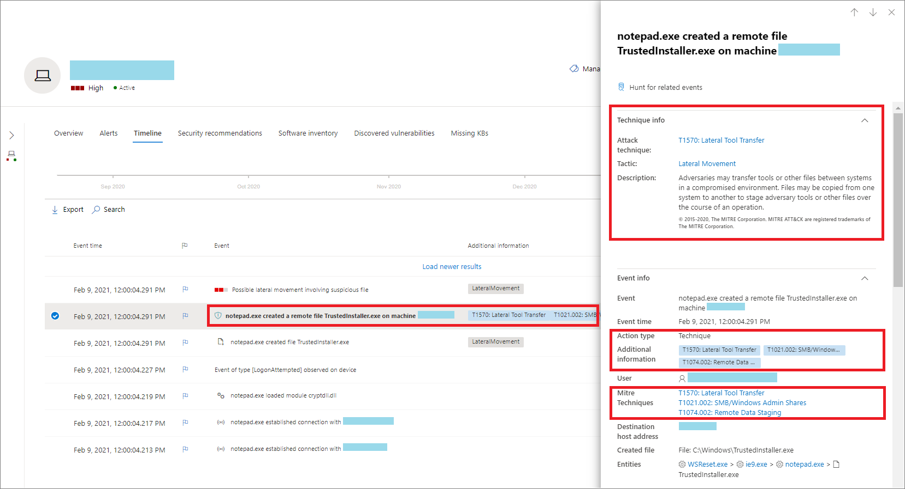
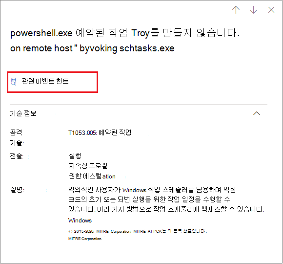
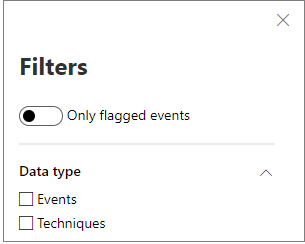

# 디바이스 타임라인의 기술

**적용 대상:**
- [엔드포인트용 Microsoft Defender](https://go.microsoft.com/fwlink/p/?linkid=2154037)

특정 디바이스에서 발생된 이벤트를 분석하여 조사에서 더 많은 정보를 얻을 수 있습니다. 먼저 장치 목록 에서 관심 있는 장치를 [선택합니다.](machines-view-overview.md) 디바이스 페이지에서 시간 표시 막대  탭을 선택하여 디바이스에서 발생한 모든 이벤트를 볼 수 있습니다.

## 타임라인의 기술 이해

> [!IMPORTANT]
> 일부 정보는 상업적으로 출시되기 전에 상당수 수정될 수 있는 공개 미리 보기의 미리 보기 제품 기능과 관련이 있습니다. Microsoft는 여기에서 제공하는 정보와 관련하여 명시적이거나 묵시적인 어떠한 보증도 제공하지 않습니다.

끝점용 Microsoft Defender에서 **Techniques은** 이벤트 타임라인의 추가 데이터 형식입니다. 기술은 [MITRE ATT](https://attack.mitre.org/) 및 CK 기술 또는 하위&관련된 활동에 대한 더 많은 정보를 제공합니다.

이 기능은 분석가가 디바이스에서 관찰된 활동을 이해하는 데 도움을 주어 조사 환경을 간소화합니다. 분석가가 추가 조사를 결정할 수 있습니다.

공개 미리 보기의 경우 기본적으로 기술을 사용할 수 있으며 디바이스의 타임라인이 표시되어 있는 경우 이벤트와 함께 표시됩니다.

기술은 굵은 텍스트로 강조 표시하고 왼쪽에 파란색 아이콘과 함께 표시됩니다. 해당 MITRE ATT&CK ID 및 기술 이름도 추가 정보 아래에 태그로 표시됩니다.

기술에 대해 검색 및 내보내기 옵션도 사용할 수 있습니다.

## 왼쪽 창을 사용하여 조사

기술을 선택하여 해당 왼쪽 창을 여는 방법을 선택합니다. 여기에서 관련 ATT 및 CK 기술, 전략 및 설명과 같은&정보를 볼 수 있습니다.

특정 *공격* 기술을 선택하여 관련 ATT&CK 기술 페이지를 열어 자세한 정보를 찾을 수 있습니다.

오른쪽에 파란색 아이콘이 표시될 때 엔터티의 세부 정보를 복사할 수 있습니다. 예를 들어 관련 파일의 SHA1을 복사하려면 파란색 페이지 아이콘을 선택합니다.

명령줄에 대해 동일한 작업을 할 수 있습니다.

## 관련 이벤트 조사

고급 [헌팅을](advanced-hunting-overview.md) 사용하여 선택한 기술과 관련된 이벤트를 찾으하려면 관련 이벤트 **헌트 를 선택합니다.** 이렇게 하면 기술과 관련된 이벤트를 찾기 위한 쿼리가 있는 고급 헌팅 페이지가 표시됩니다.

> [!NOTE]
> 기술 쪽  창의 관련 이벤트 헌트 단추를 사용하여 쿼리하면 식별된 기술과 관련된 모든 이벤트가 표시되지만 쿼리 결과에는 기술 자체가 포함되어 있지 않습니다.

## 장치 타임라인 사용자 지정

디바이스 타임라인의 오른쪽 위에 있는 날짜 범위를 선택하면 타임라인의 이벤트 및 기술 수를 제한할 수 있습니다.

노출할 열을 사용자 지정할 수 있습니다. 또한 데이터 형식 또는 이벤트 그룹별로 플래그가 지정된 이벤트를 필터링할 수 있습니다.

### 노출할 열 선택

열 선택 단추를 선택하여 시간 표시 막대에 노출할 열을 **선택할 수** 있습니다.

이 목록에서 포함할 정보를 선택할 수 있습니다.

### 기술 또는 이벤트만 보기 위해 필터링

이벤트 또는 기술만 표시하려면  장치 타임라인에서 필터를 선택하고 볼 기본 설정 데이터 형식을 선택합니다.

## 참고 항목

- [장치 목록 보기 및 구성](machines-view-overview.md)
- [끝점용 Microsoft Defender 장치 타임라인 이벤트 플래그](device-timeline-event-flag.md)
