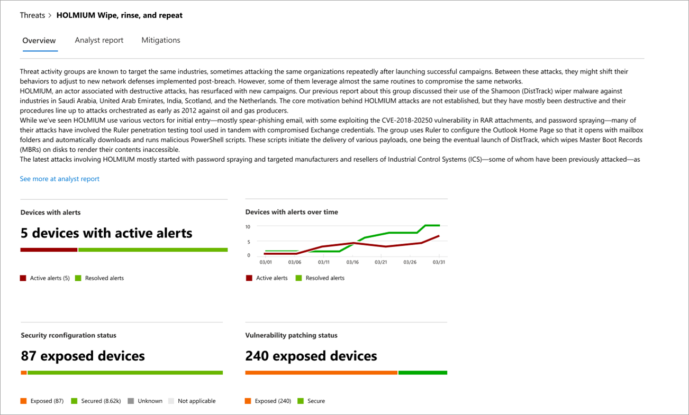

# 위협 분석을 통해 새로운 위협 추적 및 대응

[!INCLUDE [Microsoft 365 Defender rebranding](../../includes/microsoft-defender.md)]

**적용 대상:**
- [엔드포인트용 Microsoft Defender](https://go.microsoft.com/fwlink/?linkid=2154037)
- [Microsoft 365 Defender](https://go.microsoft.com/fwlink/?linkid=2118804)

> 엔드포인트용 Microsoft Defender를 경험하고 싶으신가요? [무료 평가판을 신청하세요.](https://signup.microsoft.com/create-account/signup?products=7f379fee-c4f9-4278-b0a1-e4c8c2fcdf7e&ru=https://aka.ms/MDEp2OpenTrial?ocid=docs-wdatp-exposedapis-abovefoldlink)

더욱 정교한 공격자 및 새로운 위협이 자주 발생하고 자주 등장하는 경우 빠르게 다음을 할 수 있는 것이 중요합니다.

- 새로운 위협의 영향 평가
- 위협에 대한 또는 노출에 대한 탄력성 검토
- 위협을 중지하거나 포함하기 위해 수행할 수 있는 작업 식별

위협 분석은 다음을 포함하여 가장 관련성이 높은 위협을 다루는 전문 Microsoft 보안 연구원의 보고서 집합입니다.

- 활성 위협 요소 및 캠페인
- 인기 있는 새로운 공격 기술
- 중요한 취약성
- 일반적인 공격 표면
- 널리 사용되는 맬웨어

각 보고서는 위협에 대한 자세한 분석과 위협을 방어하는 방법에 대한 광범위한 지침을 제공합니다. 또한 네트워크의 데이터를 통합하여 위협이 활성 상태인지 여부와 적용 가능한 보호가 설정되어 있는지 여부를 나타 내보입니다.

이 짧은 비디오를 시청하여 위협 분석을 통해 최신 위협을 추적하고 중지하는 방법에 대해 자세히 알아보십시오.

> [!VIDEO https://www.microsoft.com/videoplayer/embed/RE4bw1f]

## 위협 분석 대시보드 보기

위협 분석 대시보드는 조직과 가장 관련이 있는 보고서로 이동하기 위한 훌륭한 지점입니다. 다음 섹션에서는 위협을 요약하여 설명합니다.

- **최신 위협:** 최근 게시된 위협 보고서와 활성 및 해결된 경고가 있는 장치 수를 나열합니다.
- **영향력이 큰 위협:** 조직에 가장 큰 영향을 미치는 위협을 나열합니다. 이 섹션에서는 활성 경고가 있는 장치 수를 통해 위협의 순위를 매기고 있습니다.
- **위협 요약:** 활성 및 해결된 경고의 위협 수를 표시하여 추적된 위협의 전반적인 영향을 표시합니다.

대시보드에서 위협을 선택하여 해당 위협에 대한 보고서를 볼 수 있습니다.

## 위협 분석 보고서 보기

각 위협 분석 보고서는 **개요,** 분석가 보고서 및 완화의 세 섹션으로 정보를 **제공합니다.** 

### 개요: 위협을 신속하게 이해하고, 영향을 평가하고, 방어를 검토합니다.

개요 **섹션에서는** 자세한 분석 보고서의 미리 보기를 제공합니다. 또한 잘못 구성 및 패치되지 않은 장치를 통해 조직에 위협이 미치는 영향과 노출을 강조하는 차트도 제공합니다.

 _위협 분석 보고서의 개요 섹션_

#### 조직에 미치는 영향 평가

각 보고서에는 위협의 조직적 영향에 대한 정보를 제공하도록 디자인된 차트가 포함되어 있습니다.

- **경고가 있는 장치:** 위협의 영향을 을 수 있는 고유한 장치의 현재 수를 보여줍니다. 해당 위협과 연결된  경고가 하나 이상 있는 경우 장치가 활성으로 분류되고 장치의 위협과 관련된 모든 경고가 해결된 경우 해결됩니다.  
- **시간이 지날 때** 경고가 있는 장치:  시간이 지날 때 활성 및 해결된 경고가 있는 고유한 장치 **수를** 보여 주며, 해결된 경고 수는 조직이 위협과 관련된 경고에 얼마나 빠르게 응답하는지 나타냅니다. 이상적으로는 며칠 내에 해결된 경고가 차트에 표시됩니다.

#### 보안 탄력성 및 자세 검토

각 보고서에는 조직이 주어진 위협에 대해 얼마나 탄력적인지 간략하게 설명하는 차트가 포함되어 있습니다.

- **보안 구성 상태:** 위협을 완화하는 데 도움이 될 수 있는 권장 보안 설정을 적용한 장치 수를 보여줍니다. 추적된 **모든** 설정을 적용한 장치는 보안으로 간주됩니다. 
- **취약성 패치 상태:** 위협에 악용되는 취약점을 해결하는 보안 업데이트 또는 패치를 적용한 장치 수를 보여줍니다.

### 분석가 보고서: Microsoft 보안 연구원으로부터 전문가 인사이트 얻기

분석가 **보고서 섹션으로 이동하여** 자세한 전문가 쓰기를 읽어 읽습니다. 대부분의 보고서는 MITRE ATT&CK 프레임워크에 매핑된 전략 및 기술, 권장 사항의 전체 목록 및 강력한 위협 헌팅 지침을 포함하여 공격 체인에 대한 자세한 [설명을](advanced-hunting-overview.md) 제공합니다.

[분석 보고서에 대해 자세히 알아보시다](threat-analytics-analyst-reports.md)

### 완화: 완화 목록 및 장치 상태 검토

완화 **섹션에서** 위협에 대한 조직 탄력을 강화하는 데 도움이 될 수 있는 실행 가능한 특정 권장 사항 목록을 검토합니다. 추적된 완화 목록은 다음과 같습니다.

- **보안 업데이트:** 취약성에 대한 보안 업데이트 또는 패치 배포
- **Microsoft Defender 바이러스 백신 설정**
  - 보안 인텔리전스 버전
  - 클라우드 제공 보호
  - 잠재적으로 원치 않는 응용 프로그램(PUA) 보호
  - 실시간 보호

이 섹션의 완화 정보는 보고서의 다양한 링크에 위협 및 취약성 관리 자세한 드릴다운 정보도 제공하는 위협 및 취약성 관리 데이터를 통합합니다.

_위협 분석 보고서의 완화 섹션_

## 추가 보고서 세부 정보 및 제한 사항

보고서를 사용할 때 다음에 유의해야 합니다.

- 데이터 범위는 RBAC(역할 기반 액세스 제어) 범위에 따라 지정됩니다. 에 액세스할 수 있는 그룹으로 장치의 [상태가 표시됩니다.](machine-groups.md)
- 차트에는 추적되는 완화만 반영됩니다. 보고서 개요에서 차트에 나와 있지 않은 추가 완화를 확인할 수 있습니다.
- 완화는 완전한 탄력을 보장하지 않습니다. 제공된 완화에는 탄력성을 개선하는 데 필요한 최상의 조치가 반영됩니다.
- 장치가 서비스로 데이터를 전송하지 않은 경우 장치는 "사용할 수 없음"으로 계산됩니다.
- 바이러스 백신 관련 통계는 설정에 Microsoft Defender 바이러스 백신 합니다. 타사 바이러스 백신 솔루션이 있는 장치는 "노출"으로 표시될 수 있습니다.

## 관련 항목

- [고급 헌팅을 통해 위협을 사전 대응적으로 찾기](advanced-hunting-overview.md)
- [분석가 보고서 섹션 이해](threat-analytics-analyst-reports.md)
- [보안 약점 및 노출 평가 및 해결](next-gen-threat-and-vuln-mgt.md)
