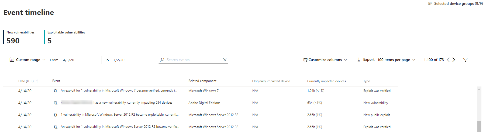

# 이벤트 타임라인 - 위협 및 취약성 관리

[!INCLUDE [Microsoft 365 Defender rebranding](../../includes/microsoft-defender.md)]

**적용 대상:**
- [엔드포인트용 Microsoft Defender](https://go.microsoft.com/fwlink/?linkid=2154037)
- [Microsoft 365 Defender](https://go.microsoft.com/fwlink/?linkid=2118804)

> 엔드포인트용 Microsoft Defender를 경험하고 싶으신가요? [무료 평가판을 신청하세요.](https://signup.microsoft.com/create-account/signup?products=7f379fee-c4f9-4278-b0a1-e4c8c2fcdf7e&ru=https://aka.ms/MDEp2OpenTrial?ocid=docs-wdatp-portaloverview-abovefoldlink)

이벤트 타임라인은 새로운 취약성 또는 악용을 통해 조직에 위험이 도입된 방법을 해석하는 데 도움이 되는 위험 뉴스 피드입니다. 조직의 위험에 영향을 줄 수 있는 이벤트를 볼 수 있습니다. 예를 들어 도입된 새로운 취약성, 악용될 수 있는 취약성, 악용 키트에 추가된 악용 등도 찾을 수 있습니다.

또한 이벤트 타임라인은 큰  변경의 원인을 확인할 수 있도록 노출 점수와 [장치에 대한 Microsoft 보안](tvm-microsoft-secure-score-devices.md) 점수에 대한 스토리를 제공합니다. 이벤트는 디바이스 또는 장치의 점수에 영향을 줄 수 있습니다. 우선 순위가 높은 보안 권장 사항에 따라 수정해야 하는 사항을 해결하여 노출을 [줄입니다.](tvm-security-recommendation.md)

> [!TIP]
> 새 취약성 이벤트에 대한 전자 메일을 얻습니다. [끝점용 Microsoft Defender에서 취약성](configure-vulnerability-email-notifications.md) 전자 메일 알림 구성을 참조하세요.

## 이벤트 타임라인 페이지로 이동합니다.

또한 대시보드의 3가지 [진입점도 위협 및 취약성 관리 있습니다.](tvm-dashboard-insights.md)

- **조직 노출 점수 카드:**"시간의에 따라 노출 점수" 그래프에서 이벤트 점 위에 마우스를 대고 "이 날의 모든 이벤트 보기"를 선택합니다. 이벤트는 소프트웨어 취약성을 나타 내는 이벤트입니다.
- **Microsoft Secure Score for Devices:**"Your score for devices over time" graph에서 이벤트 점 위에 마우스를 대고 "이 날의 모든 이벤트 보기"를 선택합니다. 이벤트는 새 구성 평가를 나타내는 이벤트입니다.
- **상위 이벤트 카드:** 상위 이벤트 테이블 아래쪽에서 "더 표시"를 선택합니다. 카드에 지난 7일 동안 가장 영향력이 큰 세 가지 이벤트가 표시됩니다. 중요한 이벤트는 이벤트가 많은 장치에 영향을 주는지 또는 중요한 취약성인 경우를 포함할 수 있습니다.

### 노출 점수 및 장치용 Microsoft 보안 점수 그래프

위협 및 취약성 관리 대시보드에서 노출 점수 그래프 위로 마우스를여 장치에 영향을 미치게 된 해당 날의 상위 소프트웨어 취약성 이벤트를 들을 수 있습니다. Microsoft Secure Score for Devices 그래프를 마우스로 마우스로 여서 점수에 영향을 주는 새로운 보안 구성 평가를 시청합니다.

디바이스 또는 장치의 점수에 영향을 주는 이벤트가 없는 경우 아무 이벤트도 표시되지 않습니다.

 
 

### 그 날의 이벤트로 드릴다운

이 **날의** 모든 이벤트 표시를 선택하면 해당 날짜에 대한 사용자 지정 날짜 범위가 있는 이벤트 타임라인 페이지로 이동합니다.

날짜 **범위를 다른** 사용자 지정 범위 또는 미리 설정된 시간 범위로 변경하려면 사용자 지정 범위를 선택합니다.

## 이벤트 타임라인 개요

이벤트 타임라인 페이지에서 이벤트와 관련된 모든 필요한 정보를 볼 수 있습니다.

기능:

- 열 사용자 지정
- 이벤트 유형 또는 영향을 미치는 장치의 백분율별로 필터링
- 페이지당 30, 50 또는 100개 항목 보기

페이지 맨 위에 있는 두 개의 큰 숫자는 이벤트가 아니라 새로운 취약성 및 악용 가능한 취약성의 수를 보여 합니다. 일부 이벤트는 여러 취약성을 가지며 일부 취약성은 여러 이벤트를 가지는 것일 수 있습니다.

### 열

- **날짜**: 월, 일, 연도
- **이벤트**: 구성 요소, 유형 및 영향을 미치는 장치 수를 비롯한 영향을 미치는 이벤트
- **관련 구성 요소**: software
- **원래 영향을 났던 장치:** 이 이벤트가 처음에 발생한 영향을 미치는 장치의 수 및 백분율입니다. 총 장치 수에서 원래 영향을 들은 장치의 비율을 필터링할 수도 있습니다.
- **현재 영향을 미치는 장치:** 이 이벤트가 현재 영향을 미치는 장치의 현재 수 및 백분율입니다. 열 사용자 지정 을 선택하여 이 **필드를 찾을 수 있습니다.**
- **유형**: 점수에 영향을 미치는 타임스탬프가 있는 이벤트를 반영합니다. 필터링할 수 있습니다.
  - Exploit Kit에 추가된 Exploit
  - Exploit가 확인된 경우
  - 새 공개 악용
  - 새로운 취약성
  - 새 구성 평가
- **점수 추세**: 노출 점수 추세

### 아이콘

다음 아이콘은 이벤트 옆에 표시됩니다.

-  새 공개 악용
-  새로운 취약성 게시
-  Exploit Kit에서 찾은 Exploit
-  악용 확인

### 특정 이벤트로 드릴다운

이벤트를 선택하면 장치에 영향을 주는 세부 정보 및 현재 CV 목록과 함께 플라이아웃이 나타납니다. CV를 더 표시하거나 관련 권장 정보를 볼 수 있습니다.

"점수 추세" 아래의 화살표를 사용하면 이 이벤트가 조직 노출 점수를 잠재적으로 발생 또는 낮출지 여부를 결정할 수 있습니다. 노출 점수가 높을수록 장치가 악용에 더 취약하다는 의미입니다.

이 페이지에서 관련 보안 권장 사항 보기로 **이동을** 선택하여 보안 권장 사항 페이지에서 새로운 소프트웨어 취약성을 해결합니다.  보안 권장 사항에서 설명 및 취약점 세부 정보를 읽은 후 수정 요청을 제출하고 수정 페이지에서 요청을 추적할 [수 있습니다.](tvm-remediation.md)

## 소프트웨어 페이지에서 이벤트 타임라인 보기

소프트웨어 페이지를 열 > 플라이아웃의 "관련 구성 요소" 섹션에서 하이퍼링크된 소프트웨어 이름(예: Visual Studio 2017)을 선택합니다. [소프트웨어 페이지에 대해 자세히 알아보시다](tvm-software-inventory.md#software-pages)

전체 페이지가 특정 소프트웨어의 모든 세부 정보가 표시됩니다. 그래프 위에 마우스를 놓아 특정 소프트웨어에 대한 이벤트 타임라인을 볼 수 있습니다.

이벤트 타임라인 탭으로 이동하여 해당 소프트웨어와 관련된 모든 이벤트를 볼 수 있습니다. 보안 권장 사항, 발견된 취약성, 설치된 장치 및 버전 배포도 볼 수 있습니다.

## 관련 항목

- [위협 및 취약성 관리 개요](next-gen-threat-and-vuln-mgt.md)
- [대시보드](tvm-dashboard-insights.md)
- [노출 점수](tvm-exposure-score.md)
- [보안 권장 사항](tvm-security-recommendation.md)
- [취약성 수정](tvm-remediation.md)
- [소프트웨어 인벤토리](tvm-software-inventory.md)
