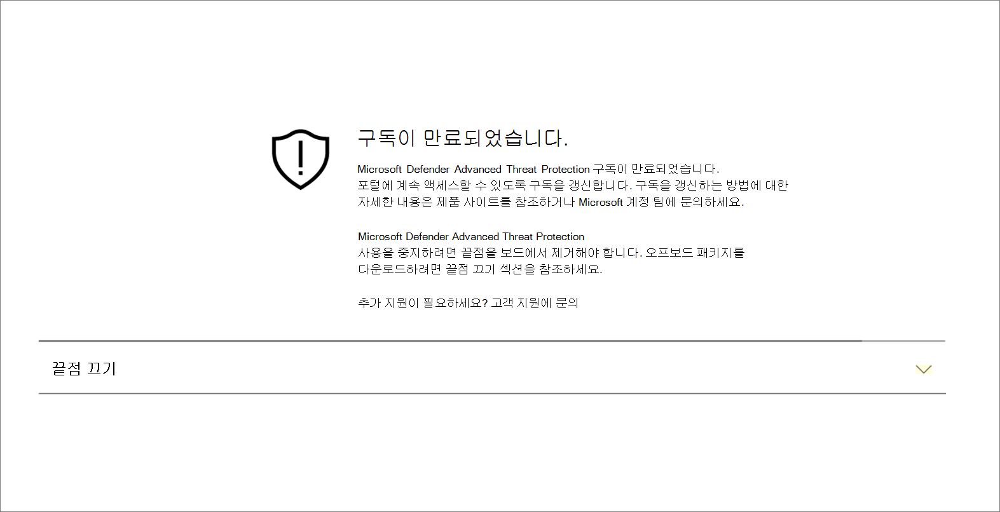
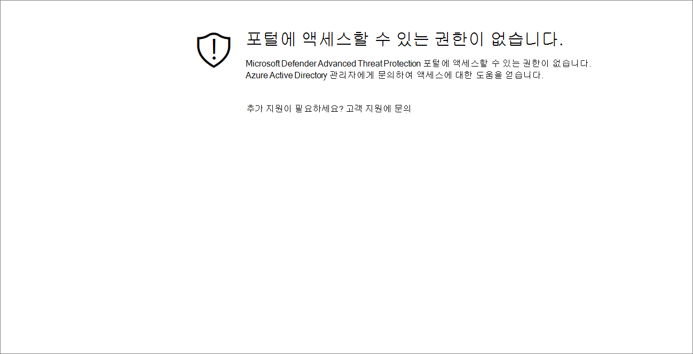
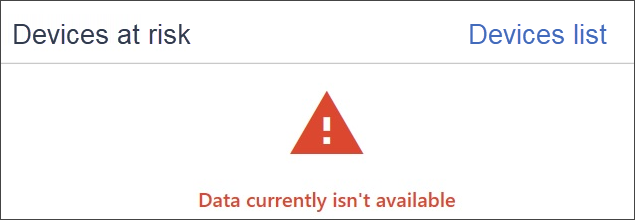

# 구독 및 포털 액세스 문제 해결

[!INCLUDE [Microsoft 365 Defender rebranding](../../includes/microsoft-defender.md)]

**적용 대상:**
- [엔드포인트용 Microsoft Defender](https://go.microsoft.com/fwlink/p/?linkid=2154037)
- [Microsoft 365 Defender](https://go.microsoft.com/fwlink/?linkid=2118804)

> 엔드포인트용 Microsoft Defender를 경험하고 싶으신가요? [무료 평가판을 신청하세요.](https://signup.microsoft.com/create-account/signup?products=7f379fee-c4f9-4278-b0a1-e4c8c2fcdf7e&ru=https://aka.ms/MDEp2OpenTrial?ocid=docs-wdatp-troublshootonboarding-abovefoldlink)

이 페이지에서는 끝점용 Microsoft Defender 서비스를 설정할 때 발생할 수 있는 문제를 해결하기 위한 자세한 단계를 제공합니다.

오류 메시지가 표시될 경우 Microsoft 365 Defender 관련 링크가 제공될 문제 및 관련 링크에 대한 자세한 설명을 제공합니다.

## 구독을 찾을 수 없음

앱에 액세스하는 Microsoft 365 Defender 구독을  찾을 수 없음 메시지가 표시되는 경우 사용자를 포털에 로그인하는 데 사용되는 Azure Active Directory(Azure AD)에 끝점용 Microsoft Defender 라이선스가 없음을 의미합니다.

가능한 원인:
- Windows E5 및 Office E5 라이선스는 별도의 라이선스입니다.
- 라이선스를 구매했지만 이 Azure AD 인스턴스에 프로비전되지는 않습니다.
    - 라이선스 프로비저닝 문제일 수 있습니다.
    - 서비스에 대한 인증에 사용되는 라이선스와 다른 Microsoft Azure AD 라이선스를 프로비전할 수 있습니다.

두 경우 모두 일반 Microsoft [Defender for Endpoint 지원](https://support.microsoft.com/getsupport?wf=0&tenant=ClassicCommercial&oaspworkflow=start_1.0.0.0&locale=en-us&supportregion=en-us&pesid=16055&ccsid=636419533611396913) 또는 볼륨 라이선스 지원 에서 Microsoft 지원에 [문의해야 합니다.](https://www.microsoft.com/licensing/servicecenter/Help/Contact.aspx)

## 구독이 만료되었습니다.

구독에 액세스하는 동안 Microsoft 365 Defender 만료된 메시지가 표시되면 온라인 서비스 구독이 만료된 것입니다.  다른 온라인 서비스 구독과 마찬가지로 Endpoint용 Microsoft Defender 구독에는 만료 날짜가 있습니다. 

특정 시점에 라이선스를 갱신하거나 연장할 수 있습니다. 만료 날짜 후 포털에 액세스할  때 라이선스를 갱신하지 않을 경우 구독이 만료된 메시지에 장치 등록 취소 패키지를 다운로드하는 옵션이 표시됩니다.

> [!NOTE]
> 보안상의 이유로, 오프보드 장치에 사용된 패키지는 다운로드한 날짜 30일 후에 만료됩니다. 장치에 전송된 만료된 오프보더 패키지는 거부됩니다. 오프보더 패키지를 다운로드할 때 패키지 만료 날짜에 대한 알림을 하게 되고 패키지 이름에도 포함됩니다.

## 포털에 액세스할 수 있는 권한이 없습니다.

포털에 액세스할 수 있는 권한이 없는 경우 끝점용 Microsoft Defender는 보안 모니터링, 인시던트 조사 및 대응 제품으로, 이에 따라 액세스가 제한되고 사용자가 제어합니다.
자세한 내용은 포털에 [**대한 사용자 액세스 할당을 참조하세요.**](/windows/threat-protection/windows-defender-atp/assign-portal-access-windows-defender-advanced-threat-protection)

## 현재 포털의 일부 섹션에서 데이터를 사용할 수 없습니다.
포털 대시보드 및 기타 섹션에 "현재 데이터를 사용할 수 없습니다."라는 오류 메시지가 표시되는 경우:

그 아래에 있는 모든 하위omain을 허용해야 `security.windows.com` 합니다. 예를 들면 `*.security.windows.com`와 같습니다.

## 포털 통신 문제
포털 액세스, 데이터 누락 또는 포털 일부에 대한 제한된 액세스와 관련한 문제가 발생하는 경우 다음 URL이 통신에 허용되고 열려 있는지 확인해야 합니다.

- `*.blob.core.windows.net`
- `crl.microsoft.com`
- `https://*.microsoftonline-p.com`
- `https://*.securitycenter.windows.com` 
- `https://automatediracs-eus-prd.securitycenter.windows.com`
- `https://login.microsoftonline.com`
- `https://login.windows.net`
- `https://onboardingpackagescusprd.blob.core.windows.net`
- `https://secure.aadcdn.microsoftonline-p.com` 
- `https://securitycenter.windows.com` 
- `https://static2.sharepointonline.com` 

