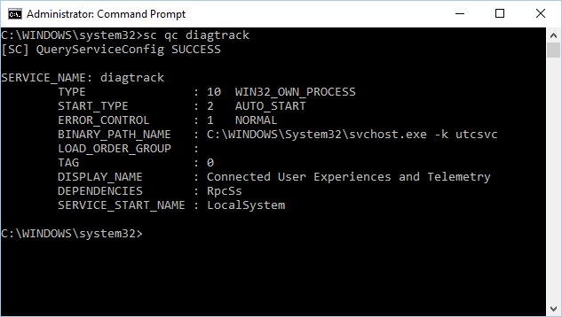
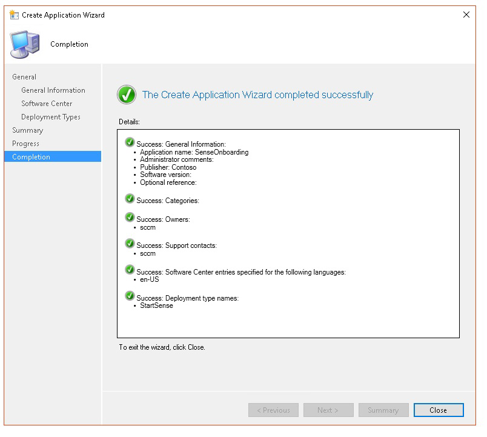

# <a name="troubleshoot-microsoft-defender-for-endpoint-onboarding-issues"></a><span data-ttu-id="17ceb-104">끝점 온보딩 문제에 대한 Microsoft Defender 문제 해결</span><span class="sxs-lookup"><span data-stu-id="17ceb-104">Troubleshoot Microsoft Defender for Endpoint onboarding issues</span></span>

[!INCLUDE [Microsoft 365 Defender rebranding](../../includes/microsoft-defender.md)]


<span data-ttu-id="17ceb-105">**적용 대상:**</span><span class="sxs-lookup"><span data-stu-id="17ceb-105">**Applies to:**</span></span>

- <span data-ttu-id="17ceb-106">[엔드포인트용 Microsoft Defender](https://go.microsoft.com/fwlink/?linkid=2154037) </span><span class="sxs-lookup"><span data-stu-id="17ceb-106">[Microsoft Defender for Endpoint](https://go.microsoft.com/fwlink/?linkid=2154037)</span></span>
- <span data-ttu-id="17ceb-107">Windows Server 2012 R2</span><span class="sxs-lookup"><span data-stu-id="17ceb-107">Windows Server 2012 R2</span></span>
- <span data-ttu-id="17ceb-108">Windows Server 2016</span><span class="sxs-lookup"><span data-stu-id="17ceb-108">Windows Server 2016</span></span>
- [<span data-ttu-id="17ceb-109">Microsoft 365 Defender</span><span class="sxs-lookup"><span data-stu-id="17ceb-109">Microsoft 365 Defender</span></span>](https://go.microsoft.com/fwlink/?linkid=2118804)

> <span data-ttu-id="17ceb-110">Endpoint용 Defender를 경험하고 싶나요?</span><span class="sxs-lookup"><span data-stu-id="17ceb-110">Want to experience Defender for Endpoint?</span></span> [<span data-ttu-id="17ceb-111">무료 평가판에 등록합니다.</span><span class="sxs-lookup"><span data-stu-id="17ceb-111">Sign up for a free trial.</span></span>](https://www.microsoft.com/microsoft-365/windows/microsoft-defender-atp?ocid=docs-wdatp-pullalerts-abovefoldlink) 

<span data-ttu-id="17ceb-112">문제가 발생할 경우 끝점용 Microsoft Defender 온보딩 프로세스 문제를 해결해야 할 수 있습니다.</span><span class="sxs-lookup"><span data-stu-id="17ceb-112">You might need to troubleshoot the Microsoft Defender for Endpoint onboarding process if you encounter issues.</span></span>
<span data-ttu-id="17ceb-113">이 페이지에서는 배포 도구 중 하나를 사용하여 배포할 때 발생할 수 있는 온보더링 문제와 장치에서 발생할 수 있는 일반적인 오류를 해결하는 자세한 단계를 제공합니다.</span><span class="sxs-lookup"><span data-stu-id="17ceb-113">This page provides detailed steps to troubleshoot onboarding issues that might occur when deploying with one of the deployment tools and common errors that might occur on the devices.</span></span>

## <a name="troubleshoot-issues-with-onboarding-tools"></a><span data-ttu-id="17ceb-114">온보더링 도구 관련 문제 해결</span><span class="sxs-lookup"><span data-stu-id="17ceb-114">Troubleshoot issues with onboarding tools</span></span>

<span data-ttu-id="17ceb-115">온보더링 프로세스를 완료하고 1시간이 지나도 [](investigate-machines.md) 장치 목록에 장치가 없는 경우 온보드 또는 연결 문제가 표시될 수 있습니다.</span><span class="sxs-lookup"><span data-stu-id="17ceb-115">If you have completed the onboarding process and don't see devices in the [Devices list](investigate-machines.md) after an hour, it might indicate an onboarding or connectivity problem.</span></span>

### <a name="troubleshoot-onboarding-when-deploying-with-group-policy"></a><span data-ttu-id="17ceb-116">그룹 정책을 사용하여 배포할 때의 온보더링 문제 해결</span><span class="sxs-lookup"><span data-stu-id="17ceb-116">Troubleshoot onboarding when deploying with Group Policy</span></span>

<span data-ttu-id="17ceb-117">그룹 정책을 사용하여 배포는 장치에서 온보딩 스크립트를 실행하여 수행됩니다.</span><span class="sxs-lookup"><span data-stu-id="17ceb-117">Deployment with Group Policy is done by running the onboarding script on the devices.</span></span> <span data-ttu-id="17ceb-118">그룹 정책 콘솔은 배포의 성공 또는 실패를 나타내지 않습니다.</span><span class="sxs-lookup"><span data-stu-id="17ceb-118">The Group Policy console does not indicate if the deployment has succeeded or not.</span></span>

<span data-ttu-id="17ceb-119">온보딩 프로세스를 완료하고 1시간이 지나도 장치 [](investigate-machines.md) 목록에 장치가 없는 경우 장치에서 스크립트 출력을 확인할 수 있습니다.</span><span class="sxs-lookup"><span data-stu-id="17ceb-119">If you have completed the onboarding process and don't see devices in the [Devices list](investigate-machines.md) after an hour, you can check the output of the script on the devices.</span></span> <span data-ttu-id="17ceb-120">자세한 내용은 스크립트를 사용하여 배포할 때 [온보딩 문제 해결을 참조하세요.](#troubleshoot-onboarding-when-deploying-with-a-script)</span><span class="sxs-lookup"><span data-stu-id="17ceb-120">For more information, see [Troubleshoot onboarding when deploying with a script](#troubleshoot-onboarding-when-deploying-with-a-script).</span></span>

<span data-ttu-id="17ceb-121">스크립트가 성공적으로 완료되면 발생할 수 있는 추가 오류에 대한 자세한 내용은 [장치에서](#troubleshoot-onboarding-issues-on-the-device) 온보딩 문제 해결을 참조합니다.</span><span class="sxs-lookup"><span data-stu-id="17ceb-121">If the script completes successfully, see [Troubleshoot onboarding issues on the devices](#troubleshoot-onboarding-issues-on-the-device) for additional errors that might occur.</span></span>

### <a name="troubleshoot-onboarding-issues-when-deploying-with-microsoft-endpoint-configuration-manager"></a><span data-ttu-id="17ceb-122">Microsoft Endpoint Configuration Manager를 사용하여 배포할 때의 온보더링 문제 해결</span><span class="sxs-lookup"><span data-stu-id="17ceb-122">Troubleshoot onboarding issues when deploying with Microsoft Endpoint Configuration Manager</span></span>

<span data-ttu-id="17ceb-123">다음 버전의 Configuration Manager를 사용하여 장치를 온보드하는 경우:</span><span class="sxs-lookup"><span data-stu-id="17ceb-123">When onboarding devices using the following versions of Configuration Manager:</span></span>

- <span data-ttu-id="17ceb-124">Microsoft Endpoint Configuration Manager</span><span class="sxs-lookup"><span data-stu-id="17ceb-124">Microsoft Endpoint Configuration Manager</span></span>
- <span data-ttu-id="17ceb-125">System Center 2012 Configuration Manager</span><span class="sxs-lookup"><span data-stu-id="17ceb-125">System Center 2012 Configuration Manager</span></span>
- <span data-ttu-id="17ceb-126">System Center 2012 R2 Configuration Manager</span><span class="sxs-lookup"><span data-stu-id="17ceb-126">System Center 2012 R2 Configuration Manager</span></span>

<span data-ttu-id="17ceb-127">위에서 언급한 Configuration Manager 버전이 있는 배포는 장치에서 온보딩 스크립트를 실행하여 수행됩니다.</span><span class="sxs-lookup"><span data-stu-id="17ceb-127">Deployment with the above-mentioned versions of Configuration Manager is done by running the onboarding script on the devices.</span></span> <span data-ttu-id="17ceb-128">Configuration Manager 콘솔에서 배포를 추적할 수 있습니다.</span><span class="sxs-lookup"><span data-stu-id="17ceb-128">You can track the deployment in the Configuration Manager Console.</span></span>

<span data-ttu-id="17ceb-129">배포가 실패하면 장치에서 스크립트의 출력을 확인할 수 있습니다.</span><span class="sxs-lookup"><span data-stu-id="17ceb-129">If the deployment fails, you can check the output of the script on the devices.</span></span>

<span data-ttu-id="17ceb-130">온보드가 완료되어도 1시간이 지나도 장치가  장치 목록에 표시되지 않는 경우 발생할 수 있는 추가 오류에 대한 자세한 내용은 [장치에서](#troubleshoot-onboarding-issues-on-the-device) 온보더링 문제 해결을 참조하세요.</span><span class="sxs-lookup"><span data-stu-id="17ceb-130">If the onboarding completed successfully but the devices are not showing up in the **Devices list** after an hour, see [Troubleshoot onboarding issues on the device](#troubleshoot-onboarding-issues-on-the-device) for additional errors that might occur.</span></span>

### <a name="troubleshoot-onboarding-when-deploying-with-a-script"></a><span data-ttu-id="17ceb-131">스크립트를 사용하여 배포할 때의 온보딩 문제 해결</span><span class="sxs-lookup"><span data-stu-id="17ceb-131">Troubleshoot onboarding when deploying with a script</span></span>

<span data-ttu-id="17ceb-132">**장치에서 스크립트의 결과를 확인합니다.**</span><span class="sxs-lookup"><span data-stu-id="17ceb-132">**Check the result of the script on the device:**</span></span>

1. <span data-ttu-id="17ceb-133">**시작을** 클릭하고 이벤트 **뷰어를 입력하고** **Enter를 클릭합니다.**</span><span class="sxs-lookup"><span data-stu-id="17ceb-133">Click **Start**, type **Event Viewer**, and press **Enter**.</span></span>

2. <span data-ttu-id="17ceb-134">Windows **로그 응용 프로그램으로**  >  **이동하십시오.**</span><span class="sxs-lookup"><span data-stu-id="17ceb-134">Go to **Windows Logs** > **Application**.</span></span>

3. <span data-ttu-id="17ceb-135">**WDATPOnboarding** 이벤트 원본에서 이벤트를 찾아야 합니다.</span><span class="sxs-lookup"><span data-stu-id="17ceb-135">Look for an event from **WDATPOnboarding** event source.</span></span>

<span data-ttu-id="17ceb-136">스크립트가 실패하고 이벤트가 오류인 경우 다음 표의 이벤트 ID를 확인하여 문제를 해결할 수 있습니다.</span><span class="sxs-lookup"><span data-stu-id="17ceb-136">If the script fails and the event is an error, you can check the event ID in the following table to help you troubleshoot the issue.</span></span>

> [!NOTE]
> <span data-ttu-id="17ceb-137">다음 이벤트 ID는 온보딩 스크립트에만 해당됩니다.</span><span class="sxs-lookup"><span data-stu-id="17ceb-137">The following event IDs are specific to the onboarding script only.</span></span>

<span data-ttu-id="17ceb-138">이벤트 ID</span><span class="sxs-lookup"><span data-stu-id="17ceb-138">Event ID</span></span> | <span data-ttu-id="17ceb-139">오류 유형</span><span class="sxs-lookup"><span data-stu-id="17ceb-139">Error Type</span></span> | <span data-ttu-id="17ceb-140">해결 단계</span><span class="sxs-lookup"><span data-stu-id="17ceb-140">Resolution steps</span></span>
:---:|:---|:---
 `5` | <span data-ttu-id="17ceb-141">오프보더 데이터를 찾았지만 삭제할 수 없습니다.</span><span class="sxs-lookup"><span data-stu-id="17ceb-141">Offboarding data was found but couldn't be deleted</span></span> | <span data-ttu-id="17ceb-142">레지스트리에 대한 사용 권한 확인, 특히</span><span class="sxs-lookup"><span data-stu-id="17ceb-142">Check the permissions on the registry, specifically</span></span><br> <span data-ttu-id="17ceb-143">`HKLM\SOFTWARE\Policies\Microsoft\Windows Advanced Threat Protection`.</span><span class="sxs-lookup"><span data-stu-id="17ceb-143">`HKLM\SOFTWARE\Policies\Microsoft\Windows Advanced Threat Protection`.</span></span>
`10` | <span data-ttu-id="17ceb-144">등록 데이터를 레지스트리에 기록할 수 없습니다.</span><span class="sxs-lookup"><span data-stu-id="17ceb-144">Onboarding data couldn't be written to registry</span></span> |  <span data-ttu-id="17ceb-145">레지스트리에 대한 사용 권한 확인, 특히</span><span class="sxs-lookup"><span data-stu-id="17ceb-145">Check the permissions on the registry, specifically</span></span><br> <span data-ttu-id="17ceb-146">`HKLM\SOFTWARE\Policies\Microsoft\Windows Advanced Threat Protection`.</span><span class="sxs-lookup"><span data-stu-id="17ceb-146">`HKLM\SOFTWARE\Policies\Microsoft\Windows Advanced Threat Protection`.</span></span><br><span data-ttu-id="17ceb-147">스크립트가 관리자 권한으로 실행된지 확인</span><span class="sxs-lookup"><span data-stu-id="17ceb-147">Verify that the script has been run as an administrator.</span></span>
`15` |  <span data-ttu-id="17ceb-148">SENSE 서비스를 시작하지 못했습니다.</span><span class="sxs-lookup"><span data-stu-id="17ceb-148">Failed to start SENSE service</span></span> |<span data-ttu-id="17ceb-149">서비스 상태 확인( `sc query sense` 명령).</span><span class="sxs-lookup"><span data-stu-id="17ceb-149">Check the service health (`sc query sense` command).</span></span> <span data-ttu-id="17ceb-150">이 상태가 중간 *상태('Pending_Stopped'*, *'Pending_Running')에* 있지 않은지 확인한 후 스크립트를 다시 실행합니다(관리자 권한으로).</span><span class="sxs-lookup"><span data-stu-id="17ceb-150">Make sure it's not in an intermediate state (*'Pending_Stopped'*, *'Pending_Running'*) and try to run the script again (with administrator rights).</span></span> <br> <br> <span data-ttu-id="17ceb-151">디바이스에서 Windows 10 버전 1607을 실행하고 명령을 실행하면 를 반환하고 `sc query sense` `START_PENDING` 장치를 다시 시작합니다.</span><span class="sxs-lookup"><span data-stu-id="17ceb-151">If the device is running Windows 10, version 1607 and running the command `sc query sense` returns `START_PENDING`, reboot the device.</span></span> <span data-ttu-id="17ceb-152">장치를 다시 시작해도 문제가 해결되지 않는 경우 KB4015217로 업그레이드하고 다시 등록을 시도하십시오.</span><span class="sxs-lookup"><span data-stu-id="17ceb-152">If rebooting the device doesn't address the issue, upgrade to KB4015217 and try onboarding again.</span></span>
`15` | <span data-ttu-id="17ceb-153">SENSE 서비스를 시작하지 못했습니다.</span><span class="sxs-lookup"><span data-stu-id="17ceb-153">Failed to start SENSE service</span></span> | <span data-ttu-id="17ceb-154">오류 메시지가 시스템 오류 577 또는 오류 1058이 발생한 경우 Microsoft Defender 바이러스 백신 ELAM 드라이버를 사용하도록 설정해야 합니다. 지침은 정책에 [따라 Microsoft Defender](#ensure-that-microsoft-defender-antivirus-is-not-disabled-by-a-policy) 바이러스 백신이 사용하지 않도록 설정되지 않도록 설정되어 있지 않은지 확인을 참조하세요.</span><span class="sxs-lookup"><span data-stu-id="17ceb-154">If the message of the error is: System error 577  or error 1058 has occurred, you need to enable the Microsoft Defender Antivirus ELAM driver, see [Ensure that Microsoft Defender Antivirus is not disabled by a policy](#ensure-that-microsoft-defender-antivirus-is-not-disabled-by-a-policy) for instructions.</span></span>
`30` |  <span data-ttu-id="17ceb-155">스크립트가 서비스 실행을 기다리지 못했습니다.</span><span class="sxs-lookup"><span data-stu-id="17ceb-155">The script failed to wait for the service to start running</span></span> | <span data-ttu-id="17ceb-156">서비스를 시작하는 데 시간이 더 많이 들이거나 시작하려고 하는 동안 오류가 발생할 수 있습니다.</span><span class="sxs-lookup"><span data-stu-id="17ceb-156">The service could have taken more time to start or has encountered errors while trying to start.</span></span> <span data-ttu-id="17ceb-157">SENSE와 관련된 이벤트 및 오류에 대한 자세한 내용은 이벤트 뷰어를 사용하여 이벤트 및 오류 [검토를 참조하세요.](event-error-codes.md)</span><span class="sxs-lookup"><span data-stu-id="17ceb-157">For more information on events and errors related to SENSE, see [Review events and errors using Event viewer](event-error-codes.md).</span></span>
`35` |  <span data-ttu-id="17ceb-158">스크립트가 필요한 온보딩 상태 레지스트리 값을 찾지 못했습니다.</span><span class="sxs-lookup"><span data-stu-id="17ceb-158">The script failed to find needed onboarding status registry value</span></span> | <span data-ttu-id="17ceb-159">SENSE 서비스가 처음 시작되면 등록 상태를 레지스트리 위치에 기록합니다.</span><span class="sxs-lookup"><span data-stu-id="17ceb-159">When the SENSE service starts for the first time, it writes onboarding status to the registry location</span></span><br><span data-ttu-id="17ceb-160">`HKLM\SOFTWARE\Microsoft\Windows Advanced Threat Protection\Status`.</span><span class="sxs-lookup"><span data-stu-id="17ceb-160">`HKLM\SOFTWARE\Microsoft\Windows Advanced Threat Protection\Status`.</span></span><br> <span data-ttu-id="17ceb-161">몇 초 후에 스크립트를 찾지 못했습니다.</span><span class="sxs-lookup"><span data-stu-id="17ceb-161">The script failed to find it after several seconds.</span></span> <span data-ttu-id="17ceb-162">수동으로 테스트하고 테스트가 있는지 확인할 수 있습니다.</span><span class="sxs-lookup"><span data-stu-id="17ceb-162">You can manually test it and check if it's there.</span></span> <span data-ttu-id="17ceb-163">SENSE와 관련된 이벤트 및 오류에 대한 자세한 내용은 이벤트 뷰어를 사용하여 이벤트 및 오류 [검토를 참조하세요.](event-error-codes.md)</span><span class="sxs-lookup"><span data-stu-id="17ceb-163">For more information on events and errors related to SENSE, see [Review events and errors using Event viewer](event-error-codes.md).</span></span>
`40` | <span data-ttu-id="17ceb-164">SENSE 서비스 온보드 상태가 **1로 설정되지 않은 경우**</span><span class="sxs-lookup"><span data-stu-id="17ceb-164">SENSE service onboarding status is not set to **1**</span></span> | <span data-ttu-id="17ceb-165">SENSE 서비스가 제대로 온보드되지 않았습니다.</span><span class="sxs-lookup"><span data-stu-id="17ceb-165">The SENSE service has failed to onboard properly.</span></span> <span data-ttu-id="17ceb-166">SENSE와 관련된 이벤트 및 오류에 대한 자세한 내용은 이벤트 뷰어를 사용하여 이벤트 및 오류 [검토를 참조하세요.](event-error-codes.md)</span><span class="sxs-lookup"><span data-stu-id="17ceb-166">For more information on events and errors related to SENSE, see [Review events and errors using Event viewer](event-error-codes.md).</span></span>
`65` | <span data-ttu-id="17ceb-167">권한이 부족합니다.</span><span class="sxs-lookup"><span data-stu-id="17ceb-167">Insufficient privileges</span></span>| <span data-ttu-id="17ceb-168">관리자 권한으로 스크립트를 다시 실행합니다.</span><span class="sxs-lookup"><span data-stu-id="17ceb-168">Run the script again with administrator privileges.</span></span>

### <a name="troubleshoot-onboarding-issues-using-microsoft-intune"></a><span data-ttu-id="17ceb-169">Microsoft Intune을 사용하여 온보더링 문제 해결</span><span class="sxs-lookup"><span data-stu-id="17ceb-169">Troubleshoot onboarding issues using Microsoft Intune</span></span>

<span data-ttu-id="17ceb-170">Microsoft Intune을 사용하여 오류 코드를 확인하고 문제의 원인을 해결해 볼 수 있습니다.</span><span class="sxs-lookup"><span data-stu-id="17ceb-170">You can use Microsoft Intune to check error codes and attempt to troubleshoot the cause of the issue.</span></span>

<span data-ttu-id="17ceb-171">Intune에서 정책을 구성한 경우 정책이 장치에 전파되지 않은 경우 자동 MDM 등록을 구성해야 할 수 있습니다.</span><span class="sxs-lookup"><span data-stu-id="17ceb-171">If you have configured policies in Intune and they are not propagated on devices, you might need to configure automatic MDM enrollment.</span></span>

<span data-ttu-id="17ceb-172">다음 표를 사용하여 온보더링하는 동안 가능한 문제의 원인을 파악합니다.</span><span class="sxs-lookup"><span data-stu-id="17ceb-172">Use the following tables to understand the possible causes of issues while onboarding:</span></span>

- <span data-ttu-id="17ceb-173">Microsoft Intune 오류 코드 및 OMA-URIs 표</span><span class="sxs-lookup"><span data-stu-id="17ceb-173">Microsoft Intune error codes and OMA-URIs table</span></span>
- <span data-ttu-id="17ceb-174">비준수 테이블의 알려진 문제</span><span class="sxs-lookup"><span data-stu-id="17ceb-174">Known issues with non-compliance table</span></span>
- <span data-ttu-id="17ceb-175">MDM(모바일 장치 관리) 이벤트 로그 테이블</span><span class="sxs-lookup"><span data-stu-id="17ceb-175">Mobile Device Management (MDM) event logs table</span></span>

<span data-ttu-id="17ceb-176">이벤트 로그 및 문제 해결 단계가 작동하지 않는다면 포털의 장치 관리 섹션에서 로컬 스크립트를 다운로드하고 상승된 명령 프롬프트에서 실행합니다. </span><span class="sxs-lookup"><span data-stu-id="17ceb-176">If none of the event logs and troubleshooting steps work, download the Local script from the **Device management** section of the portal, and run it in an elevated command prompt.</span></span>

#### <a name="microsoft-intune-error-codes-and-oma-uris"></a><span data-ttu-id="17ceb-177">Microsoft Intune 오류 코드 및 OMA-URIs</span><span class="sxs-lookup"><span data-stu-id="17ceb-177">Microsoft Intune error codes and OMA-URIs</span></span>

<span data-ttu-id="17ceb-178">오류 코드 16진수</span><span class="sxs-lookup"><span data-stu-id="17ceb-178">Error Code Hex</span></span> | <span data-ttu-id="17ceb-179">오류 코드 Dec</span><span class="sxs-lookup"><span data-stu-id="17ceb-179">Error Code Dec</span></span> | <span data-ttu-id="17ceb-180">오류 설명/Error Description</span><span class="sxs-lookup"><span data-stu-id="17ceb-180">Error Description</span></span> | <span data-ttu-id="17ceb-181">OMA-URI</span><span class="sxs-lookup"><span data-stu-id="17ceb-181">OMA-URI</span></span> | <span data-ttu-id="17ceb-182">가능한 원인 및 문제 해결 단계</span><span class="sxs-lookup"><span data-stu-id="17ceb-182">Possible cause and troubleshooting steps</span></span>
:---:|:---|:---|:---|:---
<span data-ttu-id="17ceb-183">0x87D1FDE8</span><span class="sxs-lookup"><span data-stu-id="17ceb-183">0x87D1FDE8</span></span> | <span data-ttu-id="17ceb-184">-2016281112</span><span class="sxs-lookup"><span data-stu-id="17ceb-184">-2016281112</span></span> | <span data-ttu-id="17ceb-185">재구성 실패</span><span class="sxs-lookup"><span data-stu-id="17ceb-185">Remediation failed</span></span> | <span data-ttu-id="17ceb-186">온보딩</span><span class="sxs-lookup"><span data-stu-id="17ceb-186">Onboarding</span></span> <br> <span data-ttu-id="17ceb-187">오프보더링</span><span class="sxs-lookup"><span data-stu-id="17ceb-187">Offboarding</span></span> | <span data-ttu-id="17ceb-188">**가능한 원인:** 잘못된 Blob( 잘못된 서명 또는 PreviousOrgIds 필드 누락)에서 온보딩 또는 오프보딩에 실패했습니다.</span><span class="sxs-lookup"><span data-stu-id="17ceb-188">**Possible cause:** Onboarding or offboarding failed on a wrong blob: wrong signature or missing PreviousOrgIds fields.</span></span> <br><br> <span data-ttu-id="17ceb-189">**문제 해결 단계:**</span><span class="sxs-lookup"><span data-stu-id="17ceb-189">**Troubleshooting steps:**</span></span> <br> <span data-ttu-id="17ceb-190">장치 이벤트 로그의 에이전트 온보더링 오류 보기 섹션에서 이벤트 [ID를 확인합니다.](#view-agent-onboarding-errors-in-the-device-event-log)</span><span class="sxs-lookup"><span data-stu-id="17ceb-190">Check the event IDs in the [View agent onboarding errors in the device event log](#view-agent-onboarding-errors-in-the-device-event-log) section.</span></span> <br><br> <span data-ttu-id="17ceb-191">다음 표의 MDM 이벤트 로그를 확인하거나 [Windows 10에서 MDM 오류 진단의 지침을 따릅니다.](https://docs.microsoft.com/windows/client-management/mdm/diagnose-mdm-failures-in-windows-10)</span><span class="sxs-lookup"><span data-stu-id="17ceb-191">Check the MDM event logs in the following table or follow the instructions in [Diagnose MDM failures in Windows 10](https://docs.microsoft.com/windows/client-management/mdm/diagnose-mdm-failures-in-windows-10).</span></span>
 | | | | <span data-ttu-id="17ceb-192">온보딩</span><span class="sxs-lookup"><span data-stu-id="17ceb-192">Onboarding</span></span> <br> <span data-ttu-id="17ceb-193">오프보더링</span><span class="sxs-lookup"><span data-stu-id="17ceb-193">Offboarding</span></span> <br> <span data-ttu-id="17ceb-194">SampleSharing</span><span class="sxs-lookup"><span data-stu-id="17ceb-194">SampleSharing</span></span> | <span data-ttu-id="17ceb-195">**가능한 원인:** 끝점용 Microsoft Defender 정책 레지스트리 키가 존재하지 않는 경우 또는 OMA DM 클라이언트에 끝점 정책 레지스트리 키에 쓸 수 있는 권한이 없습니다.</span><span class="sxs-lookup"><span data-stu-id="17ceb-195">**Possible cause:** Microsoft Defender for Endpoint Policy registry key does not exist or the OMA DM client doesn't have permissions to write to it.</span></span> <br><br> <span data-ttu-id="17ceb-196">**문제 해결 단계:** 다음 레지스트리 키가 존재하는지 확인 `HKEY_LOCAL_MACHINE\SOFTWARE\Policies\Microsoft\Windows Advanced Threat Protection`</span><span class="sxs-lookup"><span data-stu-id="17ceb-196">**Troubleshooting steps:** Ensure that the following registry key exists: `HKEY_LOCAL_MACHINE\SOFTWARE\Policies\Microsoft\Windows Advanced Threat Protection`</span></span> <br> <br> <span data-ttu-id="17ceb-197">이 명령이 존재하지 않는 경우 상승된 명령을 열고 키를 추가합니다.</span><span class="sxs-lookup"><span data-stu-id="17ceb-197">If it doesn't exist, open an elevated command and add the key.</span></span>
 | | | | <span data-ttu-id="17ceb-198">SenseIsRunning</span><span class="sxs-lookup"><span data-stu-id="17ceb-198">SenseIsRunning</span></span> <br> <span data-ttu-id="17ceb-199">OnboardingState</span><span class="sxs-lookup"><span data-stu-id="17ceb-199">OnboardingState</span></span> <br> <span data-ttu-id="17ceb-200">OrgId</span><span class="sxs-lookup"><span data-stu-id="17ceb-200">OrgId</span></span> |  <span data-ttu-id="17ceb-201">**가능한 원인:** 읽기 전용 속성으로 수정하려고 합니다.</span><span class="sxs-lookup"><span data-stu-id="17ceb-201">**Possible cause:** An attempt to remediate by read-only property.</span></span> <span data-ttu-id="17ceb-202">온보더링에 실패했습니다.</span><span class="sxs-lookup"><span data-stu-id="17ceb-202">Onboarding has failed.</span></span> <br><br> <span data-ttu-id="17ceb-203">**문제 해결 단계:** 장치의 온보더링 문제 해결에서 문제 [해결 단계를 확인합니다.](#troubleshoot-onboarding-issues-on-the-device)</span><span class="sxs-lookup"><span data-stu-id="17ceb-203">**Troubleshooting steps:** Check the troubleshooting steps in [Troubleshoot onboarding issues on the device](#troubleshoot-onboarding-issues-on-the-device).</span></span> <br><br> <span data-ttu-id="17ceb-204">다음 표의 MDM 이벤트 로그를 확인하거나 [Windows 10에서 MDM 오류 진단의 지침을 따릅니다.](https://docs.microsoft.com/windows/client-management/mdm/diagnose-mdm-failures-in-windows-10)</span><span class="sxs-lookup"><span data-stu-id="17ceb-204">Check the MDM event logs in the following table or follow the instructions in [Diagnose MDM failures in Windows 10](https://docs.microsoft.com/windows/client-management/mdm/diagnose-mdm-failures-in-windows-10).</span></span>
 | | | | <span data-ttu-id="17ceb-205">모두</span><span class="sxs-lookup"><span data-stu-id="17ceb-205">All</span></span> | <span data-ttu-id="17ceb-206">**가능한 원인:** 지원되지 않는 SKU/플랫폼, 특히 Holographic SKU에 끝점용 Microsoft Defender를 배포하려고 시도합니다.</span><span class="sxs-lookup"><span data-stu-id="17ceb-206">**Possible cause:** Attempt to deploy Microsoft Defender for Endpoint on non-supported SKU/Platform, particularly Holographic SKU.</span></span> <br><br> <span data-ttu-id="17ceb-207">현재 지원되는 플랫폼:</span><span class="sxs-lookup"><span data-stu-id="17ceb-207">Currently supported platforms:</span></span><br> <span data-ttu-id="17ceb-208">Enterprise, Education 및 Professional.</span><span class="sxs-lookup"><span data-stu-id="17ceb-208">Enterprise, Education, and Professional.</span></span><br> <span data-ttu-id="17ceb-209">서버가 지원되지 않습니다.</span><span class="sxs-lookup"><span data-stu-id="17ceb-209">Server is not supported.</span></span>
 <span data-ttu-id="17ceb-210">0x87D101A9</span><span class="sxs-lookup"><span data-stu-id="17ceb-210">0x87D101A9</span></span> | <span data-ttu-id="17ceb-211">-2016345687</span><span class="sxs-lookup"><span data-stu-id="17ceb-211">-2016345687</span></span> |<span data-ttu-id="17ceb-212">SyncML(425): 보낸 사람에게 받는 사람에 대한 적절한 ACL(액세스 제어 권한)이 없는 경우 요청한 명령이 실패했습니다.</span><span class="sxs-lookup"><span data-stu-id="17ceb-212">SyncML(425): The requested command failed because the sender does not have adequate access control permissions (ACL) on the recipient.</span></span> | <span data-ttu-id="17ceb-213">모두</span><span class="sxs-lookup"><span data-stu-id="17ceb-213">All</span></span> |  <span data-ttu-id="17ceb-214">**가능한 원인:** 지원되지 않는 SKU/플랫폼, 특히 Holographic SKU에 끝점용 Microsoft Defender를 배포하려고 시도합니다.</span><span class="sxs-lookup"><span data-stu-id="17ceb-214">**Possible cause:** Attempt to deploy Microsoft Defender for Endpoint on non-supported SKU/Platform, particularly Holographic SKU.</span></span><br><br> <span data-ttu-id="17ceb-215">현재 지원되는 플랫폼:</span><span class="sxs-lookup"><span data-stu-id="17ceb-215">Currently supported platforms:</span></span><br>  <span data-ttu-id="17ceb-216">Enterprise, Education 및 Professional.</span><span class="sxs-lookup"><span data-stu-id="17ceb-216">Enterprise, Education, and Professional.</span></span>

#### <a name="known-issues-with-non-compliance"></a><span data-ttu-id="17ceb-217">비준수와 관련한 알려진 문제</span><span class="sxs-lookup"><span data-stu-id="17ceb-217">Known issues with non-compliance</span></span>

<span data-ttu-id="17ceb-218">다음 표에서는 비준수 문제에 대한 정보와 문제를 해결할 수 있는 방법을 제공합니다.</span><span class="sxs-lookup"><span data-stu-id="17ceb-218">The following table provides information on issues with non-compliance and how you can address the issues.</span></span>

<span data-ttu-id="17ceb-219">사례</span><span class="sxs-lookup"><span data-stu-id="17ceb-219">Case</span></span> | <span data-ttu-id="17ceb-220">증상</span><span class="sxs-lookup"><span data-stu-id="17ceb-220">Symptoms</span></span> | <span data-ttu-id="17ceb-221">가능한 원인 및 문제 해결 단계</span><span class="sxs-lookup"><span data-stu-id="17ceb-221">Possible cause and troubleshooting steps</span></span>
:---:|:---|:---
 `1` | <span data-ttu-id="17ceb-222">디바이스가 SenseIsRunning OMA-URI를 준수합니다.</span><span class="sxs-lookup"><span data-stu-id="17ceb-222">Device is compliant by SenseIsRunning OMA-URI.</span></span> <span data-ttu-id="17ceb-223">그러나 OrgId, Onboarding 및 OnboardingState OMA-URIs는 준수하지 않습니다.</span><span class="sxs-lookup"><span data-stu-id="17ceb-223">But is non-compliant by OrgId, Onboarding and OnboardingState OMA-URIs.</span></span> | <span data-ttu-id="17ceb-224">**가능한 원인:** 사용자가 Windows 설치 또는 업그레이드 후 OOBE를 통과한지 검사합니다.</span><span class="sxs-lookup"><span data-stu-id="17ceb-224">**Possible cause:** Check that user passed OOBE after Windows installation or upgrade.</span></span> <span data-ttu-id="17ceb-225">OOBE 온보더링을 완료할 수 없지만 SENSE가 이미 실행되고 있습니다.</span><span class="sxs-lookup"><span data-stu-id="17ceb-225">During OOBE onboarding couldn't be completed but SENSE is running already.</span></span><br><br> <span data-ttu-id="17ceb-226">**문제 해결 단계:** OOBE가 완료될 때까지 기다렸다가</span><span class="sxs-lookup"><span data-stu-id="17ceb-226">**Troubleshooting steps:** Wait for OOBE to complete.</span></span>
 `2` |  <span data-ttu-id="17ceb-227">장치는 OrgId, Onboarding 및 OnboardingState OMA-URI를 준수하지만 SenseIsRunning OMA-URI는 준수하지 않습니다.</span><span class="sxs-lookup"><span data-stu-id="17ceb-227">Device is compliant by OrgId, Onboarding, and OnboardingState OMA-URIs, but is non-compliant by SenseIsRunning OMA-URI.</span></span> |  <span data-ttu-id="17ceb-228">**가능한 원인:** 센스 서비스의 시작 유형이 "지연된 시작"으로 설정됩니다.</span><span class="sxs-lookup"><span data-stu-id="17ceb-228">**Possible cause:** Sense service's startup type is set as "Delayed Start".</span></span> <span data-ttu-id="17ceb-229">이로 인해 시스템 시작 시 DM 세션이 발생할 때 Microsoft Intune 서버가 디바이스를 SenseIsRunning을 준수하지 않는 것으로 보고하는 경우도 있습니다.</span><span class="sxs-lookup"><span data-stu-id="17ceb-229">Sometimes this causes the Microsoft Intune server to report the device as non-compliant by SenseIsRunning when DM session occurs on system start.</span></span> <br><br> <span data-ttu-id="17ceb-230">**문제 해결 단계:** 이 문제는 24시간 내에 자동으로 해결됩니다.</span><span class="sxs-lookup"><span data-stu-id="17ceb-230">**Troubleshooting steps:** The issue should automatically be fixed within 24 hours.</span></span>
 `3` | <span data-ttu-id="17ceb-231">장치가 호환되지 않습니다.</span><span class="sxs-lookup"><span data-stu-id="17ceb-231">Device is non-compliant</span></span> | <span data-ttu-id="17ceb-232">**문제 해결 단계:** 온보드 및 오프보더 정책이 같은 장치에 동시에 배포되지 않는지 확인합니다.</span><span class="sxs-lookup"><span data-stu-id="17ceb-232">**Troubleshooting steps:** Ensure that Onboarding and Offboarding policies are not deployed on the same device at same time.</span></span>

#### <a name="mobile-device-management-mdm-event-logs"></a><span data-ttu-id="17ceb-233">MDM(모바일 장치 관리) 이벤트 로그</span><span class="sxs-lookup"><span data-stu-id="17ceb-233">Mobile Device Management (MDM) event logs</span></span>

<span data-ttu-id="17ceb-234">MDM 이벤트 로그를 확인하여 온보더링 중에 발생할 수 있는 문제를 해결합니다.</span><span class="sxs-lookup"><span data-stu-id="17ceb-234">View the MDM event logs to troubleshoot issues that might arise during onboarding:</span></span>

<span data-ttu-id="17ceb-235">로그 이름: Microsoft\Windows\DeviceManagement-EnterpriseDiagnostics-Provider</span><span class="sxs-lookup"><span data-stu-id="17ceb-235">Log name: Microsoft\Windows\DeviceManagement-EnterpriseDiagnostics-Provider</span></span>

<span data-ttu-id="17ceb-236">채널 이름: Admin</span><span class="sxs-lookup"><span data-stu-id="17ceb-236">Channel name: Admin</span></span>

<span data-ttu-id="17ceb-237">ID</span><span class="sxs-lookup"><span data-stu-id="17ceb-237">ID</span></span> | <span data-ttu-id="17ceb-238">심각도</span><span class="sxs-lookup"><span data-stu-id="17ceb-238">Severity</span></span> | <span data-ttu-id="17ceb-239">이벤트 설명</span><span class="sxs-lookup"><span data-stu-id="17ceb-239">Event description</span></span> | <span data-ttu-id="17ceb-240">문제 해결 단계</span><span class="sxs-lookup"><span data-stu-id="17ceb-240">Troubleshooting steps</span></span>
:---|:---|:---|:---
<span data-ttu-id="17ceb-241">1819</span><span class="sxs-lookup"><span data-stu-id="17ceb-241">1819</span></span> | <span data-ttu-id="17ceb-242">오류</span><span class="sxs-lookup"><span data-stu-id="17ceb-242">Error</span></span> | <span data-ttu-id="17ceb-243">끝점 CSP용 Microsoft Defender: 노드의 값을 설정하지 못했습니다.</span><span class="sxs-lookup"><span data-stu-id="17ceb-243">Microsoft Defender for Endpoint CSP: Failed to Set Node's Value.</span></span> <span data-ttu-id="17ceb-244">NodeId: (%1), TokenName: (%2), Result: (%3).</span><span class="sxs-lookup"><span data-stu-id="17ceb-244">NodeId: (%1), TokenName: (%2), Result: (%3).</span></span> | <span data-ttu-id="17ceb-245">Windows [10, 1607용](https://go.microsoft.com/fwlink/?linkid=829760)누적 업데이트를 다운로드합니다.</span><span class="sxs-lookup"><span data-stu-id="17ceb-245">Download the [Cumulative Update for Windows 10, 1607](https://go.microsoft.com/fwlink/?linkid=829760).</span></span>

## <a name="troubleshoot-onboarding-issues-on-the-device"></a><span data-ttu-id="17ceb-246">장치의 온보더링 문제 해결</span><span class="sxs-lookup"><span data-stu-id="17ceb-246">Troubleshoot onboarding issues on the device</span></span>

<span data-ttu-id="17ceb-247">사용된 배포 도구가 온보딩 프로세스에서 오류를 나타내지 않지만 장치가 1시간 동안 장치 목록에 계속 나타나지 않는 경우 다음 확인 항목을 통해 끝점 에이전트에 오류가 발생했는지 확인할 수 있습니다.</span><span class="sxs-lookup"><span data-stu-id="17ceb-247">If the deployment tools used does not indicate an error in the onboarding process, but devices are still not appearing in the devices list in an hour, go through the following verification topics to check if an error occurred with the Microsoft Defender for Endpoint agent.</span></span>

- [<span data-ttu-id="17ceb-248">장치 이벤트 로그에서 에이전트 온보드 오류 보기</span><span class="sxs-lookup"><span data-stu-id="17ceb-248">View agent onboarding errors in the device event log</span></span>](#view-agent-onboarding-errors-in-the-device-event-log)
- [<span data-ttu-id="17ceb-249">진단 데이터 서비스를 사용하도록 설정되어 있는지 확인</span><span class="sxs-lookup"><span data-stu-id="17ceb-249">Ensure the diagnostic data service is enabled</span></span>](#ensure-the-diagnostics-service-is-enabled)
- [<span data-ttu-id="17ceb-250">서비스가 시작되도록 설정되어 있는지 확인</span><span class="sxs-lookup"><span data-stu-id="17ceb-250">Ensure the service is set to start</span></span>](#ensure-the-service-is-set-to-start)
- [<span data-ttu-id="17ceb-251">디바이스가 인터넷에 연결되어 있는지 확인</span><span class="sxs-lookup"><span data-stu-id="17ceb-251">Ensure the device has an Internet connection</span></span>](#ensure-the-device-has-an-internet-connection)
- [<span data-ttu-id="17ceb-252">정책에 Microsoft Defender 바이러스 백신이 사용하지 않도록 설정되어 있지 않은지 확인</span><span class="sxs-lookup"><span data-stu-id="17ceb-252">Ensure that Microsoft Defender Antivirus is not disabled by a policy</span></span>](#ensure-that-microsoft-defender-antivirus-is-not-disabled-by-a-policy)

### <a name="view-agent-onboarding-errors-in-the-device-event-log"></a><span data-ttu-id="17ceb-253">장치 이벤트 로그에서 에이전트 온보드 오류 보기</span><span class="sxs-lookup"><span data-stu-id="17ceb-253">View agent onboarding errors in the device event log</span></span>

1. <span data-ttu-id="17ceb-254">**시작을** 클릭하고 이벤트 **뷰어를 입력하고** **Enter를 클릭합니다.**</span><span class="sxs-lookup"><span data-stu-id="17ceb-254">Click **Start**, type **Event Viewer**, and press **Enter**.</span></span>

2. <span data-ttu-id="17ceb-255">이벤트 **뷰어(로컬)** 창에서 **응용** 프로그램 및 서비스 로그  >  **Microsoft** Windows SENSE  >  **를**  >  **확장합니다.**</span><span class="sxs-lookup"><span data-stu-id="17ceb-255">In the **Event Viewer (Local)** pane, expand **Applications and Services Logs** > **Microsoft** > **Windows** > **SENSE**.</span></span>

   > [!NOTE]
   > <span data-ttu-id="17ceb-256">SENSE는 끝점용 Microsoft Defender의 전원을 공급하는 동작 센서를 참조하는 데 사용되는 내부 이름입니다.</span><span class="sxs-lookup"><span data-stu-id="17ceb-256">SENSE is the internal name used to refer to the behavioral sensor that powers Microsoft Defender for Endpoint.</span></span>

3. <span data-ttu-id="17ceb-257">**작동을** 선택하여 로그를 로드합니다.</span><span class="sxs-lookup"><span data-stu-id="17ceb-257">Select **Operational** to load the log.</span></span>

4. <span data-ttu-id="17ceb-258">작업 **창에서** 현재 로그 **필터링을 클릭합니다.**</span><span class="sxs-lookup"><span data-stu-id="17ceb-258">In the **Action** pane, click **Filter Current log**.</span></span>

5. <span data-ttu-id="17ceb-259">필터 **탭의** 이벤트 수준 **아래에서 위험,** 경고 **및** 오류를 선택하고 확인 을 **클릭합니다.** </span><span class="sxs-lookup"><span data-stu-id="17ceb-259">On the **Filter** tab, under **Event level:** select **Critical**, **Warning**, and **Error**, and click **OK**.</span></span>

   

6. <span data-ttu-id="17ceb-261">문제를 나타낼 수 있는 이벤트가 작업 **창에** 표시됩니다.</span><span class="sxs-lookup"><span data-stu-id="17ceb-261">Events which can indicate issues will appear in the **Operational** pane.</span></span> <span data-ttu-id="17ceb-262">다음 표의 솔루션에 따라 문제를 해결할 수 있습니다.</span><span class="sxs-lookup"><span data-stu-id="17ceb-262">You can attempt to troubleshoot them based on the solutions in the following table:</span></span>

<span data-ttu-id="17ceb-263">이벤트 ID</span><span class="sxs-lookup"><span data-stu-id="17ceb-263">Event ID</span></span> | <span data-ttu-id="17ceb-264">메시지</span><span class="sxs-lookup"><span data-stu-id="17ceb-264">Message</span></span> | <span data-ttu-id="17ceb-265">해결 단계</span><span class="sxs-lookup"><span data-stu-id="17ceb-265">Resolution steps</span></span>
:---:|:---|:---
 `5` | <span data-ttu-id="17ceb-266">Microsoft Defender for Endpoint Service가 변수에서 서버에 연결하지 _못했습니다._</span><span class="sxs-lookup"><span data-stu-id="17ceb-266">Microsoft Defender for Endpoint service failed to connect to the server at _variable_</span></span> | <span data-ttu-id="17ceb-267">[장치에 인터넷에 액세스할 수 있도록 합니다.](#ensure-the-device-has-an-internet-connection)</span><span class="sxs-lookup"><span data-stu-id="17ceb-267">[Ensure the device has Internet access](#ensure-the-device-has-an-internet-connection).</span></span>
 `6` | <span data-ttu-id="17ceb-268">Microsoft Defender for Endpoint Service가 온보딩되지 않은 경우 온보딩 매개 변수를 찾을 수 없습니다.</span><span class="sxs-lookup"><span data-stu-id="17ceb-268">Microsoft Defender for Endpoint service is not onboarded and no onboarding parameters were found.</span></span> <span data-ttu-id="17ceb-269">오류 코드: _variable_</span><span class="sxs-lookup"><span data-stu-id="17ceb-269">Failure code: _variable_</span></span> | <span data-ttu-id="17ceb-270">[온보딩 스크립트를 다시 실행합니다.](configure-endpoints-script.md)</span><span class="sxs-lookup"><span data-stu-id="17ceb-270">[Run the onboarding script again](configure-endpoints-script.md).</span></span>
 `7` | <span data-ttu-id="17ceb-271">Microsoft Defender for Endpoint Service에서 온보딩 매개 변수를 읽지 못했습니다.</span><span class="sxs-lookup"><span data-stu-id="17ceb-271">Microsoft Defender for Endpoint service failed to read the onboarding parameters.</span></span> <span data-ttu-id="17ceb-272">오류 코드: _variable_</span><span class="sxs-lookup"><span data-stu-id="17ceb-272">Failure code: _variable_</span></span> | <span data-ttu-id="17ceb-273">[장치에 인터넷 액세스 권한이 있는지 확인한](#ensure-the-device-has-an-internet-connection)다음 전체 온보더링 프로세스를 다시 실행합니다.</span><span class="sxs-lookup"><span data-stu-id="17ceb-273">[Ensure the device has Internet access](#ensure-the-device-has-an-internet-connection), then run the entire onboarding process again.</span></span>
 `9` | <span data-ttu-id="17ceb-274">끝점용 Microsoft Defender 서비스가 시작 유형을 변경하지 못했습니다.</span><span class="sxs-lookup"><span data-stu-id="17ceb-274">Microsoft Defender for Endpoint service failed to change its start type.</span></span> <span data-ttu-id="17ceb-275">오류 코드: variable</span><span class="sxs-lookup"><span data-stu-id="17ceb-275">Failure code: variable</span></span> | <span data-ttu-id="17ceb-276">온보딩하는 동안 이벤트가 발생하면 다시 시작하고 온보딩 스크립트를 다시 실행합니다.</span><span class="sxs-lookup"><span data-stu-id="17ceb-276">If the event happened during onboarding, reboot and re-attempt running the onboarding script.</span></span> <span data-ttu-id="17ceb-277">자세한 내용은 온보딩 [스크립트를 다시 실행을 참조하세요.](configure-endpoints-script.md)</span><span class="sxs-lookup"><span data-stu-id="17ceb-277">For more information, see [Run the onboarding script again](configure-endpoints-script.md).</span></span> <br><br><span data-ttu-id="17ceb-278">오프보더 중에 이벤트가 발생하면 고객 지원에 문의합니다.</span><span class="sxs-lookup"><span data-stu-id="17ceb-278">If the event happened during offboarding, contact support.</span></span>
`10` | <span data-ttu-id="17ceb-279">Microsoft Defender for Endpoint Service에서 온보딩 정보를 유지하지 못했습니다.</span><span class="sxs-lookup"><span data-stu-id="17ceb-279">Microsoft Defender for Endpoint service failed to persist the onboarding information.</span></span> <span data-ttu-id="17ceb-280">오류 코드: variable</span><span class="sxs-lookup"><span data-stu-id="17ceb-280">Failure code: variable</span></span> | <span data-ttu-id="17ceb-281">온보딩 중에 이벤트가 발생하면 온보딩 스크립트를 다시 실행합니다.</span><span class="sxs-lookup"><span data-stu-id="17ceb-281">If the event happened during onboarding, re-attempt running the onboarding script.</span></span> <span data-ttu-id="17ceb-282">자세한 내용은 온보딩 [스크립트를 다시 실행을 참조하세요.](configure-endpoints-script.md)</span><span class="sxs-lookup"><span data-stu-id="17ceb-282">For more information, see [Run the onboarding script again](configure-endpoints-script.md).</span></span> <br><br><span data-ttu-id="17ceb-283">문제가 계속되면 고객 지원에 문의합니다.</span><span class="sxs-lookup"><span data-stu-id="17ceb-283">If the problem persists, contact support.</span></span>
`15` | <span data-ttu-id="17ceb-284">끝점용 Microsoft Defender가 URL을 사용하여 명령 채널을 시작할 수 없습니다. _variable_</span><span class="sxs-lookup"><span data-stu-id="17ceb-284">Microsoft Defender for Endpoint cannot start command channel with URL: _variable_</span></span> | <span data-ttu-id="17ceb-285">[장치에 인터넷에 액세스할 수 있도록 합니다.](#ensure-the-device-has-an-internet-connection)</span><span class="sxs-lookup"><span data-stu-id="17ceb-285">[Ensure the device has Internet access](#ensure-the-device-has-an-internet-connection).</span></span>
`17` | <span data-ttu-id="17ceb-286">끝점용 Microsoft Defender 서비스가 연결된 사용자 환경 및 원격 분석 서비스 위치를 변경하지 못했습니다.</span><span class="sxs-lookup"><span data-stu-id="17ceb-286">Microsoft Defender for Endpoint service failed to change the Connected User Experiences and Telemetry service location.</span></span> <span data-ttu-id="17ceb-287">오류 코드: variable</span><span class="sxs-lookup"><span data-stu-id="17ceb-287">Failure code: variable</span></span> | <span data-ttu-id="17ceb-288">[온보딩 스크립트를 다시 실행합니다.](configure-endpoints-script.md)</span><span class="sxs-lookup"><span data-stu-id="17ceb-288">[Run the onboarding script again](configure-endpoints-script.md).</span></span> <span data-ttu-id="17ceb-289">문제가 계속되면 고객 지원에 문의합니다.</span><span class="sxs-lookup"><span data-stu-id="17ceb-289">If the problem persists, contact support.</span></span>
`25` | <span data-ttu-id="17ceb-290">Microsoft Defender for Endpoint Service가 레지스트리에서 상태를 다시 설정하지 못했습니다.</span><span class="sxs-lookup"><span data-stu-id="17ceb-290">Microsoft Defender for Endpoint service failed to reset health status in the registry.</span></span> <span data-ttu-id="17ceb-291">오류 코드: _variable_</span><span class="sxs-lookup"><span data-stu-id="17ceb-291">Failure code: _variable_</span></span> | <span data-ttu-id="17ceb-292">고객 지원에 문의하세요.</span><span class="sxs-lookup"><span data-stu-id="17ceb-292">Contact support.</span></span>
`27` | <span data-ttu-id="17ceb-293">Microsoft Defender에서 끝점 모드에 대해 Microsoft Defender를 사용하도록 설정하지 Windows Defender.</span><span class="sxs-lookup"><span data-stu-id="17ceb-293">Failed to enable Microsoft Defender for Endpoint mode in Windows Defender.</span></span> <span data-ttu-id="17ceb-294">온보더링 프로세스가 실패했습니다.</span><span class="sxs-lookup"><span data-stu-id="17ceb-294">Onboarding process failed.</span></span> <span data-ttu-id="17ceb-295">오류 코드: variable</span><span class="sxs-lookup"><span data-stu-id="17ceb-295">Failure code: variable</span></span> | <span data-ttu-id="17ceb-296">고객 지원에 문의하세요.</span><span class="sxs-lookup"><span data-stu-id="17ceb-296">Contact support.</span></span>
`29` | <span data-ttu-id="17ceb-297">오프보더 매개 변수를 읽지 못했습니다.</span><span class="sxs-lookup"><span data-stu-id="17ceb-297">Failed to read the offboarding parameters.</span></span> <span data-ttu-id="17ceb-298">오류 유형: %1, 오류 코드: %2, 설명: %3</span><span class="sxs-lookup"><span data-stu-id="17ceb-298">Error type: %1, Error code: %2, Description: %3</span></span> | <span data-ttu-id="17ceb-299">장치에 인터넷 액세스 권한이 있는지 확인한 다음 전체 오프보더 프로세스를 다시 실행합니다.</span><span class="sxs-lookup"><span data-stu-id="17ceb-299">Ensure the device has Internet access, then run the entire offboarding process again.</span></span>
`30` | <span data-ttu-id="17ceb-300">끝점용 Microsoft Defender에서 $(build.sense.productDisplayName) 모드를 사용하지 않도록 설정하지 못했습니다.</span><span class="sxs-lookup"><span data-stu-id="17ceb-300">Failed to disable $(build.sense.productDisplayName) mode in Microsoft Defender for Endpoint.</span></span> <span data-ttu-id="17ceb-301">오류 코드: %1</span><span class="sxs-lookup"><span data-stu-id="17ceb-301">Failure code: %1</span></span> | <span data-ttu-id="17ceb-302">고객 지원에 문의하세요.</span><span class="sxs-lookup"><span data-stu-id="17ceb-302">Contact support.</span></span>
`32` | <span data-ttu-id="17ceb-303">$(build.sense.productDisplayName) 서비스가 온보더링 프로세스 후 자체 중지를 요청하지 못했습니다.</span><span class="sxs-lookup"><span data-stu-id="17ceb-303">$(build.sense.productDisplayName) service failed to request to stop itself after offboarding process.</span></span> <span data-ttu-id="17ceb-304">오류 코드: %1</span><span class="sxs-lookup"><span data-stu-id="17ceb-304">Failure code: %1</span></span> | <span data-ttu-id="17ceb-305">서비스 시작 유형이 수동으로 설정되어 있는지 확인하고 장치를 다시 시작하십시오.</span><span class="sxs-lookup"><span data-stu-id="17ceb-305">Verify that the service start type is manual and reboot the device.</span></span>
`55` | <span data-ttu-id="17ceb-306">보안 ETW 자동 로거를 만들지 못했습니다.</span><span class="sxs-lookup"><span data-stu-id="17ceb-306">Failed to create the Secure ETW autologger.</span></span> <span data-ttu-id="17ceb-307">오류 코드: %1</span><span class="sxs-lookup"><span data-stu-id="17ceb-307">Failure code: %1</span></span> | <span data-ttu-id="17ceb-308">장치를 다시부팅합니다.</span><span class="sxs-lookup"><span data-stu-id="17ceb-308">Reboot the device.</span></span>
`63` | <span data-ttu-id="17ceb-309">외부 서비스의 시작 유형을 업데이트합니다.</span><span class="sxs-lookup"><span data-stu-id="17ceb-309">Updating the start type of external service.</span></span> <span data-ttu-id="17ceb-310">이름: %1, 실제 시작 유형: %2, 예상 시작 유형: %3, 종료 코드: %4</span><span class="sxs-lookup"><span data-stu-id="17ceb-310">Name: %1, actual start type: %2, expected start type: %3, exit code: %4</span></span> | <span data-ttu-id="17ceb-311">언급한 서비스의 시작 유형이 변경되는 원인을 식별합니다.</span><span class="sxs-lookup"><span data-stu-id="17ceb-311">Identify what is causing changes in start type of mentioned service.</span></span> <span data-ttu-id="17ceb-312">종료 코드가 0이 아닌 경우 시작 유형을 예상된 시작 유형으로 수동으로 수정합니다.</span><span class="sxs-lookup"><span data-stu-id="17ceb-312">If the exit code is not 0, fix the start type manually to expected start type.</span></span>
`64` | <span data-ttu-id="17ceb-313">중지된 외부 서비스 시작</span><span class="sxs-lookup"><span data-stu-id="17ceb-313">Starting stopped external service.</span></span> <span data-ttu-id="17ceb-314">이름: %1, 종료 코드: %2</span><span class="sxs-lookup"><span data-stu-id="17ceb-314">Name: %1, exit code: %2</span></span> | <span data-ttu-id="17ceb-315">이벤트가 계속 다시 나타나면 고객 지원에 문의합니다.</span><span class="sxs-lookup"><span data-stu-id="17ceb-315">Contact support if the event keeps re-appearing.</span></span>
`68` | <span data-ttu-id="17ceb-316">서비스의 시작 유형이 예기치 않습니다.</span><span class="sxs-lookup"><span data-stu-id="17ceb-316">The start type of the service is unexpected.</span></span> <span data-ttu-id="17ceb-317">서비스 이름: %1, 실제 시작 유형: %2, 예상 시작 유형: %3</span><span class="sxs-lookup"><span data-stu-id="17ceb-317">Service name: %1, actual start type: %2, expected start type: %3</span></span> | <span data-ttu-id="17ceb-318">시작 유형에서 변경의 원인을 식별합니다.</span><span class="sxs-lookup"><span data-stu-id="17ceb-318">Identify what is causing changes in start type.</span></span> <span data-ttu-id="17ceb-319">언급한 서비스 시작 유형을 수정합니다.</span><span class="sxs-lookup"><span data-stu-id="17ceb-319">Fix mentioned service start type.</span></span>
`69` | <span data-ttu-id="17ceb-320">서비스가 중지되었습니다.</span><span class="sxs-lookup"><span data-stu-id="17ceb-320">The service is stopped.</span></span> <span data-ttu-id="17ceb-321">서비스 이름: %1</span><span class="sxs-lookup"><span data-stu-id="17ceb-321">Service name: %1</span></span> | <span data-ttu-id="17ceb-322">언급한 서비스를 시작합니다.</span><span class="sxs-lookup"><span data-stu-id="17ceb-322">Start the mentioned service.</span></span> <span data-ttu-id="17ceb-323">지속되는 경우 고객 지원에 문의합니다.</span><span class="sxs-lookup"><span data-stu-id="17ceb-323">Contact support if persists.</span></span>

<br />

<span data-ttu-id="17ceb-324">끝점용 Microsoft Defender 에이전트가 제대로 작동하기 위해 사용하는 디바이스에 추가 구성 요소가 있습니다.</span><span class="sxs-lookup"><span data-stu-id="17ceb-324">There are additional components on the device that the Microsoft Defender for Endpoint agent depends on to function properly.</span></span> <span data-ttu-id="17ceb-325">Microsoft Defender for Endpoint 에이전트 이벤트 로그에 온보딩 관련 오류가 없는 경우 다음 단계를 진행하여 추가 구성 요소가 올바르게 구성되도록 합니다.</span><span class="sxs-lookup"><span data-stu-id="17ceb-325">If there are no onboarding related errors in the Microsoft Defender for Endpoint agent event log, proceed with the following steps to ensure that the additional components are configured correctly.</span></span>

<span id="ensure-the-diagnostics-service-is-enabled" />

### <a name="ensure-the-diagnostic-data-service-is-enabled"></a><span data-ttu-id="17ceb-326">진단 데이터 서비스를 사용하도록 설정되어 있는지 확인</span><span class="sxs-lookup"><span data-stu-id="17ceb-326">Ensure the diagnostic data service is enabled</span></span>

<span data-ttu-id="17ceb-327">장치가 올바르게 보고되지 않는 경우 Windows 10 진단 데이터 서비스가 자동으로 시작되고 디바이스에서 실행 중인지 확인해야 할 수 있습니다.</span><span class="sxs-lookup"><span data-stu-id="17ceb-327">If the devices aren't reporting correctly, you might need to check that the Windows 10 diagnostic data service is set to automatically start and is running on the device.</span></span> <span data-ttu-id="17ceb-328">다른 프로그램이나 사용자 구성 변경으로 서비스가 사용하지 않도록 설정되어 있을 수 있습니다.</span><span class="sxs-lookup"><span data-stu-id="17ceb-328">The service might have been disabled by other programs or user configuration changes.</span></span>

<span data-ttu-id="17ceb-329">먼저 Windows가 시작될 때 서비스가 자동으로 시작되는 것으로 설정되어 있는지 확인한 다음 서비스가 현재 실행 중인지 확인하고 실행되고 있지 않은 경우 시작해야 합니다.</span><span class="sxs-lookup"><span data-stu-id="17ceb-329">First, you should check that the service is set to start automatically when Windows starts, then you should check that the service is currently running (and start it if it isn't).</span></span>

### <a name="ensure-the-service-is-set-to-start"></a><span data-ttu-id="17ceb-330">서비스가 시작되도록 설정되어 있는지 확인</span><span class="sxs-lookup"><span data-stu-id="17ceb-330">Ensure the service is set to start</span></span>

<span data-ttu-id="17ceb-331">**명령줄을 사용하여 Windows 10 진단** 데이터 서비스 시작 유형을 확인할 수 있습니다.</span><span class="sxs-lookup"><span data-stu-id="17ceb-331">**Use the command line to check the Windows 10 diagnostic data service startup type**:</span></span>

1. <span data-ttu-id="17ceb-332">디바이스에서 상승된 명령줄 프롬프트를 니다.</span><span class="sxs-lookup"><span data-stu-id="17ceb-332">Open an elevated command-line prompt on the device:</span></span>

   <span data-ttu-id="17ceb-333">a.</span><span class="sxs-lookup"><span data-stu-id="17ceb-333">a.</span></span> <span data-ttu-id="17ceb-334">시작을 **클릭하고** **cmd 를** 입력하고 **Enter를 클릭합니다.**</span><span class="sxs-lookup"><span data-stu-id="17ceb-334">Click **Start**, type **cmd**, and press **Enter**.</span></span>

   <span data-ttu-id="17ceb-335">b.</span><span class="sxs-lookup"><span data-stu-id="17ceb-335">b.</span></span> <span data-ttu-id="17ceb-336">**명령 프롬프트** 을(를) 마우스 오른쪽 버튼으로 클릭하고 **관리자**(으)로 실행을 선택합니다.</span><span class="sxs-lookup"><span data-stu-id="17ceb-336">Right-click **Command prompt** and select **Run as administrator**.</span></span>

2. <span data-ttu-id="17ceb-337">다음 명령을 입력하고 **Enter를 누를 수 있습니다.**</span><span class="sxs-lookup"><span data-stu-id="17ceb-337">Enter the following command, and press **Enter**:</span></span>

   ```text
   sc qc diagtrack
   ```

   <span data-ttu-id="17ceb-338">서비스가 사용하도록 설정된 경우 결과는 다음 스크린샷과 같아야 합니다.</span><span class="sxs-lookup"><span data-stu-id="17ceb-338">If the service is enabled, then the result should look like the following screenshot:</span></span>

   

   <span data-ttu-id="17ceb-340">로 설정되지 않은 경우 서비스를 자동으로 `START_TYPE` `AUTO_START` 시작으로 설정해야 합니다.</span><span class="sxs-lookup"><span data-stu-id="17ceb-340">If the `START_TYPE` is not set to `AUTO_START`, then you'll need to set the service to automatically start.</span></span>

<span data-ttu-id="17ceb-341">**명령줄을 사용하여 Windows 10 진단 데이터 서비스가 자동으로 시작될 수 있도록 설정합니다.**</span><span class="sxs-lookup"><span data-stu-id="17ceb-341">**Use the command line to set the Windows 10 diagnostic data service to automatically start:**</span></span>

1. <span data-ttu-id="17ceb-342">디바이스에서 상승된 명령줄 프롬프트를 니다.</span><span class="sxs-lookup"><span data-stu-id="17ceb-342">Open an elevated command-line prompt on the device:</span></span>

   <span data-ttu-id="17ceb-343">a.</span><span class="sxs-lookup"><span data-stu-id="17ceb-343">a.</span></span> <span data-ttu-id="17ceb-344">시작을 **클릭하고** **cmd 를** 입력하고 **Enter를 클릭합니다.**</span><span class="sxs-lookup"><span data-stu-id="17ceb-344">Click **Start**, type **cmd**, and press **Enter**.</span></span>

   <span data-ttu-id="17ceb-345">b.</span><span class="sxs-lookup"><span data-stu-id="17ceb-345">b.</span></span> <span data-ttu-id="17ceb-346">**명령 프롬프트** 을(를) 마우스 오른쪽 버튼으로 클릭하고 **관리자**(으)로 실행을 선택합니다.</span><span class="sxs-lookup"><span data-stu-id="17ceb-346">Right-click **Command prompt** and select **Run as administrator**.</span></span>

2. <span data-ttu-id="17ceb-347">다음 명령을 입력하고 **Enter를 누를 수 있습니다.**</span><span class="sxs-lookup"><span data-stu-id="17ceb-347">Enter the following command, and press **Enter**:</span></span>

   ```text
   sc config diagtrack start=auto
   ```

3. <span data-ttu-id="17ceb-348">성공 메시지가 표시됩니다.</span><span class="sxs-lookup"><span data-stu-id="17ceb-348">A success message is displayed.</span></span> <span data-ttu-id="17ceb-349">다음 명령을 입력하여 변경을 확인하고 **Enter를 누르고 :**</span><span class="sxs-lookup"><span data-stu-id="17ceb-349">Verify the change by entering the following command, and press **Enter**:</span></span>

   ```text
   sc qc diagtrack
   ```

4. <span data-ttu-id="17ceb-350">서비스를 시작 합니다.</span><span class="sxs-lookup"><span data-stu-id="17ceb-350">Start the service.</span></span>

   <span data-ttu-id="17ceb-351">a.</span><span class="sxs-lookup"><span data-stu-id="17ceb-351">a.</span></span> <span data-ttu-id="17ceb-352">명령 프롬프트에서 다음 명령을 입력하고 **Enter를 입력합니다.**</span><span class="sxs-lookup"><span data-stu-id="17ceb-352">In the command prompt, type the following command and press **Enter**:</span></span>

   ```text
   sc start diagtrack
   ```

### <a name="ensure-the-device-has-an-internet-connection"></a><span data-ttu-id="17ceb-353">디바이스가 인터넷에 연결되어 있는지 확인</span><span class="sxs-lookup"><span data-stu-id="17ceb-353">Ensure the device has an Internet connection</span></span>

<span data-ttu-id="17ceb-354">Window Defender ATP 센서를 사용하려면 Microsoft Windows HTTP(WinHTTP)가 센서 데이터를 보고하고 끝점용 Microsoft Defender 서비스와 통신해야 합니다.</span><span class="sxs-lookup"><span data-stu-id="17ceb-354">The Window Defender ATP sensor requires Microsoft Windows HTTP (WinHTTP) to report sensor data and communicate with the Microsoft Defender for Endpoint service.</span></span>

<span data-ttu-id="17ceb-355">WinHTTP는 인터넷 검색 프록시 설정 및 기타 사용자 컨텍스트 응용 프로그램과는 독립적이며 특정 환경에서 사용할 수 있는 프록시 서버를 검색할 수 있어야 합니다.</span><span class="sxs-lookup"><span data-stu-id="17ceb-355">WinHTTP is independent of the Internet browsing proxy settings and other user context applications and must be able to detect the proxy servers that are available in your particular environment.</span></span>

<span data-ttu-id="17ceb-356">센서가 서비스에 연결되도록 보장하기 위해 끝점 서비스 [URL에 대한 Microsoft Defender에](configure-proxy-internet.md#verify-client-connectivity-to-microsoft-defender-atp-service-urls) 대한 클라이언트 연결 확인 항목에 설명된 단계를 따르세요.</span><span class="sxs-lookup"><span data-stu-id="17ceb-356">To ensure that sensor has service connectivity, follow the steps described in the [Verify client connectivity to Microsoft Defender for Endpoint service URLs](configure-proxy-internet.md#verify-client-connectivity-to-microsoft-defender-atp-service-urls) topic.</span></span>

<span data-ttu-id="17ceb-357">확인에 실패하고 사용자 환경이 프록시를 사용하여 인터넷에 연결하는 경우 프록시 및 인터넷 연결 설정 구성 항목에 설명된 단계를 [따릅니다.](configure-proxy-internet.md)</span><span class="sxs-lookup"><span data-stu-id="17ceb-357">If the verification fails and your environment is using a proxy to connect to the Internet, then follow the steps described in [Configure proxy and Internet connectivity settings](configure-proxy-internet.md) topic.</span></span>

### <a name="ensure-that-microsoft-defender-antivirus-is-not-disabled-by-a-policy"></a><span data-ttu-id="17ceb-358">정책에 Microsoft Defender 바이러스 백신이 사용하지 않도록 설정되어 있지 않은지 확인</span><span class="sxs-lookup"><span data-stu-id="17ceb-358">Ensure that Microsoft Defender Antivirus is not disabled by a policy</span></span>

> [!IMPORTANT]
> <span data-ttu-id="17ceb-359">다음 사항은 Microsoft Defender  바이러스 백신에 대한 2020년 8월(버전 4.18.2007.8) 업데이트를 아직 받지 않은 장치에만 적용됩니다.</span><span class="sxs-lookup"><span data-stu-id="17ceb-359">The following only applies to devices that have **not** yet received the August 2020 (version 4.18.2007.8) update to Microsoft Defender Antivirus.</span></span>
>
> <span data-ttu-id="17ceb-360">업데이트는 시스템 정책을 통해 클라이언트 장치에서 Microsoft Defender 바이러스 백신을 해제할 수 없습니다.</span><span class="sxs-lookup"><span data-stu-id="17ceb-360">The update ensures that Microsoft Defender Antivirus cannot be turned off on client devices via system policy.</span></span>

<span data-ttu-id="17ceb-361">**문제:** 온보딩 후 끝점용 Microsoft Defender 서비스가 시작되지 않습니다.</span><span class="sxs-lookup"><span data-stu-id="17ceb-361">**Problem**: The Microsoft Defender for Endpoint service does not start after onboarding.</span></span>

<span data-ttu-id="17ceb-362">**증상:** 온보더링이 성공적으로 완료되지만 서비스를 시작하려고 할 때 오류 577 또는 오류 1058이 표시됩니다.</span><span class="sxs-lookup"><span data-stu-id="17ceb-362">**Symptom**: Onboarding successfully completes, but you see error 577 or error 1058 when trying to start the service.</span></span>

<span data-ttu-id="17ceb-363">**해결** 방법: 장치에서 타사 맬웨어 방지 클라이언트를 실행하는 경우 끝점용 Microsoft Defender 에이전트에서 ELAM(맬웨어 방지 조기 실행) 드라이버를 사용하도록 설정해야 합니다.</span><span class="sxs-lookup"><span data-stu-id="17ceb-363">**Solution**: If your devices are running a third-party antimalware client, the Microsoft Defender for Endpoint agent needs the Early Launch Antimalware (ELAM) driver to be enabled.</span></span> <span data-ttu-id="17ceb-364">시스템 정책에 의해 해제되어 있지 않은지 확인해야 합니다.</span><span class="sxs-lookup"><span data-stu-id="17ceb-364">You must ensure that it's not turned off by a system policy.</span></span>

- <span data-ttu-id="17ceb-365">정책을 구현하는 데 사용하는 도구에 따라 다음과 같은 정책이 Windows Defender 확인해야 합니다.</span><span class="sxs-lookup"><span data-stu-id="17ceb-365">Depending on the tool that you use to implement policies, you'll need to verify that the following Windows Defender policies are cleared:</span></span>

  - <span data-ttu-id="17ceb-366">DisableAntiSpyware</span><span class="sxs-lookup"><span data-stu-id="17ceb-366">DisableAntiSpyware</span></span>
  - <span data-ttu-id="17ceb-367">DisableAntiVirus</span><span class="sxs-lookup"><span data-stu-id="17ceb-367">DisableAntiVirus</span></span>

  <span data-ttu-id="17ceb-368">예를 들어 그룹 정책에는 다음 값과 같은 항목이 없습니다.</span><span class="sxs-lookup"><span data-stu-id="17ceb-368">For example, in Group Policy there should be no entries such as the following values:</span></span>

  - `<Key Path="SOFTWARE\Policies\Microsoft\Windows Defender"><KeyValue Value="0" ValueKind="DWord" Name="DisableAntiSpyware"/></Key>`
  - `<Key Path="SOFTWARE\Policies\Microsoft\Windows Defender"><KeyValue Value="0" ValueKind="DWord" Name="DisableAntiVirus"/></Key>`

> [!IMPORTANT]
> <span data-ttu-id="17ceb-369">이 설정은 더 이상 사용되지 않습니다. Microsoft Defender 바이러스 백신에 `disableAntiSpyware` 대한 2020년 8월(버전 4.18.2007.8) 업데이트 이후로 모든 클라이언트 장치에서 무시됩니다.</span><span class="sxs-lookup"><span data-stu-id="17ceb-369">The `disableAntiSpyware` setting is discontinued and will be ignored on all client devices, as of the August 2020 (version 4.18.2007.8) update to Microsoft Defender Antivirus.</span></span>

- <span data-ttu-id="17ceb-370">정책을 지운 후 온보더링 단계를 다시 실행합니다.</span><span class="sxs-lookup"><span data-stu-id="17ceb-370">After clearing the policy, run the onboarding steps again.</span></span>

- <span data-ttu-id="17ceb-371">레지스트리 키를 열고 이전 레지스트리 키 값을 확인하여 정책이 사용하지 않도록 설정되어 있는지 확인할 수도 `HKEY_LOCAL_MACHINE\SOFTWARE\Policies\Microsoft\Windows Defender` 있습니다.</span><span class="sxs-lookup"><span data-stu-id="17ceb-371">You can also check the previous registry key values to verify that the policy is disabled, by opening the registry key `HKEY_LOCAL_MACHINE\SOFTWARE\Policies\Microsoft\Windows Defender`.</span></span>

    

   > [!NOTE]
   > <span data-ttu-id="17ceb-373">또한 사용자 지정 및 wdfilter.sys wdboot.sys 기본값인 "0"으로 설정해야 합니다.</span><span class="sxs-lookup"><span data-stu-id="17ceb-373">In addition, you must ensure that wdfilter.sys and wdboot.sys are set to their default start values of "0".</span></span>
   >
   > - `<Key Path="SYSTEM\CurrentControlSet\Services\WdBoot"><KeyValue Value="0" ValueKind="DWord" Name="Start"/></Key>`
   > - `<Key Path="SYSTEM\CurrentControlSet\Services\WdFilter"><KeyValue Value="0" ValueKind="DWord" Name="Start"/></Key>`

## <a name="troubleshoot-onboarding-issues-on-a-server"></a><span data-ttu-id="17ceb-374">서버의 온보더링 문제 해결</span><span class="sxs-lookup"><span data-stu-id="17ceb-374">Troubleshoot onboarding issues on a server</span></span>

<span data-ttu-id="17ceb-375">서버를 등록하는 동안 문제가 발생하는 경우 다음 확인 단계를 수행하여 가능한 문제를 해결합니다.</span><span class="sxs-lookup"><span data-stu-id="17ceb-375">If you encounter issues while onboarding a server, go through the following verification steps to address possible issues.</span></span>

- [<span data-ttu-id="17ceb-376">서비스에 센서 데이터를 보고하도록 MMA(Microsoft 모니터링 에이전트)가 설치되어 구성되어 있는지 확인</span><span class="sxs-lookup"><span data-stu-id="17ceb-376">Ensure Microsoft Monitoring Agent (MMA) is installed and configured to report sensor data to the service</span></span>](configure-server-endpoints.md#server-mma)
- [<span data-ttu-id="17ceb-377">서버 프록시 및 인터넷 연결 설정이 올바르게 구성되었는지 확인</span><span class="sxs-lookup"><span data-stu-id="17ceb-377">Ensure that the server proxy and Internet connectivity settings are configured properly</span></span>](configure-server-endpoints.md#server-proxy)

<span data-ttu-id="17ceb-378">다음을 확인해야 할 수도 있습니다.</span><span class="sxs-lookup"><span data-stu-id="17ceb-378">You might also need to check the following:</span></span>

- <span data-ttu-id="17ceb-379">작업 관리자의 프로세스 탭에서 실행되는 끝점  서비스에 대한 Microsoft Defender가 **있는지 확인**</span><span class="sxs-lookup"><span data-stu-id="17ceb-379">Check that there is a Microsoft Defender for Endpoint Service running in the **Processes** tab in **Task Manager**.</span></span> <span data-ttu-id="17ceb-380">예를 들어 다음과 같습니다.</span><span class="sxs-lookup"><span data-stu-id="17ceb-380">For example:</span></span>

    

- <span data-ttu-id="17ceb-382">이벤트 **뷰어** 응용 프로그램 및 서비스 로그 작업 관리자에서 오류가 발생  >    >   하는지 확인 합니다.</span><span class="sxs-lookup"><span data-stu-id="17ceb-382">Check **Event Viewer** > **Applications and Services Logs** > **Operation Manager** to see if there are any errors.</span></span>

- <span data-ttu-id="17ceb-383">서비스 **에서** **Microsoft 모니터링** 에이전트가 서버에서 실행 중인지 확인 합니다.</span><span class="sxs-lookup"><span data-stu-id="17ceb-383">In **Services**, check if the **Microsoft Monitoring Agent** is running on the server.</span></span> <span data-ttu-id="17ceb-384">예를 들면 다음과 같습니다.</span><span class="sxs-lookup"><span data-stu-id="17ceb-384">For example,</span></span>

    

- <span data-ttu-id="17ceb-386">**Microsoft 모니터링 에이전트**  >  **OMS(Azure Log Analytics)에서** 작업 영역과 상태가 실행 중인지 확인</span><span class="sxs-lookup"><span data-stu-id="17ceb-386">In **Microsoft Monitoring Agent** > **Azure Log Analytics (OMS)**, check the Workspaces and verify that the status is running.</span></span>

    

- <span data-ttu-id="17ceb-388">디바이스가 포털의 장치 목록에 **반영되는지** 확인</span><span class="sxs-lookup"><span data-stu-id="17ceb-388">Check to see that devices are reflected in the **Devices list** in the portal.</span></span>

## <a name="confirming-onboarding-of-newly-built-devices"></a><span data-ttu-id="17ceb-389">새로 구축된 장치의 온보더링 확인</span><span class="sxs-lookup"><span data-stu-id="17ceb-389">Confirming onboarding of newly built devices</span></span>

<span data-ttu-id="17ceb-390">새로 작성된 장치에 온보드가 배포되지만 완료되지 않은 경우도 있을 수 있습니다.</span><span class="sxs-lookup"><span data-stu-id="17ceb-390">There may be instances when onboarding is deployed on a newly built device but not completed.</span></span>

<span data-ttu-id="17ceb-391">아래 단계에서는 다음 시나리오에 대한 지침을 제공합니다.</span><span class="sxs-lookup"><span data-stu-id="17ceb-391">The steps below provide guidance for the following scenario:</span></span>

- <span data-ttu-id="17ceb-392">새로 구축된 장치에 온보더링 패키지 배포</span><span class="sxs-lookup"><span data-stu-id="17ceb-392">Onboarding package is deployed to newly built devices</span></span>
- <span data-ttu-id="17ceb-393">OOBE(첫 번째 경험) 또는 첫 번째 사용자 로그온이 완료되지 않은 경우 센서가 시작되지 않습니다.</span><span class="sxs-lookup"><span data-stu-id="17ceb-393">Sensor does not start because the Out-of-box experience (OOBE) or first user logon has not been completed</span></span>
- <span data-ttu-id="17ceb-394">최종 사용자가 첫 번째 로그온을 수행하기 전에 장치가 꺼지거나 다시 시작됩니다.</span><span class="sxs-lookup"><span data-stu-id="17ceb-394">Device is turned off or restarted before the end user performs a first logon</span></span>
- <span data-ttu-id="17ceb-395">이 시나리오에서는 온보더링 패키지가 배포된 경우에도 SENSE 서비스가 자동으로 시작되지 않습니다.</span><span class="sxs-lookup"><span data-stu-id="17ceb-395">In this scenario, the SENSE service will not start automatically even though onboarding package was deployed</span></span>

> [!NOTE]
> <span data-ttu-id="17ceb-396">다음 단계는 Microsoft Endpoint Configuration Manager를 사용할 때만 관련이 있습니다.</span><span class="sxs-lookup"><span data-stu-id="17ceb-396">The following steps are only relevant when using Microsoft Endpoint Configuration Manager.</span></span> <span data-ttu-id="17ceb-397">Microsoft Endpoint Configuration Manager를 사용한 온보딩에 대한 자세한 내용은 [끝점용 Microsoft Defender 를 참조합니다.](https://docs.microsoft.com/mem/configmgr/protect/deploy-use/windows-defender-advanced-threat-protection)</span><span class="sxs-lookup"><span data-stu-id="17ceb-397">For more details about onboarding using Microsoft Endpoint Configuration Manager, see [Microsoft Defender for Endpoint](https://docs.microsoft.com/mem/configmgr/protect/deploy-use/windows-defender-advanced-threat-protection).</span></span>

1. <span data-ttu-id="17ceb-398">Microsoft Endpoint Configuration Manager에서 응용 프로그램을 생성합니다.</span><span class="sxs-lookup"><span data-stu-id="17ceb-398">Create an application in Microsoft Endpoint Configuration Manager.</span></span>

    

2. <span data-ttu-id="17ceb-400">응용 **프로그램 정보 수동 지정을 선택합니다.**</span><span class="sxs-lookup"><span data-stu-id="17ceb-400">Select **Manually specify the application information**.</span></span>

    

3. <span data-ttu-id="17ceb-402">응용 프로그램에 대한 정보를 지정하고 다음 을 **선택합니다.**</span><span class="sxs-lookup"><span data-stu-id="17ceb-402">Specify information about the application, then select **Next**.</span></span>

    

4. <span data-ttu-id="17ceb-404">소프트웨어 센터에 대한 정보를 지정하고 다음 을 **선택합니다.**</span><span class="sxs-lookup"><span data-stu-id="17ceb-404">Specify information about the software center, then select **Next**.</span></span>

    

5. <span data-ttu-id="17ceb-406">배포 **유형에서 추가를** **선택합니다.**</span><span class="sxs-lookup"><span data-stu-id="17ceb-406">In **Deployment types** select **Add**.</span></span>

    

6. <span data-ttu-id="17ceb-408">배포 **유형 정보 수동 지정을 선택하고** 다음 을 **선택합니다.**</span><span class="sxs-lookup"><span data-stu-id="17ceb-408">Select **Manually specify the deployment type information**, then select **Next**.</span></span>

    

7. <span data-ttu-id="17ceb-410">배포 유형에 대한 정보를 지정하고 다음 을 **선택합니다.**</span><span class="sxs-lookup"><span data-stu-id="17ceb-410">Specify information about the deployment type, then select **Next**.</span></span>

    

8. <span data-ttu-id="17ceb-412">콘텐츠 **설치**  >  **프로그램에서 명령을** 지정합니다. `net start sense` .</span><span class="sxs-lookup"><span data-stu-id="17ceb-412">In **Content** > **Installation program** specify the command: `net start sense`.</span></span>

    

9. <span data-ttu-id="17ceb-414">검색 **방법에서** **규칙 구성을** 선택하여 이 배포 유형이 있는지 검색한 다음 **절 추가 를 선택합니다.**</span><span class="sxs-lookup"><span data-stu-id="17ceb-414">In **Detection method**, select **Configure rules to detect the presence of this deployment type**, then select **Add Clause**.</span></span>

    

10. <span data-ttu-id="17ceb-416">다음 검색 규칙 세부 정보를 지정하고 확인을 **선택합니다.**</span><span class="sxs-lookup"><span data-stu-id="17ceb-416">Specify the following detection rule details, then select **OK**:</span></span>

    

11. <span data-ttu-id="17ceb-418">검색 **방법에서** 다음 을 **선택합니다.**</span><span class="sxs-lookup"><span data-stu-id="17ceb-418">In **Detection method** select **Next**.</span></span>

    

12. <span data-ttu-id="17ceb-420">사용자 **환경에서** 다음 정보를 지정하고 다음을 **선택합니다.**</span><span class="sxs-lookup"><span data-stu-id="17ceb-420">In **User Experience**, specify the following information, then select **Next**:</span></span>

    

13. <span data-ttu-id="17ceb-422">요구 **사항에서** 다음 을 **선택합니다.**</span><span class="sxs-lookup"><span data-stu-id="17ceb-422">In **Requirements**, select **Next**.</span></span>

    

14. <span data-ttu-id="17ceb-424">**종속성에서** 다음 을 **선택합니다.**</span><span class="sxs-lookup"><span data-stu-id="17ceb-424">In **Dependencies**, select **Next**.</span></span>

    

15. <span data-ttu-id="17ceb-426">요약에서 **다음** 을 **선택합니다.**</span><span class="sxs-lookup"><span data-stu-id="17ceb-426">In **Summary**, select **Next**.</span></span>

    

16. <span data-ttu-id="17ceb-428">**완료에서** **닫기 를 선택합니다.**</span><span class="sxs-lookup"><span data-stu-id="17ceb-428">In **Completion**, select **Close**.</span></span>

    

17. <span data-ttu-id="17ceb-430">배포 **유형에서** 다음 을 **선택합니다.**</span><span class="sxs-lookup"><span data-stu-id="17ceb-430">In **Deployment types**, select **Next**.</span></span>

    

18. <span data-ttu-id="17ceb-432">요약에서 **다음** 을 **선택합니다.**</span><span class="sxs-lookup"><span data-stu-id="17ceb-432">In **Summary**, select **Next**.</span></span>

    

    <span data-ttu-id="17ceb-434">그러면 상태가 표시됩니다. </span><span class="sxs-lookup"><span data-stu-id="17ceb-434">The status is then displayed: </span></span>

19. <span data-ttu-id="17ceb-435">**완료에서** **닫기 를 선택합니다.**</span><span class="sxs-lookup"><span data-stu-id="17ceb-435">In **Completion**, select **Close**.</span></span>

    

20. <span data-ttu-id="17ceb-437">이제 앱을 마우스 오른쪽 단추로 클릭하고 배포를 선택하여 응용 프로그램을 배포할 수 **있습니다.**</span><span class="sxs-lookup"><span data-stu-id="17ceb-437">You can now deploy the application by right-clicking the app and selecting **Deploy**.</span></span>

    

21. <span data-ttu-id="17ceb-439">일반적으로 **종속성에 대한** 콘텐츠 자동 배포 및 **찾아보기를 선택합니다.** </span><span class="sxs-lookup"><span data-stu-id="17ceb-439">In **General** select **Automatically distribute content for dependencies** and **Browse**.</span></span>

    

22. <span data-ttu-id="17ceb-441">**콘텐츠에서** 다음 **을 선택합니다.**</span><span class="sxs-lookup"><span data-stu-id="17ceb-441">In **Content** select **Next**.</span></span>

    

23. <span data-ttu-id="17ceb-443">배포 **설정에서** 다음 을 **선택합니다.**</span><span class="sxs-lookup"><span data-stu-id="17ceb-443">In **Deployment settings**, select **Next**.</span></span>

    

24. <span data-ttu-id="17ceb-445">**Scheduling** select **As soon as soon after the available time**, then select **Next**.</span><span class="sxs-lookup"><span data-stu-id="17ceb-445">In **Scheduling** select **As soon as possible after the available time**, then select **Next**.</span></span>

    

25. <span data-ttu-id="17ceb-447">사용자 **환경의** 마감일 또는 유지 관리 기간 동안 변경 내용 커밋(다시 시작 필요)을 선택하고 다음 을 **선택합니다.**</span><span class="sxs-lookup"><span data-stu-id="17ceb-447">In **User experience**, select **Commit changes at deadline or during a maintenance window (requires restarts)**, then select **Next**.</span></span>

    

26. <span data-ttu-id="17ceb-449">알림에서 **다음** 을 **선택합니다.**</span><span class="sxs-lookup"><span data-stu-id="17ceb-449">In **Alerts** select **Next**.</span></span>

    

27. <span data-ttu-id="17ceb-451">요약에서 **다음** 을 **선택합니다.**</span><span class="sxs-lookup"><span data-stu-id="17ceb-451">In **Summary**, select **Next**.</span></span>

    

    <span data-ttu-id="17ceb-453">그런 다음 상태가 </span><span class="sxs-lookup"><span data-stu-id="17ceb-453">The status is then displayed </span></span>

28. <span data-ttu-id="17ceb-454">**완료에서** **닫기 를 선택합니다.**</span><span class="sxs-lookup"><span data-stu-id="17ceb-454">In **Completion**, select **Close**.</span></span>

    


## <a name="related-topics"></a><span data-ttu-id="17ceb-456">관련 항목</span><span class="sxs-lookup"><span data-stu-id="17ceb-456">Related topics</span></span>

- [<span data-ttu-id="17ceb-457">엔드포인트용 Microsoft Defender 문제 해결</span><span class="sxs-lookup"><span data-stu-id="17ceb-457">Troubleshoot Microsoft Defender for Endpoint</span></span>](troubleshoot-mdatp.md)
- [<span data-ttu-id="17ceb-458">장치 온보드</span><span class="sxs-lookup"><span data-stu-id="17ceb-458">Onboard devices</span></span>](onboard-configure.md)
- [<span data-ttu-id="17ceb-459">장치 프록시 및 인터넷 연결 설정 구성</span><span class="sxs-lookup"><span data-stu-id="17ceb-459">Configure device proxy and Internet connectivity settings</span></span>](configure-proxy-internet.md)
