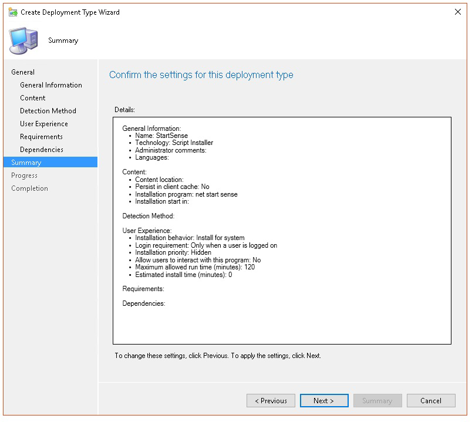
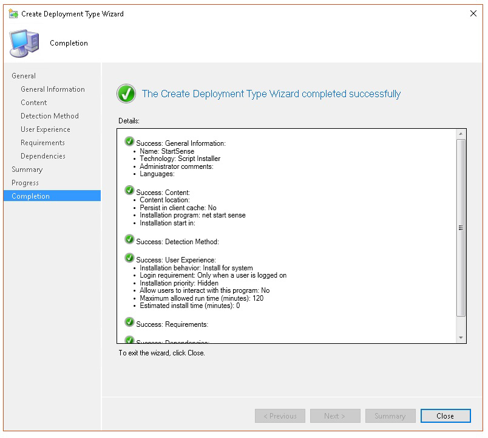

# <a name="troubleshoot-microsoft-defender-for-endpoint-onboarding-issues"></a>끝점 온보딩 문제에 대한 Microsoft Defender 문제 해결

[!INCLUDE [Microsoft 365 Defender rebranding](../../includes/microsoft-defender.md)]


**적용 대상:**

- [엔드포인트용 Microsoft Defender](https://go.microsoft.com/fwlink/?linkid=2154037)
- Windows Server 2012 R2
- Windows Server 2016
- [Microsoft 365 Defender](https://go.microsoft.com/fwlink/?linkid=2118804)

> Endpoint용 Defender를 경험하고 싶나요? [무료 평가판을 신청하세요.](https://signup.microsoft.com/create-account/signup?products=7f379fee-c4f9-4278-b0a1-e4c8c2fcdf7e&ru=https://aka.ms/MDEp2OpenTrial?ocid=docs-wdatp-pullalerts-abovefoldlink)

문제가 발생할 경우 끝점용 Microsoft Defender 온보딩 프로세스 문제를 해결해야 할 수 있습니다.
이 페이지에서는 배포 도구 중 하나를 사용하여 배포할 때 발생할 수 있는 온보더링 문제와 장치에서 발생할 수 있는 일반적인 오류를 해결하는 자세한 단계를 제공합니다.

## <a name="troubleshoot-issues-with-onboarding-tools"></a>온보더링 도구 관련 문제 해결

온보더링 프로세스를 완료하고 1시간이 지나도 [](investigate-machines.md) 장치 목록에 장치가 없는 경우 온보드 또는 연결 문제가 표시될 수 있습니다.

### <a name="troubleshoot-onboarding-when-deploying-with-group-policy"></a>그룹 정책을 사용하여 배포할 때의 온보더링 문제 해결

그룹 정책을 사용하여 배포는 장치에서 온보딩 스크립트를 실행하여 수행됩니다. 그룹 정책 콘솔은 배포의 성공 또는 실패를 나타내지 않습니다.

온보딩 프로세스를 완료하고 1시간이 지나도 장치 [](investigate-machines.md) 목록에 장치가 없는 경우 장치에서 스크립트 출력을 확인할 수 있습니다. 자세한 내용은 스크립트를 사용하여 배포할 때 [온보딩 문제 해결을 참조하세요.](#troubleshoot-onboarding-when-deploying-with-a-script)

스크립트가 성공적으로 완료되면 발생할 수 있는 추가 오류에 대한 자세한 내용은 [장치에서](#troubleshoot-onboarding-issues-on-the-device) 온보딩 문제 해결을 참조합니다.

### <a name="troubleshoot-onboarding-issues-when-deploying-with-microsoft-endpoint-configuration-manager"></a>온보더링을 사용하여 배포할 때의 온보더링 Microsoft Endpoint Configuration Manager

다음 버전의 Configuration Manager를 사용하여 장치를 온보드하는 경우:

- Microsoft Endpoint Configuration Manager
- System Center 2012 Configuration Manager
- System Center 2012 R2 Configuration Manager

위에서 언급한 Configuration Manager 버전이 있는 배포는 장치에서 온보딩 스크립트를 실행하여 수행됩니다. Configuration Manager 콘솔에서 배포를 추적할 수 있습니다.

배포가 실패하면 장치에서 스크립트의 출력을 확인할 수 있습니다.

온보드가 완료되어도 1시간이 지나도 장치가  장치 목록에 표시되지 않는 경우 발생할 수 있는 추가 오류에 대한 자세한 내용은 [장치에서](#troubleshoot-onboarding-issues-on-the-device) 온보더링 문제 해결을 참조하세요.

### <a name="troubleshoot-onboarding-when-deploying-with-a-script"></a>스크립트를 사용하여 배포할 때의 온보딩 문제 해결

**장치에서 스크립트의 결과를 확인합니다.**

1. **시작을** 클릭하고 이벤트 **뷰어를 입력하고** **Enter를 클릭합니다.**

2. 로그 **Windows 로**  >  **이동하십시오.**

3. **WDATPOnboarding** 이벤트 원본에서 이벤트를 찾아야 합니다.

스크립트가 실패하고 이벤트가 오류인 경우 다음 표의 이벤트 ID를 확인하여 문제를 해결할 수 있습니다.

> [!NOTE]
> 다음 이벤트 ID는 온보딩 스크립트에만 해당됩니다.

이벤트 ID | 오류 유형 | 해결 단계
:---:|:---|:---
 `5` | 오프보더 데이터를 찾았지만 삭제할 수 없습니다. | 레지스트리에 대한 사용 권한 확인, 특히<br> `HKLM\SOFTWARE\Policies\Microsoft\Windows Advanced Threat Protection`.
`10` | 등록 데이터를 레지스트리에 기록할 수 없습니다. |  레지스트리에 대한 사용 권한 확인, 특히<br> `HKLM\SOFTWARE\Policies\Microsoft\Windows Advanced Threat Protection`.<br>스크립트가 관리자 권한으로 실행된지 확인
`15` |  SENSE 서비스를 시작하지 못했습니다. |서비스 상태 확인( `sc query sense` 명령). 이 상태가 중간 *상태('Pending_Stopped'*, *'Pending_Running')에* 있지 않은지 확인한 후 스크립트를 다시 실행합니다(관리자 권한으로). <br> <br> 장치가 1607 버전 Windows 10 실행 중인 경우 `sc query sense` `START_PENDING` 는 를 반환합니다. 장치를 다시 시작하십시오. 장치를 다시 시작해도 문제가 해결되지 않는 경우 KB4015217로 업그레이드하고 다시 등록을 시도하십시오.
`15` | SENSE 서비스를 시작하지 못했습니다. | 오류 메시지가 시스템 오류 577 또는 오류 1058이 발생한 경우 Microsoft Defender 바이러스 백신 ELAM 드라이버를 사용하도록 [](#ensure-that-microsoft-defender-antivirus-is-not-disabled-by-a-policy) 설정해야 합니다. 자세한 내용은 정책에 Microsoft Defender 바이러스 백신 사용하지 않도록 설정되어 있지 않은지 확인을 참조하세요.
`30` |  스크립트가 서비스 실행을 기다리지 못했습니다. | 서비스를 시작하는 데 시간이 더 많이 들이거나 시작하려고 하는 동안 오류가 발생할 수 있습니다. SENSE와 관련된 이벤트 및 오류에 대한 자세한 내용은 이벤트 뷰어를 사용하여 이벤트 및 오류 [검토를 참조하세요.](event-error-codes.md)
`35` |  스크립트가 필요한 온보딩 상태 레지스트리 값을 찾지 못했습니다. | SENSE 서비스가 처음 시작되면 등록 상태를 레지스트리 위치에 기록합니다.<br>`HKLM\SOFTWARE\Microsoft\Windows Advanced Threat Protection\Status`.<br> 몇 초 후에 스크립트를 찾지 못했습니다. 수동으로 테스트하고 테스트가 있는지 확인할 수 있습니다. SENSE와 관련된 이벤트 및 오류에 대한 자세한 내용은 이벤트 뷰어를 사용하여 이벤트 및 오류 [검토를 참조하세요.](event-error-codes.md)
`40` | SENSE 서비스 온보드 상태가 **1로 설정되지 않은 경우** | SENSE 서비스가 제대로 온보드되지 않았습니다. SENSE와 관련된 이벤트 및 오류에 대한 자세한 내용은 이벤트 뷰어를 사용하여 이벤트 및 오류 [검토를 참조하세요.](event-error-codes.md)
`65` | 권한이 부족합니다.| 관리자 권한으로 스크립트를 다시 실행합니다.

### <a name="troubleshoot-onboarding-issues-using-microsoft-intune"></a>다음을 사용하여 온보더링 문제 Microsoft Intune

오류 Microsoft Intune 확인하여 문제의 원인을 해결할 수 있습니다.

Intune에서 정책을 구성한 경우 정책이 장치에 전파되지 않은 경우 자동 MDM 등록을 구성해야 할 수 있습니다.

다음 표를 사용하여 온보더링하는 동안 가능한 문제의 원인을 파악합니다.

- Microsoft Intune 오류 코드 및 OMA-URIs 테이블
- 비준수 테이블의 알려진 문제
- MDM(모바일 장치 관리) 이벤트 로그 테이블

이벤트 로그 및 문제 해결 단계가 작동하지 않는다면 포털의 장치 관리 섹션에서 로컬 스크립트를 다운로드하고 상승된 명령 프롬프트에서 실행합니다. 

#### <a name="microsoft-intune-error-codes-and-oma-uris"></a>Microsoft Intune 오류 코드 및 OMA-URIs

오류 코드 16진수 | 오류 코드 Dec | 오류 설명/Error Description | OMA-URI | 가능한 원인 및 문제 해결 단계
:---:|:---|:---|:---|:---
0x87D1FDE8 | -2016281112 | 재구성 실패 | 온보딩 <br> 오프보더링 | **가능한 원인:** 잘못된 Blob( 잘못된 서명 또는 PreviousOrgIds 필드 누락)에서 온보딩 또는 오프보딩에 실패했습니다. <br><br> **문제 해결 단계:** <br> 장치 이벤트 로그의 에이전트 온보더링 오류 보기 섹션에서 이벤트 [ID를 확인합니다.](#view-agent-onboarding-errors-in-the-device-event-log) <br><br> 다음 표의 MDM 이벤트 로그를 확인하거나 [에서 MDM 오류 진단의 지침을 Windows 10.](/windows/client-management/mdm/diagnose-mdm-failures-in-windows-10)
 | | | | 온보딩 <br> 오프보더링 <br> SampleSharing | **가능한 원인:** 끝점용 Microsoft Defender 정책 레지스트리 키가 존재하지 않는 경우 또는 OMA DM 클라이언트에 끝점 정책 레지스트리 키에 쓸 수 있는 권한이 없습니다. <br><br> **문제 해결 단계:** 다음 레지스트리 키가 존재하는지 확인 `HKEY_LOCAL_MACHINE\SOFTWARE\Policies\Microsoft\Windows Advanced Threat Protection` <br> <br> 이 명령이 존재하지 않는 경우 상승된 명령을 열고 키를 추가합니다.
 | | | | SenseIsRunning <br> OnboardingState <br> OrgId |  **가능한 원인:** 읽기 전용 속성으로 수정하려고 합니다. 온보더링에 실패했습니다. <br><br> **문제 해결 단계:** 장치의 온보더링 문제 해결에서 문제 [해결 단계를 확인합니다.](#troubleshoot-onboarding-issues-on-the-device) <br><br> 다음 표의 MDM 이벤트 로그를 확인하거나 [에서 MDM 오류 진단의 지침을 Windows 10.](/windows/client-management/mdm/diagnose-mdm-failures-in-windows-10)
 | | | | 모두 | **가능한 원인:** 지원되지 않는 SKU/플랫폼, 특히 Holographic SKU에 끝점용 Microsoft Defender를 배포하려고 시도합니다. <br><br> 현재 지원되는 플랫폼:<br> Enterprise, 교육 및 Professional.<br> 서버가 지원되지 않습니다.
 0x87D101A9 | -2016345687 |SyncML(425): 보낸 사람에게 받는 사람에 대한 적절한 ACL(액세스 제어 권한)이 없는 경우 요청한 명령이 실패했습니다. | 모두 |  **가능한 원인:** 지원되지 않는 SKU/플랫폼, 특히 Holographic SKU에 끝점용 Microsoft Defender를 배포하려고 시도합니다.<br><br> 현재 지원되는 플랫폼:<br>  Enterprise, 교육 및 Professional.

#### <a name="known-issues-with-non-compliance"></a>비준수와 관련한 알려진 문제

다음 표에서는 비준수 문제에 대한 정보와 문제를 해결할 수 있는 방법을 제공합니다.

사례 | 증상 | 가능한 원인 및 문제 해결 단계
:---:|:---|:---
 `1` | 디바이스가 SenseIsRunning OMA-URI를 준수합니다. 그러나 OrgId, Onboarding 및 OnboardingState OMA-URIs는 준수하지 않습니다. | **가능한 원인:** 설치 또는 업그레이드를 완료한 후 Windows 확인 OOBE 온보더링을 완료할 수 없지만 SENSE가 이미 실행되고 있습니다.<br><br> **문제 해결 단계:** OOBE가 완료될 때까지 기다렸다가
 `2` |  장치는 OrgId, Onboarding 및 OnboardingState OMA-URI를 준수하지만 SenseIsRunning OMA-URI는 준수하지 않습니다. |  **가능한 원인:** 센스 서비스의 시작 유형이 "지연된 시작"으로 설정됩니다. 이로 인해 시스템 Microsoft Intune DM 세션이 발생할 때 디바이스가 SenseIsRunning을 준수하지 않는 것으로 보고하는 경우도 있습니다. <br><br> **문제 해결 단계:** 이 문제는 24시간 내에 자동으로 해결됩니다.
 `3` | 장치가 호환되지 않습니다. | **문제 해결 단계:** 온보드 및 오프보더 정책이 같은 장치에 동시에 배포되지 않는지 확인합니다.

#### <a name="mobile-device-management-mdm-event-logs"></a>MDM(모바일 장치 관리) 이벤트 로그

MDM 이벤트 로그를 확인하여 온보더링 중에 발생할 수 있는 문제를 해결합니다.

로그 이름: Microsoft\Windows\DeviceManagement-EnterpriseDiagnostics-Provider

채널 이름: Admin

ID | 심각도 | 이벤트 설명 | 문제 해결 단계
:---|:---|:---|:---
1819 | 오류 | 끝점 CSP용 Microsoft Defender: 노드의 값을 설정하지 못했습니다. NodeId: (%1), TokenName: (%2), Result: (%3). | [1607년 Windows 10 누적 업데이트를 다운로드합니다.](https://go.microsoft.com/fwlink/?linkid=829760)

## <a name="troubleshoot-onboarding-issues-on-the-device"></a>장치의 온보더링 문제 해결

사용된 배포 도구가 온보딩 프로세스에서 오류를 나타내지 않지만 장치가 1시간 동안 장치 목록에 계속 나타나지 않는 경우 다음 확인 항목을 통해 끝점 에이전트에 오류가 발생했는지 확인할 수 있습니다.

- [장치 이벤트 로그에서 에이전트 온보드 오류 보기](#view-agent-onboarding-errors-in-the-device-event-log)
- [진단 데이터 서비스를 사용하도록 설정되어 있는지 확인](#ensure-the-diagnostics-service-is-enabled)
- [서비스가 시작되도록 설정되어 있는지 확인](#ensure-the-service-is-set-to-start)
- [디바이스가 인터넷에 연결되어 있는지 확인](#ensure-the-device-has-an-internet-connection)
- [정책에 Microsoft Defender 바이러스 백신 사용하지 않도록 설정되어 있지 않은지 확인](#ensure-that-microsoft-defender-antivirus-is-not-disabled-by-a-policy)

### <a name="view-agent-onboarding-errors-in-the-device-event-log"></a>장치 이벤트 로그에서 에이전트 온보드 오류 보기

1. **시작을** 클릭하고 이벤트 **뷰어를 입력하고** **Enter를 클릭합니다.**

2. 이벤트 **뷰어(로컬)** 창에서 응용 프로그램 및 서비스 로그 Microsoft Windows  >    >    >  **확장합니다.**

   > [!NOTE]
   > SENSE는 끝점용 Microsoft Defender의 전원을 공급하는 동작 센서를 참조하는 데 사용되는 내부 이름입니다.

3. **작동을** 선택하여 로그를 로드합니다.

4. 작업 **창에서** 현재 로그 **필터링을 클릭합니다.**

5. 필터 **탭의** 이벤트 수준 **아래에서 위험,** 경고 **및** 오류를 선택하고 확인 을 **클릭합니다.** 

   

6. 문제를 나타낼 수 있는 이벤트가 작업 **창에** 표시됩니다. 다음 표의 솔루션에 따라 문제를 해결할 수 있습니다.

이벤트 ID | 메시지 | 해결 단계
:---:|:---|:---
 `5` | Microsoft Defender for Endpoint Service가 변수에서 서버에 연결하지 _못했습니다._ | [장치에 인터넷에 액세스할 수 있도록 합니다.](#ensure-the-device-has-an-internet-connection)
 `6` | Microsoft Defender for Endpoint Service가 온보딩되지 않은 경우 온보딩 매개 변수를 찾을 수 없습니다. 오류 코드: _variable_ | [온보딩 스크립트를 다시 실행합니다.](configure-endpoints-script.md)
 `7` | Microsoft Defender for Endpoint Service에서 온보딩 매개 변수를 읽지 못했습니다. 오류 코드: _variable_ | [장치에 인터넷 액세스 권한이 있는지 확인한](#ensure-the-device-has-an-internet-connection)다음 전체 온보더링 프로세스를 다시 실행합니다.
 `9` | 끝점용 Microsoft Defender 서비스가 시작 유형을 변경하지 못했습니다. 오류 코드: variable | 온보딩하는 동안 이벤트가 발생하면 다시 시작하고 온보딩 스크립트를 다시 실행합니다. 자세한 내용은 온보딩 [스크립트를 다시 실행을 참조하세요.](configure-endpoints-script.md) <br><br>오프보더 중에 이벤트가 발생하면 고객 지원에 문의합니다.
`10` | Microsoft Defender for Endpoint Service에서 온보딩 정보를 유지하지 못했습니다. 오류 코드: variable | 온보딩 중에 이벤트가 발생하면 온보딩 스크립트를 다시 실행합니다. 자세한 내용은 온보딩 [스크립트를 다시 실행을 참조하세요.](configure-endpoints-script.md) <br><br>문제가 계속되면 고객 지원에 문의합니다.
`15` | 끝점용 Microsoft Defender가 URL을 사용하여 명령 채널을 시작할 수 없습니다. _variable_ | [장치에 인터넷에 액세스할 수 있도록 합니다.](#ensure-the-device-has-an-internet-connection)
`17` | 끝점용 Microsoft Defender 서비스가 연결된 사용자 환경 및 원격 분석 서비스 위치를 변경하지 못했습니다. 오류 코드: variable | [온보딩 스크립트를 다시 실행합니다.](configure-endpoints-script.md) 문제가 계속되면 고객 지원에 문의합니다.
`25` | Microsoft Defender for Endpoint Service가 레지스트리에서 상태를 다시 설정하지 못했습니다. 오류 코드: _variable_ | 고객 지원에 문의하세요.
`27` | Microsoft Defender에서 끝점 모드에 대해 Microsoft Defender를 사용하도록 설정하지 Windows Defender. 온보더링 프로세스가 실패했습니다. 오류 코드: variable | 고객 지원에 문의하세요.
`29` | 오프보더 매개 변수를 읽지 못했습니다. 오류 유형: %1, 오류 코드: %2, 설명: %3 | 장치에 인터넷 액세스 권한이 있는지 확인한 다음 전체 오프보더 프로세스를 다시 실행합니다.
`30` | 끝점용 Microsoft Defender에서 $(build.sense.productDisplayName) 모드를 사용하지 않도록 설정하지 못했습니다. 오류 코드: %1 | 고객 지원에 문의하세요.
`32` | $(build.sense.productDisplayName) 서비스가 온보더링 프로세스 후 자체 중지를 요청하지 못했습니다. 오류 코드: %1 | 서비스 시작 유형이 수동으로 설정되어 있는지 확인하고 장치를 다시 시작하십시오.
`55` | 보안 ETW 자동 로거를 만들지 못했습니다. 오류 코드: %1 | 장치를 다시부팅합니다.
`63` | 외부 서비스의 시작 유형을 업데이트합니다. 이름: %1, 실제 시작 유형: %2, 예상 시작 유형: %3, 종료 코드: %4 | 언급한 서비스의 시작 유형이 변경되는 원인을 식별합니다. 종료 코드가 0이 아닌 경우 시작 유형을 예상된 시작 유형으로 수동으로 수정합니다.
`64` | 중지된 외부 서비스 시작 이름: %1, 종료 코드: %2 | 이벤트가 계속 다시 나타나면 고객 지원에 문의합니다.
`68` | 서비스의 시작 유형이 예기치 않습니다. 서비스 이름: %1, 실제 시작 유형: %2, 예상 시작 유형: %3 | 시작 유형에서 변경의 원인을 식별합니다. 언급한 서비스 시작 유형을 수정합니다.
`69` | 서비스가 중지되었습니다. 서비스 이름: %1 | 언급한 서비스를 시작합니다. 지속되는 경우 고객 지원에 문의합니다.

<br />

끝점용 Microsoft Defender 에이전트가 제대로 작동하기 위해 사용하는 디바이스에 추가 구성 요소가 있습니다. Microsoft Defender for Endpoint 에이전트 이벤트 로그에 온보딩 관련 오류가 없는 경우 다음 단계를 진행하여 추가 구성 요소가 올바르게 구성되도록 합니다.

<span id="ensure-the-diagnostics-service-is-enabled" />

### <a name="ensure-the-diagnostic-data-service-is-enabled"></a>진단 데이터 서비스를 사용하도록 설정되어 있는지 확인

장치가 올바르게 보고되지 않는 경우 Windows 10 진단 데이터 서비스가 자동으로 시작되고 장치에서 실행 중인지 확인해야 할 수 있습니다. 다른 프로그램이나 사용자 구성 변경으로 서비스가 사용하지 않도록 설정되어 있을 수 있습니다.

먼저 서비스가 시작될 때 서비스가 자동으로 시작 Windows 확인한 다음 서비스가 현재 실행 중인지 확인하고 실행되고 있지 않은 경우 시작해야 합니다.

### <a name="ensure-the-service-is-set-to-start"></a>서비스가 시작되도록 설정되어 있는지 확인

**명령줄을 사용하여 진단** 데이터 Windows 10 시작 유형을 확인할 수 있습니다.

1. 디바이스에서 상승된 명령줄 프롬프트를 니다.

   a. 시작을 **클릭하고** **cmd 를** 입력하고 **Enter를 클릭합니다.**

   b. **명령 프롬프트** 을(를) 마우스 오른쪽 버튼으로 클릭하고 **관리자**(으)로 실행을 선택합니다.

2. 다음 명령을 입력하고 **Enter를 누를 수 있습니다.**

   ```text
   sc qc diagtrack
   ```

   서비스가 사용하도록 설정된 경우 결과는 다음 스크린샷과 같아야 합니다.

   

   로 설정되지 않은 경우 서비스를 자동으로 `START_TYPE` `AUTO_START` 시작으로 설정해야 합니다.

**명령줄을 사용하여 Windows 10 진단 데이터 서비스가 자동으로 시작될 수 있도록 합니다.**

1. 디바이스에서 상승된 명령줄 프롬프트를 니다.

   a. 시작을 **클릭하고** **cmd 를** 입력하고 **Enter를 클릭합니다.**

   b. **명령 프롬프트** 을(를) 마우스 오른쪽 버튼으로 클릭하고 **관리자**(으)로 실행을 선택합니다.

2. 다음 명령을 입력하고 **Enter를 누를 수 있습니다.**

   ```text
   sc config diagtrack start=auto
   ```

3. 성공 메시지가 표시됩니다. 다음 명령을 입력하여 변경을 확인하고 **Enter를 누르고 :**

   ```text
   sc qc diagtrack
   ```

4. 서비스를 시작 합니다.

   a. 명령 프롬프트에서 다음 명령을 입력하고 **Enter를 입력합니다.**

   ```text
   sc start diagtrack
   ```

### <a name="ensure-the-device-has-an-internet-connection"></a>디바이스가 인터넷에 연결되어 있는지 확인

엔드포인트용 Microsoft Defender 센서를 사용하려면 센서 데이터를 보고하고 엔드포인트용 Microsoft Defender 서비스와 통신하기 위해 WinHTTP(Microsoft Windows HTTP)가 필요합니다.

WinHTTP는 인터넷 검색 프록시 설정 및 기타 사용자 컨텍스트 응용 프로그램과는 독립적이며 특정 환경에서 사용할 수 있는 프록시 서버를 검색할 수 있어야 합니다.

센서가 서비스에 연결되도록 보장하기 위해 끝점 서비스 [URL에 대한 Microsoft Defender에](configure-proxy-internet.md#verify-client-connectivity-to-microsoft-defender-for-endpoint-service-urls) 대한 클라이언트 연결 확인 항목에 설명된 단계를 따르세요.

확인에 실패하고 사용자 환경이 프록시를 사용하여 인터넷에 연결하는 경우 프록시 및 인터넷 연결 설정 구성 항목에 설명된 단계를 [따릅니다.](configure-proxy-internet.md)

### <a name="ensure-that-microsoft-defender-antivirus-is-not-disabled-by-a-policy"></a>정책에 Microsoft Defender 바이러스 백신 사용하지 않도록 설정되어 있지 않은지 확인

> [!IMPORTANT]
> 다음 사항은 2020년 8월(버전 4.18.2007.8) 업데이트를 아직 수신하지 않은 장치에만 Microsoft Defender 바이러스 백신. 
>
> 이 업데이트는 시스템 Microsoft Defender 바이러스 백신 통해 클라이언트 장치에서 클라이언트를 해제할 수 없습니다.

**문제:** 온보딩 후 끝점용 Microsoft Defender 서비스가 시작되지 않습니다.

**증상:** 온보더링이 성공적으로 완료되지만 서비스를 시작하려고 할 때 오류 577 또는 오류 1058이 표시됩니다.

**해결** 방법: 장치에서 타사 맬웨어 방지 클라이언트를 실행하는 경우 끝점용 Microsoft Defender 에이전트에서 ELAM(맬웨어 방지 조기 실행) 드라이버를 사용하도록 설정해야 합니다. 시스템 정책에 의해 해제되어 있지 않은지 확인해야 합니다.

- 정책을 구현하는 데 사용하는 도구에 따라 다음과 같은 정책이 Windows Defender 확인해야 합니다.

  - DisableAntiSpyware
  - DisableAntiVirus

  예를 들어 그룹 정책에는 다음 값과 같은 항목이 없습니다.

  - `<Key Path="SOFTWARE\Policies\Microsoft\Windows Defender"><KeyValue Value="0" ValueKind="DWord" Name="DisableAntiSpyware"/></Key>`
  - `<Key Path="SOFTWARE\Policies\Microsoft\Windows Defender"><KeyValue Value="0" ValueKind="DWord" Name="DisableAntiVirus"/></Key>`

> [!IMPORTANT]
> 이 설정은 더 이상 사용되지 않습니다. 이 설정은 `disableAntiSpyware` 2020년 8월(버전 4.18.2007.8) 업데이트 이후 모든 클라이언트 장치에서 Microsoft Defender 바이러스 백신.

- 정책을 지운 후 온보더링 단계를 다시 실행합니다.

- 레지스트리 키를 열고 이전 레지스트리 키 값을 확인하여 정책이 사용하지 않도록 설정되어 있는지 확인할 수도 `HKEY_LOCAL_MACHINE\SOFTWARE\Policies\Microsoft\Windows Defender` 있습니다.

    

   > [!NOTE]
   > 모든 Windows Defender 서비스(wdboot, wdfilter, wdnisdrv, wdnissvc 및 windefend)는 기본 상태입니다. 이러한 서비스의 시작을 변경하는 것은 지원되지 않는 것이고 강제로 시스템을 다시 그만 두게 될 수 있습니다.
   >
   > WdBoot 및 WdFilter의 기본 구성 예제:
   > - `<Key Path="SYSTEM\CurrentControlSet\Services\WdBoot"><KeyValue Value="0" ValueKind="DWord" Name="Start"/></Key>`
   > - `<Key Path="SYSTEM\CurrentControlSet\Services\WdFilter"><KeyValue Value="0" ValueKind="DWord" Name="Start"/></Key>`

## <a name="troubleshoot-onboarding-issues-on-a-server"></a>서버의 온보더링 문제 해결

>[!NOTE]
>다음 문제 해결 지침은 하위 수준에만 Windows Server 2016 있습니다.

서버를 등록하는 동안 문제가 발생하는 경우 다음 확인 단계를 수행하여 가능한 문제를 해결합니다.

- [MMA(Microsoft Monitoring Agent 센서 데이터를 서비스에 보고하도록 설치 및 구성) 확인](configure-server-endpoints.md)
- [서버 프록시 및 인터넷 연결 설정이 올바르게 구성되었는지 확인](configure-server-endpoints.md)

다음을 확인해야 할 수도 있습니다.

- 작업 관리자의 프로세스 탭에서 실행되는 끝점  서비스에 대한 Microsoft Defender가 **있는지 확인** 예:

    

- 이벤트 **뷰어** 응용 프로그램 및 서비스 로그 작업 관리자에서 오류가 발생  >    >   하는지 확인 합니다.

- 서비스 **에서** 서버 Microsoft Monitoring Agent **실행** 중인지 검사합니다. 예를 들면 다음과 같습니다.

    

- Azure **Microsoft Monitoring Agent**  >  **분석(OMS)에서** 작업 영역과 상태가 실행 중인지 확인 합니다.

    

- 디바이스가 포털의 장치 목록에 **반영되는지** 확인

## <a name="confirming-onboarding-of-newly-built-devices"></a>새로 구축된 장치의 온보더링 확인

새로 작성된 장치에 온보드가 배포되지만 완료되지 않은 경우도 있을 수 있습니다.

아래 단계에서는 다음 시나리오에 대한 지침을 제공합니다.

- 새로 구축된 장치에 온보더링 패키지 배포
- OOBE(첫 번째 경험) 또는 첫 번째 사용자 로그온이 완료되지 않은 경우 센서가 시작되지 않습니다.
- 최종 사용자가 첫 번째 로그온을 수행하기 전에 장치가 꺼지거나 다시 시작됩니다.
- 이 시나리오에서는 온보더링 패키지가 배포된 경우에도 SENSE 서비스가 자동으로 시작되지 않습니다.

> [!NOTE]
> SENSE 서비스가 [2021년](https://support.microsoft.com/kb/5001384)4월 22일 업데이트 롤업에서 Windows 10, 버전 1809 또는 Windows Server 2019와 같은 최신 Windows 버전에서 시작하려면 OOBE 후 사용자 로그온이 더 이상 필요하지 않습니다. Windows 10 2021년 4월 업데이트 롤업이 [적용된 버전 1909입니다.](https://support.microsoft.com/kb/5001396) Windows 10 2021년 4월 28일 업데이트 롤업이 적용된 버전 [2004/20H2입니다.](https://support.microsoft.com/kb/5001391) 


> [!NOTE]
> 다음 단계는 다음 단계를 사용하는 경우만 관련이 Microsoft Endpoint Configuration Manager. 온보딩을 사용하는 온보딩에 대한 자세한 Microsoft Endpoint Configuration Manager [끝점용 Microsoft Defender를 참조합니다.](/mem/configmgr/protect/deploy-use/windows-defender-advanced-threat-protection)

1. 응용 프로그램을 Microsoft Endpoint Configuration Manager.

    

2. 응용 **프로그램 정보 수동 지정을 선택합니다.**

    

3. 응용 프로그램에 대한 정보를 지정하고 다음 을 **선택합니다.**

    

4. 소프트웨어 센터에 대한 정보를 지정하고 다음 을 **선택합니다.**

    

5. 배포 **유형에서 추가를** **선택합니다.**

    

6. 배포 **유형 정보 수동 지정을 선택하고** 다음 을 **선택합니다.**

    

7. 배포 유형에 대한 정보를 지정하고 다음 을 **선택합니다.**

    

8. 콘텐츠 **설치**  >  **프로그램에서 명령을** 지정합니다. `net start sense` .

    

9. 검색 **방법에서** **규칙 구성을** 선택하여 이 배포 유형이 있는지 검색한 다음 **절 추가 를 선택합니다.**

    

10. 다음 검색 규칙 세부 정보를 지정하고 확인을 **선택합니다.**

    

11. 검색 **방법에서** 다음 을 **선택합니다.**

    

12. 사용자 **환경에서** 다음 정보를 지정하고 다음을 **선택합니다.**

    

13. 요구 **사항에서** 다음 을 **선택합니다.**

    

14. **종속성에서** 다음 을 **선택합니다.**

    

15. 요약에서 **다음** 을 **선택합니다.**

    

16. **완료에서** **닫기 를 선택합니다.**

    

17. 배포 **유형에서** 다음 을 **선택합니다.**

    

18. 요약에서 **다음** 을 **선택합니다.**

    

    그러면 상태가 

19. **완료에서** **닫기 를 선택합니다.**

    

20. 이제 앱을 마우스 오른쪽 단추로 클릭하고 배포를 선택하여 응용 프로그램을 배포할 수 **있습니다.**

    

21. 일반적으로 **종속성에 대한** 콘텐츠 자동 배포 및 **찾아보기를 선택합니다.** 

    

22. **콘텐츠에서** 다음 **을 선택합니다.**

    

23. 배포 **설정에서** 다음 을 **선택합니다.**

    

24. **Scheduling** select **As soon as soon after the available time**, then select **Next**.

    

25. 사용자 **환경의** 마감일 또는 유지 관리 기간 동안 변경 내용 커밋(다시 시작 필요)을 선택하고 다음 을 **선택합니다.**

    

26. 알림에서 **다음** 을 **선택합니다.**

    

27. 요약에서 **다음** 을 **선택합니다.**

    

    그러면 상태가 

28. **완료에서** **닫기 를 선택합니다.**

    


## <a name="related-topics"></a>관련 항목

- [엔드포인트용 Microsoft Defender 문제 해결](troubleshoot-mdatp.md)
- [온보딩 장치](onboard-configure.md)
- [디바이스 프록시 및 인터넷 연결 설정 구성](configure-proxy-internet.md)
