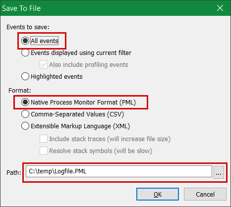

# <a name="troubleshoot-performance-issues-related-to-real-time-protection"></a>실시간 보호와 관련된 성능 문제 해결


[!INCLUDE [Microsoft 365 Defender rebranding](../../includes/microsoft-defender.md)]


**적용 대상:**

- [엔드포인트용 Microsoft Defender](https://go.microsoft.com/fwlink/p/?linkid=2146631)

시스템에 끝점용 Microsoft Defender의 실시간 보호 서비스와 관련된 높은 CPU 사용량 또는 성능 문제가 있는 경우 Microsoft 지원에 티켓을 제출할 수 있습니다. 진단 데이터 [수집의 Microsoft Defender 바이러스 백신 따릅니다.](collect-diagnostic-data.md)

관리자는 이러한 문제를 직접 해결할 수도 있습니다.

먼저 다른 소프트웨어로 인해 문제가 발생하고 있는지 확인할 수 있습니다. 공급업체에 바이러스 백신 제외 [확인을 읽어야 합니다.](#check-with-vendor-for-antivirus-exclusions)

그렇지 않으면 Microsoft 보호 로그 분석의 단계에 따라 식별된 성능 문제와 관련된 소프트웨어를 [식별할 수 있습니다.](#analyze-the-microsoft-protection-log)

다음 단계에 따라 Microsoft 지원에 제출에 추가 로그를 제공할 수도 있습니다.

- [프로세스 모니터를 사용하여 프로세스 로그 캡처](#capture-process-logs-using-process-monitor)
- [성능 기록기에서 Windows 성능 로그 캡처](#capture-performance-logs-using-windows-performance-recorder)

## <a name="check-with-vendor-for-antivirus-exclusions"></a>공급업체에 바이러스 백신 제외 확인

시스템 성능에 영향을 주는 소프트웨어를 쉽게 식별할 수 있는 경우 소프트웨어 공급업체의 기술 자료 또는 지원 센터로 이동하십시오. 바이러스 백신 제외에 대한 권장 사항이 있는 경우 검색합니다. 공급업체의 웹 사이트에 해당 웹 사이트가 없는 경우 지원 티켓을 열어서 게시할 수 있습니다.

소프트웨어 공급업체는 업계와 파트너 관계의 다양한 지침을 따라 가극적 긍정을 [최소화하는 것이 좋습니다.](https://www.microsoft.com/security/blog/2018/08/16/partnering-with-the-industry-to-minimize-false-positives/) 공급업체는 Microsoft Defender 보안 인텔리전스 포털(MDSI)을 통해 소프트웨어를 [제출할 수 있습니다.](https://www.microsoft.com/wdsi/filesubmission?persona=SoftwareDeveloper)

## <a name="analyze-the-microsoft-protection-log"></a>Microsoft 보호 로그 분석

**MPLog-xxxxxx-xxxxxx.log에서** 실행 중인 소프트웨어의 예상 성능 영향 정보를 *EstimatedImpact*:

`Per-process counts:ProcessImageName: smsswd.exe, TotalTime: 6597, Count: 1406, MaxTime: 609, MaxTimeFile: \Device\HarddiskVolume3\_SMSTaskSequence\Packages\WQ1008E9\Files\FramePkg.exe, EstimatedImpact: 65%`

<br>

****

|필드 이름|설명|
|---|---|
|ProcessImageName|프로세스 이미지 이름|
|TotalTime|이 프로세스에서 액세스한 파일 검색에 소요된 누적 기간(밀리초)입니다.|
|갯수|이 프로세스에서 액세스하는 검사된 파일 수|
|MaxTime|이 프로세스에서 액세스하는 파일의 가장 긴 단일 검색 기간(밀리초)입니다.|
|MaxTimeFile|가장 긴 기간 스캔이 기록된 이 프로세스에서 액세스하는 `MaxTime` 파일의 경로입니다.|
|EstimatedImpact|이 프로세스에서 검색 활동을 경험한 기간을 지난 기간 동안 이 프로세스에서 액세스한 파일을 검색하는 데 소요된 시간의 백분율|
|

성능에 미치는 영향이 큰 경우 검색에 대한 제외 구성 및 유효성 검사의 단계를 수행하여 경로/프로세스 제외에 프로세스를 [Microsoft Defender 바이러스 백신 시도합니다.](collect-diagnostic-data.md)

이전 단계로 문제가 해결되지 않는 경우 다음 섹션의 [](#capture-process-logs-using-process-monitor) 프로세스 모니터 또는 Windows 성능 레코더를 통해 추가 [정보를](#capture-performance-logs-using-windows-performance-recorder) 수집할 수 있습니다.

## <a name="capture-process-logs-using-process-monitor"></a>프로세스 모니터를 사용하여 프로세스 로그 캡처

프로세스 모니터(ProcMon)는 실시간 프로세스를 표시하는 고급 모니터링 도구입니다. 이 기능을 사용하여 발생하는 성능 문제를 캡처할 수 있습니다.

1. 프로세스 [모니터 v3.60을](/sysinternals/downloads/procmon) 같은 폴더로 다운로드합니다. `C:\temp`

2. 웹의 파일 표시를 제거하려면
    1. 마우스 오른쪽 **단추로ProcessMonitor.zip** 속성을 **선택합니다.**
    1. 일반 *탭에서* 보안 을 *찾아 봐야 합니다.*
    1. 차단 해제 **옆의 확인란을 선택합니다.**
    1. **적용** 을 선택합니다.

    

3. 폴더 경로가 으로 표시될 수 있도록 파일에서 `C:\temp` 파일의zip을 `C:\temp\ProcessMonitor` 제거합니다.

4. 문제를 **ProcMon.exe** 클라이언트 또는 Windows Windows 서버로 복사합니다.

5. ProcMon을 실행하기 전에 CPU 사용량이 높은 문제와 관련이 없는 다른 모든 응용 프로그램을 닫아야 합니다. 이렇게 하면 확인할 프로세스 수가 최소화됩니다.

6. ProcMon은 두 가지 방법으로 실행될 수 있습니다.
    1. 마우스 오른쪽 **단추로ProcMon.exe** 관리자 **권한으로 실행을 선택합니다.**

        로깅이 자동으로 시작되면 돋보기 아이콘을 선택하여 현재 캡처를 중지하거나 바로 가기 **키 Ctrl+E를 사용합니다.**

        

        캡처를 중지했다는 확인을 위해 돋보기 아이콘이 빨간색 X와 함께 나타나는지 여부를 검사합니다.

        

        다음으로, 이전 캡처를 지우기 위해 지우개 아이콘을 선택합니다.

        

        또는 바로 가기 키 **Ctrl+X를 사용합니다.**

    2. 두 번째 방법은 명령줄을 관리자로 실행한 다음 프로세스 모니터 경로에서 다음을 실행하는 것입니다. 

        

        ```console
        Procmon.exe /AcceptEula /Noconnect /Profiling
        ```

        > [!TIP]
        > 데이터를 캡처할 때 ProcMon 창을 최대한 작게 만들어 추적을 쉽게 시작 및 중지할 수 있습니다.
        >
        > 

7. 6단계의 절차 중 하나를 수행한 후 필터를 설정하는 옵션이 표시될 것입니다. **확인** 을 선택합니다. 캡처가 완료된 후 항상 결과를 필터링할 수 있습니다.

    

8. 캡처를 시작하려면 돋보기 아이콘을 다시 선택합니다.

9. 문제를 재현합니다.

    > [!TIP]
    > 문제가 완전히 재현될 때까지 기다렸다가 추적이 시작될 때 타임스탬프를 기록합니다.

10. 높은 CPU 사용량 조건에서 2-4분의 프로세스 활동이 있는 경우 돋보기 아이콘을 선택하여 캡처를 중지합니다.

11. 고유한 이름과 .pml 형식으로 캡처를 저장하려면 **파일,** **저장... 을 선택합니다.** 라디오 단추 모든 이벤트  및 네이티브 프로세스 모니터 **형식(PML)을 선택해야 합니다.**

    

12. 더 나은 추적을 위해 기본 경로를 다음 위치로 `C:\temp\ProcessMonitor\LogFile.PML` `C:\temp\ProcessMonitor\%ComputerName%_LogFile_MMDDYEAR_Repro_of_issue.PML` 변경합니다.
    - `%ComputerName%` 은 장치 이름입니다.
    - `MMDDYEAR` 은 월, 일 및 연도입니다.
    - `Repro_of_issue` 은 재현하려는 문제의 이름입니다.

    > [!TIP]
    > 작업 시스템이 있는 경우 비교할 샘플 로그를 얻을 수 있습니다.

13. .pml 파일을 압축하고 Microsoft 지원에 제출합니다.

## <a name="capture-performance-logs-using-windows-performance-recorder"></a>성능 기록기에서 Windows 성능 로그 캡처

WPR(Windows Recorder)을 사용하여 Microsoft 지원에 제출할 추가 정보를 포함할 수 있습니다. WPR은 녹음/녹화에 대한 이벤트 추적을 만드는 Windows 도구입니다.

WPR은 Windows ADK(Windows Assessment and Deployment Kit)의 일부로, ADK 다운로드 및 [설치에서 다운로드할 Windows 있습니다.](/windows-hardware/get-started/adk-install) SDK에서 Windows 10 소프트웨어 개발 키트의 일부로 다운로드할 [Windows 10 있습니다.](https://developer.microsoft.com/windows/downloads/windows-10-sdk/)

WPR UI를 사용하여 성능 로그 캡처의 단계에 따라 WPR 사용자 인터페이스를 [사용할 수 있습니다.](#capture-performance-logs-using-the-wpr-ui)

또는 [WPR CLI를](#capture-performance-logs-using-the-wpr-cli)사용하여 성능 *로그* 캡처의 단계에 따라wpr.exe및 이후 버전에서 사용할 수 있는 명령줄 도구인 Windows 8 를 사용할 수도 있습니다.

### <a name="capture-performance-logs-using-the-wpr-ui"></a>WPR UI를 사용하여 성능 로그 캡처

> [!TIP]
> 문제가 발생하는 디바이스가 여러 개 있는 경우 RAM이 가장 많은 장치를 사용 합니다.

1. WPR을 다운로드하여 설치합니다.

2. Windows *에서* Performance **Recorder를 Windows 클릭합니다.**

    

    추가 **를 선택합니다.** 관리자 **권한으로 실행을 선택합니다.**

3. 사용자 계정 컨트롤 대화 상자가 나타나면 예를 **선택합니다.**

    

4. 그런 다음 [끝점용 Microsoft Defender 분석](https://github.com/YongRhee-MDE/Scripts/blob/master/MDAV.wprp) 프로필을 다운로드하고 과 같은 `MDAV.wprp` 폴더에 `C:\temp` 저장합니다.

5. WPR 대화 상자에서 추가 옵션을 **선택합니다.**

    

6. 프로필 **추가...를** 선택하고 파일의 경로를 `MDAV.wprp` 탐색합니다.

7. 그런 다음 사용자 지정 측정 아래에  끝점 *분석용 Microsoft Defender라는* 새 프로필 집합이 표시됩니다.

    

    > [!WARNING]
    > Windows 서버에 64GB 이상의 RAM이 있는 경우 대신 사용자 지정 측정을 `Microsoft Defender for Endpoint analysis for large servers` `Microsoft Defender for Endpoint analysis` 사용합니다. 그렇지 않으면 시스템에서 많은 양의 비페이지 풀 메모리 또는 버퍼를 사용할 수 있으며, 이로 인해 시스템 비보안이 발생할 수 있습니다. 자원 분석을 확장하여 추가할 **프로필을 선택할 수 있습니다.**
    이 사용자 지정 프로필은 자세한 성능 분석에 필요한 컨텍스트를 제공합니다.

8. WPR UI에서 사용자 지정 측정 Microsoft Defender for Endpoint 자세한 분석 프로필을 사용하려면

    1. 첫 번째 수준 *Triage,* Resource Analysis and Scenario *Analysis* groups에서 프로필을 *선택하지 않도록* 합니다.
    2. 사용자 **지정 측정을 선택합니다.**
    3. 끝점 **분석용 Microsoft Defender를 선택합니다.**
    4. 세부 **정보 수준에서 자세한** *정보를* 선택합니다.
    5. 로깅 **모드에서** 파일 또는 **메모리를** 선택합니다.

    > [!IMPORTANT]
    > 사용자가 성능  문제를 직접 재현할 수 있는 경우 파일 로깅 모드를 사용하려면 파일을 선택해야 합니다. 대부분의 문제는 이 범주에 속합니다. 그러나 사용자가 직접 문제를 재현할 수 없지만 문제가 발생하면 쉽게 알 수  있는 경우 메모리를 선택하여 메모리 로깅 모드를 사용해야 합니다. 이렇게 하면 추적 로그가 장기 실행 시간으로 인해 과도하게 노출되지 않습니다.

9. 이제 데이터를 수집할 준비가 완료되었습니다. 성능 문제를 다시 재현하는 데 관련이 없는 모든 응용 프로그램을 종료합니다. 옵션 **숨기기** 옵션을 선택하여 WPR 창에 차지하는 공간을 작게 유지할 수 있습니다.

    

    > [!TIP]
    > 정수 초에 추적을 시작해 하세요. 예를 들어 01:30:00입니다. 이렇게 하면 데이터를 보다 쉽게 분석할 수 있습니다. 또한 문제가 재현된 정확한 타임스탬프를 추적하려고 시도합니다.

10. **시작** 을 선택합니다.

    

11. 문제를 재현합니다.

    > [!TIP]
    > 데이터 수집을 5분까지 유지하십시오. 2~3분은 많은 데이터가 수집되고 있는 것이 좋은 범위입니다.

12. **저장** 을 선택합니다.

    

13. 문제 **및** 문제를 재현한 방법에 대한 정보를 입력하여 자세한 문제 설명을 입력합니다.

    

    1. 파일 **이름:** 추적 파일을 저장할 위치를 결정하려면 선택합니다. 기본적으로 에 1.is `%user%\Documents\WPR Files\` 저장됩니다.
    1. **저장** 을 선택합니다.

14. 추적이 병합되는 동안 기다릴 수 있습니다.

    

15. 추적이 저장되고 나면 폴더 **열기 를 선택합니다.**

    

    Microsoft 지원에 제출할 파일과 폴더를 모두 포함합니다.

    

### <a name="capture-performance-logs-using-the-wpr-cli"></a>WPR CLI를 사용하여 성능 로그 캡처

명령줄 *도구는* wpr.exe명령줄 도구로 시작하는 운영 체제에 Windows 8. 명령줄 도구를 사용하여 WPR 추적을 수집하려면 다음을 wpr.exe.

1. 성능 추적을 위해 끝점 분석 프로필에 대한 **[Microsoft Defender를](https://github.com/YongRhee-MDE/Scripts/blob/master/MDAV.wprp)** 다운로드하여 같은 로컬 디렉터리에 있는 파일에 `MDAV.wprp` 대한 성능 추적을 다운로드합니다. `C:\traces`

2. 시작 메뉴  아이콘을 마우스 **오른쪽 단추로 클릭하고**  Windows PowerShell(관리자) 또는 명령 프롬프트(관리자)를 선택하여 관리자 명령 프롬프트 창을 열 수 있습니다.

3. 사용자 계정 컨트롤 대화 상자가 나타나면 예를 **선택합니다.**

4. 승격된 프롬프트에서 다음 명령을 실행하여 끝점 성능 추적에 대한 Microsoft Defender를 시작합니다.

    ```console
    wpr.exe -start C:\traces\MDAV.wprp!WD.Verbose -filemode
    ```

    > [!WARNING]
    > Windows 서버에 64GB 이상의 RAM이 있는 경우 프로필 및 대신 프로필을 `WDForLargeServers.Light` `WDForLargeServers.Verbose` 각각 `WD.Light` `WD.Verbose` 사용합니다. 그렇지 않으면 시스템에서 많은 양의 비페이지 풀 메모리 또는 버퍼를 사용할 수 있으며, 이로 인해 시스템 비보안이 발생할 수 있습니다.

5. 문제를 재현합니다.

    > [!TIP]
    > 데이터 수집을 5분 이상 유지하지 않습니다. 시나리오에 따라 많은 데이터가 수집되고 있는 것이 2~3분 정도면 좋습니다.

6. 승강된 프롬프트에서 다음 명령을 실행하여 성능 추적을 중지하고 문제 및 문제를 재현한 방법에 대한 정보를 제공해야 합니다.

    ```console
    wpr.exe -stop merged.etl "Timestamp when the issue was reproduced, in HH:MM:SS format" "Description of the issue" "Any error that popped up"
    ```

7. 추적이 병합될 때까지 기다렸다가

8. Microsoft 지원에 제출할 파일과 폴더를 모두 포함합니다.

## <a name="see-also"></a>참고 항목

- [진단 Microsoft Defender 바이러스 백신 데이터 수집](collect-diagnostic-data.md)
- [검사에 대한 제외 Microsoft Defender 바이러스 백신 유효성 검사](configure-exclusions-microsoft-defender-antivirus.md)
