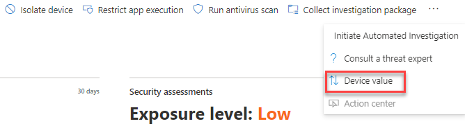

# 장치 값 할당 - 위협 및 취약성 관리

[!INCLUDE [Microsoft 365 Defender rebranding](../../includes/microsoft-defender.md)]

**적용 대상:**

- [엔드포인트용 Microsoft Defender](https://go.microsoft.com/fwlink/?linkid=2154037)
- [위협 및 취약성 관리](next-gen-threat-and-vuln-mgt.md)
- [Microsoft 365 Defender](https://go.microsoft.com/fwlink/?linkid=2118804)

> 엔드포인트용 Microsoft Defender를 경험하고 싶으신가요? [무료 평가판을 신청하세요.](https://signup.microsoft.com/create-account/signup?products=7f379fee-c4f9-4278-b0a1-e4c8c2fcdf7e&ru=https://aka.ms/MDEp2OpenTrial?ocid=docs-wdatp-portaloverview-abovefoldlink)

[!include[Prerelease information](../../includes/prerelease.md)]

디바이스의 값을 정의하면 자산 우선 순위를 차별화하는 데 도움이 됩니다. 디바이스 값은 노출 점수 계산에 개별 자산의 위험 위협 및 취약성 관리 통합하는 데 사용됩니다. "높은 값"으로 할당된 장치는 더 많은 가중치를 받게 됩니다.

설정 장치 값 [API 를 사용할 수 있습니다.](set-device-value.md)

디바이스 값 옵션:

- 낮음
- 보통(기본값)
- 높음

높은 값을 할당해야 하는 장치의 예:

- 도메인 컨트롤러, Active Directory
- 인터넷 연결 장치
- VIP 장치
- 내부/외부 프로덕션 서비스를 호스팅하는 장치

## 장치 값 선택

1. 장치 페이지로 이동하는 것이 장치 인벤토리에서 가장 쉬운 장소입니다.

2. 페이지 **위쪽의** 작업 표시줄 옆에 있는 세 점에서 장치 값을 선택합니다.

    

3. 플라이아웃은 현재 디바이스 값 및 의미와 함께 표시됩니다. 디바이스의 값을 검토하고 장치에 가장 적합한 값을 선택하세요.

## 디바이스 값이 노출 점수에 미치는 영향

노출 점수는 모든 디바이스에서 가중 평균입니다. 장치 그룹이 있는 경우 장치 그룹으로 점수를 필터링할 수 있습니다.

- 일반 디바이스의 가중치 1
- 낮은 값 디바이스의 가중치가 0.75입니다.
- 값이 높은 디바이스는 NumberOfAssets /10의 가중치를 가중치로 가중치가 있습니다.
    - 디바이스가 100개인 경우 각 고가치 디바이스의 가중치가 10(100/10)입니다.

## 관련 항목

- [위협 및 취약성 관리 개요](next-gen-threat-and-vuln-mgt.md)
- [노출 점수](tvm-exposure-score.md)
- [API](next-gen-threat-and-vuln-mgt.md#apis)