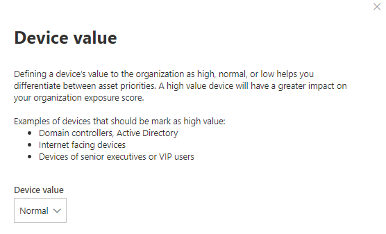

# 장치 값 할당 - 위협 및 취약성 관리Assign device value - threat and vulnerability management

[!INCLUDE [Microsoft 365 Defender rebranding](../../includes/microsoft-defender.md)]

**적용 대상:****Applies to:**

- [엔드포인트용 Microsoft DefenderMicrosoft Defender for Endpoint](https://go.microsoft.com/fwlink/?linkid=2154037)
- [위협 및 취약성 관리Threat and vulnerability management](next-gen-threat-and-vuln-mgt.md)
- [Microsoft 365 DefenderMicrosoft 365 Defender](https://go.microsoft.com/fwlink/?linkid=2118804)

> 끝점용 Microsoft Defender를 경험하고 싶나요?Want to experience Microsoft Defender for Endpoint? [무료 평가판에 등록합니다.Sign up for a free trial.](https://www.microsoft.com/microsoft-365/windows/microsoft-defender-atp?ocid=docs-wdatp-portaloverview-abovefoldlink)

[!include[Prerelease information](../../includes/prerelease.md)]

디바이스의 값을 정의하면 자산 우선 순위를 차별화하는 데 도움이 됩니다.Defining a device’s value helps you differentiate between asset priorities. 디바이스 값은 노출 점수 계산에 개별 자산의 위험 위협 및 취약성 관리 통합하는 데 사용됩니다.The device value is used to incorporate the risk appetite of an individual asset into the threat and vulnerability management exposure score calculation. "높은 값"으로 할당된 장치는 더 많은 가중치를 받게 됩니다.Devices assigned as “high value” will receive more weight.

설정 장치 값 [API 를 사용할 수 있습니다.](set-device-value.md)You can also use the [set device value API](set-device-value.md).

디바이스 값 옵션:Device value options:

- 낮음Low
- 보통(기본값)Normal (Default)
- 높음High

높은 값을 할당해야 하는 장치의 예:Examples of devices that should be assigned a high value:

- 도메인 컨트롤러, Active DirectoryDomain controllers, Active Directory
- 인터넷 연결 장치Internet facing devices
- VIP 장치VIP devices
- 내부/외부 프로덕션 서비스를 호스팅하는 장치Devices hosting internal/external production services

## 장치 값 선택Choose device value

1. 장치 페이지로 이동하는 것이 장치 인벤토리에서 가장 쉬운 장소입니다.Navigate to any device page, the easiest place is from the device inventory.

2. 페이지 **위쪽의** 작업 표시줄 옆에 있는 세 점에서 장치 값을 선택합니다.Select **Device value** from three dots next to the actions bar at the top of the page.

    

3. 플라이아웃은 현재 디바이스 값 및 의미와 함께 표시됩니다.A flyout will appear with the current device value and what it means. 디바이스의 값을 검토하고 장치에 가장 적합한 값을 선택하세요.Review the value of the device and choose the one that best fits your device.

## 디바이스 값이 노출 점수에 미치는 영향How device value impacts your exposure score

노출 점수는 모든 디바이스에서 가중 평균입니다.The exposure score is a weighted average across all devices. 장치 그룹이 있는 경우 장치 그룹으로 점수를 필터링할 수 있습니다.If you have device groups, you can also filter the score by device group.

- 일반 디바이스의 가중치 1Normal devices have a weight of 1
- 낮은 값 디바이스의 가중치가 0.75입니다.Low value devices have a weight of 0.75
- 값이 높은 디바이스는 NumberOfAssets /10의 가중치를 가중치로 가중치가 있습니다.High value devices have a weight of NumberOfAssets / 10.
    - 디바이스가 100개인 경우 각 고가치 디바이스의 가중치가 10(100/10)입니다.If you have 100 devices, each high value device will have a weight of 10 (100/10)

## 관련 항목Related topics

- [위협 및 취약성 관리 개요Threat and vulnerability management overview](next-gen-threat-and-vuln-mgt.md)
- [노출 점수Exposure Score](tvm-exposure-score.md)
- [APIAPIs](next-gen-threat-and-vuln-mgt.md#apis)