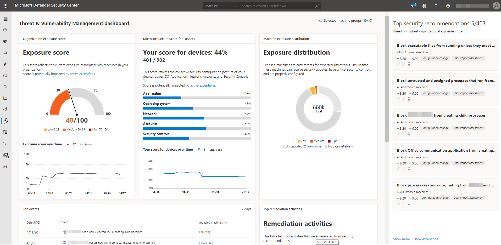

# 대시보드 인사이트 - 위협 및 취약성 관리Dashboard insights - threat and vulnerability management

[!INCLUDE [Microsoft 365 Defender rebranding](../../includes/microsoft-defender.md)]

**적용 대상:****Applies to:**

- [엔드포인트용 Microsoft DefenderMicrosoft Defender for Endpoint](https://go.microsoft.com/fwlink/?linkid=2154037)
- [위협 및 취약점 관리Threat and vulnerability management](next-gen-threat-and-vuln-mgt.md)
- [Microsoft 365 DefenderMicrosoft 365 Defender](https://go.microsoft.com/fwlink/?linkid=2118804)

> Endpoint용 Defender를 경험하고 싶나요?Want to experience Defender for Endpoint? [무료 평가판에 등록합니다.Sign up for a free trial.](https://www.microsoft.com/microsoft-365/windows/microsoft-defender-atp?ocid=docs-wdatp-portaloverview-abovefoldlink)

위협 및 취약점 관리는 끝점용 Defender의 구성 요소로, 다음을 포함하여 보안 관리자와 보안 운영 팀 모두에게 고유한 가치를 제공합니다.Threat and vulnerability management is a component of Defender for Endpoint, and provides both security administrators and security operations teams with unique value, including:

- 엔드포인트 취약점과 관련된 실시간 EDR(엔드포인트 탐지 및 대응) 인사이트Real-time endpoint detection and response (EDR) insights correlated with endpoint vulnerabilities
- 인시던트 조사 중에 평가할 수 있는 장치 취약성 컨텍스트Invaluable device vulnerability context during incident investigations
- Microsoft Intune 및 Microsoft Endpoint Configuration Manager를 통한 기본 제공 수정 프로세스Built-in remediation processes through Microsoft Intune and Microsoft Endpoint Configuration Manager  
  
Microsoft Defender 보안 센터의 위협 및 취약성 관리 기능을 사용하여 [다음을 할 수](https://securitycenter.windows.com/) 있습니다.You can use the threat and vulnerability management capability in [Microsoft Defender Security Center](https://securitycenter.windows.com/) to:

- 주요 보안 권장 사항, 소프트웨어 취약성, 수정 활동 및 노출된 장치와 함께 노출 점수 및 장치에 대한 Microsoft 보안 점수 보기View you exposure score and Microsoft Secure Score for Devices, along with top security recommendations, software vulnerability, remediation activities, and exposed devices
- EDR 인사이트를 끝점 취약성과 상관 관계 및 처리Correlate EDR insights with endpoint vulnerabilities and process them
- 재구성 옵션을 선택하여 재구성 작업을 Triage and track the remediation tasksSelect remediation options to triage and track the remediation tasks
- 예외 옵션 선택 및 활성 예외 추적Select exception options and track active exceptions

> [!NOTE]
> 지난 30일 동안 활성화되지 않은 장치는 조직의 위협 및 취약성 관리 노출 점수와 장치용 Microsoft 보안 점수를 반영하는 데이터에 반영되지 않습니다.Devices that are not active in the last 30 days are not factored in on the data that reflects your organization's threat and vulnerability management exposure score and Microsoft Secure Score for Devices.

이 비디오를 통해 위협 및 취약성 관리 대시보드에 있는 기능의 간략한 개요를 확인할 수 있습니다.Watch this video for a quick overview of what is in the threat and vulnerability management dashboard.

>[!VIDEO https://www.microsoft.com/en-us/videoplayer/embed/RE4r1nv]

## 위협 및 취약성 관리 대시보드Threat and vulnerability management dashboard

 

영역Area | 설명Description
:---|:---
**선택한 장치 그룹(#/#)****Selected device groups (#/#)**   | 대시보드 및 카드에 표시하려는 위협 및 취약성 관리 데이터를 장치 그룹으로 필터링합니다.Filter the threat and vulnerability management data you want to see in the dashboard and cards by device groups. 필터에서 선택한 사항은 위협 및 취약성 관리 페이지 전체에 적용됩니다.What you select in the filter applies throughout the threat and vulnerability management pages.
[**노출 점수****Exposure score**](tvm-exposure-score.md)   | 위협 및 취약성에 대한 조직의 현재 장치 노출 상태를 확인합니다.See the current state of your organization's device exposure to threats and vulnerabilities. 조직의 노출 점수에 영향을 주는 요인으로는 디바이스에서 발견된 약점, 장치가 위반될 가능성, 조직에 대한 장치 값, 장치에서 검색된 관련 경고 등 여러 가지 요인이 있습니다.Several factors affect your organization's exposure score: weaknesses discovered in your devices, likelihood of your devices to be breached, value of the devices to your organization, and relevant alerts discovered with your devices. 목표는 조직의 노출 점수를 낮출 수 있도록 보다 안전하게 하는 것입니다.The goal is to lower the exposure score of your organization to be more secure. 점수를 줄이기 위해 보안 권장 사항에 나열된 관련 보안 구성 문제를 수정해야 합니다.To reduce the score, you need to remediate the related security configuration issues listed in the security recommendations.
[**장치용 Microsoft 보안 점수****Microsoft Secure Score for Devices**](tvm-microsoft-secure-score-devices.md) | 조직의 운영 체제, 응용 프로그램, 네트워크, 계정 및 보안 제어에 대한 보안 자세를 참조합니다.See the security posture of the operating system, applications, network, accounts, and security controls of your organization. 목표는 관련 보안 구성 문제를 수정하여 디바이스에 대한 점수를 높이는 것입니다.The goal is to remediate the related security configuration issues to increase your score for devices. 막대를 선택하면 보안 권장 **페이지로 이동됩니다.**Selecting the bars will take you to the **Security recommendation** page.
**디바이스 노출 분포****Device exposure distribution** | 노출 수준에 따라 노출되는 장치 수를 참조합니다.See how many devices are exposed based on their exposure level. 도넛형 차트에서 섹션을 선택하여 장치 목록  페이지로 이동하여 영향을 받는 장치 이름, 노출 수준, 위험 수준 및 도메인, 운영 체제 플랫폼, 상태, 마지막으로 확인된 경우 및 태그와 같은 기타 세부 정보를 확인합니다.Select a section in the doughnut chart to go to the **Devices list** page and view the affected device names, exposure level, risk level, and other details such as domain, operating system platform, its health state, when it was last seen, and its tags.
**주요 보안 권장 사항****Top security recommendations** | 조직의 위험 노출 및 필요한 긴급도에 따라 정렬 및 우선 순위가 지정되는 정렬된 보안 권장 사항을 참조하세요.See the collated security recommendations that are sorted and prioritized based on your organization's risk exposure and the urgency that it requires. **목록의** 나머지 보안 권장 사항을 표시하려면 자세한 정보 표시를 선택합니다.Select **Show more** to see the rest of the security recommendations in the list. 예외가 **있는** 권장 사항 목록에 대해 예외 표시를 선택합니다.Select **Show exceptions** for the list of recommendations that have an exception.
**취약한 상위 소프트웨어****Top vulnerable software** | 네트워크 장치에 설치된 취약한 소프트웨어의 스택 순위 목록과 조직의 노출 점수에 어떤 영향을 미치는지 실시간으로 조직의 소프트웨어 인벤토리를 확인합니다.Get real-time visibility into your organization's software inventory with a stack-ranked list of vulnerable software installed on your network's devices and how they impact your organizational exposure score. 자세한 내용은 항목을 선택하거나 **소프트웨어** 인벤토리 페이지에서 나머지 취약한 소프트웨어 목록을 확인하려면 자세히 **표시를** 선택합니다.Select an item for details or **Show more** to see the rest of the vulnerable software list in the **Software inventory** page.
**상위 수정 활동****Top remediation activities** | 보안 권장 사항에서 생성된 수정 활동을 추적합니다.Track the remediation activities generated from the security recommendations. 목록의 각 항목을 선택하여 재구성 페이지에서  세부 정보를 보거나  자세히 표시를 선택하여 나머지 재구성 활동 및 활성 예외를 볼 수 있습니다.You can select each item on the list to see the details in the **Remediation** page or select **Show more** to view the rest of the remediation activities, and active exceptions.
**노출된 상위 장치****Top exposed devices** | 노출된 장치 이름 및 노출 수준을 확인합니다.View exposed device names and their exposure level. 목록에서 장치 이름을 선택하여 경고, 위험, 인시던트, 보안 권장 사항, 설치된 소프트웨어 및 노출된 장치와 관련된 검색된 취약점을 볼 수 있는 장치 페이지로 이동합니다.Select a device name from the list to go to the device page where you can view the alerts, risks, incidents, security recommendations, installed software, and discovered vulnerabilities associated with the exposed devices. 노출된 **장치 목록의** 나머지를 표시하려면 더 보기를 선택합니다.Select **Show more** to see the rest of the exposed devices list. 장치 목록에서 태그를 관리하고, 자동화된 조사를 시작하고, 라이브 응답 세션을 시작하고, 조사 패키지를 수집하고, 바이러스 백신 검색을 실행하고, 앱 실행을 제한하고, 장치를 격리할 수 있습니다.From the devices list, you can manage tags, initiate automated investigations, initiate a live response session, collect an investigation package, run antivirus scan, restrict app execution, and isolate device.

포털 전체에서 사용되는 아이콘에 대한 자세한 내용은 [끝점 아이콘용 Microsoft Defender를 참조하세요.](portal-overview.md#microsoft-defender-for-endpoint-icons)For more information on the icons used throughout the portal, see [Microsoft Defender for Endpoint icons](portal-overview.md#microsoft-defender-for-endpoint-icons).

## 관련 항목Related topics

- [위협 및 취약성 관리 개요Threat and vulnerability management overview](next-gen-threat-and-vuln-mgt.md)
- [노출 점수Exposure score](tvm-exposure-score.md)
- [장치용 Microsoft 보안 점수Microsoft Secure Score for Devices](tvm-microsoft-secure-score-devices.md)
- [보안 권장 사항Security recommendations](tvm-security-recommendation.md)
- [소프트웨어 인벤토리Software inventory](tvm-software-inventory.md)
- [이벤트 타임라인Event timeline](threat-and-vuln-mgt-event-timeline.md)

