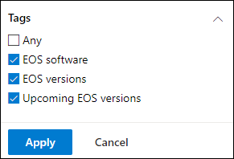

# 지원 종료 소프트웨어 및 소프트웨어 버전을 계획하고 위협 및 취약성 관리

[!INCLUDE [Microsoft 365 Defender rebranding](../../includes/microsoft-defender.md)]

**적용 대상:**

- [엔드포인트용 Microsoft Defender](https://go.microsoft.com/fwlink/?linkid=2154037)
- [위협 및 취약성 관리](next-gen-threat-and-vuln-mgt.md)
- [Microsoft 365 Defender](https://go.microsoft.com/fwlink/?linkid=2118804)

> 엔드포인트용 Microsoft Defender를 경험하고 싶으신가요? [무료 평가판을 신청하세요.](https://signup.microsoft.com/create-account/signup?products=7f379fee-c4f9-4278-b0a1-e4c8c2fcdf7e&ru=https://aka.ms/MDEp2OpenTrial?ocid=docs-wdatp-portaloverview-abovefoldlink)

소프트웨어 또는 소프트웨어 버전에 대한 EOS(서비스 종료)(EOS)는 더 이상 지원되거나 서비스되지 않고 보안 업데이트를 수신하지 않는다는 의미입니다. 지원이 종료된 소프트웨어 또는 소프트웨어 버전을 사용하는 경우 조직이 보안 취약성, 법률 및 재무 위험에 노출됩니다.

보안 및 IT 관리자가 함께 작업하고 최적의 결과, 규정 준수 및 건전한 네트워크 에코시스템을 위해 조직의 소프트웨어 인벤토리를 구성하는 것이 중요합니다. 지원 종료에 도달한 앱을 제거하거나 교체하고 더 이상 지원되지 않는 버전을 업데이트하는 옵션을 검사해야 합니다. 지원 날짜가 끝나기 전에  계획을 만들고 구현하는 것이 가장 좋은 것입니다.

> [!NOTE]
> 지원 종료 기능은 현재 모든 제품에서만 Windows 있습니다.

## 더 이상 지원되지 않는 소프트웨어 또는 소프트웨어 버전 찾기

1. 보안 위협 및 취약성 관리 보안 권장 [**사항으로 이동합니다.**](tvm-security-recommendation.md)
2. 필터 **패널로** 이동하여 태그 섹션을 검색합니다. EOS 태그 옵션 중 하나 이상을 선택합니다. 그런 다음 **을 적용합니다.**

    

3. 지원이 종료된 소프트웨어, 지원 종료된 소프트웨어 버전 또는 예정된 지원 종료 버전과 관련된 권장 사항 목록이 표시됩니다. 이러한 태그는 소프트웨어 인벤토리 [페이지에도 표시됩니다.](tvm-software-inventory.md)

    

## 버전 및 날짜 목록

지원이 종료되거나 곧 지원이 종료되거나 지원이 종료된 버전 목록을 확인한 후 해당 날짜는 다음 단계를 따르세요.

1. 지원이 종료된 버전이 있는 소프트웨어에 대한 보안 권장 플라이아웃에 메시지가 표시되거나 곧 지원이 종료될 예정입니다.

    

2. 소프트웨어 **드릴다운** 페이지로 이동하려면 버전 배포 링크를 선택합니다. 지원 종료 또는 예정된 지원 종료로 식별되는 태그가 있는 필터링된 버전 목록을 볼 수 있습니다.

    

3. 열 표에서 버전 중 하나를 선택합니다. 예: 버전 10.0.18362.1. 지원 종료 날짜와 함께 플라이아웃이 표시됩니다.

    

지원 종료 상태로 인해 취약한 소프트웨어 및 소프트웨어 버전을 확인한 후 조직에서 해당 버전을 업데이트하거나 제거할지 여부를 결정해야 합니다. 이렇게 하면 조직이 취약성 및 고급 영구 위협에 노출되는 것을 낮출 수 있습니다.

## 관련 항목

- [위협 및 취약성 관리 개요](next-gen-threat-and-vuln-mgt.md)
- [보안 권장 사항](tvm-security-recommendation.md)
- [소프트웨어 인벤토리](tvm-software-inventory.md)
