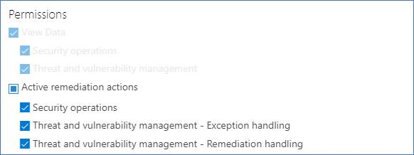

# 보안 권장 사항에 대한 예외 만들기 및 보기 - 위협 및 취약성 관리

[!INCLUDE [Microsoft 365 Defender rebranding](../../includes/microsoft-defender.md)]

**적용 대상:**

- [엔드포인트용 Microsoft Defender](https://go.microsoft.com/fwlink/?linkid=2154037)
- [위협 및 취약성 관리](next-gen-threat-and-vuln-mgt.md)
- [Microsoft 365 Defender](https://go.microsoft.com/fwlink/?linkid=2118804)

> 엔드포인트용 Microsoft Defender를 경험하고 싶으신가요? [무료 평가판을 신청하세요.](https://signup.microsoft.com/create-account/signup?products=7f379fee-c4f9-4278-b0a1-e4c8c2fcdf7e&ru=https://aka.ms/MDEp2OpenTrial?ocid=docs-wdatp-portaloverview-abovefoldlink)

현재 권장 사항이 관련이 없는 경우 수정 요청 대신 권장 사항에 대한 예외를 만들 수 있습니다. 조직에 장치 그룹이 있는 경우 예외의 범위를 특정 장치 그룹으로 제한할 수 있습니다. 선택한 장치 그룹 또는 과거 및 현재에 있는 모든 장치 그룹에 대해 예외를 만들 수 있습니다.

권장에 대한 예외가 만들어질 경우 예외 기간이 끝날 때까지 권장되지 않습니다. 권장 상태는 전체  예외 또는 부분 **예외(장치** 그룹)로 변경됩니다.

## 사용 권한

"예외 처리" 권한이 있는 사용자만 예외(만들기 또는 취소 포함)를 관리할 수 있습니다. [RBAC 역할에 대해 자세히 알아보시다.](user-roles.md)

## 예외 만들기

예외를 만들 보안 권장을 선택한 다음 예외  옵션을 선택하고 양식을 작성합니다.

### 장치 그룹에서 예외

모든 현재 장치 그룹에 예외를 적용하거나 특정 장치 그룹을 선택하십시오. 향후 장치 그룹은 예외에 포함되지 않습니다. 이미 예외가 있는 장치 그룹은 목록에 표시되지 않습니다. 특정 장치 그룹만 선택하면 권장 상태가 "활성"에서 "부분 예외"로 변경됩니다. 모든 장치 그룹을 선택하면 상태가 "전체 예외"로 변경됩니다.

#### 필터링된 보기

모든 위협 및 취약성 관리 그룹에서 장치 그룹으로 필터링한 경우 필터링된 장치 그룹만 옵션으로 표시됩니다.

이 단추는 모든 장치 페이지에서 장치 그룹으로 필터링하는 위협 및 취약성 관리 있습니다.

필터링된 장치 그룹을 사용하여 예외 보기:

#### 많은 수의 장치 그룹

조직에 20개 이상의 장치 그룹이 있는 경우 필터링된 장치 그룹 옵션 옆에 있는 편집을 선택합니다. 

포함된 장치 그룹을 검색하고 선택할 수 있는 플라이아웃이 나타납니다. 검색 아래의 확인 표시 아이콘을 선택하여 모두 확인/선택을 선택하지 않습니다.

### 전역 예외

전역 관리자 권한이 있는 경우 전역 예외를 만들고 취소할 수 있습니다. 이 설정은 조직의 **모든** 현재 및 향후 장치 그룹에 영향을 주며, 유사한 권한이 있는 사용자만 변경할 수 있습니다. 권장 상태는 "활성"에서 "전체 예외"로 변경됩니다.

유의해야 할 몇 가지 사항:

- 권장 설정이 전역 예외에 해당되는 경우 전역 예외가 만료되거나 취소될 때까지 장치 그룹에 대해 새로 만든 예외가 일시 중단됩니다. 이 시점이 지난 후 만료될 때까지 새 장치 그룹 예외가 적용됩니다.
- 권장에 특정 장치 그룹에 대한 예외가 이미 있는 경우 전역 예외가 생성되면 장치 그룹 예외가 만료되거나 전역 예외가 만료되기 전에 취소될 때까지 일시 중단됩니다.

### 사리

해당 보안 권장을 수정하는 대신 제출해야 하는 예외에 대한 사당을 선택합니다. 사정 컨텍스트를 작성한 다음 예외 기간을 설정합니다.

다음 목록에는 예외 옵션의 사당이 자세히 설명됩니다.

- **제3자** 제어 - 제3자 제품 또는 소프트웨어가 이미 이 권장을 해결합니다. 이 정당 유형을 선택하면 노출 점수가 낮아지며 위험이 감소하기 때문에 보안 점수가 증가합니다.
- **대체 완화** - 내부 도구는 이미 이 권장을 해결합니다. 이 사정 유형을 선택하면 노출 점수가 낮아지며 위험이 감소하기 때문에 보안 점수가 증가합니다.
- **위험 수락** - 낮은 위험에 노출되거나 권장을 구현하는 데 비용이 너무 많이 드는 경우
- **계획된 재구성(유예)** - 이미 계획되어 있지만 실행 또는 권한 부여를 대기하고 있습니다.

## 모든 예외 보기

수정 **페이지의 예외** **탭으로** 이동합니다. 정당성, 유형 및 상태별로 필터링할 수 있습니다.

 자세한 정보가 있는 플라이아웃을 열기 위해 예외를 선택합니다. 장치 그룹당 예외에는 예외가 다루는 모든 장치 그룹 목록이 표시될 수 있습니다. 이 목록은 내보낼 수 있습니다. 관련 권장 정보를 보거나 예외를 취소할 수도 있습니다.

## 예외를 취소하는 방법

예외를 취소하기 위해 수정 페이지의 **예외** **탭으로** 이동합니다. 예외를 선택합니다.

모든 장치 그룹 또는 전역 예외에 대한 예외를 취소하려면 모든 장치 그룹에서 예외 취소 **단추를** 선택합니다. 사용 권한이 있는 장치 그룹에 대한 예외만 취소할 수 있습니다.

### 특정 장치 그룹에 대한 예외 취소

특정 장치 그룹을 선택하여 예외를 취소합니다. 장치 그룹에 대한 플라이아웃이 표시되고 예외 취소 **를 선택할 수 있습니다.**

## 예외가 적용된 후의 영향 보기

보안 권장 사항 페이지에서 열 사용자  지정을 선택하고 노출된 장치(예외 후) 및 영향(예외 **후)** 확인란을 **선택합니다.**

노출된 장치(예외 이후) 열에는 예외가 적용된 후에도 여전히 취약성에 노출된 나머지 장치가 표시됩니다. 노출에 영향을 주는 예외 사당성에는 '제3자 제어' 및 '대체 완화'가 포함됩니다. 다른 사정은 디바이스의 노출을 줄이지 않는 것이 아니며 여전히 노출된 것으로 간주됩니다.

예외가 적용된 후의 영향(예외 이후)은 노출 점수 또는 보안 점수에 남은 영향을 보여 주며, 점수에 영향을 주는 예외 사당성에는 '제3자 제어' 및 '대체 완화'가 포함됩니다. 다른 사당성은 장치의 노출을 줄이지 않습니다. 따라서 노출 점수와 보안 점수는 변경되지 않습니다.

## 관련 항목

- [위협 및 취약성 관리 개요](next-gen-threat-and-vuln-mgt.md)
- [취약성 수정](tvm-remediation.md)
- [보안 권장 사항](tvm-security-recommendation.md)
- [노출 점수](tvm-exposure-score.md)
- [장치용 Microsoft Secure Score](tvm-microsoft-secure-score-devices.md)
