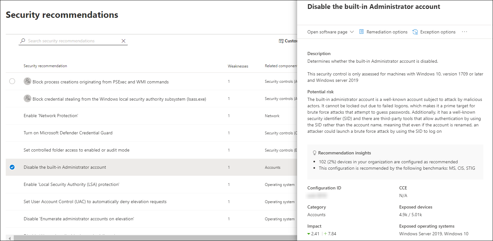

# 장치용 Microsoft Secure ScoreMicrosoft Secure Score for Devices

[!INCLUDE [Microsoft 365 Defender rebranding](../../includes/microsoft-defender.md)]

**적용 대상:****Applies to:**

- [엔드포인트용 Microsoft DefenderMicrosoft Defender for Endpoint](https://go.microsoft.com/fwlink/?linkid=2154037)
- [위협 및 취약성 관리Threat and vulnerability management](next-gen-threat-and-vuln-mgt.md)
- [Microsoft 365 DefenderMicrosoft 365 Defender](https://go.microsoft.com/fwlink/?linkid=2118804)

> Endpoint용 Defender를 경험하고 싶나요?Want to experience Defender for Endpoint? [무료 평가판에 등록합니다.Sign up for a free trial.](https://www.microsoft.com/microsoft-365/windows/microsoft-defender-atp?ocid=docs-wdatp-pullalerts-abovefoldlink) 

>[!NOTE]
> 구성 점수는 이제 장치용 Microsoft 위협 및 취약성 관리 점수의 일부입니다.Configuration score is now part of threat and vulnerability management as Microsoft Secure Score for Devices.

장치에 대한 점수는 디바이스의 위협 및 취약성 관리 [대시보드에](tvm-dashboard-insights.md) Microsoft Defender 보안 센터.Your score for devices is visible in the [threat and vulnerability management dashboard](tvm-dashboard-insights.md) of the Microsoft Defender Security Center. 장치에 대한 Microsoft 보안 점수가 높을수록 끝점이 사이버 보안 위협 공격으로부터 더 탄력적입니다.A higher Microsoft Secure Score for Devices means your endpoints are more resilient from cybersecurity threat attacks. 다음 범주에 걸쳐 디바이스의 전체 보안 구성 상태를 반영합니다.It reflects the collective security configuration state of your devices across the following categories:

- 응용 프로그램Application
- 운영 체제Operating system
- 네트워크Network
- 계정Accounts
- 보안 제어Security controls

보안 권장 사항 페이지로 이동하여 관련 권장 사항을 볼 범주를 선택합니다. Select a category to go to the [**Security recommendations**](tvm-security-recommendation.md) page and view the relevant recommendations.

## Microsoft 보안 점수 커넥터 켜기Turn on the Microsoft Secure Score connector

끝점 신호를 위해 Microsoft Defender를 전달하여 장치 보안 상태의 Microsoft 보안 점수를 볼 수 있도록 합니다.Forward Microsoft Defender for Endpoint signals, giving Microsoft Secure Score visibility into the device security posture. 전달된 데이터는 Microsoft 보안 점수 데이터와 동일한 위치에 저장되고 처리됩니다.Forwarded data is stored and processed in the same location as your Microsoft Secure Score data.

변경 내용을 대시보드에 반영하는 데 최대 몇 시간이 걸릴 수 있습니다.Changes might take up to a few hours to reflect in the dashboard.

1. 탐색 창에서 고급 설정   >  **이동**In the navigation pane, go to **Settings** > **Advanced features** 

2. **아래로 스크롤하여 Microsoft 보안** 점수로 이동하고 설정을 으로 **전환합니다.**Scroll down to **Microsoft Secure Score** and toggle the setting to **On**.

3. 기본 **설정 저장을 선택합니다.**Select **Save preferences**.

## 작동 방법How it works

>[!NOTE]
> Microsoft Secure Score for Devices는 현재 그룹 정책을 통해 설정된 구성을 지원합니다.Microsoft Secure Score for Devices currently supports configurations set via Group Policy. 현재 부분 Intune 지원으로 인해 Intune을 통해 설정될 수 있는 구성이 잘못 구성된 것으로 표시될 수 있습니다.Due to the current partial Intune support, configurations which might have been set through Intune might show up as misconfigured. 조직에서 보안 구성 관리를 위해 Intune을 사용하는 경우 IT 관리자에게 문의하여 실제 구성 상태를 확인할 수 있습니다.Contact your IT Administrator to verify the actual configuration status in case your organization is using Intune for secure configuration management.

Microsoft Secure Score for Devices 카드의 데이터는 세세하고 지속적인 취약점 검색 프로세스의 제품입니다.The data in the Microsoft Secure Score for Devices card is the product of meticulous and ongoing vulnerability discovery process. 다음을 지속적으로 구성 검색 평가를 통해 집계됩니다.It is aggregated with configuration discovery assessments that continuously:

- 수집된 구성을 수집된 벤치마크와 비교하여 잘못 구성된 자산 검색Compare collected configurations to the collected benchmarks to discover misconfigured assets
- 수정 또는 부분적으로 수정될 수 있는 취약성에 구성 매핑(위험 감소)Map configurations to vulnerabilities that can be remediated or partially remediated (risk reduction)
- 모범 사례 구성 벤치마크 수집 및 유지 관리(공급업체, 보안 피드, 내부 연구 팀)Collect and maintain best practice configuration benchmarks (vendors, security feeds, internal research teams)
- 모든 자산에서 보안 제어 구성 상태의 변경 사항 수집 및 모니터링Collect and monitor changes of security control configuration state from all assets

## 보안 구성 개선Improve your security configuration

보안 권장 사항 목록의 문제를 수정하여 보안 구성을 개선합니다.Improve your security configuration by remediating issues from the security recommendations list. 이렇게 할 때 장치에 대한 Microsoft 보안 점수가 개선될 수 있으며 조직은 사이버 보안 위협 및 취약성에 대해 더 탄력적으로 대응할 수 있습니다.As you do so, your Microsoft Secure Score for Devices improves and your organization becomes more resilient against cybersecurity threats and vulnerabilities.

1. 위협 및 취약성 관리 대시보드의 Microsoft Secure Score for Devices(장치 보안 점수) 카드에서 범주 중 하나를 선택합니다.From the Microsoft Secure Score for Devices card in the threat and vulnerability management dashboard, select the one of the categories. 해당 범주와 관련된 추천 목록을 볼 수 있습니다.You'll view the list of recommendations related to that category. 보안 권장 사항 [**페이지로 이동합니다.**](tvm-security-recommendation.md)It will take you to the [**Security recommendations**](tvm-security-recommendation.md) page. 모든 보안 권장 사항을 확인하려는 경우 보안 권장 사항 페이지로 이동한 후 검색 필드를 지우십시오.If you want to see all security recommendations, once you get to the Security recommendations page, clear the search field.

2. 목록에서 항목을 선택합니다.Select an item on the list. 추천과 관련된 세부 정보가 있는 플라이아웃 패널이 열립니다.The flyout panel will open with details related to the recommendation. 수정 **옵션 을 선택합니다.**Select **Remediation options**.

   

3. 설명을 읽어 문제의 컨텍스트와 다음에 할 작업을 이해합니다.Read the description to understand the context of the issue and what to do next. 기한을 선택하고 메모를 추가하고, 추가 작업 수행을 위해 전자 메일에 첨부할 수 있도록 모든 재구성 활동 데이터를 **CSV로** 내보내기 를 선택합니다.Select a due date, add notes, and select **Export all remediation activity data to CSV** so you can attach it to an email for follow-up.

4. **요청을 제출합니다.****Submit request**. 재구성 작업이 만들어졌다는 확인 메시지가 표시됩니다.You'll see a confirmation message that the remediation task has been created.
   

5. CSV 파일을 저장합니다.Save your CSV file.
   

6. IT 관리자에게 후속 전자 메일을 보내고 수정을 위해 시스템에서 전파하도록 허용하는 시간을 허용합니다.Send a follow-up email to your IT Administrator and allow the time that you've allotted for the remediation to propagate in the system.

7. 대시보드에서 **Microsoft Secure Score for Devices(장치용 Microsoft 보안 점수)** 카드를 다시 검토합니다.Review the **Microsoft Secure Score for Devices** card again on the dashboard. 권장 보안 제어의 수가 감소합니다.The number of security controls recommendations will decrease. 보안 **컨트롤을** 선택하여 보안 권장  사항 페이지로 돌아가면 해결한 항목이 더 이상 목록에 나열되지 않습니다.When you select **Security controls** to go back to the **Security recommendations** page, the item that you've addressed won't be listed there anymore. 장치에 대한 Microsoft 보안 점수가 높아야 합니다.Your Microsoft Secure Score for Devices should increase.

>[!IMPORTANT]
>취약성 평가 감지 비율을 높이기 위해 다음과 같은 필수 보안 업데이트를 다운로드하여 네트워크에 배포합니다.To boost your vulnerability assessment detection rates, download the following mandatory security updates and deploy them in your network:
>- 19H1 고객 | [KB 4512941](https://support.microsoft.com/help/4512941/windows-10-update-kb4512941)19H1 customers | [KB 4512941](https://support.microsoft.com/help/4512941/windows-10-update-kb4512941)
>- RS5 고객 | [KB 4516077](https://support.microsoft.com/help/4516077/windows-10-update-kb4516077)RS5 customers | [KB 4516077](https://support.microsoft.com/help/4516077/windows-10-update-kb4516077)
>- RS4 고객 | [KB 4516045](https://support.microsoft.com/help/4516045/windows-10-update-kb4516045)RS4 customers | [KB 4516045](https://support.microsoft.com/help/4516045/windows-10-update-kb4516045)
>- RS3 고객 | [KB 4516071](https://support.microsoft.com/help/4516071/windows-10-update-kb4516071)RS3 customers | [KB 4516071](https://support.microsoft.com/help/4516071/windows-10-update-kb4516071)
>
>보안 업데이트를 다운로드하려면To download the security updates:
>1. Microsoft [업데이트 카탈로그로 이동하십시오.](https://www.catalog.update.microsoft.com/home.aspx)Go to [Microsoft Update Catalog](https://www.catalog.update.microsoft.com/home.aspx).
>2. 다운로드해야 하는 보안 업데이트 KB 번호에 키를 입력한 다음 검색을 **클릭합니다.**Key-in the security update KB number that you need to download, then click **Search**.  

## 관련 항목Related topics

- [위협 및 취약성 관리 개요Threat and vulnerability management overview](next-gen-threat-and-vuln-mgt.md)
- [DashboardDashboard](tvm-dashboard-insights.md)
- [노출 점수Exposure score](tvm-exposure-score.md)
- [보안 권장 사항Security recommendations](tvm-security-recommendation.md)
