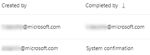

# 위협 및 취약성 관리를 통해 취약성 수정Remediate vulnerabilities with threat and vulnerability management

[!INCLUDE [Microsoft 365 Defender rebranding](../../includes/microsoft-defender.md)]

**적용 대상:****Applies to:**
- [엔드포인트용 Microsoft DefenderMicrosoft Defender for Endpoint](https://go.microsoft.com/fwlink/?linkid=2154037)
- [위협 및 취약점 관리Threat and vulnerability management](next-gen-threat-and-vuln-mgt.md)
- [Microsoft 365 DefenderMicrosoft 365 Defender](https://go.microsoft.com/fwlink/?linkid=2118804)

>끝점용 Microsoft Defender를 경험하고 싶나요?Want to experience Microsoft Defender for Endpoint? [무료 평가판에 등록합니다.Sign up for a free trial.](https://www.microsoft.com/microsoft-365/windows/microsoft-defender-atp?ocid=docs-wdatp-portaloverview-abovefoldlink)

## 요청 수정Request remediation

Microsoft Defender for Endpoint의 위협 및 취약성 관리 기능은 수정 요청 워크플로를 통해 보안 관리자와 IT 관리자 간의 격차를 해소합니다.The threat and vulnerability management capability in Microsoft Defender for Endpoint bridges the gap between Security and IT administrators through the remediation request workflow. 보안 관리자는 IT 관리자에게 보안 권장 페이지에서 Intune으로의  취약점 수정을 요청할 수 있습니다.Security admins like you can request for the IT Administrator to remediate a vulnerability from the **Security recommendation** pages to Intune.

### Microsoft Intune 연결 사용Enable Microsoft Intune connection

이 기능을 사용하려면 Microsoft Intune 연결을 사용하도록 설정해야 합니다.To use this capability, enable your Microsoft Intune connections. Microsoft Defender 보안 센터에서 설정 **일반** 고급  >    >  **기능으로 이동합니다.**In the Microsoft Defender Security Center, navigate to **Settings** > **General** > **Advanced features**. 아래로 스크롤하여 **Microsoft Intune 연결을 확인합니다.**Scroll down and look for **Microsoft Intune connection**. 기본적으로 토글은 꺼져 있습니다.By default, the toggle is turned off. Microsoft **Intune 연결** 토글을 **으로 전환합니다.**Turn your **Microsoft Intune connection** toggle **On**.

**참고:** Intune 연결을 사용하도록 설정한 경우 수정 요청을 만들 때 Intune 보안 작업을 만드는 옵션이 제공됩니다.**Note**: If you have the Intune connection enabled, you get an option to create an Intune security task when creating a remediation request. 연결이 설정되어 있지 않은 경우 이 옵션이 나타나지 않습니다.This option does not appear if the connection is not set.

자세한 [내용은 Intune을 사용하여 끝점용 Microsoft Defender로](https://docs.microsoft.com/intune/atp-manage-vulnerabilities) 식별된 취약점 수정을 참조합니다.See [Use Intune to remediate vulnerabilities identified by Microsoft Defender for Endpoint](https://docs.microsoft.com/intune/atp-manage-vulnerabilities) for details.

### 재구성 요청 단계Remediation request steps

1. Microsoft Defender 보안 센터의 위협 및 취약성 관리 탐색 메뉴로 이동하여 보안 권장 [**사항을 선택합니다.**](tvm-security-recommendation.md)Go to the threat and vulnerability management navigation menu in the Microsoft Defender Security Center, and select [**Security recommendations**](tvm-security-recommendation.md).

2. 재구성 요청을 할 보안 권장을 선택한 다음 수정 옵션을 **선택합니다.**Select a security recommendation you would like to request remediation for, and then select **Remediation options**.

3. 수정을 요청하는 사항, 해당 장치 그룹, 우선 순위, 기한 및 선택적 메모를 포함하여 양식을 작성합니다.Fill out the form, including what you are requesting remediation for, applicable device groups, priority, due date, and optional notes.
    1. "주의 필요" 수정 옵션을 선택하는 경우 특정 작업이 아니기 때문에 기한을 선택할 수 없습니다.If you choose the "attention required" remediation option, selecting a due date will not be available since there is no specific action.

4. 요청 **제출을 선택합니다.**Select **Submit request**. 수정 요청을 제출하면 위협 및 취약성 관리 내에 재구성 활동 항목이 생성됩니다. 이 항목은 이 권장에 대한 재구성 진행 상황을 모니터링하는 데 사용할 수 있습니다.Submitting a remediation request creates a remediation activity item within threat and vulnerability management, which can be used for monitoring the remediation progress for this recommendation. 이렇게 하면 수정이 트리거되거나 장치에 변경 내용이 적용되지 않습니다.This will not trigger a remediation or apply any changes to devices.

5. IT 관리자에게 새 요청을 알리고 Intune에 로그인하여 요청을 승인하거나 거부하고 패키지 배포를 시작하게 합니다.Notify your IT Administrator about the new request and have them log into Intune to approve or reject the request and start a package deployment.

6. [**재구성 페이지로 이동하여**](tvm-remediation.md) 재구성 요청의 상태를 시청하세요.Go to the [**Remediation**](tvm-remediation.md) page to view the status of your remediation request.

Intune에서 티켓이 어떻게 표시하는지 확인하려는 경우 [Intune을 사용하여 끝점용 Microsoft Defender로](https://docs.microsoft.com/intune/atp-manage-vulnerabilities) 식별된 취약점 수정을 참조하세요.If you want to check how the ticket shows up in Intune, see [Use Intune to remediate vulnerabilities identified by Microsoft Defender for Endpoint](https://docs.microsoft.com/intune/atp-manage-vulnerabilities) for details.

>[!NOTE]
>요청에 10,000개가 넘는 장치를 수정해야 하는 경우 수정을 위해 10,000개가 넘는 장치만 Intune에 보낼 수 있습니다.If your request involves remediating more than 10,000 devices, we can only send 10,000 devices for remediation to Intune.

조직의 사이버 보안 약점을 식별하고 실행 가능한 보안 권장 사항에 매핑한 후 [보안](tvm-security-recommendation.md)작업 만들기를 시작하세요.After your organization's cybersecurity weaknesses are identified and mapped to actionable [security recommendations](tvm-security-recommendation.md), start creating security tasks. 재구성 티켓이 만들어진 Microsoft Intune과의 통합을 통해 작업을 만들 수 있습니다.You can create tasks through the integration with Microsoft Intune where remediation tickets are created.

보안 권장 사항을 수정하여 취약성에 대한 조직의 노출을 낮추고 보안 구성을 강화합니다.Lower your organization's exposure from vulnerabilities and increase your security configuration by remediating the security recommendations.

## 재구성 활동 보기View your remediation activities

보안 권장 사항 페이지에서 재구성 요청을 제출하면 수정 활동이 시작됩니다.When you submit a remediation request from the Security recommendations page, it kicks-off a remediation activity. 위협 및 취약성 관리 수정 페이지에서 추적할 수  있는 보안 작업이 만들어지며 Microsoft Intune에서 수정 티켓이 만들어집니다.A security task is created that can be tracked in the threat and vulnerability management **Remediation** page, and a remediation ticket is created in Microsoft Intune.

"주의 필요" 수정 옵션을 선택한 경우 모니터링할 수 있는 실제 작업이 아니기 때문에 진행률 표시줄, 티켓 상태 또는 기한이 없습니다.If you chose the "attention required" remediation option, there will be no progress bar, ticket status, or due date since there is no actual action we can monitor.

재구성 페이지에 있는 경우 보게 할 수정 활동을 선택합니다.Once you are in the Remediation page, select the remediation activity that you want to view. 재구성 단계를 따르거나 진행 상황을 추적하거나 관련 권장 지침을 보거나 CSV로 내보내거나 완료로 표시할 수 있습니다.You can follow the remediation steps, track progress, view the related recommendation, export to CSV, or mark as complete.

>[!NOTE]
> 완료된 재구성 활동에 대한 보존 기간은 180일입니다.There is a 180 day retention period for completed remediation activities. 재구성 페이지를 최적으로 유지하기 위해 재구성 활동은 완료 후 6개월 후에 제거됩니다.To keep the Remediation page performing optimally, the remediation activity will be removed 6 months after its completion.

### 완료한 열Completed by column

재구성 페이지의 "완료한 사람" 열을 통해 재구성 활동을 닫은 사람 추적Track who closed the remediation activity with the "Completed by" column on the Remediation page.

- **전자 메일 주소:** 작업을 수동으로 완료한 사람의 전자 메일입니다.**Email address**: The email of the person who manually completed the task
- **시스템 확인:** 작업이 자동으로 완료되었습니다(모든 장치 수정).**System confirmation**: The task was automatically completed (all devices remediated)
- **해당 이전** 작업의 완료 방법을 모르는 경우: 정보를 사용할 수 없습니다.**N/A**: Information is not available because we don't know how this older task was completed

### 대시보드의 상위 수정 활동Top remediation activities in the dashboard

위협 **및 취약성** 관리 대시보드에서 상위 수정 [활동을 을 볼 수 있습니다.](tvm-dashboard-insights.md)View **Top remediation activities** in the [threat and vulnerability management dashboard](tvm-dashboard-insights.md). 수정 페이지로 이동하려면 항목을 **선택합니다.**Select any of the entries to go to the **Remediation** page. IT 관리자 팀이 작업을 수정한 후 재구성 활동을 완료된 것으로 표시하면 됩니다.You can mark the remediation activity as completed after the IT admin team remediates the task.

## 관련 문서Related articles

- [위협 및 취약성 관리 개요Threat and vulnerability management overview](next-gen-threat-and-vuln-mgt.md)
- [DashboardDashboard](tvm-dashboard-insights.md)
- [보안 권장 사항Security recommendations](tvm-security-recommendation.md)