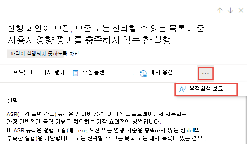

# 보안 권장 사항 - 위협 및 취약성 관리

[!INCLUDE [Microsoft 365 Defender rebranding](../../includes/microsoft-defender.md)]

**적용 대상:**

- [엔드포인트용 Microsoft Defender](https://go.microsoft.com/fwlink/?linkid=2154037)
- [위협 및 취약성 관리](next-gen-threat-and-vuln-mgt.md)
- [Microsoft 365 Defender](https://go.microsoft.com/fwlink/?linkid=2118804)

> 엔드포인트용 Microsoft Defender를 경험하고 싶으신가요? [무료 평가판을 신청하세요.](https://signup.microsoft.com/create-account/signup?products=7f379fee-c4f9-4278-b0a1-e4c8c2fcdf7e&ru=https://aka.ms/MDEp2OpenTrial?ocid=docs-wdatp-portaloverview-abovefoldlink)

조직에서 식별된 사이버 보안 약점은 실행 가능한 보안 권장 사항에 매핑된 후 영향에 따라 우선 순위가 지정됩니다. 우선 순위가 높은 권장 사항은 취약성을 완화하거나 수정하고 규정 준수를 구동하는 데 시간을 단축하는 데 도움이 됩니다.

각 보안 권장에는 실행 가능한 수정 단계가 포함됩니다. 작업 관리를 지원하기 위해 권장되는 작업은 작업 관리 Microsoft Intune 사용하여 보낼 Microsoft Endpoint Configuration Manager. 위협 환경이 변경될 때 환경의 정보를 지속적으로 수집할 때 권장 사항도 변경됩니다.

> [!TIP]
> 새 취약성 이벤트에 대한 전자 메일을 얻습니다. [끝점용 Microsoft Defender에서 취약성](configure-vulnerability-email-notifications.md) 전자 메일 알림 구성을 참조하세요.

## 작업 방법

조직의 각 장치는 고객이 올바른 점에 집중할 수 있도록 세 가지 중요한 요인에 따라 점수를 매기게 됩니다.

- **위협:** 조직의 장치에서 취약성 및 악용의 특성 및 위반 기록. 이러한 요인에 따라 보안 권장 사항에 따라 활성 경고, 지속적인 위협 캠페인 및 해당 위협 분석 보고서에 대한 해당 링크가 표시됩니다.
- **위반 가능성:** 조직의 보안 설정 및 위협에 대한 탄력성.
- **비즈니스 가치:** 조직의 자산, 중요한 프로세스 및 지적 재산.

## 보안 권장 사항 페이지로 이동합니다.

몇 가지 다른 방법으로 보안 권장 페이지에 액세스합니다.

- 취약성 관리 포털의 위협 및 Microsoft 365 Defender [메뉴](portal-overview.md)
- 보안 대시보드의 위협 및 취약성 관리 [권장 사항](tvm-dashboard-insights.md)

다음과 같은 위치의 관련 보안 권장 사항을 볼 수 있습니다.

- 소프트웨어 페이지
- 디바이스 페이지

### 탐색 메뉴

취약성 관리 탐색 **메뉴로** 이동하여 를 **권장 사항.** 이 페이지에는 조직에서 발견된 위협 및 취약성에 대한 보안 권장 사항 목록이 포함되어 있습니다.

### 보안 대시보드의 주요 위협 및 취약성 관리 권장 사항

보안 관리자로 주어진 날에 위협 및 취약성 관리 대시보드를 살펴보고 노출 점수를 장치용  Microsoft 보안 점수와 [나란히](tvm-microsoft-secure-score-devices.md)볼 수 있습니다.  목표는 **취약성에서** 조직의 노출을 낮추고 사이버  보안 위협 공격에 대한 조직의 장치 보안을 강화하는 것입니다. 주요 보안 권장 사항 목록은 해당 목표를 달성하는 데 도움이 될 수 있습니다.

주요 보안 권장 사항은 이전 섹션에서 언급한 중요한 요인인 위협, 위반 가능성 및 가치에 따라 우선 순위가 지정된 개선 기회를 나열합니다. 권장 사항을 선택하면 보안 권장 사항 페이지로 이동하여 자세한 내용을 제공합니다.

## 보안 권장 사항 개요

권장 사항, 발견된 약점 수, 관련 구성 요소, 위협 정보, 노출된 장치 수, 상태, 수정 유형, 수정 활동, 노출 점수 및 장치에 대한 Microsoft 보안 점수 및 관련 태그를 볼 수 있습니다.

추세가 변경되면 **노출된 디바이스** 그래프의 색이 변경됩니다. 노출된 디바이스 수가 증가하면 색이 빨강으로 변경됩니다. 노출된 장치 수가 감소하면 그래프의 색이 녹색으로 변경됩니다.

> [!NOTE]
> 위협 및 취약성 관리 **30일** 전까지 사용 중이던 장치를 보여줍니다. 이는 장치가 7일 이상 사용되지 않은 경우 '비활성' 상태인 끝점용 Microsoft Defender의 나머지와 다릅니다.

### 아이콘

유용한 아이콘도 빠르게 주의를 끌 수 있습니다.

-  가능한 활성 경고
-  연결된 공용 악용
-  권장 정보

### 보안 권장 옵션 살펴보기

조사하거나 처리하려는 보안 권장을 선택합니다.

:::image type="content" alt-text="보안 권장 플라이아웃 페이지의 예입니다." source="images/secrec-flyouteolsw.png" lightbox="images/secrec-flyouteolsw.png":::

플라이아웃에서 다음 옵션을 선택할 수 있습니다.

- **소프트웨어 페이지 열기** - 소프트웨어 페이지를 열어 소프트웨어 및 소프트웨어 배포 방법에 대한 추가 컨텍스트를 얻을 수 있습니다. 이 정보에는 위협 컨텍스트, 관련 권장 사항, 발견된 약점, 노출된 장치 수, 발견된 취약점, 소프트웨어가 설치된 장치의 이름 및 상세한 장치 및 버전 배포가 포함됩니다.

- [**수정**](tvm-remediation.md) 옵션 - IT 관리자가 선택 및 주소를 입력할 수 있도록 Microsoft Intune 재구성 요청을 제출하여 티켓을 열 수 있습니다. 재구성 페이지에서 재구성 활동을 추적합니다.

- [**예외 옵션**](tvm-exception.md) - 예외를 제출하고, 사당을 제공하고, 문제를 아직 수정하지 못하면 예외 기간을 설정할 수 있습니다.

> [!NOTE]
> 장치에서 소프트웨어 변경을 하는 경우 일반적으로 데이터가 보안 포털에 반영되는 데 2시간이 소요됩니다. 하지만, 때때로 더 오래 걸릴 수도 있습니다. 구성 변경에는 4시간에서 24시간까지 걸릴 수 있습니다.

### 장치 노출 또는 영향의 변경 내용 조사

노출된 장치 수가 크게 증가하거나 조직 노출 점수 및 장치에 대한 Microsoft 보안 점수에 미치는 영향이 급격히 증가하면 해당 보안 권장을 조사할 가치가 있습니다.

1. 권장 옵션 및 **소프트웨어 열기 페이지 선택**
2. 이벤트 **타임라인 탭을** 선택하여 해당 소프트웨어와 관련된 모든 영향을 미치는 이벤트(예: 새 취약성 또는 새 공용 악용)를 볼 수 있습니다. [이벤트 타임라인에 대해 자세히 알아보세요.](threat-and-vuln-mgt-event-timeline.md)
3. 재구성 요청을 제출하는 등 증가 또는 조직의 노출을 해결할 방법 결정

## 요청 수정

이러한 위협 및 취약성 관리 기능은 업데이트 관리 요청 워크플로를 통해 보안 및 IT 관리자 간의 격차를 해소합니다. 보안 관리자는 IT 관리자에게 보안 권장 페이지에서 Intune으로의  취약점 수정을 요청할 수 있습니다. [수정 옵션에 대해 자세히 알아보시다](tvm-remediation.md)

### 수정을 요청하는 방법

재구성 요청을 할 보안 권장을 선택한 다음 수정 옵션을 **선택합니다.** 양식을 작성하고 전송 요청 **을 선택합니다.** [**재구성 페이지로 이동하여**](tvm-remediation.md) 재구성 요청의 상태를 시청하세요. [수정을 요청하는 방법에 대한 자세한 정보](tvm-remediation.md#request-remediation)

## 예외 파일

현재 권장 사항이 관련이 없는 경우 수정 요청 대신 권장 사항에 대한 예외를 만들 수 있습니다. [예외에 대해 자세히 알아보시다](tvm-exception.md)

"예외 처리" 권한이 있는 사용자만 예외를 추가할 수 있습니다. [RBAC 역할에 대해 자세히 알아보시다.](user-roles.md)

권장에 대한 예외가 생성되면 권장이 더 이상 활성화되지 않습니다. 권장 상태는 전체  예외 또는 부분 **예외(장치** 그룹)로 변경됩니다.

### 예외를 만드는 방법

예외를 만들 보안 권장을 선택한 다음 예외 옵션을 **선택합니다.**

양식을 작성하고 전송합니다. 모든 예외(현재 **및** 과거)를 확인하려면 위협 & 취약성 관리 메뉴의 수정 페이지로 이동하고 예외 탭을 선택합니다. 예외를 만드는 방법에 대해 자세히 [알아보십시오.](tvm-exception.md#create-an-exception)  

## 부정확성 보고

모호하거나 부정확하거나, 불완전하거나, 이미 수정된 보안 권장 정보가 표시될 경우 가짓 긍정을 보고할 수 있습니다.

1. 보안 권장을 열 수 있습니다.

2. 보고할 보안 권장 옆에 있는 세 점을 선택한 다음 부정확 보고를 **선택합니다.**

    

3. 플라이아웃 창의 드롭다운 메뉴에서 부정확성 범주를 선택하고 전자 메일 주소를 입력하고 부정확성에 대한 세부 정보를 입력합니다.

4. **전송** 을 선택합니다. 피드백은 즉시 전문가에게 위협 및 취약성 관리 전송됩니다.

## 관련 문서

- [위협 및 취약성 관리 개요](next-gen-threat-and-vuln-mgt.md)
- [대시보드](tvm-dashboard-insights.md)
- [노출 점수](tvm-exposure-score.md)
- [장치용 Microsoft Secure Score](tvm-microsoft-secure-score-devices.md)
- [취약성 수정](tvm-remediation.md)
- [보안 권장 사항에 대한 예외 만들기 및 보기](tvm-exception.md)
- [이벤트 타임라인](threat-and-vuln-mgt-event-timeline.md)
