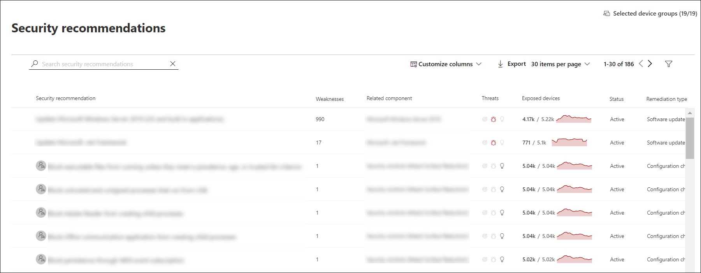

# 보안 권장 사항 - 위협 및 취약성 관리Security recommendations - threat and vulnerability management

[!INCLUDE [Microsoft 365 Defender rebranding](../../includes/microsoft-defender.md)]

**적용 대상:****Applies to:**

- [엔드포인트용 Microsoft DefenderMicrosoft Defender for Endpoint](https://go.microsoft.com/fwlink/?linkid=2154037)
- [위협 및 취약성 관리Threat and vulnerability management](next-gen-threat-and-vuln-mgt.md)
- [Microsoft 365 DefenderMicrosoft 365 Defender](https://go.microsoft.com/fwlink/?linkid=2118804)

>끝점용 Microsoft Defender를 경험하고 싶나요?Want to experience Microsoft Defender for Endpoint? [무료 평가판에 등록합니다.Sign up for a free trial.](https://www.microsoft.com/microsoft-365/windows/microsoft-defender-atp?ocid=docs-wdatp-portaloverview-abovefoldlink)

조직에서 식별된 사이버 보안 약점은 실행 가능한 보안 권장 사항에 매핑된 후 영향에 따라 우선 순위가 지정됩니다.Cybersecurity weaknesses identified in your organization are mapped to actionable security recommendations and prioritized by their impact. 우선 순위가 높은 권장 사항은 취약성을 완화하거나 수정하고 규정 준수를 구동하는 데 시간을 단축하는 데 도움이 됩니다.Prioritized recommendations help shorten the time to mitigate or remediate vulnerabilities and drive compliance.

각 보안 권장에는 실행 가능한 수정 단계가 포함됩니다.Each security recommendation includes actionable remediation steps. 작업 관리를 지원하기 위해 권장되는 작업은 작업 관리 Microsoft Intune 사용하여 보낼 Microsoft Endpoint Configuration Manager.To help with task management, the recommendation can also be sent using Microsoft Intune and Microsoft Endpoint Configuration Manager. 위협 환경이 변경될 때 환경의 정보를 지속적으로 수집할 때 권장 사항도 변경됩니다.When the threat landscape changes, the recommendation also changes as it continuously collects information from your environment.

>[!TIP]
>새 취약성 이벤트에 대한 전자 메일을 얻습니다. [끝점용 Microsoft Defender에서 취약성](configure-vulnerability-email-notifications.md) 전자 메일 알림 구성을 참조하세요.To get emails about new vulnerability events, see [Configure vulnerability email notifications in Microsoft Defender for Endpoint](configure-vulnerability-email-notifications.md)

## 작동 방법How it works

조직의 각 장치는 고객이 올바른 점에 집중할 수 있도록 세 가지 중요한 요인에 따라 점수를 매기게 됩니다.Each device in the organization is scored based on three important factors to help customers to focus on the right things at the right time.

- **위협** - 조직의 장치에서 취약성 및 악용의 특성 및 위반 기록.**Threat** - Characteristics of the vulnerabilities and exploits in your organizations' devices and breach history. 이러한 요인에 따라 보안 권장 사항에 따라 활성 경고, 지속적인 위협 캠페인 및 해당 위협 분석 보고서에 대한 해당 링크가 표시됩니다.Based on these factors, the security recommendations show the corresponding links to active alerts, ongoing threat campaigns, and their corresponding threat analytic reports.

- **위반 가능성** - 위협에 대한 조직의 보안 설정 및 탄력성**Breach likelihood** - Your organization's security posture and resilience against threats

- **비즈니스 가치** - 조직의 자산, 중요한 프로세스 및 지적 재산**Business value** - Your organization's assets, critical processes, and intellectual properties

## 보안 권장 사항 페이지로 이동합니다.Navigate to the Security recommendations page

몇 가지 다른 방법으로 보안 권장 페이지에 액세스합니다.Access the Security recommendations page a few different ways:

- 위협 및 취약성 관리 탐색 [메뉴의](portal-overview.md) Microsoft Defender 보안 센터Threat and vulnerability management navigation menu in the [Microsoft Defender Security Center](portal-overview.md)
- 보안 대시보드의 위협 및 취약성 관리 [권장 사항](tvm-dashboard-insights.md)Top security recommendations in the [threat and vulnerability management dashboard](tvm-dashboard-insights.md)

다음과 같은 위치의 관련 보안 권장 사항을 볼 수 있습니다.View related security recommendations in the following places:

- 소프트웨어 페이지Software page
- 디바이스 페이지Device page

### 탐색 메뉴Navigation menu

위협 및 취약성 관리 메뉴로 이동하고 보안 권장 **사항을 선택합니다.**Go to the threat and vulnerability management navigation menu and select **Security recommendations**. 이 페이지에는 조직에서 발견된 위협 및 취약성에 대한 보안 권장 사항 목록이 포함되어 있습니다.The page contains a list of security recommendations for the threats and vulnerabilities found in your organization.

### 보안 대시보드의 주요 위협 및 취약성 관리 권장 사항Top security recommendations in the threat and vulnerability management dashboard

보안 관리자로 주어진 날에 위협 및 취약성 관리 대시보드를 살펴보고 노출 점수를 장치용  Microsoft 보안 점수와 [나란히](tvm-microsoft-secure-score-devices.md)볼 수 있습니다. In a given day as a Security Administrator, you can take a look at the [threat and vulnerability management dashboard](tvm-dashboard-insights.md) to see your [exposure score](tvm-exposure-score.md) side by side with your [Microsoft Secure Score for Devices](tvm-microsoft-secure-score-devices.md). 목표는 **취약성에서** 조직의 노출을 낮추고 사이버  보안 위협 공격에 대한 조직의 장치 보안을 강화하는 것입니다.The goal is to **lower** your organization's exposure from vulnerabilities, and **increase** your organization's device security to be more resilient against cybersecurity threat attacks. 주요 보안 권장 사항 목록은 해당 목표를 달성하는 데 도움이 될 수 있습니다.The top security recommendations list can help you achieve that goal.

주요 보안 권장 사항은 이전 섹션에서 언급한 중요한 요인인 위협, 위반 가능성 및 가치에 따라 우선 순위가 지정된 개선 기회를 나열합니다.The top security recommendations list the improvement opportunities prioritized based on the important factors mentioned in the previous section - threat, likelihood to be breached, and value. 권장 사항을 선택하면 보안 권장 사항 페이지로 이동하여 자세한 내용을 제공합니다.Selecting a recommendation will take you to the security recommendations page with more details.

## 보안 권장 사항 개요Security recommendations overview

권장 사항, 발견된 약점 수, 관련 구성 요소, 위협 정보, 노출된 장치 수, 상태, 수정 유형, 수정 활동, 노출 점수 및 장치에 대한 Microsoft 보안 점수 및 관련 태그를 볼 수 있습니다.View recommendations, the number of weaknesses found, related components, threat insights, number of exposed devices, status, remediation type, remediation activities, impact to your exposure score and Microsoft Secure Score for Devices, and associated tags.

추세가 변경되면 **노출된 디바이스** 그래프의 색이 변경됩니다.The color of the **Exposed devices** graph changes as the trend changes. 노출된 디바이스 수가 증가하면 색이 빨강으로 변경됩니다.If the number of exposed devices is on the rise, the color changes into red. 노출된 장치 수가 감소하면 그래프의 색이 녹색으로 변경됩니다.If there's a decrease in the number of exposed devices, the color of the graph will change into green.

>[!NOTE]
>위협 및 취약성 관리 **30일** 전까지 사용 중이던 장치를 보여줍니다.Threat and vulnerability management shows devices that were in use up to **30 days** ago. 이는 장치가 7일 이상 사용되지 않은 경우 '비활성' 상태인 끝점용 Microsoft Defender의 나머지와 다릅니다.This is different from the rest of Microsoft Defender for Endpoint, where if a device has not been in use for more than 7 days it has in an ‘Inactive’ status.

### 아이콘Icons

유용한 아이콘도 빠르게 주의를 끌 수 있습니다.Useful icons also quickly call your attention to:
-  가능한 활성 경고possible active alerts
-  연결된 공용 악용associated public exploits
-  권장 정보recommendation insights

### 보안 권장 옵션 살펴보기Explore security recommendation options

조사하거나 처리하려는 보안 권장을 선택합니다.Select the security recommendation that you want to investigate or process.

플라이아웃에서 다음 옵션을 선택할 수 있습니다.From the flyout, you can choose any of the following options:

- **소프트웨어 페이지 열기** - 소프트웨어 페이지를 열어 소프트웨어 및 소프트웨어 배포 방법에 대한 추가 컨텍스트를 얻을 수 있습니다.**Open software page** - Open the software page to get more context on the software and how it's distributed. 이 정보에는 위협 컨텍스트, 관련 권장 사항, 발견된 약점, 노출된 장치 수, 발견된 취약점, 소프트웨어가 설치된 장치의 이름 및 상세한 장치 및 버전 배포가 포함됩니다.The information can include threat context, associated recommendations, weaknesses discovered, number of exposed devices, discovered vulnerabilities, names and detailed of devices with the software installed, and version distribution.

- [**수정**](tvm-remediation.md) 옵션 - IT 관리자가 선택 및 주소를 입력할 수 있도록 Microsoft Intune 재구성 요청을 제출하여 티켓을 열 수 있습니다.[**Remediation options**](tvm-remediation.md) - Submit a remediation request to open a ticket in Microsoft Intune for your IT administrator to pick up and address. 재구성 페이지에서 재구성 활동을 추적합니다.Track the remediation activity in the Remediation page.

- [**예외 옵션**](tvm-exception.md) - 예외를 제출하고, 사당을 제공하고, 문제를 아직 수정하지 못하면 예외 기간을 설정할 수 있습니다.[**Exception options**](tvm-exception.md) - Submit an exception, provide justification, and set exception duration if you can't remediate the issue yet.

>[!NOTE]
>장치에서 소프트웨어 변경을 하는 경우 일반적으로 데이터가 보안 포털에 반영되는 데 2시간이 소요됩니다.When a software change is made on a device, it typically takes 2 hours for the data to be reflected in the security portal. 하지만, 때때로 더 오래 걸릴 수도 있습니다.However, it may sometimes take longer. 구성 변경에는 4시간에서 24시간까지 걸릴 수 있습니다.Configuration changes can take anywhere from 4 to 24 hours.

### 장치 노출 또는 영향의 변경 내용 조사Investigate changes in device exposure or impact

노출된 장치 수가 크게 증가하거나 조직 노출 점수 및 장치에 대한 Microsoft 보안 점수에 미치는 영향이 급격히 증가하면 해당 보안 권장을 조사할 가치가 있습니다.If there is a large jump in the number of exposed devices, or a sharp increase in the impact on your organization exposure score and Microsoft Secure Score for Devices, then that security recommendation is worth investigating.

1. 권장 옵션 및 **소프트웨어 열기 페이지 선택**Select the recommendation and **Open software page**
2. 이벤트 **타임라인 탭을** 선택하여 해당 소프트웨어와 관련된 모든 영향을 미치는 이벤트(예: 새 취약성 또는 새 공용 악용)를 볼 수 있습니다.Select the **Event timeline** tab to view all the impactful events related to that software, such as new vulnerabilities or new public exploits. [이벤트 타임라인에 대해 자세히 알아보세요.Learn more about event timeline](threat-and-vuln-mgt-event-timeline.md)
3. 재구성 요청을 제출하는 등 증가 또는 조직의 노출을 해결할 방법 결정Decide how to address the increase or your organization's exposure, such as submitting a remediation request

## 요청 수정Request remediation

이러한 위협 및 취약성 관리 기능은 업데이트 관리 요청 워크플로를 통해 보안 및 IT 관리자 간의 격차를 해소합니다.The threat and vulnerability management remediation capability bridges the gap between Security and IT administrators through the remediation request workflow. 보안 관리자는 IT 관리자에게 보안 권장 페이지에서 Intune으로의  취약점 수정을 요청할 수 있습니다.Security admins like you can request for the IT Administrator to remediate a vulnerability from the **Security recommendation** page to Intune. [수정 옵션에 대해 자세히 알아보시다Learn more about remediation options](tvm-remediation.md)

### 수정을 요청하는 방법How to request remediation

재구성 요청을 할 보안 권장을 선택한 다음 수정 옵션을 **선택합니다.**Select a security recommendation you would like to request remediation for, and then select **Remediation options**. 양식을 작성하고 전송 요청 **을 선택합니다.**Fill out the form and select **Submit request**. [**재구성 페이지로 이동하여**](tvm-remediation.md) 재구성 요청의 상태를 시청하세요.Go to the [**Remediation**](tvm-remediation.md) page to view the status of your remediation request. [수정을 요청하는 방법에 대한 자세한 정보Learn more about how to request remediation](tvm-remediation.md#request-remediation)

## 예외 파일File for exception

현재 권장 사항이 관련이 없는 경우 수정 요청 대신 권장 사항에 대한 예외를 만들 수 있습니다.As an alternative to a remediation request when a recommendation is not relevant at the moment, you can create exceptions for recommendations. [예외에 대해 자세히 알아보시다Learn more about exceptions](tvm-exception.md)

"예외 처리" 권한이 있는 사용자만 예외를 추가할 수 있습니다.Only users with “exceptions handling” permissions can add exception. [RBAC 역할에 대해 자세히 알아보시다.](user-roles.md)[Learn more about RBAC roles](user-roles.md).

권장에 대한 예외가 생성되면 권장이 더 이상 활성화되지 않습니다.When an exception is created for a recommendation, the recommendation is no longer active. 권장 상태는 전체  예외 또는 부분 **예외(장치** 그룹)로 변경됩니다.The recommendation state will change to **Full exception** or **Partial exception** (by device group).

### 예외를 만드는 방법How to create an exception

예외를 만들 보안 권장을 선택한 다음 예외 옵션을 **선택합니다.**Select a security recommendation you would like create an exception for, and then select **Exception options**.  

양식을 작성하고 전송합니다.Fill out the form and submit. 모든 예외(현재 **및** 과거)를 확인하려면 위협 & 취약성 관리 메뉴의 수정 페이지로 이동하고 예외 탭을 선택합니다. 예외를 만드는 방법에 대해 자세히 [알아보십시오.](tvm-exception.md#create-an-exception)  To view all your exceptions (current and past), navigate to the [Remediation](tvm-remediation.md) page under the **Threat & Vulnerability Management** menu and select the **Exceptions** tab. [Learn more about how to create an exception](tvm-exception.md#create-an-exception)

## 부정확성 보고Report inaccuracy

모호하거나 부정확하거나, 불완전하거나, 이미 수정된 보안 권장 정보가 표시될 경우 가짓 긍정을 보고할 수 있습니다.You can report a false positive when you see any vague, inaccurate, incomplete, or already remediated security recommendation information.

1. 보안 권장을 열 수 있습니다.Open the Security recommendation.

2. 보고할 보안 권장 옆에 있는 세 점을 선택한 다음 부정확 보고를 **선택합니다.**Select the three dots beside the security recommendation that you want to report,  then select **Report inaccuracy**.

    

3. 플라이아웃 창의 드롭다운 메뉴에서 부정확성 범주를 선택하고 전자 메일 주소를 입력하고 부정확성에 대한 세부 정보를 입력합니다.From the flyout pane, select the inaccuracy category from the drop-down menu, fill in your email address, and details regarding the inaccuracy.

4. **전송** 을 선택합니다.Select **Submit**. 피드백은 즉시 전문가에게 위협 및 취약성 관리 전송됩니다.Your feedback is immediately sent to the threat and vulnerability management experts.

## 관련 문서Related articles

- [위협 및 취약성 관리 개요Threat and vulnerability management overview](next-gen-threat-and-vuln-mgt.md)
- [DashboardDashboard](tvm-dashboard-insights.md)
- [노출 점수Exposure score](tvm-exposure-score.md)
- [장치용 Microsoft Secure ScoreMicrosoft Secure Score for Devices](tvm-microsoft-secure-score-devices.md)
- [취약성 수정Remediate vulnerabilities](tvm-remediation.md)
- [보안 권장 사항에 대한 예외 만들기 및 보기Create and view exceptions for security recommendations](tvm-exception.md)
- [이벤트 타임라인Event timeline](threat-and-vuln-mgt-event-timeline.md)
