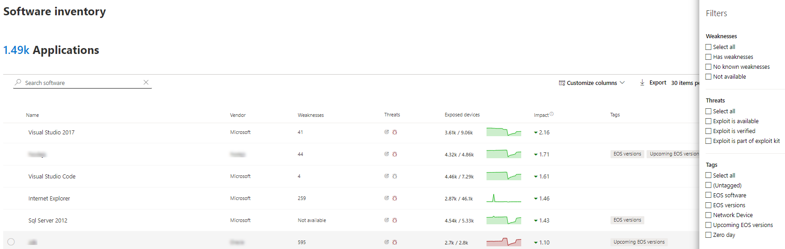

# 소프트웨어 인벤토리 - 위협 및 취약성 관리Software inventory - threat and vulnerability management

[!INCLUDE [Microsoft 365 Defender rebranding](../../includes/microsoft-defender.md)]

**적용 대상:****Applies to:**
- [엔드포인트용 Microsoft DefenderMicrosoft Defender for Endpoint](https://go.microsoft.com/fwlink/?linkid=2154037)
- [위협 및 취약점 관리Threat and vulnerability management](next-gen-threat-and-vuln-mgt.md)
- [Microsoft 365 DefenderMicrosoft 365 Defender](https://go.microsoft.com/fwlink/?linkid=2118804)

>Endpoint용 Defender를 경험하고 싶나요?Want to experience Defender for Endpoint? [무료 평가판에 등록합니다.Sign up for a free trial.](https://www.microsoft.com/microsoft-365/windows/microsoft-defender-atp?ocid=docs-wdatp-portaloverview-abovefoldlink)

위협 및 취약성 관리의 소프트웨어 인벤토리는 공식 [CPE(Common Platform Enumerations)가](https://nvd.nist.gov/products/cpe)있는 조직의 알려진 소프트웨어 목록입니다.The software inventory in threat and vulnerability management is a list of known software in your organization with official [Common Platform Enumerations (CPE)](https://nvd.nist.gov/products/cpe). 공식 CPE가 없는 소프트웨어 제품에는 취약점이 게시되지 않습니다.Software products without an official CPE don’t have vulnerabilities published. 또한 공급업체 이름, 약점 수, 위협, 노출된 장치 수 등의 세부 정보도 포함됩니다.It also includes details such as the name of the vendor, number of weaknesses, threats, and number of exposed devices.

## 작동 방식How it works

검색 필드에서는 끝점 감지 및 응답 기능에 대한 Microsoft Defender의 감지 및 취약점 평가를 담당하는 동일한 신호 집합을 [활용하고 있습니다.](overview-endpoint-detection-response.md)In the field of discovery, we're leveraging the same set of signals that is responsible for detection and vulnerability assessment in [Microsoft Defender for Endpoint detection and response capabilities](overview-endpoint-detection-response.md).

실시간이기 때문에 발견된 취약성 정보를 몇 분 만에 볼 수 있습니다.Since it's real time, in a matter of minutes, you'll see vulnerability information as they get discovered. 엔진이 여러 보안 피드에서 정보를 자동으로 잡습니다.The engine automatically grabs information from multiple security feeds. 실제로 특정 소프트웨어가 라이브 위협 캠페인에 연결되어 있는지를 볼 수 있습니다.In fact, you'll see if a particular software is connected to a live threat campaign. 또한 위협 분석 보고서가 사용 가능해지자마자 링크를 제공합니다.It also provides a link to a Threat Analytics report soon as it's available.

## 소프트웨어 인벤토리 페이지로 이동합니다.Navigate to the Software inventory page

Microsoft Defender 보안 센터의 위협 및 취약성 관리 탐색 메뉴에서 소프트웨어 인벤토리를 선택하여 소프트웨어 [인벤토리 페이지에 액세스합니다.](portal-overview.md) Access the Software inventory page by selecting **Software inventory** from the threat and vulnerability management navigation menu in the [Microsoft Defender Security Center](portal-overview.md).

장치 목록에서 개별 디바이스 페이지의 특정 디바이스에서 소프트웨어를 [볼 수 있습니다.](machines-view-overview.md)View software on specific devices in the individual devices pages from the [devices list](machines-view-overview.md).

>[!NOTE]
>Microsoft Defender for Endpoint 전역 검색을 사용하여 소프트웨어를 검색하는 경우 공백 대신 밑면을 넣어야 합니다.If you search for software using the Microsoft Defender for Endpoint global search, make sure to put an underscore instead of a space. 예를 들어 최상의 검색 결과를 위해 "Windows 10" windows_10 "windows_10"를 작성합니다.For example, for the best search results you'd write "windows_10" instead of "Windows 10".

## 소프트웨어 인벤토리 개요Software inventory overview

소프트웨어 **인벤토리** 페이지는 공급업체 이름, 발견된 약점, 관련된 위협, 노출 장치, 노출 점수에 미치는 영향, 태그를 포함하여 네트워크에 설치된 소프트웨어 목록으로 열립니다.The **Software inventory** page opens with a list of software installed in your network, including the vendor name, weaknesses found, threats associated with them, exposed devices, impact to exposure score, and tags.

소프트웨어에서 발견된 약점, 관련된 위협 및 소프트웨어가 지원 종료에 도달한지 여부와 같은 태그를 기준으로 목록 보기를 필터링할 수 있습니다.You can filter the list view based on weaknesses found in the software, threats associated with them, and tags like whether the software has reached end-of-support.

조사할 소프트웨어를 선택합니다.Select the software that you want to investigate. 플라이아웃 패널은 페이지에 있는 정보를 보다 컴팩트하게 볼 수 있는 보기로 열립니다.A flyout panel will open with a more compact view of the information on the page. 조사를 더 깊이 진행하고 소프트웨어 페이지 열기를 선택하거나 부정확성 보고를 선택하여 기술 불일치에 플래그를 지정합니다. You can either dive deeper into the investigation and select **Open software page**, or flag any technical inconsistencies by selecting **Report inaccuracy**.

### 지원되지 않는 소프트웨어Software that isn't supported

위협 및 취약성 관리에서 현재 지원되지 & 소프트웨어 인벤토리 페이지에 있을 수 있습니다.Software that isn't currently supported by threat & vulnerability management may be present in the Software inventory page. 지원되지 않는 경우 제한된 데이터만 사용할 수 있습니다.Because it is not supported, only limited data will be available. "약점" 섹션의 "사용할 수 없는" 옵션을 사용하여 지원되지 않는 소프트웨어로 필터링합니다.Filter by unsupported software with the "Not available" option in the "Weakness" section.

다음은 소프트웨어가 지원되지 않는다는 것입니다.The following indicates that a software is not supported:

- 약점 필드에 "사용할 수 없습니다."가 표시Weaknesses field shows "Not available"
- 노출된 장치 필드에 대시가 표시Exposed devices field shows a dash
- 사이드 패널 및 소프트웨어 페이지에 추가된 정보 텍스트Informational text added in side panel and in software page
- 소프트웨어 페이지에 보안 권장 사항, 발견된 취약성 또는 이벤트 타임라인 섹션이 없습니다.The software page won't have the security recommendations, discovered vulnerabilities, or event timeline sections

현재 CPE가 없는 제품은 소프트웨어 인벤토리 페이지에는 표시되지 않고 장치 수준 소프트웨어 인벤토리에만 표시됩니다.Currently, products without a CPE are not shown in the software inventory page, only in the device level software inventory.

## 장치의 소프트웨어 인벤토리Software inventory on devices

Microsoft Defender 보안 센터 탐색 패널에서 장치 **[목록으로 이동하세요.](machines-view-overview.md)**From the Microsoft Defender Security Center navigation panel, go to the **[Devices list](machines-view-overview.md)**. 장치 페이지를 열 장치의 이름(예: Computer1)을  선택한 다음 소프트웨어 인벤토리 탭을 선택하여 장치에 있는 알려진 모든 소프트웨어 목록을 확인합니다.Select the name of a device to open the device page (like Computer1), then select the **Software inventory** tab to see a list of all the known software present on the device. 자세한 정보를 사용하여 플라이아웃을 열기 위해 특정 소프트웨어 항목을 선택합니다.Select a specific software entry to open the flyout with more information.

소프트웨어가 현재 위협 및 취약성 관리에서 지원되지 않는 경우에도 장치 수준에서 표시될 수 있습니다.Software may be visible at the device level even if it is currently not supported by threat and vulnerability management. 그러나 제한된 데이터만 사용할 수 있습니다.However, only limited data will be available. 소프트웨어가 "취약성" 열에 "사용할 수 없습니다."라고 표시될 것이기 때문에 지원되지 않는지 알 수 있습니다.You'll know if software is unsupported because it will say "Not available" in the "Weakness" column.

CPE가 없는 소프트웨어는 이 장치별 소프트웨어 인벤토리 아래에도 표시될 수 있습니다.Software with no CPE can also show up under this device specific software inventory.

### 소프트웨어 증거Software evidence

레지스트리, 디스크 또는 둘 다에서 디바이스에서 특정 소프트웨어를 검색한 위치의 증거를 참조하세요. 디바이스 소프트웨어 인벤토리의 모든 장치에서 찾을 수 있습니다.See evidence of where we detected a specific software on a device from the registry, disk, or both.You can find it on any device in the device software inventory.

플라이아웃을 열고 "소프트웨어 증거" 섹션을 찾아보는 소프트웨어 이름을 선택합니다.Select a software name to open the flyout, and look for the section called "Software Evidence."

## 소프트웨어 페이지Software pages

몇 가지 다른 방법으로 소프트웨어 페이지를 볼 수 있습니다.You can view software pages a few different ways:

- 소프트웨어 인벤토리 > 소프트웨어 이름 선택> 플라이아웃에서 소프트웨어 열기 페이지 선택 Software inventory page > Select a software name > Select **Open software page** in the flyout
- [보안 권장 >](tvm-security-recommendation.md) 플라이아웃에서 소프트웨어 열기 > **권장** 사항 선택[Security recommendations page](tvm-security-recommendation.md) > Select a recommendation > Select **Open software page** in the flyout
- [이벤트 타임라인](threat-and-vuln-mgt-event-timeline.md) > > 플라이아웃의 "관련 구성 요소" 섹션에서 하이퍼링크된 소프트웨어 이름(예: Visual Studio 2017)을 선택합니다.[Event timeline page](threat-and-vuln-mgt-event-timeline.md) > Select an event > Select the hyperlinked software name (like Visual Studio 2017) in the section called "Related component" in the flyout

 전체 페이지는 특정 소프트웨어의 모든 세부 정보와 다음 정보가 함께 표시됩니다.A full page will appear with all the details of a specific software and the following information:

- 공급업체 정보가 있는 사이드 패널, 조직의 소프트웨어 보전(설치된 장치 수, 패치되지 않은 노출된 장치 포함), 사용 가능 여부 및 악용 여부, 노출 점수에 미치는 영향Side panel with vendor information, prevalence of the software in the organization (including number of devices it's installed on, and exposed devices that aren't patched), whether and exploit is available, and impact to your exposure score.
- 취약성 및 잘못 구성의 수 및 심각도에 대한 데이터 시각화Data visualizations showing the number of, and severity of, vulnerabilities and misconfigurations. 또한 노출된 장치 수가 있는 그래프입니다.Also, graphs with the number of exposed devices.
- 정보를 표시하는 탭:Tabs showing information such as:
    - 식별된 취약점에 대한 해당 보안 권장 사항Corresponding security recommendations for the weaknesses and vulnerabilities identified.
    - 검색된 취약성의 명명된 CVNamed CVEs of discovered vulnerabilities.
    - 소프트웨어가 설치된 장치(장치 이름, 도메인, OS 등)입니다.Devices that have the software installed (along with device name, domain, OS, and more).
    - 소프트웨어 버전 목록(버전이 설치된 장치 수, 검색된 취약성 수 및 설치된 장치의 이름 포함)Software version list (including number of devices the version is installed on, the number of discovered vulnerabilities, and the names of the installed devices).

    

## 부정확성 보고Report inaccuracy

모호하거나 부정확하거나 불완전한 정보가 표시될 경우 가짓 긍정을 보고합니다.Report a false positive when you see any vague, inaccurate, or incomplete information. 또한 이미 수정된 보안 권장 사항에 대한 보고를 할 수 있습니다.You can also report on security recommendations that have already been remediated.

1. 소프트웨어 인벤토리 페이지에서 소프트웨어 플라이아웃을 니다.Open the software flyout on the Software inventory page.
2. 부정확 **보고를 선택합니다.**Select **Report inaccuracy**.
3. 플라이아웃 창의 드롭다운 메뉴에서 부정확성 범주를 선택하고 전자 메일 주소를 입력하고 부정확성에 대한 세부 정보를 입력합니다.From the flyout pane, select the inaccuracy category from the drop-down menu, fill in your email address, and details about the inaccuracy.
4. **전송** 을 선택합니다.Select **Submit**. 피드백은 위협 및 취약성 관리 전문가에게 즉시 전송됩니다.Your feedback is immediately sent to the threat and vulnerability management experts.

## 관련 문서Related articles

- [위협 및 취약성 관리 개요Threat and vulnerability management overview](next-gen-threat-and-vuln-mgt.md)
- [보안 권장 사항Security recommendations](tvm-security-recommendation.md)
- [이벤트 타임라인Event timeline](threat-and-vuln-mgt-event-timeline.md)
- [끝점 장치용 Microsoft Defender 목록 보기 및 구성View and organize the Microsoft Defender for Endpoint Devices list](machines-view-overview.md)
