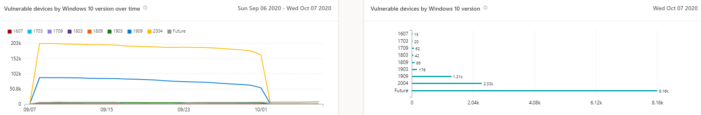

# 취약한 장치 보고서 - 위협 및 취약성 관리

[!INCLUDE [Microsoft 365 Defender rebranding](../../includes/microsoft-defender.md)]

**적용 대상:**

- [엔드포인트용 Microsoft Defender](https://go.microsoft.com/fwlink/?linkid=2154037)
- [위협 및 취약성 관리](next-gen-threat-and-vuln-mgt.md)
- [Microsoft 365 Defender](https://go.microsoft.com/fwlink/?linkid=2118804)

> 엔드포인트용 Microsoft Defender를 경험하고 싶으신가요? [무료 평가판을 신청하세요.](https://signup.microsoft.com/create-account/signup?products=7f379fee-c4f9-4278-b0a1-e4c8c2fcdf7e&ru=https://aka.ms/MDEp2OpenTrial?ocid=docs-wdatp-portaloverview-abovefoldlink)

이 보고서에는 취약한 장치 추세 및 현재 통계가 있는 그래프 및 막대 차트가 표시됩니다. 목표는 장치 노출의 숨과 범위를 이해하는 데 있습니다.

보고서 및 취약한 장치로 이동하여 Microsoft 365 Defender **포털의 보고서에 > 액세스**

두 개의 열이 있습니다.

- 추세(시간 경과에 따라) 지난 30일, 3개월, 6개월 또는 사용자 지정 날짜 범위를 표시 할 수 있습니다.
- 상태(현재 정보)

**필터:** 취약성 심각도 수준, 악용 가용성, 취약성 사용 시간, 운영 체제 플랫폼, Windows 10 또는 장치 그룹을별로 필터링할 수 있습니다.

**드릴다운:** 추가 탐색할 인사이트가 있는 경우 관련 막대 차트를 선택하여 장치 인벤토리 페이지에서 필터링된 장치 목록을 확인합니다. 이 목록에서 목록을 내보낼 수 있습니다.

## 심각도 수준 그래프

각 장치는 해당 디바이스에서 발견되는 가장 심각한 취약점에 따라 한 번만 계산됩니다.

:::image type="content" alt-text="현재 장치 취약성 심각도 수준의 그래프 1개와 시간의 따라 수준을 표시하는 그래프 1개" source="images/tvm-report-severity.png" lightbox="images/tvm-report-severity.png":::

## Exploit availability graphs

각 장치는 알려진 가장 높은 수준의 악용에 따라 한 번만 계산됩니다.

:::image type="content" alt-text="현재 장치 악용 가용성의 그래프 하나와 시간의 따라 가용성을 보여 주는 그래프 한 개" source="images/tvm-report-exploit-availability.png" lightbox="images/tvm-report-exploit-availability.png":::

## 취약성 연령 그래프

각 장치는 가장 오래된 취약점 게시 날짜에 한 번만 계산됩니다. 오래된 취약성일수록 악용될 가능성이 더 높습니다.

:::image type="content" alt-text="현재 장치 취약성 연령의 그래프 1개와 시간이 지난 기간을 보여주는 그래프 한 개." source="images/tvm-report-age.png" lightbox="images/tvm-report-age.png":::

## 운영 체제 플랫폼 그래프를 통해 취약한 장치

소프트웨어 취약성으로 인해 노출되는 각 운영 체제의 장치 수입니다.

:::image type="content" alt-text="운영 체제 플랫폼을 통해 현재 취약한 장치의 그래프 한 개와 시간이 지날 때 OS 플랫폼에 의해 취약한 장치를 보여주는 그래프 하나." source="images/tvm-report-os.png" lightbox="images/tvm-report-os.png":::

## 버전 그래프를 Windows 10 취약한 장치

취약한 응용 프로그램 또는 OS로 Windows 10 각 버전에 있는 장치 수입니다.

lightbox="images/tvm-report-version.png"::

## 관련 항목

- [위협 및 취약성 관리 개요](next-gen-threat-and-vuln-mgt.md)
- [보안 권장 사항](tvm-security-recommendation.md)
