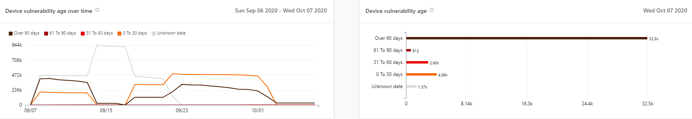
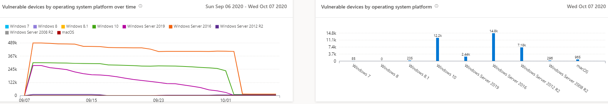

# 취약한 장치 보고서 - 위협 및 취약성 관리Vulnerable devices report - threat and vulnerability management

[!INCLUDE [Microsoft 365 Defender rebranding](../../includes/microsoft-defender.md)]

**적용 대상:****Applies to:**

- [엔드포인트용 Microsoft DefenderMicrosoft Defender for Endpoint](https://go.microsoft.com/fwlink/?linkid=2154037)
- [위협 및 취약성 관리Threat and vulnerability management](next-gen-threat-and-vuln-mgt.md)
- [Microsoft 365 DefenderMicrosoft 365 Defender](https://go.microsoft.com/fwlink/?linkid=2118804)

>끝점용 Microsoft Defender를 경험하고 싶나요?Want to experience Microsoft Defender for Endpoint? [무료 평가판에 등록합니다.Sign up for a free trial.](https://www.microsoft.com/microsoft-365/windows/microsoft-defender-atp?ocid=docs-wdatp-portaloverview-abovefoldlink)

이 보고서에는 취약한 장치 추세 및 현재 통계가 있는 그래프 및 막대 차트가 표시됩니다.The report shows graphs and bar charts with vulnerable device trends and current statistics. 목표는 장치 노출의 숨과 범위를 이해하는 데 있습니다.The goal is for you to understand the breath and scope of your device exposure.

보고서 및 취약한 Microsoft Defender 보안 센터 **보고서로** > 액세스Access the report in the Microsoft Defender Security Center by going to **Reports > Vulnerable devices**

두 개의 열이 있습니다.There are two columns:

- 추세(시간 경과에 따라)Trends (over time). 지난 30일, 3개월, 6개월 또는 사용자 지정 날짜 범위를 표시 할 수 있습니다.Can show the past 30 days, 3 months, 6 months, or a custom date range.
- 오늘(현재 정보)Today (current information)

**필터:** 취약성 심각도 수준, 악용 가용성, 취약성 사용 시간, 운영 체제 플랫폼, Windows 10 또는 장치 그룹을별로 필터링할 수 있습니다.**Filter**: You can filter the data by vulnerability severity levels, exploit availability, vulnerability age, operating system platform, Windows 10 version, or device group.

**드릴다운:** 추가 탐색할 인사이트가 있는 경우 관련 막대 차트를 선택하여 장치 인벤토리 페이지에서 필터링된 장치 목록을 확인합니다.**Drill down**: If there is an insight you want to explore further, select the relevant bar chart to view a filtered list of devices in the Device inventory page. 이 목록에서 목록을 내보낼 수 있습니다.From there, you can export the list.

## 심각도 수준 그래프Severity level graphs

각 장치는 해당 디바이스에서 발견되는 가장 심각한 취약점에 따라 한 번만 계산됩니다.Each device is counted only once according to the most severe vulnerability found on that device.

## Exploit availability graphsExploit availability graphs

각 장치는 알려진 가장 높은 수준의 악용에 따라 한 번만 계산됩니다.Each device is counted only once based on the highest level of known exploit.

## 취약성 연령 그래프Vulnerability age graphs

각 장치는 가장 오래된 취약점 게시 날짜에 한 번만 계산됩니다.Each device is counted only once under the oldest vulnerability publication date. 오래된 취약성은 악용 가능성이 더 높습니다.Older vulnerabilities have a higher chance of being exploited.

## 운영 체제 플랫폼 그래프를 통해 취약한 장치Vulnerable devices by operating system platform graphs

소프트웨어 취약성으로 인해 노출되는 각 운영 체제의 장치 수입니다.The number of devices on each operating system that are exposed due to software vulnerabilities.

## 버전 그래프를 Windows 10 취약한 장치Vulnerable devices by Windows 10 version graphs

취약한 응용 프로그램 또는 OS로 Windows 10 각 버전에 있는 장치 수입니다.The number of devices on each Windows 10 version that are exposed due to vulnerable applications or OS.

## 관련 항목Related topics

- [위협 및 취약성 관리 개요Threat and vulnerability management overview](next-gen-threat-and-vuln-mgt.md)
- [보안 권장 사항Security recommendations](tvm-security-recommendation.md)
