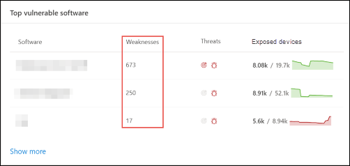

# 조직의 취약성 - 위협 및 취약성 관리

[!INCLUDE [Microsoft 365 Defender rebranding](../../includes/microsoft-defender.md)]

**적용 대상:**
- [엔드포인트용 Microsoft Defender](https://go.microsoft.com/fwlink/?linkid=2154037)
- [위협 및 취약성 관리](next-gen-threat-and-vuln-mgt.md)
- [Microsoft 365 Defender](https://go.microsoft.com/fwlink/?linkid=2118804)

> 엔드포인트용 Microsoft Defender를 경험하고 싶으신가요? [무료 평가판을 신청하세요.](https://signup.microsoft.com/create-account/signup?products=7f379fee-c4f9-4278-b0a1-e4c8c2fcdf7e&ru=https://aka.ms/MDEp2OpenTrial?ocid=docs-wdatp-portaloverview-abovefoldlink)

위협 취약성 관리 끝점 보호를 위해 Defender의 동일한 신호를 사용하여 취약점을 검색합니다.

취약점 **페이지에는** CVE(Common Vulnerabilities and Exposures) ID를 나열하여 장치가 노출하는 소프트웨어 취약점이 나열됩니다. 또한 심각도, CVSS(Common Vulnerability Scoring System) 등급, 조직의 보급, 해당 위반, 위협 정보 등도 볼 수 있습니다.

>[!NOTE]
>취약성에 공식 CVE-ID가 할당되지 않은 경우 취약성 이름은 에 의해 위협 및 취약성 관리.

>[!TIP]
>새 취약성 이벤트에 대한 전자 메일을 얻습니다. [끝점용 Microsoft Defender에서 취약성](configure-vulnerability-email-notifications.md) 전자 메일 알림 구성을 참조하세요.

## 약점 페이지로 이동합니다.

몇 가지 다른 방법으로 취약점 페이지에 액세스합니다.

- [Microsoft 365 Defender  포털]의 취약성 관리 탐색 메뉴에서 약점 선택(portal-overview.md) 
- 전역 검색

### 탐색 메뉴

취약성 관리 탐색 **메뉴로**  이동하고 취약점을 선택하여 CV 목록을 열 수 있습니다.

### 전역 검색의 취약성

1. 전역 검색 드롭다운 메뉴로 이동하세요.
2. 찾고 **있는** CVE(Common Vulnerabilities and Exposures) ID의 취약성 및 키-를 선택한 다음 검색 아이콘을 선택합니다. 취약점 **페이지가** 원하는 CVE 정보로 열립니다.

3. CVE를 선택하여 취약성 설명, 세부 정보, 위협 정보 및 노출된 장치를 비롯한 자세한 정보가 있는 플라이아웃 패널을 열 수 있습니다.

취약점 페이지에서 나머지 취약점을 **확인하려면** CVE를 입력한 다음 검색을 선택합니다.

## 약점 개요

노출된 장치의 취약점을 수정하여 자산 및 조직에 대한 위험을 줄입니다. 노출된 **장치 열에** 0이 표시되면 위험에 노출되지 않습니다.

### 위반 및 위협 정보

아이콘이 빨간색으로 표시될 때  위협 열에서 관련 위반 및 위협 정보를 볼 수 있습니다.

 >[!NOTE]
 > 항상 지속적인 위협과 관련된 권장 사항의 우선 순위를 지정합니다. 이러한 권장 사항은 위협 인사이트 아이콘 빨간색 버그의  및 위반 인사이트 아이콘  .  

조직에 취약점이 발견된 경우 위반 정보 아이콘이 강조 표시됩니다.

조직에서 발견된 취약점에 관련된 악용이 있는 경우 위협 정보 아이콘이 강조 표시됩니다. 아이콘 위에 마우스를 대면 위협이 악용 키트의 일부인지 또는 특정 고급 영구적 캠페인 또는 활동 그룹에 연결되어 있는지를 보여 주게 됩니다. 사용 가능한 경우 제로 데이 악용 뉴스, 공개 또는 관련 보안 권고가 있는 Threat Analytics 보고서에 대한 링크가 있습니다.  

### 취약성 인사이트 얻기

CVE를 선택하면 취약성 설명, 세부 정보, 위협 정보 및 노출된 장치와 같은 추가 정보가 있는 플라이아웃 패널이 열립니다.

- 관련 시나리오에 "OS 기능" 범주가 표시됩니다.
- 노출된 장치를 사용하여 모든 CVE에 대한 관련 보안 권장으로 이동하면 됩니다.

 

### 지원되지 않는 소프트웨어

위협 요소에서 현재 지원되지 않는 소프트웨어용 CV는 & 취약성 관리 페이지에 여전히 존재합니다. 소프트웨어가 지원되지 않는 경우 제한된 데이터만 사용할 수 있습니다.

지원되지 않는 소프트웨어가 있는 CV에서는 노출된 장치 정보를 사용할 수 없습니다. "노출된 장치" 섹션에서 "사용할 수 없습니다" 옵션을 선택하여 지원되지 않는 소프트웨어로 필터링합니다.

:::image type="content" alt-text="노출된 장치 필터." source="images/tvm-exposed-devices-filter.png":::

## 다른 위치의 CVE(공통 취약성 및 노출) 항목 보기

### 대시보드에서 가장 취약한 소프트웨어

1. 대시보드로 [위협 및 취약성 관리 아래로](tvm-dashboard-insights.md) 스크롤하여 취약한 최상위 소프트웨어 **위젯으로 스크롤합니다.** 각 소프트웨어에서 발견되는 취약점의 수와 위협 정보 및 시간이 지날 때마다 디바이스 노출에 대한 높은 수준의 보기가 표시됩니다.

    

2. 조사할 소프트웨어를 선택하여 드릴다운 페이지로 이동합니다.

3. 검색된 **취약성 탭을** 선택합니다.

4. 취약점 세부 정보에 대한 자세한 내용을 조사할 취약점 선택

    

### 디바이스 페이지에서 취약점 검색

장치 페이지에서 관련 약점 정보를 확인합니다.

1. 탐색 Microsoft 365 Defender 모음으로 이동한 다음 장치 아이콘을 선택합니다. 장치 **인벤토리** 페이지가 열립니다.

2. 장치 **인벤토리 페이지에서** 조사할 장치 이름을 선택합니다.

    

3. 조사할 장치에 대한 세부 정보 및 응답 옵션이 있는 장치 페이지가 열립니다.

4. 검색된 **취약성을 선택합니다.**

   :::image type="content" alt-text="세부 정보 및 응답 옵션이 있는 장치 페이지입니다." source="images/tvm-discovered-vulnerabilities.png" lightbox="images/tvm-discovered-vulnerabilities.png":::

5. 조사할 취약점을 선택하여 CVE 세부 정보(예: 취약성 설명, 위협 정보 및 검색 논리)가 있는 플라이아웃 패널을 열 수 있습니다.

#### CVE 검색 논리

소프트웨어 증거와 마찬가지로, 이제 디바이스에 적용한 검색 논리를 표시하여 취약하다는 사실도 밝혔습니다. 새 섹션을 "검색 논리"(디바이스 페이지의 검색된 모든 취약성)라고 부르며 검색 논리 및 소스를 보여 주며,

관련 시나리오에서도 "OS 기능" 범주가 표시됩니다. CVE는 특정 OS 구성 요소를 사용하는 경우 취약한 OS를 실행하는 장치에만 영향을 미치게 됩니다. Server 2019의 WINDOWS DNS 구성 요소에 취약점이 있습니다. 이 새로운 기능을 사용하여 OS에서 사용하도록 설정된 DNS 기능을 사용하여 Windows Server 2019 장치에만 이 CVE를 연결합니다.

:::image type="content" alt-text="검색 논리 장치 및 KB에서 검색된 소프트웨어를 나열하는 예제입니다." source="images/tvm-cve-detection-logic.png":::

## 부정확성 보고

모호하거나 부정확하거나 불완전한 정보가 표시될 경우 가짓 긍정을 보고합니다. 또한 이미 수정된 보안 권장 사항에 대한 보고를 할 수 있습니다.

1. 취약점 페이지에서 CVE를 여십시오.
2. **부정확성** 보고를 선택하면 플라이아웃 창이 열립니다.
3. 드롭다운 메뉴에서 부정확성 범주를 선택하고 전자 메일 주소와 부정확한 정보를 입력합니다.
4. **전송** 을 선택합니다. 피드백은 즉시 전문가에게 위협 및 취약성 관리 전송됩니다.

## 관련 문서

- [위협 및 취약성 관리 개요](next-gen-threat-and-vuln-mgt.md)
- [보안 권장 사항](tvm-security-recommendation.md)
- [소프트웨어 인벤토리](tvm-software-inventory.md)
- [대시보드 인사이트](tvm-dashboard-insights.md)
- [끝점 장치용 Microsoft Defender 목록 보기 및 구성](machines-view-overview.md)
