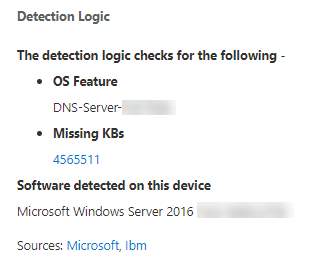

# 조직의 취약성 - 위협 및 취약성 관리Vulnerabilities in my organization - threat and vulnerability management

[!INCLUDE [Microsoft 365 Defender rebranding](../../includes/microsoft-defender.md)]

**적용 대상:****Applies to:**
- [엔드포인트용 Microsoft DefenderMicrosoft Defender for Endpoint](https://go.microsoft.com/fwlink/?linkid=2154037)
- [위협 및 취약점 관리Threat and vulnerability management](next-gen-threat-and-vuln-mgt.md)
- [Microsoft 365 DefenderMicrosoft 365 Defender](https://go.microsoft.com/fwlink/?linkid=2118804)

>끝점용 Microsoft Defender를 경험하고 싶나요?Want to experience Microsoft Defender for Endpoint? [무료 평가판에 등록합니다.Sign up for a free trial.](https://www.microsoft.com/microsoft-365/windows/microsoft-defender-atp?ocid=docs-wdatp-portaloverview-abovefoldlink)

위협 및 취약성 관리는 끝점의 끝점 보호를 위해 Defender의 동일한 신호를 사용하여 취약점을 검색합니다.Threat and vulnerability management uses the same signals in Defender for Endpoint's endpoint protection to scan and detect vulnerabilities.

취약점 **페이지에는** CVE(Common Vulnerabilities and Exposures) ID를 나열하여 장치가 노출하는 소프트웨어 취약점이 나열됩니다.The **Weaknesses** page lists the software vulnerabilities your devices are exposed to by listing the Common Vulnerabilities and Exposures (CVE) ID. 또한 심각도, CVSS(Common Vulnerability Scoring System) 등급, 조직의 보급, 해당 위반, 위협 정보 등도 볼 수 있습니다.You can also view the severity, Common Vulnerability Scoring System (CVSS) rating, prevalence in your organization, corresponding breach, threat insights, and more.

>[!NOTE]
>취약점에 공식 CVE-ID가 할당되지 않은 경우 취약성 이름은 위협 및 취약성 관리에 의해 할당됩니다.If there is no official CVE-ID assigned to a vulnerability, the vulnerability name is assigned by threat and vulnerability management.

>[!TIP]
>새 취약성 이벤트에 대한 전자 메일을 얻습니다. [끝점용 Microsoft Defender에서 취약성](configure-vulnerability-email-notifications.md) 전자 메일 알림 구성을 참조하세요.To get emails about new vulnerability events, see [Configure vulnerability email notifications in Microsoft Defender for Endpoint](configure-vulnerability-email-notifications.md)

## 약점 페이지로 이동합니다.Navigate to the Weaknesses page

몇 가지 다른 방법으로 취약점 페이지에 액세스합니다.Access the Weaknesses page a few different ways:

- Microsoft  Defender 보안 센터의 위협 및 취약성 관리 탐색 메뉴에서 [약점 선택](portal-overview.md)Selecting **Weaknesses** from the threat and vulnerability management navigation menu in the [Microsoft Defender Security Center](portal-overview.md)
- 전역 검색Global search

### 탐색 메뉴Navigation menu

위협 및 취약성 관리 탐색 메뉴로 이동하고 취약점을 선택하여 CV 목록을 열 수 있습니다. Go to the threat and vulnerability management navigation menu and select **Weaknesses** to open the list of CVEs.

### 전역 검색의 취약성Vulnerabilities in global search

1. 전역 검색 드롭다운 메뉴로 이동하세요.Go to the global search drop-down menu.
2. 찾고 **있는** CVE(Common Vulnerabilities and Exposures) ID의 취약성 및 키-를 선택한 다음 검색 아이콘을 선택합니다.Select **Vulnerability** and key-in the Common Vulnerabilities and Exposures (CVE) ID that you're looking for, then select the search icon. 취약점 **페이지가** 원하는 CVE 정보로 열립니다.The **Weaknesses** page opens with the CVE information that you're looking for.

3. CVE를 선택하여 취약성 설명, 세부 정보, 위협 정보 및 노출된 장치를 비롯한 자세한 정보가 있는 플라이아웃 패널을 열 수 있습니다.Select the CVE to open a flyout panel with more information, including the vulnerability description, details, threat insights, and exposed devices.

취약점 페이지에서 나머지 취약점을 **확인하려면** CVE를 입력한 다음 검색을 선택합니다.To see the rest of the vulnerabilities in the **Weaknesses** page, type CVE, then select search.

## 약점 개요Weaknesses overview

노출된 장치의 취약점을 수정하여 자산 및 조직에 대한 위험을 줄입니다.Remediate the vulnerabilities in exposed devices to reduce the risk to your assets and organization. 노출된 **장치 열에** 0이 표시되면 위험에 노출되지 않습니다.If the **Exposed Devices** column shows 0, that means you aren't at risk.

### 위반 및 위협 정보Breach and threat insights

아이콘이 빨간색으로 표시될 때  위협 열에서 관련 위반 및 위협 정보를 볼 수 있습니다.View any related breach and threat insights in the **Threat** column when the icons are colored red.

 >[!NOTE]
 > 항상 지속적인 위협과 관련된 권장 사항의 우선 순위를 지정합니다.Always prioritize recommendations that are associated with ongoing threats. 이러한 권장 사항은 위협 인사이트 아이콘 빨간색 버그의 These recommendations are marked with the threat insight icon  및 위반 인사이트 아이콘  .and breach insight icon .  

조직에 취약점이 발견된 경우 위반 정보 아이콘이 강조 표시됩니다.The breach insights icon is highlighted if there's a vulnerability found in your organization.
This one says "possible active alert is associated with this recommendation.](images/tvm-breach-insights.png)

조직에서 발견된 취약점에 관련된 악용이 있는 경우 위협 정보 아이콘이 강조 표시됩니다.The threat insights icon is highlighted if there are associated exploits in the vulnerability found in your organization. 아이콘 위에 마우스를 대면 위협이 악용 키트의 일부인지 또는 특정 고급 영구적 캠페인 또는 활동 그룹에 연결되어 있는지를 보여 주게 됩니다.Hovering over the icon shows whether the threat is a part of an exploit kit, or connected to specific advanced persistent campaigns or activity groups. 사용 가능한 경우 제로 데이 악용 뉴스, 공개 또는 관련 보안 권고가 있는 Threat Analytics 보고서에 대한 링크가 있습니다.When available, there's a link to a Threat Analytics report with zero-day exploitation news, disclosures, or related security advisories.  

### 취약성 인사이트 얻기Gain vulnerability insights

CVE를 선택하면 취약성 설명, 세부 정보, 위협 정보 및 노출된 장치와 같은 추가 정보가 있는 플라이아웃 패널이 열립니다.If you select a CVE, a flyout panel will open with more information such as the vulnerability description, details, threat insights, and exposed devices.

- 관련 시나리오에 "OS 기능" 범주가 표시됩니다.The "OS Feature" category is shown in relevant scenarios
- 노출된 장치를 사용하여 모든 CVE에 대한 관련 보안 권장으로 이동하면 됩니다.You can go to the related security recommendation for every CVE with exposed device

 

### 지원되지 않는 소프트웨어Software that isn't supported

위협 요소 및 취약성 관리에 의해 현재 지원되지 & 소프트웨어의 CV는 취약점 페이지에 여전히 존재합니다.CVEs for software that isn't currently supported by threat & vulnerability management is still present in the Weaknesses page. 소프트웨어가 지원되지 않는 경우 제한된 데이터만 사용할 수 있습니다.Because the software is not supported, only limited data will be available.

지원되지 않는 소프트웨어가 있는 CV에서는 노출된 장치 정보를 사용할 수 없습니다.Exposed device information will not be available for CVEs with unsupported software. "노출된 장치" 섹션에서 "사용할 수 없습니다" 옵션을 선택하여 지원되지 않는 소프트웨어로 필터링합니다.Filter by unsupported software by selecting the "Not available" option in the "Exposed devices" section.

 

## 다른 위치의 CVE(공통 취약성 및 노출) 항목 보기View Common Vulnerabilities and Exposures (CVE) entries in other places

### 대시보드에서 가장 취약한 소프트웨어Top vulnerable software in the dashboard

1. 위협 및 [취약성](tvm-dashboard-insights.md) 관리 대시보드로 이동하여 취약한 최상위 소프트웨어 위젯으로 **아래로 스크롤합니다.**Go to the [threat and vulnerability management dashboard](tvm-dashboard-insights.md) and scroll down to the **Top vulnerable software** widget. 각 소프트웨어에서 발견되는 취약점의 수와 위협 정보 및 시간이 지날 때마다 디바이스 노출에 대한 높은 수준의 보기가 표시됩니다.You will see the number of vulnerabilities found in each software, along with threat information and a high-level view of device exposure over time.

    

2. 조사할 소프트웨어를 선택하여 드릴다운 페이지로 이동합니다.Select the software you want to investigate to go to a drilldown page.
3. 검색된 **취약성 탭을** 선택합니다.Select the **Discovered vulnerabilities** tab.
4. 취약점 세부 정보에 대한 자세한 내용을 조사할 취약점 선택Select the vulnerability you want to investigate for more information on vulnerability details

    

### 디바이스 페이지에서 취약점 검색Discover vulnerabilities in the device page

장치 페이지에서 관련 약점 정보를 확인합니다.View related weaknesses information in the device page.

1. Microsoft Defender 보안 센터 탐색 메뉴 모음으로 이동한 다음 장치 아이콘을 선택합니다.Go to the Microsoft Defender Security Center navigation menu bar, then select the device icon. 장치 **목록 페이지가** 열립니다.The **Devices list** page opens.
2. 장치 **목록 페이지에서** 조사할 장치 이름을 선택합니다.In the **Devices list** page, select the device name that you want to investigate.

    

3. 조사할 장치에 대한 세부 정보 및 응답 옵션이 있는 장치 페이지가 열립니다.The device page will open with details and response options for the device you want to investigate.
4. 검색된 **취약성을 선택합니다.**Select **Discovered vulnerabilities**.

    

5. 조사할 취약점을 선택하여 CVE 세부 정보(예: 취약성 설명, 위협 정보 및 검색 논리)가 있는 플라이아웃 패널을 열 수 있습니다.Select the vulnerability that you want to investigate to open up a flyout panel with the CVE details, such as: vulnerability description, threat insights, and detection logic.

#### CVE 검색 논리CVE Detection logic

소프트웨어 증거와 마찬가지로, 이제 디바이스에 적용한 검색 논리를 표시하여 취약하다는 사실도 밝혔습니다.Similar to the software evidence, we now show the detection logic we applied on a device in order to state that it's vulnerable. 새 섹션을 "검색 논리"(디바이스 페이지의 검색된 모든 취약성)라고 부르며 검색 논리 및 소스를 보여 주며,The new section is called "Detection Logic" (in any discovered vulnerability in the device page) and shows the detection logic and source.

관련 시나리오에서도 "OS 기능" 범주가 표시됩니다.The "OS Feature" category is also shown in relevant scenarios. CVE는 특정 OS 구성 요소를 사용하는 경우 취약한 OS를 실행하는 장치에만 영향을 미치게 됩니다.A CVE would affect devices that run a vulnerable OS only if a specific OS component is enabled. Windows Server 2019의 DNS 구성 요소에 취약점이 있습니다.Let's say Windows Server 2019 has vulnerability in its DNS component. 이 새로운 기능을 사용하여 OS에서 사용하도록 설정된 DNS 기능을 사용하여 이 CVE를 Windows Server 2019 장치에만 연결합니다.With this new capability, we’ll only attach this CVE to the Windows Server 2019 devices with the DNS capability enabled in their OS.

## 부정확성 보고Report inaccuracy

모호하거나 부정확하거나 불완전한 정보가 표시될 경우 가짓 긍정을 보고합니다.Report a false positive when you see any vague, inaccurate, or incomplete information. 또한 이미 수정된 보안 권장 사항에 대한 보고를 할 수 있습니다.You can also report on security recommendations that have already been remediated.

1. 취약점 페이지에서 CVE를 여십시오.Open the CVE on the Weaknesses page.
2. **부정확성** 보고를 선택하면 플라이아웃 창이 열립니다.Select **Report inaccuracy** and a flyout pane will open.
3. 드롭다운 메뉴에서 부정확성 범주를 선택하고 전자 메일 주소와 부정확한 정보를 입력합니다.Select the inaccuracy category from the drop-down menu and fill in your email address and inaccuracy details.
4. **전송** 을 선택합니다.Select **Submit**. 피드백은 위협 및 취약성 관리 전문가에게 즉시 전송됩니다.Your feedback is immediately sent to the threat and vulnerability management experts.

## 관련 문서Related articles

- [위협 및 취약성 관리 개요Threat and vulnerability management overview](next-gen-threat-and-vuln-mgt.md)
- [보안 권장 사항Security recommendations](tvm-security-recommendation.md)
- [소프트웨어 인벤토리Software inventory](tvm-software-inventory.md)
- [대시보드 인사이트Dashboard insights](tvm-dashboard-insights.md)
- [끝점 장치용 Microsoft Defender 목록 보기 및 구성View and organize the Microsoft Defender for Endpoint Devices list](machines-view-overview.md)
