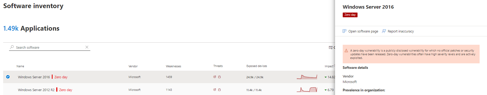
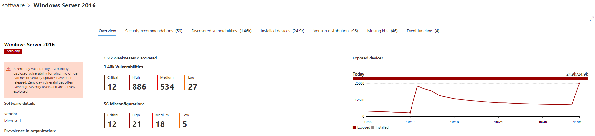
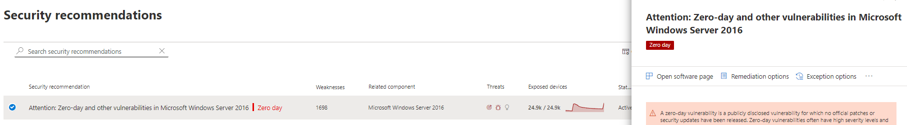

# 제로 데이 취약성 완화 - 위협 및 취약성 관리Mitigate zero-day vulnerabilities - threat and vulnerability management

[!INCLUDE [Microsoft 365 Defender rebranding](../../includes/microsoft-defender.md)]

**적용 대상:****Applies to:**

- [엔드포인트용 Microsoft DefenderMicrosoft Defender for Endpoint](https://go.microsoft.com/fwlink/?linkid=2154037)
- [위협 및 취약성 관리Threat and vulnerability management](next-gen-threat-and-vuln-mgt.md)
- [Microsoft 365 DefenderMicrosoft 365 Defender](https://go.microsoft.com/fwlink/?linkid=2118804)

>끝점용 Microsoft Defender를 경험하고 싶나요?Want to experience Microsoft Defender for Endpoint? [무료 평가판에 등록합니다.Sign up for a free trial.](https://www.microsoft.com/microsoft-365/windows/microsoft-defender-atp?ocid=docs-wdatp-portaloverview-abovefoldlink)

제로 데이 취약성은 공식 패치 또는 보안 업데이트가 릴리스되지 않은 공개된 취약성입니다.A zero-day vulnerability is a publicly disclosed vulnerability for which no official patches or security updates have been released. 제로 데이 취약성은 심각도 수준이 높고 적극적으로 악용되는 경우가 종종 있습니다.Zero-day vulnerabilities often have high severity levels and are actively exploited.

위협 및 취약성 관리 정보가 있는 제로 데이 취약성만 표시합니다.Threat and vulnerability management will only display zero-day vulnerabilities it has information about.

## 제로 데이 취약성에 대한 정보 찾기Find information about zero-day vulnerabilities

제로 데이 취약점이 발견된 후 이 취약점에 대한 정보는 제로 데이의 다음 경험을 통해 Microsoft Defender 보안 센터.Once a zero-day vulnerability has been found, information about it will be conveyed through the following experiences in the Microsoft Defender Security Center.

>[!NOTE]
> 0일 취약성 기능은 현재 모든 제품에서만 Windows 있습니다.0-day vulnerability capability is currently available only for Windows products.

### 위협 및 취약성 관리 대시보드Threat and vulnerability management dashboard

"최상위 보안 권장 사항" 카드에서 제로 데이 태그가 있는 추천을 찾아 봐야 합니다.Look for recommendations with a zero-day tag in the “Top security recommendations” card.

"가장 취약한 소프트웨어" 카드에서 제로 데이 태그가 있는 최상위 소프트웨어를 찾아 찾습니다.Find top software with the zero-day tag in the "Top vulnerable software" card.

### 약점 페이지Weaknesses page

명명된 제로 데이 취약성에 대한 설명 및 세부 정보를 찾아야 합니다.Look for the named zero-day vulnerability along with a description and details.

- 이 취약성에 CVE-ID가 할당된 경우 CVE 이름 옆에 제로 데이 레이블이 표시됩니다.If this vulnerability has a CVE-ID assigned, you’ll see the zero-day label next to the CVE name.

- 이 취약성에 할당된 CVE-ID가 없는 경우 내부의 임시 이름 아래에 "TVM-XXXX-XXXX"처럼 표시됩니다.If this vulnerability has no CVE-ID assigned, you'll find it under an internal, temporary name that looks like “TVM-XXXX-XXXX”. 공식 CVE-ID가 할당된 후 이름이 업데이트되지만 이전 내부 이름은 계속 검색할 수 있으며 사이드 패널에서 찾을 수 있습니다.The name will be updated once an official CVE-ID has been assigned, but the previous internal name will still be searchable and found in the side-panel.

### 소프트웨어 인벤토리 페이지Software inventory page

제로 데이 태그가 있는 소프트웨어를 검색합니다.Look for software with the zero-day tag. "제로 데이" 태그로 필터링하여 제로 데이 취약점이 있는 소프트웨어만 볼 수 있습니다.Filter by the "zero day" tag to only see software with zero-day vulnerabilities.

### 소프트웨어 페이지Software page

제로 데이 취약성의 영향을 받은 각 소프트웨어에 대해 제로 데이 태그를 찾아야 합니다.Look for a zero-day tag for each software that has been affected by the zero–day vulnerability.

### 보안 권장 사항 페이지Security recommendations page

해결 옵션이 있는 경우 해결을 포함하여 수정 및 완화 옵션에 대한 명확한 제안을 볼 수 있습니다.View clear suggestions about remediation and mitigation options, including workarounds if they exist. "제로 데이" 태그로 필터링하여 제로 데이 취약성을 해결한 보안 권장 사항만 볼 수 있습니다.Filter by the "zero day" tag to only see security recommendations addressing zero-day vulnerabilities.

제로 데이 취약성 및 추가 취약점이 있는 소프트웨어가 있는 경우 모든 취약성에 대한 하나의 권장을 받을 수 있습니다.If there's software with a zero-day vulnerability and additional vulnerabilities to address, you'll get one recommendation about all vulnerabilities.

## 제로 데이 취약성 해결Addressing zero-day vulnerabilities

보안 권장 페이지로 이동하여 제로 데이가 있는 권장을 선택합니다.Go to the security recommendation page and select a recommendation with a zero-day. 플라이아웃은 제로 데이 및 해당 소프트웨어의 기타 취약성에 대한 정보와 함께 열립니다.A flyout will open with information about the zero-day and other vulnerabilities for that software.

완화 옵션 및 해결 옵션(사용 가능한 경우)에 대한 링크가 있습니다.There will be a link to mitigation options and workarounds if they are available. 해결 방법을 사용하면 패치 또는 보안 업데이트를 배포할 수 있을 때까지 이 제로 데이 취약성에 의해 노출되는 위험을 줄이는 데 도움이 될 수 있습니다.Workarounds may help reduce the risk posed by this zero-day vulnerability until a patch or security update can be deployed.

수정 옵션을 열고 주의 유형을 선택합니다.Open remediation options and choose the attention type. 업데이트가 아직 릴리스되지 않았기 때문에 제로 데이 취약성에 대해 "주의 필요" 수정 옵션을 사용하는 것이 좋습니다.An "attention required" remediation option is recommended for the zero-day vulnerabilities, since an update hasn't been released yet. 수행할 특정 작업이 아니기 때문에 기한을 선택할 수 없습니다.You won't be able to select a due date, since there's no specific action to perform. 수정하고자 하는 이 소프트웨어에 대한 이전 취약점이 있는 경우 "주의 필요" 수정 옵션을 다시 적용하고 "업데이트"를 선택할 수 있습니다.If there are older vulnerabilities for this software you wish to remediation, you can override the "attention required" remediation option and choose “update.”

## 제로 데이 재구성 활동 추적Track zero-day remediation activities

재구성 위협 및 취약성 관리 페이지로 [이동하여](tvm-remediation.md) 재구성 활동 항목을 하세요.Go to the threat and vulnerability management [Remediation](tvm-remediation.md) page to view the remediation activity item. "주의 필요" 수정 옵션을 선택한 경우 모니터링할 수 있는 실제 작업이 아니기 때문에 진행률 표시줄, 티켓 상태 또는 기한이 없습니다.If you chose the "attention required" remediation option, there will be no progress bar, ticket status, or due date since there's no actual action we can monitor. "소프트웨어 업데이트" 또는 "주의 필요" 같은 수정 유형별로 필터링하여 동일한 범주의 모든 활동 항목을 볼 수 있습니다.You can filter by remediation type, such as "software update" or "attention required," to see all activity items in the same category.

## 제로 데이 취약성 패치Patching zero-day vulnerabilities

제로 데이에 대한 패치가 릴리스될 때 권장되는 것은 "업데이트"로 변경하고 옆에 "제로 데이용 새 보안 업데이트"라는 파란색 레이블이 표시됩니다.When a patch is released for the zero-day, the recommendation will be changed to “Update” and a blue label next to it that says “New security update for zero day.” 더 이상 제로 데이로 고려하지 않습니다. 제로 데이 태그는 모든 페이지에서 제거됩니다.It will no longer consider as a zero-day, the zero-day tag will be removed from all pages.

## 관련 문서Related articles

- [위협 및 취약성 관리 개요Threat and vulnerability management overview](next-gen-threat-and-vuln-mgt.md)
- [DashboardDashboard](tvm-dashboard-insights.md)
- [보안 권장 사항Security recommendations](tvm-security-recommendation.md)
- [소프트웨어 인벤토리Software inventory](tvm-software-inventory.md)
- [내 조직의 취약성Vulnerabilities in my organization](tvm-weaknesses.md)
