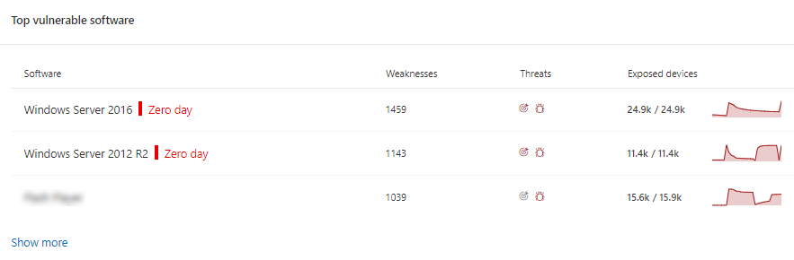
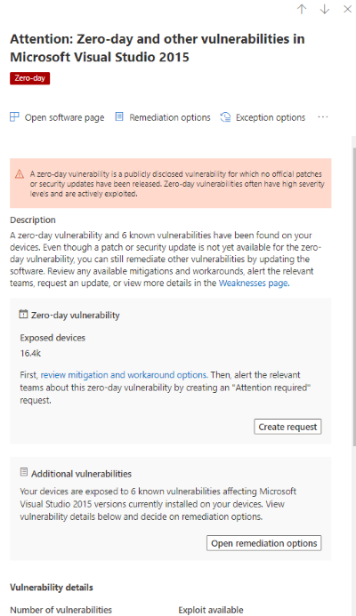

# 제로 데이 취약성 완화 - 위협 및 취약성 관리

[!INCLUDE [Microsoft 365 Defender rebranding](../../includes/microsoft-defender.md)]

**적용 대상:**

- [엔드포인트용 Microsoft Defender](https://go.microsoft.com/fwlink/?linkid=2154037)
- [위협 및 취약성 관리](next-gen-threat-and-vuln-mgt.md)
- [Microsoft 365 Defender](https://go.microsoft.com/fwlink/?linkid=2118804)

> 엔드포인트용 Microsoft Defender를 경험하고 싶으신가요? [무료 평가판을 신청하세요.](https://signup.microsoft.com/create-account/signup?products=7f379fee-c4f9-4278-b0a1-e4c8c2fcdf7e&ru=https://aka.ms/MDEp2OpenTrial?ocid=docs-wdatp-portaloverview-abovefoldlink)

제로 데이 취약성은 공식 패치 또는 보안 업데이트가 릴리스되지 않은 공개된 취약성입니다. 제로 데이 취약성은 심각도 수준이 높고 적극적으로 악용되는 경우가 종종 있습니다.

위협 및 취약성 관리 정보가 있는 제로 데이 취약성만 표시합니다.

## 제로 데이 취약성에 대한 정보 찾기

제로 데이 취약점이 발견된 후 이 취약점에 대한 정보는 Microsoft 365 Defender 포털에서 다음 환경을 통해 전달됩니다.

> [!NOTE]
> 0일 취약성 기능은 현재 모든 제품에서만 Windows 있습니다.

### 위협 및 취약성 관리 대시보드

"최상위 보안 권장 사항" 카드에서 제로 데이 태그가 있는 추천을 찾아 봐야 합니다.

"가장 취약한 소프트웨어" 카드에서 제로 데이 태그가 있는 최상위 소프트웨어를 찾아 찾습니다.

### 약점 페이지

명명된 제로 데이 취약성에 대한 설명 및 세부 정보를 찾아야 합니다.

- 이 취약성에 CVE-ID가 할당된 경우 CVE 이름 옆에 제로 데이 레이블이 표시됩니다.

- 이 취약성에 할당된 CVE-ID가 없는 경우 내부의 임시 이름 아래에 "TVM-XXXX-XXXX"처럼 표시됩니다. 공식 CVE-ID가 할당된 후 이름이 업데이트되지만 이전 내부 이름은 계속 검색할 수 있으며 사이드 패널에서 찾을 수 있습니다.

:::image type="content" alt-text="약점 페이지의 CVE-2020-17087에 대한 제로 데이 예제입니다." source="images/tvm-zero-day-weakness-name.png" lightbox="images/tvm-zero-day-weakness-name.png":::

### 소프트웨어 인벤토리 페이지

제로 데이 태그가 있는 소프트웨어를 검색합니다. "제로 데이" 태그로 필터링하여 제로 데이 취약점이 있는 소프트웨어만 볼 수 있습니다.

:::image type="content" alt-text="소프트웨어 인벤토리 Windows Server 2016 예제입니다." source="images/tvm-zero-day-software-inventory.png" lightbox="images/tvm-zero-day-software-inventory.png":::

### 소프트웨어 페이지

제로 데이 취약성의 영향을 받은 각 소프트웨어에 대해 제로 데이 태그를 찾아야 합니다.

:::image type="content" alt-text="소프트웨어 페이지의 Windows Server 2016 예입니다." source="images/tvm-zero-day-software-page.png" lightbox="images/tvm-zero-day-software-page.png":::

### 보안 권장 사항 페이지

해결 옵션이 있는 경우 해결을 포함하여 수정 및 완화 옵션에 대한 명확한 제안을 볼 수 있습니다. "제로 데이" 태그로 필터링하여 제로 데이 취약성을 해결한 보안 권장 사항만 볼 수 있습니다.

제로 데이 취약성 및 추가 취약점이 있는 소프트웨어가 있는 경우 모든 취약성에 대한 하나의 권장을 받을 수 있습니다.

:::image type="content" alt-text="보안 권장 사항 Windows Server 2016 예제입니다." source="images/tvm-zero-day-security-recommendation.png" lightbox="images/tvm-zero-day-security-recommendation.png":::

## 제로 데이 취약성 해결

보안 권장 페이지로 이동하여 제로 데이가 있는 권장을 선택합니다. 플라이아웃은 제로 데이 및 해당 소프트웨어의 기타 취약성에 대한 정보와 함께 열립니다.

완화 옵션 및 해결 옵션(사용 가능한 경우)에 대한 링크가 있습니다. 해결 방법을 사용하면 패치 또는 보안 업데이트를 배포할 수 있을 때까지 이 제로 데이 취약성에 의해 노출되는 위험을 줄이는 데 도움이 될 수 있습니다.

수정 옵션을 열고 주의 유형을 선택합니다. 업데이트가 아직 릴리스되지 않았기 때문에 제로 데이 취약성에 대해 "주의 필요" 수정 옵션을 사용하는 것이 좋습니다. 수행할 특정 작업이 아니기 때문에 기한을 선택할 수 없습니다. 수정하고자 하는 이 소프트웨어에 대한 이전 취약점이 있는 경우 "주의 필요" 수정 옵션을 다시 적용하고 "업데이트"를 선택할 수 있습니다.

## 제로 데이 재구성 활동 추적

재구성 위협 및 취약성 관리 페이지로 [이동하여](tvm-remediation.md) 재구성 활동 항목을 하세요. "주의 필요" 수정 옵션을 선택한 경우 모니터링할 수 있는 실제 작업이 아니기 때문에 진행률 표시줄, 티켓 상태 또는 기한이 없습니다. "소프트웨어 업데이트" 또는 "주의 필요" 같은 수정 유형별로 필터링하여 동일한 범주의 모든 활동 항목을 볼 수 있습니다.

## 제로 데이 취약성 패치

제로 데이에 대한 패치가 릴리스될 때 권장되는 것은 "업데이트"로 변경하고 옆에 "제로 데이용 새 보안 업데이트"라는 파란색 레이블이 표시됩니다. 더 이상 제로 데이로 고려하지 않습니다. 제로 데이 태그는 모든 페이지에서 제거됩니다.

## 관련 문서

- [위협 및 취약성 관리 개요](next-gen-threat-and-vuln-mgt.md)
- [대시보드](tvm-dashboard-insights.md)
- [보안 권장 사항](tvm-security-recommendation.md)
- [소프트웨어 인벤토리](tvm-software-inventory.md)
- [내 조직의 취약성](tvm-weaknesses.md)
