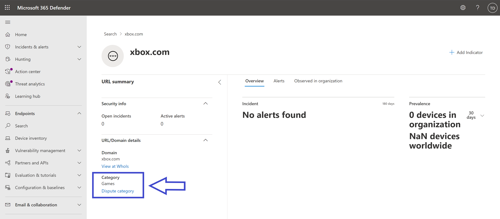
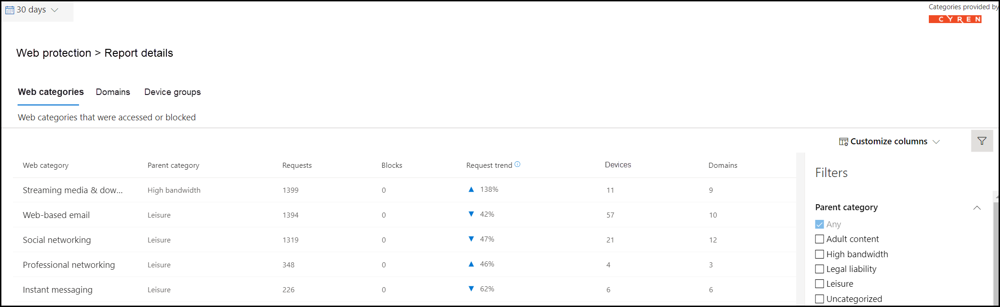

# 웹 컨텐츠 필터링

[!INCLUDE [Microsoft 365 Defender rebranding](../../includes/microsoft-defender.md)]

**적용 대상:**
- [엔드포인트용 Microsoft Defender](https://go.microsoft.com/fwlink/p/?linkid=2154037)
- [Microsoft 365 Defender](https://go.microsoft.com/fwlink/?linkid=2118804)

> [!IMPORTANT]
> **웹 콘텐츠 필터링이 현재 공개 미리 보기에 있습니다.** 
> 이 미리 보기 버전은 서비스 수준 계약 없이 제공되며 프로덕션 워크로드에는 권장되지 않습니다. 특정 기능이 지원되지 않거나 기능이 제한될 수 있습니다.
> 자세한 내용은 [엔드포인트용 Microsoft Defender 미리 보기 기능](preview.md)을 참조하세요.

> [!TIP]
> 엔드포인트용 Microsoft Defender를 경험하고 싶으신가요? [무료 평가판을 신청하세요.](https://signup.microsoft.com/create-account/signup?products=7f379fee-c4f9-4278-b0a1-e4c8c2fcdf7e&ru=https://aka.ms/MDEp2OpenTrial?ocid=docs-wdatp-main-abovefoldlink&rtc=1)

웹 콘텐츠 필터링은  끝점용 Microsoft Defender의 웹 보호 기능의 일부입니다. 이를 통해 조직은 해당 콘텐츠 범주에 따라 웹 사이트에 대한 액세스를 추적하고 규제할 수 있습니다. 이러한 웹 사이트 중 상당수는 악의적이지 않은 경우 규정 준수 규정, 대역폭 사용량 또는 기타 문제로 문제가 될 수 있습니다.

특정 범주를 차단하도록 장치 그룹 전체에서 정책을 구성합니다. 범주를 차단하면 지정된 장치 그룹 내의 사용자가 해당 범주와 연결된 URL에 액세스할 수 없습니다. 차단되지 않은 범주에 대해 URL이 자동으로 감사됩니다. 사용자는 중단 없이 URL에 액세스할 수 있으며 액세스 통계를 수집하여 보다 사용자 지정 정책 결정을 만드는 데 도움이 됩니다. 사용자가 보고 있는 페이지의 요소가 차단된 리소스를 호출하는 경우 차단 알림이 표시됩니다.

웹 콘텐츠 필터링은 주요 웹 브라우저에서 사용할 수 있으며, Windows Defender SmartScreen(Microsoft Edge) 및 네트워크 보호(Chrome, Firefox, Brave 및 Opera)에서 수행되는 블록이 있습니다. 브라우저 지원에 대한 자세한 내용은 prerequisites 섹션을 참조하세요.

이점 요약:

- 사용자가 차단된 범주의 웹 사이트에 액세스하지 못하도록 차단됩니다.
- 보안 팀에서 끝점 역할 기반 액세스 제어 설정에 대해 Microsoft Defender에 정의된 장치 그룹을 사용하여 사용자 그룹에 정책을 편리하게 [배포할 수 있습니다.](/microsoft-365/security/defender-endpoint/rbac)
- 보안 팀이 실제 블록 및 웹 사용 현황을 볼 수 있는 동일한 중앙 위치에서 웹 보고서에 액세스할 수 있습니다.

## 필수 구성 요소

이 기능을 시도하기 전에 다음 요구 사항을 충족하는지 확인합니다.

- Windows 10 Enterprise E5, Microsoft 365 E5, Microsoft 365 E5 Security, Microsoft 365 E3 + Microsoft 365 E5 Security 추가 기능 또는 끝점 독립 실행형 라이선스용 Microsoft Defender 
- Microsoft 365 Defender 포털에 https://security.microsoft.com) 액세스합니다( .
- 최신 moCAMP Windows 10 1주년 업데이트(버전 1607) 이상을 실행하는 장치.
- Windows Defender SmartScreen 및 네트워크 보호를 사용할 수 있습니다.

## 사용자 환경

지원되는 타사 브라우저에 대한 차단 환경은 차단된 연결을 사용자에게 알리는 시스템 수준 메시지를 제공하는 네트워크 보호에서 제공합니다. 보다 사용자에게 친숙한 브라우저 내 환경을 위해 브라우저 내 환경을 Microsoft Edge.

## 데이터 처리

데이터는 끝점 데이터 처리 설정에 대한 [Microsoft Defender의 일부로 선택된 지역에 저장됩니다.](data-storage-privacy.md) 데이터가 데이터 센터에서 나가지 않습니다. 또한 데이터 공급자를 포함하여 모든 타사와 귀하의 데이터가 공유되지 않습니다.

## 웹 콘텐츠 필터링 켜기

왼쪽 탐색 메뉴에서 **끝점 설정** 고급 기능을  >    >    >  **선택합니다.** 웹 콘텐츠 필터링 항목이 표시될 때까지 아래로 **스크롤합니다.** 토글을 **켜기 및** 저장 기본 **설정으로 전환합니다.**

### 웹 콘텐츠 필터링 정책 구성

웹 콘텐츠 필터링 정책은 어떤 장치 그룹에서 차단되는 사이트 범주를 지정합니다. 정책을 관리하기 위해 **규칙에서 설정**  >  **끝점** 웹 콘텐츠 필터링으로  >   **이동하세요.**

필터를 사용하여 차단된 특정 범주를 포함하거나 특정 장치 그룹에 적용되는 정책을 찾습니다.

### 정책 만들기

새 정책을 추가하는 경우:

1. 에서 **웹 콘텐츠** 필터링 **페이지에서** 정책 **설정.**

2. 이름을 지정합니다.

3. 차단할 범주를 선택합니다. 확장 아이콘을 사용하여 각 상위 범주를 완전히 확장하고 특정 웹 콘텐츠 범주를 선택합니다.

4. 정책 범위를 지정합니다. 정책을 적용할 위치를 지정하려면 장치 그룹을 선택합니다. 선택한 디바이스 그룹의 디바이스만 선택한 범주의 웹 사이트에 액세스할 수 없습니다.

5. 요약을 검토하고 정책을 저장합니다. 선택한 장치에 정책 새로 고침을 적용하는 데 최대 2시간이 걸릴 수 있습니다.

> [!NOTE]
> - 장치 그룹에서 범주를 선택하지 않고 정책을 배포할 수 있습니다. 이 작업은 차단 정책을 만들기 전에 사용자 동작을 이해하는 데 도움이 되는 감사 전용 정책을 생성합니다.
> - 정책을 제거하거나 장치 그룹을 동시에 변경하는 경우 정책 배포가 지연될 수 있습니다.
> - "분류되지 않은" 범주를 차단하면 예기치 않게 원치 않는 결과가 발생할 수 있습니다.  

### 특정 웹 사이트 허용

웹 콘텐츠 필터링에서 차단된 범주를 정의하여 사용자 지정 표시기 정책을 만들어 단일 사이트를 허용할 수 있습니다. 사용자 지정 표시기 정책은 해당 디바이스 그룹에 적용될 때 웹 콘텐츠 필터링 정책을 대신합니다.

1. 끝점 표시기 URL/도메인 Microsoft 365 Defender 추가로 이동하여 설정  >    >    >    >  **표시기를 만드세요.**

2. 사이트의 도메인을 입력합니다.

3. 정책 작업을 허용으로 **설정**  

### 분쟁 범주

잘못 분류된 도메인이 발생하는 경우 포털에서 해당 범주에 직접 이의를 제기할 수 있습니다. 

도메인 범주에 이의를 제기하려면 보고서 웹 **보호** 웹 콘텐츠 필터링  >    >  **세부 정보**  >  **도메인 으로 이동합니다.** 웹 콘텐츠 필터링 보고서의 도메인 탭에는 각 도메인 옆에 타원이 표시됩니다. 이 타원 위에 마우스를 대고 분쟁 **범주 를 선택합니다.**

우선 순위를 선택하고 다시 분류할 수 있는 범주와 같은 추가 세부 정보를 추가할 수 있는 패널이 열립니다. 양식을 완성한 후 제출 을 **선택합니다.** 팀에서 업무일 1일 이내에 요청을 검토합니다. 즉각적인 차단 해제를 위해 사용자 지정 허용 [표시기를 만드시다.](indicator-ip-domain.md)

### URL 범주 검색

웹 사이트의 범주를 확인하기 위해 웹 사이트 포털(끝점 검색에서 Microsoft 365 Defender URL 검색 기능을 사용할 https://security.microsoft.com) **수**  >  **있습니다.** URL 검색 결과에서 웹 콘텐츠 필터링 범주는 **URL/도메인 세부 정보 아래에 표시됩니다.** 관리자는 다음 이미지와 같이 이 페이지에서 직접 도메인 범주에 이의를 제기할 수도 있습니다. 범주 결과가 표시되어 있지 않은 경우 URL은 현재 기존 웹 콘텐츠 필터링 범주에 할당되지 않습니다.

## 웹 콘텐츠 필터링 카드 및 세부 정보

웹 **콘텐츠** 필터링 및 웹 위협 방지에 대한 정보가 있는 카드를 표시하려면 보고서 웹  >   보호를 선택합니다. 다음 카드는 웹 콘텐츠 필터링에 대한 요약 정보를 제공합니다.

### 범주별 웹 활동

이 카드에는 액세스 시도 횟수가 가장 크게 증가하거나 감소한 상위 웹 콘텐츠 범주가 나열됩니다. 지난 30일, 3개월 또는 6개월 동안 조직의 웹 활동 패턴이 대대적으로 변경된 내용을 이해합니다. 범주 이름을 선택하여 자세한 정보를 확인합니다.

이 기능을 처음 30일 동안 사용하면 조직에 이 정보를 표시할 데이터가 부족할 수 있습니다.

### 웹 콘텐츠 필터링 요약 카드

이 카드는 여러 상위 웹 콘텐츠 범주에 대해 차단된 액세스 시도의 분포를 표시됩니다. 특정 상위 웹 범주에 대한 자세한 정보를 표시하려면 색 막대 중 하나를 선택합니다.

### 웹 활동 요약 카드

이 카드에는 모든 URL의 웹 콘텐츠에 대한 총 요청 수가 표시됩니다.

### 카드 세부 정보 보기

카드의 차트에서 표 행이나 색이 있는 막대를 선택하여 각 카드에 대한 보고서 세부 정보에 액세스할 수 있습니다.  각 카드의 보고서 세부 정보 페이지에는 웹 콘텐츠 범주, 웹 사이트 도메인 및 장치 그룹에 대한 광범위한 통계 데이터가 포함되어 있습니다.

- **웹 범주:** 조직에서 액세스 시도가 시도된 웹 콘텐츠 범주를 나열합니다. 요약 플라이아웃을 열기 위해 특정 범주를 선택합니다.

- **도메인:** 조직에서 액세스되거나 차단된 웹 도메인을 나열합니다. 해당 도메인에 대한 자세한 정보를 확인하려면 특정 도메인을 선택합니다.

- **장치 그룹:** 조직에서 웹 활동을 생성한 모든 장치 그룹을 나열합니다.

페이지 왼쪽 위에 있는 시간 범위 필터를 사용하여 기간을 선택합니다. 정보를 필터링하거나 열을 사용자 지정할 수도 있습니다. 선택한 항목에 대한 추가 정보가 있는 플라이아웃 창을 열기 위해 행을 선택합니다.

## 오류 및 문제

### 이 미리 보기의 제한 사항 및 알려진 문제

- 장치의 Microsoft Edge 구성이 **Server(cmd**  >  **Systeminfo** OS 구성)인 경우  >  **지원됩니다.** 네트워크 보호는 지원되는 타사 브라우저에서 트래픽을 보호하는 서버 장치의 검사 모드에서만 지원됩니다.

- 미지정 장치에는 보고서에 잘못된 데이터가 표시됩니다. 보고서 **세부 정보** 장치 그룹 피벗에서 빈 장치 그룹 필드가  >   있는 행이 표시될 수 있습니다. 이 그룹에는 지정한 그룹에 들어가기 전에 지정되지 않은 장치가 포함되어 있습니다. 이 행에 대한 보고서에 정확한 장치 수나 액세스 수가 포함되지 않을 수 있습니다.

- 웹 콘텐츠 필터링 보고서는 현재 상위 5,000개 레코드를 표시하는 것으로 제한됩니다. 예를 들어 도메인 보고서에는 해당되는 경우 지정한 필터 쿼리에 대해 상위 5,000개 도메인만 표시됩니다. 

- [웹 보호 개요](web-protection-overview.md)
- [웹 위협 방지](web-threat-protection.md)
- [웹 보안 모니터링](web-protection-monitoring.md)
- [웹 위협에 대응](web-protection-response.md)
- [네트워크 보호 요구 사항](web-content-filtering.md)
