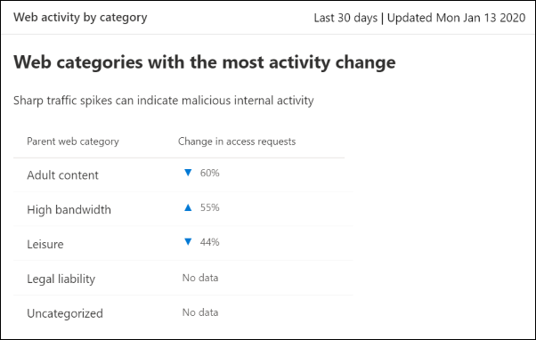

# 웹 컨텐츠 필터링

[!INCLUDE [Microsoft 365 Defender rebranding](../../includes/microsoft-defender.md)]

**적용 대상:**
- [엔드포인트용 Microsoft Defender](https://go.microsoft.com/fwlink/p/?linkid=2154037)
- [Microsoft 365 Defender](https://go.microsoft.com/fwlink/?linkid=2118804)

> [!TIP]
> 엔드포인트용 Microsoft Defender를 경험하고 싶으신가요? [무료 평가판을 신청하세요.](https://signup.microsoft.com/create-account/signup?products=7f379fee-c4f9-4278-b0a1-e4c8c2fcdf7e&ru=https://aka.ms/MDEp2OpenTrial?ocid=docs-wdatp-main-abovefoldlink&rtc=1)

웹 콘텐츠 필터링은 끝점용 Microsoft Defender의 웹 보호 기능의 일부입니다.  이를 통해 조직은 해당 콘텐츠 범주에 따라 웹 사이트에 대한 액세스를 추적하고 규제할 수 있습니다. 이러한 웹 사이트 중 상당수는 악의적이지 않은 경우 규정 준수 규정, 대역폭 사용량 또는 기타 문제로 문제가 될 수 있습니다.

특정 범주를 차단하도록 장치 그룹 전체에서 정책을 구성합니다. 범주를 차단하면 지정된 장치 그룹 내의 사용자가 해당 범주와 연결된 URL에 액세스할 수 없습니다. 차단되지 않은 범주에 대해 URL이 자동으로 감사됩니다. 사용자는 중단 없이 URL에 액세스할 수 있으며 액세스 통계를 수집하여 보다 사용자 지정 정책 결정을 만드는 데 도움이 됩니다. 사용자가 보고 있는 페이지의 요소가 차단된 리소스를 호출하는 경우 차단 알림이 표시됩니다.

웹 콘텐츠 필터링은 주요 웹 브라우저에서 사용할 수 있으며, Windows Defender SmartScreen(Microsoft Edge) 및 네트워크 보호(Chrome, Firefox, Brave 및 Opera)에서 수행되는 블록이 있습니다. 브라우저 지원에 대한 자세한 내용은 prerequisites 섹션을 참조하세요.

## 웹 콘텐츠 필터링의 이점

- 사용자는 사용자가 차단된 범주의 웹 사이트에 액세스할 수 없습니다. 즉, 사용자가 온라인에서 검색하는지 아니면 멀어지든 액세스가 차단됩니다.

- 보안 팀은 끝점 역할 기반 액세스 제어 설정에 대해 Microsoft Defender에 정의된 장치 그룹을 사용하여 사용자 그룹에 정책을 편리하게 [배포할 수 있습니다.](/microsoft-365/security/defender-endpoint/rbac)

- 보안 팀은 실제 블록 및 웹 사용 현황을 볼 수 있는 동일한 중앙 위치에 있는 웹 보고서에 액세스할 수 있습니다.

## 전제 조건

이 기능을 시도하기 전에 다음 요구 사항을 충족하는지 확인합니다.

- 구독에는 Windows 10 Enterprise E5, Microsoft 365 E5, Microsoft 365 E5 Security Microsoft 365 E3 + Microsoft 365 E5 Security 추가 기능 또는 Microsoft Defender for Endpoint 독립 실행형 라이선스. 

- 포털()에 Microsoft 365 Defender [https://security.microsoft.com](https://security.microsoft.com) 있습니다.

- 조직의 장치에서 최신 바이러스 백신/맬웨어 방지 Windows 10 1주년 업데이트(버전 1607) 이상이 [실행되고 있습니다.](manage-updates-baselines-microsoft-defender-antivirus.md)

- Windows Defender SmartScreen 및 네트워크 보호는 조직의 장치에서 사용하도록 설정됩니다.

## 데이터 처리

데이터는 끝점 데이터 처리 설정에 대한 [Microsoft Defender의 일부로 선택된 지역에 저장됩니다.](data-storage-privacy.md) 데이터가 데이터 센터에서 나가지 않습니다. 또한 데이터 공급자를 포함하여 귀하의 데이터는 타사와 공유되지 않습니다.

## 웹 콘텐츠 필터링 켜기

왼쪽 탐색 메뉴에서 **끝점 설정** 고급 기능을  >    >    >  **선택합니다.** 웹 콘텐츠 필터링 항목이 표시될 때까지 아래로 **스크롤합니다.** 토글을 **켜기 및** 저장 기본 **설정으로 전환합니다.**

### 웹 콘텐츠 필터링 정책 구성

웹 콘텐츠 필터링 정책은 어떤 장치 그룹에서 차단되는 사이트 범주를 지정합니다. 정책을 관리하기 위해 **규칙에서 설정**  >  **끝점** 웹 콘텐츠 필터링으로  >   **이동하세요.**

정책을 배포하여 다음 상위 또는 자식 범주를 차단할 수 있습니다.

성인용 콘텐츠

**Cults:** 구성원이 사회적으로 수락된 시스템과는 다른 신념 시스템에 대한 열의를 보여 주며 그룹 또는 이동과 관련된 사이트입니다. 

**링링:** 온라인 스킬 및 연습을 촉진하는 온라인 프로비전 및 사이트입니다.

**누드:** 일반적으로 아티스트 형식의 전방 및 세미 누드 이미지 또는 비디오를 제공하고 이러한 자료의 다운로드 또는 판매를 허용하는 사이트입니다.

**발음/ 성적 명시적:** 이미지 기반 또는 텍스트 형식의 성적 명시적 콘텐츠를 포함하는 사이트입니다. 성적 지향적 자료의 형식도 여기에 나열되어 있습니다.

**성 교육:** 성행위와 성행위에 대한 교육을 제공하는 사이트, 성병에 대한 예방에 대한 조언을 제공하는 사이트, 성 건강 문제 관련 조언을 제공하는 사이트 등, 정보 및 비음성 방식으로 성행위를 논의하는 사이트.

**무미:** 학교 자녀가 볼 수 없는 콘텐츠 또는 고용주가 직원의 액세스에 불편을 잊어버려도 폭력이나 사교도에 불편할 수 있는 사이트입니다.

**폭력:** 인간이나 동물에 대한 폭력과 관련된 콘텐츠를 표시하거나 홍보하는 사이트입니다.

높은 대역폭

**사이트 다운로드**: 사용자가 컴퓨터 프로그램과 같은 미디어 콘텐츠 또는 프로그램을 다운로드할 수 있도록 하는 기본 기능이 있는 사이트입니다.

**이미지 공유:** 공유 측면이 있는 사이트를 포함하여 주로 사진을 검색하거나 공유하는 데 사용되는 사이트입니다.

**피어 투 피어:** P2P(피어 투 피어) 소프트웨어를 호스팅하거나 P2P 소프트웨어를 사용하여 파일 공유를 용이하게 하는 사이트입니다.

**스트리밍 &** 다운로드: 기본 기능이 스트리밍 미디어의 배포인 사이트 또는 사용자가 스트리밍 미디어를 검색, 시청 또는 수신할 수 있는 사이트입니다.
  

법적 책임

**아동 남용 이미지:** 자식 남용 이미지 또는 인물 사진이 포함된 사이트입니다. 

**범죄 활동:** 불법 활동에 대한 지침, 조언 또는 홍보를 하는 사이트입니다.

**해킹**: 크랙된 저작권이 있는 자료를 배포하는 사이트를 포함하여 컴퓨터 소프트웨어 또는 하드웨어의 불법적 또는 의심이 있는 사용에 대한 리소스를 제공하는 사이트입니다.

**욕설 &** 욕설: 경마, 경도, 성별, 연령, 국적, 신체적 장애, 경제적 상황, 성적 기본 설정 또는 기타 라이프스타일 선택으로 식별될 수 있는 인구의 모든 섹션에 대한 적극적, 저하 또는 욕설을 조장하는 사이트입니다.

**불법 마약**: 불법/제어된 치료법을 판매하거나, 남용을 촉진하거나, 관련 파라페나리아를 판매하는 사이트입니다.

**불법 소프트웨어:** 맬웨어, 스파이웨어, 봇넷, 피싱 사기 또는 저작권 도용을 포함하거나 홍보하는 &.

**학교 부정**: 표기학 또는 학교 부정 행위와 관련된 사이트입니다. 

**자해:** 사용자에 대한 협박 및/또는 협박 메시지를 포함하는 사이버 위협 사이트를 포함하여 자해를 촉진하는 사이트입니다.

**무기:** 무기를 판매하거나 무기의 사용을 지지하는 모든 사이트(총, 기사 및 탄약을 포함하지만 국한되지는 않습니다.)

선행 대수

**채팅**: 주로 웹 기반 채팅방인 사이트입니다.

**게임:** 온라인 서비스 호스팅을 통해 게임을 홍보하는 사이트 또는 게임 관련 정보를 포함하여 비디오 또는 컴퓨터 게임과 관련된 사이트입니다.

**인스턴트 메시징:** 인스턴트 메시징 소프트웨어 또는 클라이언트 기반 인스턴트 메시징을 다운로드하는 데 사용할 수 있는 사이트입니다.

**Professional 네트워크:** 전문 네트워킹 서비스를 제공하는 사이트입니다.

**소셜 네트워킹:** 소셜 네트워킹 서비스를 제공하는 사이트입니다.

**웹 기반 전자 메일:** 웹 기반 메일 서비스를 제공하는 사이트입니다.
  

Uncategorized

**새로 등록된 도메인:** 지난 30일 동안 새로 등록되어 아직 다른 범주로 이동되지 않은 사이트입니다.

**파기된 도메인:** 콘텐츠가 없는 사이트 또는 나중에 사용하기 위해 사용이 예정된 사이트입니다.
  
**참고:** 분류되지 않은 항목은 새로 등록된 도메인 및 예약된 도메인만 포함하며, 이러한 범주 외부의 다른 모든 사이트는 포함하지 않습니다.
  

### 정책 만들기

새 정책을 추가하기 위해 다음 단계를 수행합니다.

1. in the Microsoft 365 Defender portal ( [https://security.microsoft.com](https://security.microsoft.com) ), choose **설정** Web  >  **content filtering**  >  **+ Add policy**.

2. 이름을 지정합니다.

3. 차단할 범주를 선택합니다. 확장 아이콘을 사용하여 각 상위 범주를 완전히 확장하고 특정 웹 콘텐츠 범주를 선택합니다.

4. 정책 범위를 지정합니다. 정책을 적용할 위치를 지정하려면 장치 그룹을 선택합니다. 선택한 디바이스 그룹의 디바이스만 선택한 범주의 웹 사이트에 액세스할 수 없습니다.

5. 요약을 검토하고 정책을 저장합니다. 선택한 장치에 정책 새로 고침을 적용하는 데 최대 2시간이 걸릴 수 있습니다.

> [!NOTE]
> - 장치 그룹에서 범주를 선택하지 않고 정책을 배포할 수 있습니다. 이 작업은 차단 정책을 만들기 전에 사용자 동작을 이해하는 데 도움이 되는 감사 전용 정책을 생성합니다.
> - 정책을 제거하거나 장치 그룹을 동시에 변경하는 경우 정책 배포가 지연될 수 있습니다.
> - "분류되지 않은" 범주를 차단하면 예기치 않게 원치 않는 결과가 발생할 수 있습니다.  

## 최종 사용자 환경

지원되는 타사 브라우저에 대한 차단 환경은 차단된 연결을 사용자에게 알리는 시스템 수준 메시지를 제공하는 네트워크 보호에서 제공합니다. 보다 사용자에게 친숙한 브라우저 내 환경을 위해 브라우저 내 환경을 Microsoft Edge.

### 특정 웹 사이트 허용

웹 콘텐츠 필터링에서 차단된 범주를 정의하여 사용자 지정 표시기 정책을 만들어 단일 사이트를 허용할 수 있습니다. 사용자 지정 표시기 정책은 해당 디바이스 그룹에 적용될 때 웹 콘텐츠 필터링 정책을 대신합니다.

사용자 지정 표시기를 정의하기 위해 다음 단계를 수행합니다.

1. in the Microsoft 365 Defender portal ( [https://security.microsoft.com](https://security.microsoft.com) ) go to **설정**  >  **Endpoints**  >  **Indicators**  >  **URL/Domain**  >  **Add Item**.

2. 사이트의 도메인을 입력합니다.

3. 정책 작업을 허용으로 **설정**  

### 분쟁 범주

잘못 분류된 도메인이 발생하는 경우 포털에서 해당 범주에 직접 이의를 제기할 수 있습니다. 

도메인 범주에 이의를 제기하려면 보고서 웹 **보호** 웹 콘텐츠 필터링  >    >  **세부 정보**  >  **도메인 으로 이동합니다.** 웹 콘텐츠 필터링 보고서의 도메인 탭에는 각 도메인 옆에 타원이 표시됩니다. 이 타원 위에 마우스를 대고 분쟁 **범주 를 선택합니다.**

우선 순위를 선택하고 재계산을 위한 제안 범주와 같은 추가 세부 정보를 추가할 수 있는 패널이 열립니다. 양식을 완성한 후 제출 을 **선택합니다.** 팀에서 업무일 1일 이내에 요청을 검토합니다. 즉각적인 차단 해제를 위해 사용자 지정 허용 [표시기를 만드시다.](indicator-ip-domain.md)

### URL 범주 검색

웹 사이트의 범주를 확인하기 위해 끝점 검색의 Microsoft 365 Defender 포털( )에서 사용할 수 있는 URL 검색 기능을 사용할 [https://security.microsoft.com](https://security.microsoft.com) **수**  >  **있습니다.** URL 검색 결과에서 웹 콘텐츠 필터링 범주는 **URL/도메인 세부 정보 아래에 표시됩니다.** 관리자는 다음 이미지와 같이 이 페이지에서 직접 도메인 범주에 이의를 제기할 수도 있습니다. 범주 결과가 표시되어 있지 않은 경우 URL은 현재 기존 웹 콘텐츠 필터링 범주에 할당되지 않습니다.

## 웹 콘텐츠 필터링 카드 및 세부 정보

웹 **콘텐츠** 필터링 및 웹 위협 방지에 대한 정보가 있는 카드를 표시하려면 보고서 웹  >   보호를 선택합니다. 다음 카드는 웹 콘텐츠 필터링에 대한 요약 정보를 제공합니다.

### 범주별 웹 활동

이 카드에는 액세스 시도 횟수가 가장 크게 증가하거나 감소한 상위 웹 콘텐츠 범주가 나열됩니다. 지난 30일, 3개월 또는 6개월 동안 조직의 웹 활동 패턴이 대대적으로 변경된 내용을 이해합니다. 범주 이름을 선택하여 자세한 정보를 확인합니다.

이 기능을 처음 30일 동안 사용하면 조직에 이 정보를 표시할 데이터가 부족할 수 있습니다.

### 웹 콘텐츠 필터링 요약 카드

이 카드는 여러 상위 웹 콘텐츠 범주에 대해 차단된 액세스 시도의 분포를 표시됩니다. 특정 상위 웹 범주에 대한 자세한 정보를 표시하려면 색 막대 중 하나를 선택합니다.

### 웹 활동 요약 카드

이 카드에는 모든 URL의 웹 콘텐츠에 대한 총 요청 수가 표시됩니다.

### 카드 세부 정보 보기

카드의 차트에서 표 행이나 색이 있는 막대를 선택하여 각 카드에 대한 보고서 세부 정보에 액세스할 수 있습니다.  각 카드의 보고서 세부 정보 페이지에는 웹 콘텐츠 범주, 웹 사이트 도메인 및 장치 그룹에 대한 광범위한 통계 데이터가 포함되어 있습니다.

- **웹 범주:** 조직에서 액세스 시도가 시도된 웹 콘텐츠 범주를 나열합니다. 요약 플라이아웃을 열기 위해 특정 범주를 선택합니다.

- **도메인:** 조직에서 액세스되거나 차단된 웹 도메인을 나열합니다. 해당 도메인에 대한 자세한 정보를 확인하려면 특정 도메인을 선택합니다.

- **장치 그룹:** 조직에서 웹 활동을 생성한 모든 장치 그룹을 나열합니다.

페이지 왼쪽 위에 있는 시간 범위 필터를 사용하여 기간을 선택합니다. 정보를 필터링하거나 열을 사용자 지정할 수도 있습니다. 선택한 항목에 대한 추가 정보가 있는 플라이아웃 창을 열기 위해 행을 선택합니다.

### 알려진 문제 및 제한 사항

- 장치의 Microsoft Edge 구성이 **Server(cmd**  >  **Systeminfo** OS 구성)인 경우  >  **지원됩니다.** 네트워크 보호는 지원되는 타사 브라우저에서 트래픽을 보호하는 서버 장치의 검사 모드에서만 지원됩니다.

- 미지정 장치에는 보고서에 잘못된 데이터가 표시됩니다. 보고서 **세부 정보** 장치 그룹 피벗에서 빈 장치 그룹 필드가  >   있는 행이 표시될 수 있습니다. 이 그룹에는 지정한 그룹에 들어가기 전에 지정되지 않은 장치가 포함되어 있습니다. 이 행에 대한 보고서에 정확한 장치 수나 액세스 수가 포함되지 않을 수 있습니다.

- 웹 콘텐츠 필터링 보고서는 현재 상위 5,000개 레코드를 표시하는 것으로 제한됩니다. 예를 들어 도메인 보고서에는 해당되는 경우 지정한 필터 쿼리에 대해 상위 5,000개 도메인만 표시됩니다. 

## 참고 항목

- [웹 보호 개요](web-protection-overview.md)
- [웹 위협 방지](web-threat-protection.md)
- [웹 보안 모니터링](web-protection-monitoring.md)
- [웹 위협에 대응](web-protection-response.md)
- [네트워크 보호 요구 사항](web-content-filtering.md)
