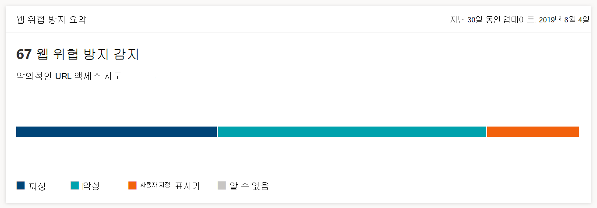

# 웹 검색 보안 모니터링Monitor web browsing security

[!INCLUDE [Microsoft 365 Defender rebranding](../../includes/microsoft-defender.md)]

**적용 대상:****Applies to:**
- [엔드포인트용 Microsoft Defender](https://go.microsoft.com/fwlink/p/?linkid=2154037) [Microsoft Defender for Endpoint](https://go.microsoft.com/fwlink/p/?linkid=2154037)
- [Microsoft 365 DefenderMicrosoft 365 Defender](https://go.microsoft.com/fwlink/?linkid=2118804)

>끝점용 Microsoft Defender를 경험하고 싶나요?Want to experience Microsoft Defender for Endpoint? [무료 평가판에 등록합니다.Sign up for a free trial.](https://www.microsoft.com/microsoft-365/windows/microsoft-defender-atp?ocid=docs-wdatp-main-abovefoldlink&rtc=1)

웹 보호를 사용하면 Microsoft Defender 보안 센터의 보고서 및 웹 보호에 > 통해 조직의 웹 **검색** 보안을 모니터링할 수 있습니다.Web protection lets you monitor your organization’s web browsing security through reports under **Reports > Web protection** in the Microsoft Defender Security Center. 이 보고서에는 웹 위협 감지 통계를 제공하는 카드가 포함되어 있습니다.The report contains cards that provide web threat detection statistics.

- **시간 경과에** 대한 웹 위협 방지 감지 - 이 추세 카드는 선택한 기간(지난 30일, 지난 3개월, 지난 6개월) 동안 유형별로 검색된 웹 위협 수를 표시합니다.**Web threat protection detections over time** - this trending card displays the number of web threats detected by type during the selected time period (Last 30 days, Last 3 months, Last 6 months)
 
    

- **웹 위협 방지** 요약 - 이 카드는 지난 30일 동안의 총 웹 위협 감지를 표시하여 다양한 유형의 웹 위협에 대한 배포를 표시합니다.**Web threat protection summary** - this card displays the total web threat detections in the past 30 days, showing distribution across the different types of web threats. 조각을 선택하면 악성 또는 원치 않는 웹 사이트에서 발견된 도메인 목록이 열립니다.Selecting a slice opens the list of the domains that were found with malicious or unwanted websites.

    

>[!Note]
>블록이 카드 또는 도메인 목록에 반영되기까지 최대 12시간이 걸릴 수 있습니다.It can take up to 12 hours before a block is reflected in the cards or the domain list.

## 웹 위협 유형Types of web threats

웹 보호는 악성 및 원치 않는 웹 사이트를 다음과 같은 분류합니다.Web protection categorizes malicious and unwanted websites as:

- **피싱** - 사용자가 자격 증명 및 기타 중요한 정보를 유출하도록 설계된 스푸핑된 웹 양식 및 기타 피싱 메커니즘을 포함하는 웹 사이트**Phishing** - websites that contain spoofed web forms and other phishing mechanisms designed to trick users into divulging credentials and other sensitive information
- **악성** - 맬웨어를 호스트하고 코드를 악용하는 웹 사이트**Malicious** - websites that host malware and exploit code
- **사용자 지정 표시기** - 차단을 위해 사용자 지정 표시기 목록에 추가한 URL 또는 [도메인](manage-indicators.md) 웹 사이트**Custom indicator** - websites whose URLs or domains you've added to your [custom indicator list](manage-indicators.md) for blocking

## 도메인 목록 보기View the domain list

웹 위협 방지 요약  카드에서 특정 웹 위협 범주를 선택하여 도메인 페이지를 **열** 수 있습니다.Select a specific web threat category in the **Web threat protection summary** card to open the **Domains** page. 이 페이지에는 해당 위협 범주의 도메인 목록이 표시됩니다.This page displays the list of the domains under that threat category. 이 페이지에서는 각 도메인에 대해 다음 정보를 제공합니다.The page provides the following information for each domain:

- **액세스 횟수** - 도메인의 URL에 대한 요청 수**Access count** - number of requests for URLs in the domain
- **블록** - 요청이 차단된 횟수**Blocks** - number of times requests were blocked
- **액세스 추세** - 액세스 시도 횟수 변경**Access trend** - change in number of access attempts
- **위협 범주** - 웹 위협 유형**Threat category** - type of web threat
- **장치** - 액세스 시도가 있는 장치 수**Devices** - number of devices with access attempts

해당 도메인의 URL에 액세스하려고 시도한 장치 목록과 URL 목록을 확인하려면 도메인을 선택합니다.Select a domain to view the list of devices that have attempted to access URLs in that domain and the list of URLs.

## 관련 항목Related topics

- [웹 보호 개요Web protection overview](web-protection-overview.md)
- [웹 컨텐츠 필터링Web content filtering](web-content-filtering.md)
- [웹 위협 방지Web threat protection](web-threat-protection.md)
- [웹 위협에 대응Respond to web threats](web-protection-response.md)
