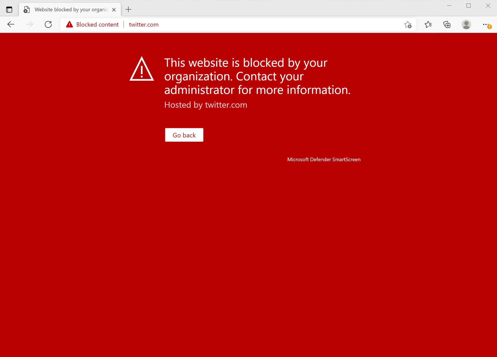

# <a name="web-protection"></a>웹 보호

[!INCLUDE [Microsoft 365 Defender rebranding](../../includes/microsoft-defender.md)]

**적용 대상:**

- [엔드포인트용 Microsoft Defender](https://go.microsoft.com/fwlink/p/?linkid=2154037)
- [Microsoft 365 Defender](https://go.microsoft.com/fwlink/?linkid=2118804)


> 엔드포인트용 Microsoft Defender를 경험하고 싶으신가요? [무료 평가판을 신청하세요.](https://signup.microsoft.com/create-account/signup?products=7f379fee-c4f9-4278-b0a1-e4c8c2fcdf7e&ru=https://aka.ms/MDEp2OpenTrial?ocid=docs-wdatp-main-abovefoldlink&rtc=1)


## <a name="about-web-protection"></a>웹 보호 정보

끝점용 Microsoft Defender의 웹 보호는 웹 위협 [방지,](web-threat-protection.md)웹 콘텐츠 필터링 및 사용자 지정 표시기 로 [끝나는 기능입니다.](manage-indicators.md) [](web-content-filtering.md) 웹 보호를 사용하면 웹 위협으로부터 장치를 보호하고 원치 않는 콘텐츠를 규제하는 데 도움이 됩니다. 보고서 및 웹 보호로 이동하여 Microsoft 365 Defender 포털에서 웹 보호 **보고서를 > 있습니다.**

:::image type="content" alt-text="모든 웹 보호 카드의 이미지입니다." source="images/web-protection.png" lightbox="images/web-protection.png":::

### <a name="web-threat-protection"></a>웹 위협 방지

웹 위협 방지를 만드는  카드는 시간이 지날 때의 웹 위협 감지 및 웹 위협 **요약입니다.**

웹 위협 방지에는 다음이 포함됩니다.

- 조직에 영향을 주는 웹 위협에 대한 포괄적인 가시성

- 경고 및 포괄적인 URL 프로필 및 이러한 URL에 액세스하는 장치를 통한 웹 관련 위협 활동에 대한 조사 기능

- 악의적인 원치 않는 웹 사이트에 대한 일반적인 액세스 추세를 추적하는 전체 보안 기능 집합입니다.

자세한 내용은 웹 위협 [방지를 참조하세요.](web-threat-protection.md)

### <a name="custom-indicators"></a>사용자 지정 표시기

사용자 지정 표시기 검색은 조직 웹 위협  보고서에서 시간의에 따라 웹 위협 감지 및 웹 위협 요약에 **요약됩니다.**

사용자 지정 표시기는 다음과 같습니다.

- 위협으로부터 조직을 보호하기 위해 IP 및 URL 기반 손상 표시기를 만드는 능력

- 사용자 지정 IP/URL 프로필 및 이러한 URL에 액세스하는 장치와 관련된 활동에 대한 조사 기능

- IPS 및 URL에 대해 허용, 차단 및 경고 정책을 만드는 능력

자세한 내용은 [CREATE indicators for IPS and URLs/domains를 참조하세요.](indicator-ip-domain.md)

### <a name="web-content-filtering"></a>웹 컨텐츠 필터링

웹 콘텐츠 필터링에는 범주별 **웹** 활동, 웹 **콘텐츠** 필터링 요약 및 웹 활동 **요약이 포함됩니다.**

웹 콘텐츠 필터링에는 다음이 포함됩니다.

- 사용자는 차단된 범주의 웹 사이트에 액세스할 수 없습니다. 즉, 사용자가 사내에서 검색하는지 아니면 멀어지든 해당 웹 사이트에 액세스할 수 없습니다.

- 끝점 역할 기반 액세스 제어 설정에 대해 [Microsoft Defender에](/microsoft-365/security/defender-endpoint/rbac)정의된 장치 그룹을 사용하여 다양한 정책을 다양한 사용자 집합에 편리하게 배포할 수 있습니다.

- 실제 블록 및 웹 사용 현황을 볼 수 있는 동일한 중앙 위치에서 웹 보고서에 액세스할 수 있습니다.

자세한 내용은 웹 콘텐츠 필터링 [을 참조하세요.](web-content-filtering.md)

## <a name="order-of-precedence"></a>우선 순위

웹 보호는 우선 순위에 따라 나열된 다음 구성 요소로 구성됩니다. 이러한 각 구성 요소는 다른 모든 브라우저 및 프로세스의 Microsoft Edge SmartScreen 클라이언트에 의해 적용됩니다.

- 사용자 지정 표시기(IP/URL, MICROSOFT CLOUD APP SECURITY(MCAS) 정책)

    - 허용
    - 경고
    - 차단

- 웹 위협(맬웨어, 피싱)

    - SmartScreen Intel(EOP(Exchange Online Protection 포함)
    - 에스컬ations

- WCF(웹 콘텐츠 필터링)

>[!Note]
>Microsoft Cloud App Security(MCAS)는 현재 차단된 URL에 대한 표시기만 생성합니다.

우선 순위 순서는 URL 또는 IP가 평가되는 작업 순서와 관련이 있습니다. 예를 들어 웹 콘텐츠 필터링 정책이 있는 경우 사용자 지정 IP/URL 표시기를 통해 제외를 만들 수 있습니다. 사용자 지정 IoC(손상 표시기)는 WCF 블록보다 우선 순위가 높습니다. 

마찬가지로 표시기 간에 충돌이 있는 동안에는 항상 블록보다 우선합니다(논리를 오버라이드). 즉, 허용 표시기가 있는 모든 블록 표시기에서 이기게 됩니다.

아래 표에는 웹 보호 스택 내에서 충돌이 있는 몇 가지 일반적인 구성이 요약되어 있습니다. 또한 위에 나열된 우선 순위에 따라 결과 결정도 식별합니다. 

<br>

****

|사용자 지정 표시기 정책|웹 위협 정책|WCF 정책|MCAS 정책|결과|
|---|---|---|---|---|
|허용|차단|차단|차단|허용(웹 보호 오버라이드)|
|허용|허용|차단|차단|허용(WCF 예외)|
|경고|차단|차단|차단|경고(오버라이드)|

내부 IP 주소는 사용자 지정 표시기에서 지원되지 않습니다. 최종 사용자가 무시한 경고 정책의 경우 기본적으로 해당 사용자에 대해 24시간 동안 사이트 차단이 해제됩니다. 이 시간 프레임은 관리자가 수정할 수 있으며 SmartScreen 클라우드 서비스에 의해 전달됩니다. 웹 위협 블록(맬웨어/피싱)에 대해 CSP를 Microsoft Edge 경고를 무시하는 기능을 사용하지 않도록 설정할 수도 있습니다. 자세한 내용은 SmartScreen Microsoft Edge [을 설정.](/DeployEdge/microsoft-edge-policies#smartscreen-settings-policies)

## <a name="protect-browsers"></a>브라우저 보호

모든 웹 보호 시나리오에서 SmartScreen 및 Network Protection을 함께 사용하여 타사 브라우저와 프로세스 둘 다에서 보호를 보장할 수 있습니다. SmartScreen은 기본 제공 Microsoft Edge, 네트워크 보호는 타사 브라우저 및 프로세스에서 트래픽을 모니터링합니다. 아래 다이어그램은 이 개념을 보여 주며, 여러 브라우저/앱 범위를 제공하기 위해 함께 작업하는 두 클라이언트의 이 다이어그램은 웹 보호의 모든 기능(표시기, 웹 위협, 콘텐츠 필터링)에 대해 정확합니다.

:::image type="content" alt-text="SmartScreen 및 네트워크 보호를 함께 사용하세요." source="../../media/web-protection-protect-browsers.png" lightbox="../../media/web-protection-protect-browsers.png":::

## <a name="troubleshoot-endpoint-blocks"></a>끝점 블록 문제 해결

SmartScreen 클라우드의 응답이 표준화됩니다. Fiddler와 같은 도구를 사용하여 클라우드 서비스의 응답을 검사할 수 있습니다. 이 도구는 블록의 원본을 확인하는 데 도움이 됩니다. 

SmartScreen 클라우드 서비스가 허용, 차단 또는 경고 응답으로 응답하면 응답 범주 및 서버 컨텍스트가 클라이언트로 다시 릴레이됩니다. 이 Microsoft Edge 응답 범주는 표시될 적절한 차단 페이지(악성, 피싱, 조직 정책)를 결정하는 데 사용됩니다.

아래 표에는 응답 및 상호 관련 기능이 표시됩니다.  

<br>

****

|ResponseCategory|차단을 담당하는 기능|
|---|---|
|CustomPolicy|WCF|
|CustomBlockList|사용자 지정 표시기|
|CasbPolicy|MCAS|
|악성|웹 위협|
|피싱|웹 위협|

## <a name="advanced-hunting-for-web-protection"></a>웹 보호를 위한 고급 헌팅

고급 헌팅의 Kusto 쿼리를 사용하여 최대 30일 동안 조직의 웹 보호 블록을 요약할 수 있습니다. 이러한 쿼리는 위에 나열된 정보를 사용하여 다양한 블록 원본을 구분하고 사용자에게 친숙한 방식으로 요약합니다. 예를 들어 아래 쿼리에는 해당 쿼리에서 시작된 모든 WCF 블록이 Microsoft Edge.

```kusto
DeviceEvents  
| where ActionType == "SmartScreenUrlWarning" 
| extend ParsedFields=parse_json(AdditionalFields) 
| project DeviceName, ActionType, Timestamp, RemoteUrl, InitiatingProcessFileName, Experience=tostring(ParsedFields.Experience)
| where Experience == "CustomPolicy" 
```

마찬가지로 아래 쿼리를 사용하여 네트워크 보호에서 시작된 모든 WCF 블록(예: 타사 브라우저의 WCF 블록)을 나열할 수 있습니다. ActionType이 업데이트되고 '환경'이 'ResponseCategory'로 변경되었습니다.

```kusto
DeviceEvents  
| where ActionType == "ExploitGuardNetworkProtectionBlocked" 
| extend ParsedFields=parse_json(AdditionalFields) 
| project DeviceName, ActionType, Timestamp, RemoteUrl, InitiatingProcessFileName, ResponseCategory=tostring(ParsedFields.ResponseCategory)
| where ResponseCategory == "CustomPolicy" 
```

다른 기능(예: 사용자 지정 표시기)으로 인한 블록을 나열하기 위해 각 기능과 해당 응답 범주를 아웃라이너스하는 위의 표를 참조하세요. 이러한 쿼리는 조직의 특정 컴퓨터와 관련된 원격 분석 검색을 위해 수정될 수도 있습니다. 위의 각 쿼리에 표시된 ActionType에는 일부 네트워크 트래픽이 아니라 웹 보호 기능에 의해 차단된 연결만 표시됩니다.

## <a name="user-experience"></a>사용자 환경

사용자가 맬웨어, 피싱 또는 기타 웹 위협의 위험이 있는 웹 페이지를 방문하면 Microsoft Edge 관련 정보와 함께 '이 사이트가 안전하지 않은 것으로 보고되었습니다.'를 읽는 차단 페이지가 트리거됩니다.

> [!div class="mx-imgBorder"]
> 

WCF 또는 사용자 지정 표시기에서 차단된 경우 조직에서 이 Microsoft Edge 차단할 수 있는 차단 페이지가 사용자에게 표시됩니다.

> [!div class="mx-imgBorder"]
> 

어떤 경우든 차단 페이지가 타사 브라우저에 표시되지 않습니다. 사용자에게 알림 메시지와 함께 '보안 연결 실패' 페이지가 표시됩니다. 차단을 담당하는 정책에 따라 알림 메시지에 다른 메시지가 표시됩니다. 예를 들어 웹 콘텐츠 필터링에는 '이 콘텐츠가 차단됩니다'는 메시지가 표시됩니다. 

> [!div class="mx-imgBorder"]
> 

## <a name="report-false-positives"></a>가긍성 보고

SmartScreen에서 위험으로 확인된 사이트에 대해 가양성으로 보고하려면 위에 표시된 대로 Microsoft Edge 페이지의 차단 페이지에 표시되는 링크를 사용하세요.

WCF의 경우 도메인 범주에 대해 이의를 제기할 수 있습니다. WCF 보고서의 **도메인** 탭으로 이동한 다음 부정확 **보고를 클릭합니다.** 플라이아웃이 열립니다. 인시던트의 우선 순위를 설정하고 제안된 범주와 같은 몇 가지 추가 세부 정보를 제공합니다. WCF를 켜는 방법 및 범주를 분쟁하는 방법에 대한 자세한 내용은 웹 콘텐츠 필터링 [을 참조하세요.](web-content-filtering.md)

가짓 긍정/부정을 제출하는 방법에 대한 자세한 내용은 [끝점용 Microsoft Defender에서 가짓 긍정/음의 주소를 참조하세요.](defender-endpoint-false-positives-negatives.md)

## <a name="related-information"></a>관련 정보

항목|설명
---|---
[웹 위협 방지](web-threat-protection.md) | 피싱 사이트, 맬웨어 벡터, 악용 사이트, 신뢰도 낮음 사이트 및 차단한 사이트에 대한 액세스를 중지합니다.
[웹 컨텐츠 필터링](web-content-filtering.md) | 콘텐츠 범주에 따라 웹 사이트에 대한 액세스를 추적하고 규제합니다.

