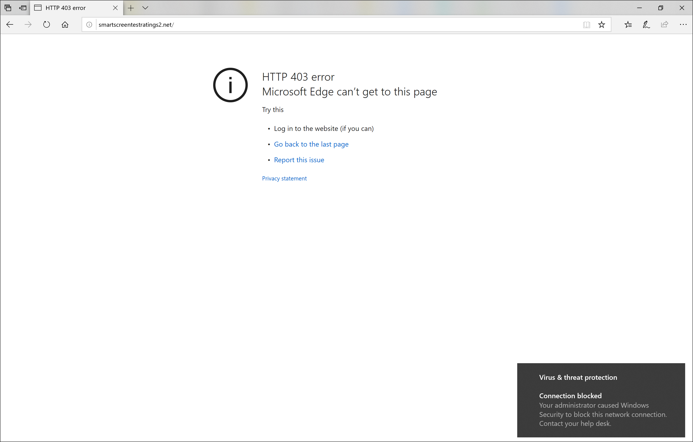
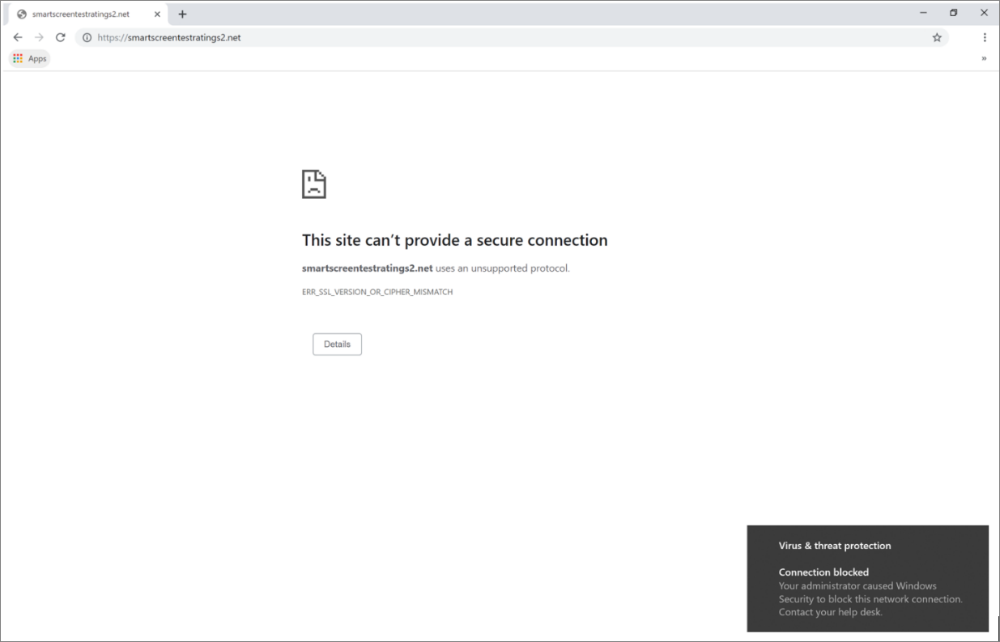

# 웹 위협에 대응

[!INCLUDE [Microsoft 365 Defender rebranding](../../includes/microsoft-defender.md)]

**적용 대상:**
- [엔드포인트용 Microsoft Defender](https://go.microsoft.com/fwlink/p/?linkid=2154037)
- [Microsoft 365 Defender](https://go.microsoft.com/fwlink/?linkid=2118804)

> 엔드포인트용 Microsoft Defender를 경험하고 싶으신가요? [무료 평가판을 신청하세요.](https://signup.microsoft.com/create-account/signup?products=7f379fee-c4f9-4278-b0a1-e4c8c2fcdf7e&ru=https://aka.ms/MDEp2OpenTrial?ocid=docs-wdatp-main-abovefoldlink&rtc=1)

끝점용 Microsoft Defender의 웹 보호를 사용하면 사용자 지정 표시기 목록에서 악성 웹 사이트 및 웹 사이트와 관련된 경고를 효율적으로 조사하고 대응할 수 있습니다.

## 웹 위협 경고 보기

끝점용 Microsoft Defender는  악성 또는 의심스러운 웹 활동에 대해 다음 경고를 생성합니다.

- **네트워크 보호에** 의해 차단된 의심스러운 연결: 이 경고는 차단 모드에서 네트워크 보호에 의해 사용자  지정 표시기 목록의 악성 웹 사이트 또는 웹 사이트에 액세스하려는 시도가 중지될 때 *생성됩니다.*
- **네트워크 보호에서** 감지된 의심스러운 연결: 이 경고는 감사 전용 모드에서 네트워크 보호를 통해 사용자 지정 표시기 목록의 악성 웹 사이트 또는 웹 사이트에 액세스하려는 시도가 감지될 때 *생성됩니다.*

각 경고는 다음 정보를 제공합니다.

- 차단된 웹 사이트에 액세스하려고 시도한 장치
- 웹 요청을 보내는 데 사용되는 응용 프로그램 또는 프로그램
- 사용자 지정 표시기 목록의 악의적인 URL 또는 URL
- 응답자에 대한 권장 작업

> [!NOTE]
> 경고 볼륨을 줄이기 위해 끝점용 Microsoft Defender는 매일 동일한 장치에서 동일한 도메인에 대한 웹 위협 감지를 단일 경고로 통합합니다. 하나의 경고만 생성되어 웹 보호 보고서 [에 계산됩니다.](web-protection-monitoring.md)

## 웹 사이트 세부 정보 검사

경고에서 웹 사이트의 URL 또는 도메인을 선택하여 더 깊이 있는 검색을 할 수 있습니다. 그러면 다음을 비롯한 다양한 정보가 있는 해당 특정 URL 또는 도메인에 대한 페이지가 열립니다.

- 웹 사이트에 액세스하려고 시도한 장치
- 웹 사이트와 관련된 인시던트 및 알림
- 조직의 이벤트에 웹 사이트가 얼마나 자주 나타날 수 있습니다.

    

[URL 또는 도메인 엔터티 페이지에 대해 자세히 알아보세요.](investigate-domain.md)

## 장치 검사

차단된 URL에 액세스하려고 시도한 장치를 확인할 수 있습니다. 경고 페이지에서 디바이스 이름을 선택하면 장치에 대한 포괄적인 정보가 있는 페이지가 열립니다.

[장치 엔터티 페이지에 대한 자세한 내용은](investigate-machines.md)

## 웹 브라우저 및 Windows 사용자에 대한 알림

Endpoint용 Microsoft Defender의 웹 보호를 통해 최종 사용자는 웹 사이트 또는 기타 브라우저를 사용하여 악성 또는 원치 않는 웹 Microsoft Edge 방지할 수 있습니다. 차단은 네트워크 보호에서 [수행하기](network-protection.md)때문에 웹 브라우저에서 일반 오류가 표시됩니다. 또한 사용자로부터 알림이 Windows.

 *웹에서 차단된 웹 Microsoft Edge*

 *Chrome에서 차단된 웹 위협*

## 관련 항목

- [웹 보호 개요](web-protection-overview.md)
- [웹 컨텐츠 필터링](web-content-filtering.md)
- [웹 위협 방지](web-threat-protection.md)
- [웹 보안 모니터링](web-protection-monitoring.md)
