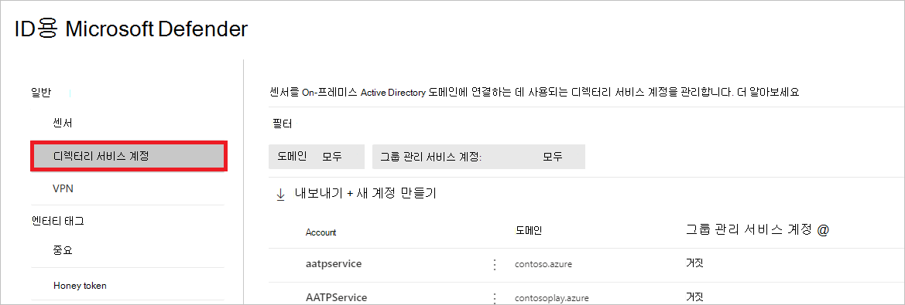
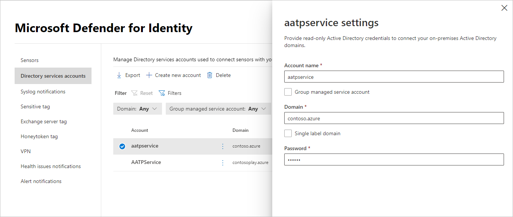

# Microsoft Defender for Identity Directory Services 계정 Microsoft 365 Defender

**적용 대상:**

- Microsoft 365 Defender
- ID용 Defender

이 문서에서는 에서 Id 디렉터리 서비스용 [Microsoft Defender](/defender-for-identity) 계정을 구성하는 [Microsoft 365 Defender.](/microsoft-365/security/defender/overview-security-center)

>[!IMPORTANT]
>Id와의 수렴의 일부로 Microsoft 365 Defender Id 포털의 해당 위치에서 일부 옵션 및 세부 정보가 변경됩니다. 익숙한 기능과 새로운 기능을 모두 찾을 수 있는 위치를 확인하시기 바랍니다.

## 디렉터리 서비스 계정 구성

센서를  Active Directory 도메인에 연결하려면 디렉터리 서비스 계정을 구성해야 합니다.

1. 에서 <a href="https://go.microsoft.com/fwlink/p/?linkid=2077139" target="_blank">Microsoft 365 Defender</a>에서  설정 **ID로 이동합니다.**

    

1. 디렉터리 **서비스 계정을 선택합니다.** 어떤 계정이 어떤 도메인과 연결되는지 볼 수 있습니다.

    

1. 계정을 선택하면 해당 계정에 대한 설정이 있는 창이 열립니다.

    

1. 새 디렉터리 서비스 계정을 추가하려면 새 계정 만들기를 **선택하고** 계정 **이름,** **도메인** 및 암호를 **입력합니다.** gMSA(그룹 관리 서비스 **계정)의** 경우와 단일 레이블 도메인에 속하는지 선택할 **수도 있습니다.**

    

1. **저장** 을 선택합니다.

## 참고 항목

- [Microsoft Defender for Identity 센서 상태 및 설정](sensor-health.md)
