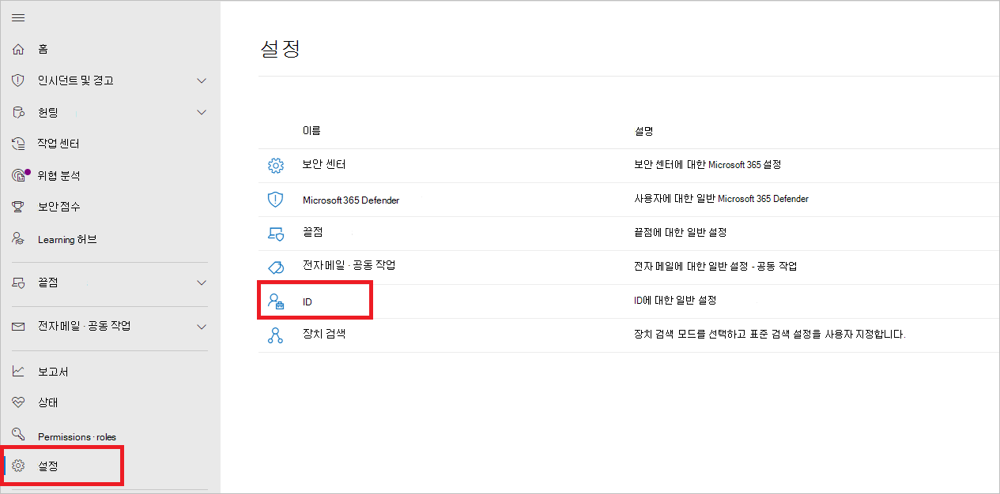
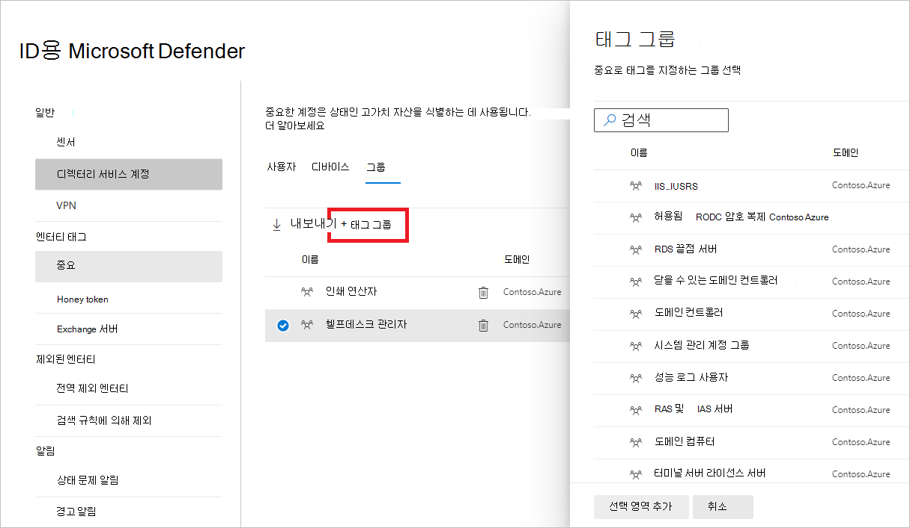
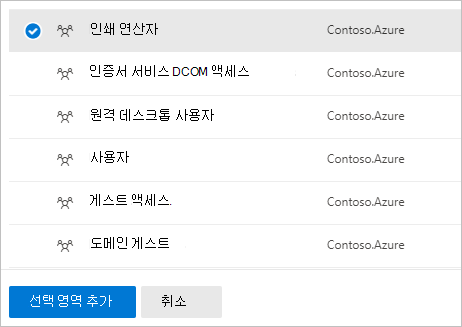

# Id 엔터티 태그에 대한 defender Microsoft 365 Defender

**적용 대상:**

- Microsoft 365 Defender
- ID용 Defender

이 문서에서는 에서 Id에 대한 [Microsoft Defender 엔터티](/defender-for-identity) 태그를 적용하는 [Microsoft 365 Defender.](/microsoft-365/security/defender/overview-security-center)

>[!IMPORTANT]
>Id와의 수렴의 일부로 Microsoft 365 Defender Id 포털의 해당 위치에서 일부 옵션 및 세부 정보가 변경됩니다. 익숙한 기능과 새로운 기능을 모두 찾을 수 있는 위치를 확인하시기 바랍니다.

## 엔터티 태그

이 Microsoft 365 Defender Id 엔터티 태그에 대해 세 가지 유형의 Defender( **중요** 태그, **Honeytoken** 태그 및 서버 태그 **)를** Exchange 수 있습니다.

이러한 태그를 설정하기 <a href="https://go.microsoft.com/fwlink/p/?linkid=2077139" target="_blank">위해</a>Microsoft 365 Defender 에서 설정  **ID로 이동합니다.**

태그 설정은 엔터티 태그 **아래에 표시됩니다.**

각 태그 유형을 설정하기 위해 아래 지침을 따릅니다.

## 중요한 태그

중요 **태그는** 높은 가치 자산을 식별하는 데 사용됩니다. 측면 이동 경로는 엔터티의 민감도 상태에도 의존합니다. 일부 엔터티는 Id에 대한 Defender에서 자동으로 중요한 것으로 간주됩니다. 이러한 자산 목록은 중요한 엔터티 [를 참조하세요.](/defender-for-identity/manage-sensitive-honeytoken-accounts#sensitive-entities)

사용자, 장치 또는 그룹을 중요한 것으로 수동으로 태그를 지정할 수도 있습니다.

1. 중요 **를 선택합니다.** 그러면 기존 중요한 **사용자,** 장치 **및** 그룹이 볼 **수 있습니다.**

    

1. 각 범주에서 **태그...를** 선택하여 해당 엔터티 유형에 태그를 지정합니다. 예를 들어 그룹 **아래에서** 태그 **그룹을 선택합니다.** 창이 태그로 선택할 수 있는 그룹과 함께 열립니다. 그룹을 검색하기 위해 검색 상자에 해당 이름을 입력합니다.

    

1. 그룹을 선택하고 선택 영역 **추가를 클릭합니다.**

    

## Honeytoken 태그

Honeytoken 엔터티는 악의적인 공격자에 대한 트래핑으로 사용됩니다. 이러한 허니투게 엔터티와 연결된 모든 인증은 경고를 트리거합니다.

중요한 계정에 태그를 지정하는 방식으로 **Honeytoken** 태그를 사용하여 사용자 또는 장치에 태그를 지정할 수 있습니다.

1. **Honeytoken 을 선택합니다.** 그런 다음 기존 허니투게한 사용자 및 **장치 를** **볼 수 있습니다.**

    

1. 각 범주에서 **태그...를** 선택하여 해당 엔터티 유형에 태그를 지정합니다. 예를 들어 사용자 **아래에서** 사용자 **태그를 선택합니다.** 창이 태그로 선택할 수 있는 그룹과 함께 열립니다. 그룹을 검색하기 위해 검색 상자에 해당 이름을 입력합니다.

    

1. 사용자를 선택하고 선택 영역 **추가를 클릭합니다.**

    

## Exchange 서버 태그

ID에 대한 defender는 Exchange 서버를 높은 가치의 자산으로 고려하고 자동으로 중요 으로 **태그를 지정합니다.** 장치를 수동으로 서버에 태그를 Exchange 있습니다.

1. 서버 **Exchange 선택합니다.** 그런 다음 기존 디바이스에 서버 태그로 레이블이 **Exchange** 표시됩니다.

    

1. 디바이스를 Exchange 태그를 지정하려면 디바이스 **태그를 선택합니다.**  태그를 지정하기 위해 선택할 수 있는 장치와 함께 창이 열립니다. 장치를 검색하려면 검색 상자에 해당 이름을 입력합니다.

    

1. 장치를 선택하고 선택 영역 **추가를 클릭합니다.**

    

## 참고 항목

- [ID 보안 경고에 대한 Defender 관리](manage-security-alerts.md)
