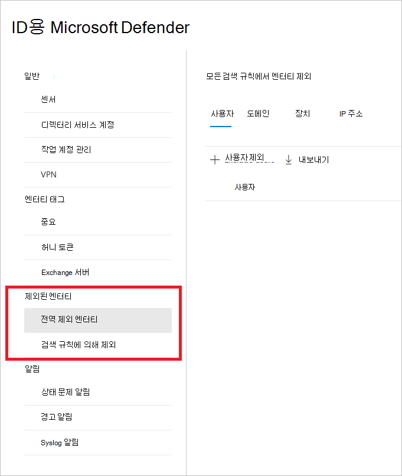
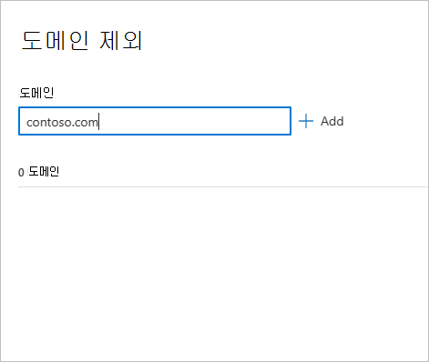

# Configure Defender for Identity detection exclusions in Microsoft 365 Defender(미리 보기)

**적용 대상:**

- Microsoft 365 Defender
- ID용 Defender

이 문서에서는 에서 Id 검색 제외에 대해 [Microsoft Defender를](/defender-for-identity) 구성하는 [Microsoft 365 Defender.](/microsoft-365/security/defender/overview-security-center)

> [!IMPORTANT]
> Id와의 수렴의 일부로 Microsoft 365 Defender Id 포털의 해당 위치에서 일부 옵션 및 세부 정보가 변경됩니다. 익숙한 기능과 새로운 기능을 모두 찾을 수 있는 위치를 확인하시기 바랍니다.

[!INCLUDE [Product long](includes/product-long.md)] 여러 검색에서 특정 IP 주소, 컴퓨터, 도메인 또는 사용자를 제외할 수 있습니다.

예를 들어 **DNS를** 검사 메커니즘으로 사용하는 보안 검색 프로그램을 통해 DNS 정비 경고를 트리거할 수 있습니다. 제외를 만들면 Id에 대한 Defender가 이러한 스캐너를 무시하고 가긍성을 줄이는 데 도움이 됩니다.

>[!NOTE]
>DNS 경고를 통해  의심스러운 통신을 사용하는 가장 일반적인 도메인 중 고객이 경고에서 가장 많이 제외한 도메인을 관찰했습니다. 이러한 도메인은 기본적으로 제외 목록에 추가되지만 쉽게 제거할 수 있는 옵션이 있습니다.

## 검색 제외를 추가하는 방법

1. 에서 [Microsoft 365 Defender](https://security.microsoft.com/)에서  설정 **ID로 이동합니다.**

    

1. 그런 다음 왼쪽  메뉴에 제외된 엔터티가 표시됩니다.

    

그런 다음 검색 규칙의 제외 및  전역 제외 엔터티의 두 가지 방법으로 제외를 설정할 **수 있습니다.**

## 검색 규칙에 의해 제외

1. 왼쪽 메뉴에서 검색 규칙에 **따라 제외를 선택합니다.** 검색 규칙 목록이 표시됩니다.

    

1. 구성할 각 검색에 대해 다음 단계를 수행합니다.

    1. 규칙을 선택합니다. 검색 표시줄을 사용하여 검색을 검색할 수 있습니다. 선택한 경우 검색 규칙 세부 정보가 있는 창이 열립니다.

        

    1. 제외를 추가하려면 제외된 엔터티  단추를 선택한 다음 제외 유형을 선택합니다. 각 규칙에 대해 서로 다른 제외된 엔터티를 사용할 수 있습니다. 여기에는 사용자, 장치, 도메인 및 IP 주소가 포함됩니다. 이 예에서는 장치 제외  및 IP 주소 **제외를 선택할 수 있습니다.**

        

    1. 제외 유형을 선택한 후 제외를 추가할 수 있습니다. 창이 열리면 **+** 제외를 추가할 단추를 선택합니다.

        

    1. 그런 다음 제외할 엔터티를 추가합니다. **+ 추가를 선택하여** 목록에 엔터티를 추가합니다.

        

    1. 그런 다음 **IP** 주소 제외(이 예에서는)를 선택하여 제외를 완료합니다.

        

    1. 제외를 추가한 후 제외된 엔터티 단추로 돌아가 목록을 내보내거나 제외를 제거할 **수** 있습니다. 이 예제에서는 디바이스 **제외로 돌아 했습니다.** 목록을 내보내기 위해 아래쪽 화살표 단추를 선택합니다.

        

    1. 제외를 삭제하려면 제외를 선택하고 휴지통 아이콘을 선택합니다.

        

## 전역 제외 엔터티

이제 전역 제외 엔터티에 의해 제외를 **구성할 수도 있습니다.** 전역 제외를 사용하면 ID에 대한 Defender가 가지는 모든 검색에서 제외할 특정 엔터티(IP 주소, 서브넷, 장치 또는 도메인)를 정의할 수 있습니다. 예를 들어 장치를 제외하는 경우 디바이스 식별이 검색의 일부로 있는 검색에만 적용됩니다.

1. 왼쪽 메뉴에서 전역 제외 엔터티 **를 선택합니다.** 제외할 수 있는 엔터티의 범주가 표시될 것입니다.

    

1. 제외 유형을 선택 합니다. 이 예에서는 도메인 **제외를 선택했습니다.**

    

1. 제외할 도메인을 추가할 수 있는 창이 열립니다. 제외할 도메인을 추가합니다.

    

1. 도메인이 목록에 추가됩니다. 제외를 **완료하려면** 도메인 제외를 선택합니다.

    

1. 그런 다음 모든 검색 규칙에서 제외할 엔터티 목록에 도메인이 표시됩니다. 목록을 내보내거나 엔터티를 선택하고 제거 단추를 클릭하여 엔터티를 제거할 **수** 있습니다.

    

## 기타 참고 항목

- [ID 보안 경고에 대한 Defender 관리](manage-security-alerts.md)
