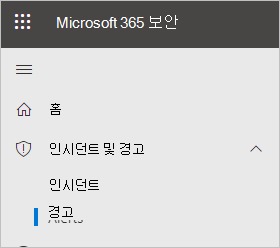
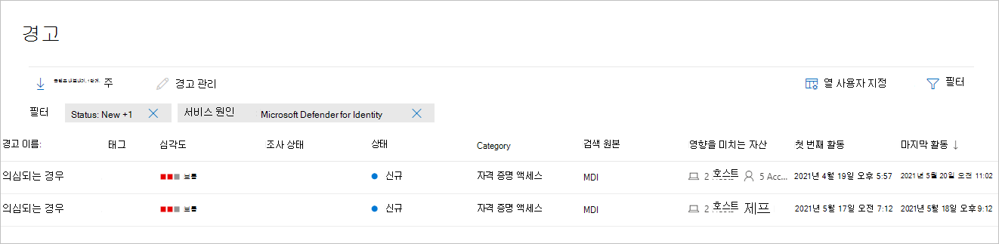
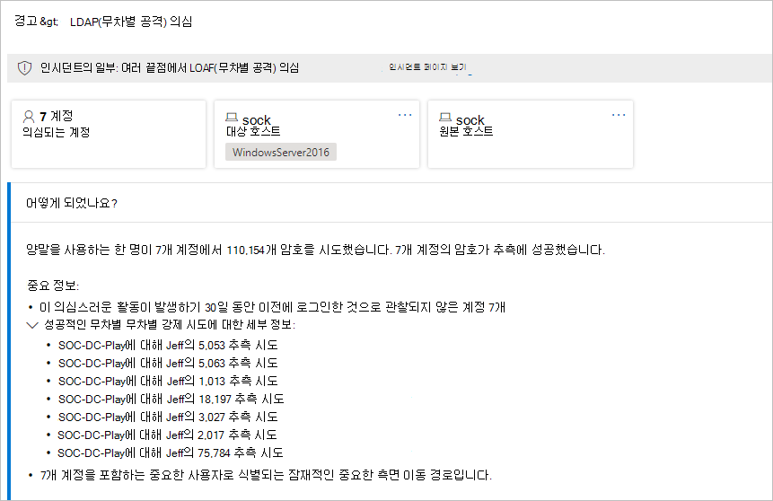
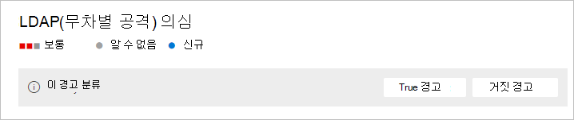
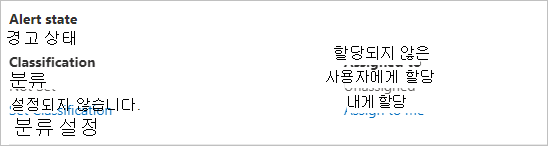
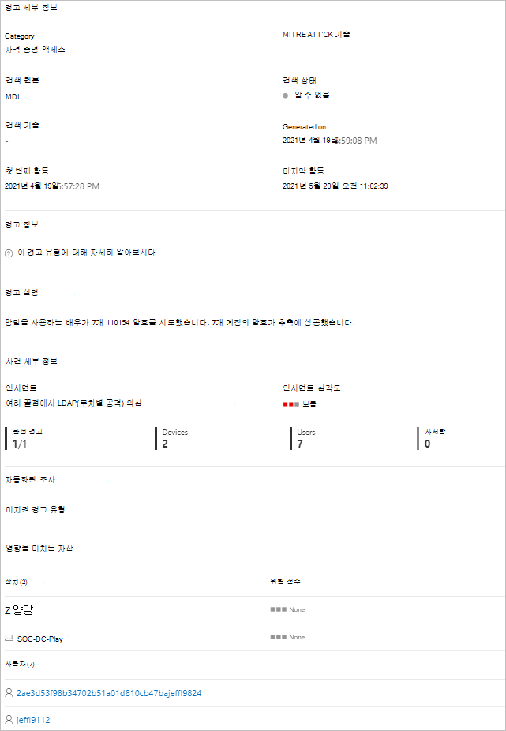
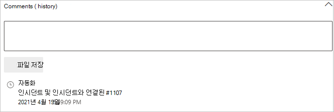
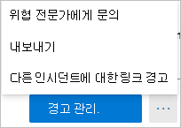

# 2013의 ID 보안 경고에 대한 Microsoft 365 Defender

**적용 대상:**

- Microsoft 365 Defender
- ID용 Defender

이 문서에서는 에서 [Microsoft Defender for Identity](/defender-for-identity) 보안 경고와 함께 작업하는 방법의 기본 [Microsoft 365 Defender.](/microsoft-365/security/defender/overview-security-center)

ID 경고에 대한 Defender는 기본적으로 전용 MICROSOFT 365 DEFENDER <a href="https://go.microsoft.com/fwlink/p/?linkid=2077139" target="_blank">페이지</a> 형식과 통합됩니다. 이는 에 전체 [Microsoft Defender for Identity](/defender-for-identity/defender-for-identity-in-microsoft-365-defender)환경을 도입하는 여정의 첫 번째 Microsoft 365 Defender.

새 ID 경고 페이지에서는 Microsoft Defender for Identity 고객에게 도메인 간 신호 향상 및 새로운 자동화된 ID 응답 기능을 제공합니다. 보안 유지를 보장하고 보안 작업의 효율성을 개선하는 데 도움이 됩니다.

Microsoft Defender for [Identity](/microsoft-365/security/defender/microsoft-365-defender) 경고는 Microsoft 365 Defender 통해 경고를 조사할 때의 이점 중 하나는 제품군의 각 다른 제품에서 얻은 정보와 추가로 상호 관련이 있습니다. 이러한 향상된 경고는 microsoft Defender for Microsoft 365 Defender 및 [끝점용 Microsoft Defender에서](/microsoft-365/security/office-365-security) Office 365 경고 형식과 [일치합니다.](/microsoft-365/security/defender-endpoint) 새 페이지에서는 ID와 관련된 경고를 조사하기 위해 다른 제품 포털로 이동할 필요가 없습니다.

ID에 대한 Defender에서 시작된 경고는 이제 경고를 자동으로 수정하고 의심스러운 활동에 기여할 수 있는 도구 및 프로세스의 완화를 포함하여 MICROSOFT 365 DEFENDER 자동화된 조사 및 [대응(AIR)](/microsoft-365/security/defender/m365d-autoir) 기능을 트리거할 수 있습니다.

> [!IMPORTANT]
> Id와의 수렴의 일부로 Microsoft 365 Defender Id 포털의 해당 위치에서 일부 옵션 및 세부 정보가 변경됩니다. 익숙한 기능과 새로운 기능을 모두 찾을 수 있는 위치를 확인하시기 바랍니다.

## 보안 경고 검토

경고 페이지, 인시던트 페이지,  개별 장치의  페이지 및 고급 헌팅 페이지를 비롯한 여러 위치에서 경고에 액세스할 **수** 있습니다.  이 예제에서는 경고 페이지를 **검토합니다.**

에서 <a href="https://go.microsoft.com/fwlink/p/?linkid=2077139" target="_blank">Microsoft 365 Defender</a> **인시던트 알림으로 & 경고로** **이동한 다음 으로 이동합니다.**

ID에 대한 Defender의 경고를 확인하려면 오른쪽 위에 있는  필터를 선택한 다음 서비스 원본에서 ID에 **대한 Microsoft Defender를** 선택하고 **적용을 선택합니다.**

경고는 경고 이름, 태그, **심각도,** 조사  **상태,** **상태,** **범주,** 검색 **원본,** 영향 있는 **자산,** 첫 번째 활동 및 마지막 활동 열의 정보와 함께 **표시됩니다.** 

## 경고 관리

경고 중 하나에 대한 **경고** 이름을 클릭하면 경고에 대한 세부 정보가 있는 페이지로 이동합니다. 왼쪽 창에는 발생된 일에 대한 **요약이 있습니다.**

진행 **중 상자** 위에는 경고의 **계정,** **대상** 호스트 및 원본 호스트에 **대한** 단추가 있습니다. 다른 경고의 경우 추가 호스트, 계정, IP 주소, 도메인 및 보안 그룹에 대한 자세한 내용은 단추가 표시될 수 있습니다. 관련된 엔터티에 대한 자세한 내용을 확인하려면 해당 엔터티를 선택합니다.

오른쪽 창에 경고 세부 정보가 **표시됩니다.** 여기에서 자세한 내용을 보고 여러 작업을 수행할 수 있습니다.

- **이 경고 분류** - 여기에서 이 경고를 True 경고 또는 거짓 **경고로 지정할** **수 있습니다.**

    

- **경고 상태** - **분류 설정에서** 경고를 True 또는 **False로** 분류할 **수 있습니다.** 할당된 **에서** 경고를 직접 할당하거나 할당을 해지할 수 있습니다.

    

- **경고** 세부 정보 - 경고 세부 정보에서 특정 경고에 대한 자세한 정보를 찾고, 경고 유형에 대한 설명서 링크를 따라가고, 경고가 연결된 인시던트 확인, 이 경고 유형에 연결된 자동화된 조사를 검토하고, 영향을 미치는 장치 및 사용자를 볼 수 있습니다.

    

- **설명 &** 기록 - 여기에서 경고에 의견을 추가하고 경고와 연결된 모든 작업의 기록을 볼 수 있습니다.

    

- 경고 관리 - 경고 관리를 선택하면 다음을 편집할 수 있는 창으로 이동하게 **됩니다.**
  - **상태** - 새로, 해결 **또는** 진행 **중 을 선택할 수 있습니다.** 
  - **분류** - True 경고 **또는 거짓 경고를** **선택할 수 있습니다.**
  - **설명** - 경고에 대한 설명을 추가할 수 있습니다.

    경고 관리 옆에 있는 세 개의 점을 선택하면 위협 전문가에게 **문의,** 경고를 Excel 파일로 내보내기 또는 다른 인시던트에 연결 을 선택할 **수 있습니다.** 

    

    > [!NOTE]
    > 이제 Excel 파일에서 두 개의 링크를 사용할 수 있습니다. **Id에 대한 Microsoft Defender의** 보기 및 **보기의** Microsoft 365 Defender. 각 링크는 관련 포털로 이동하고 경고에 대한 정보를 제공합니다.

## 참고 항목

- [2013에서 경고 Microsoft 365 Defender](../defender/investigate-alerts.md)
