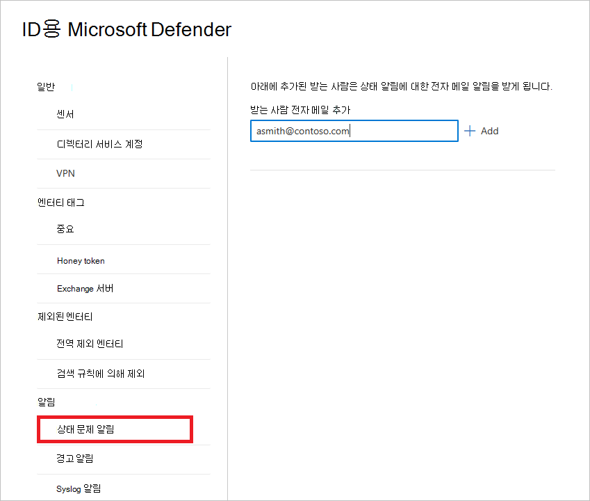
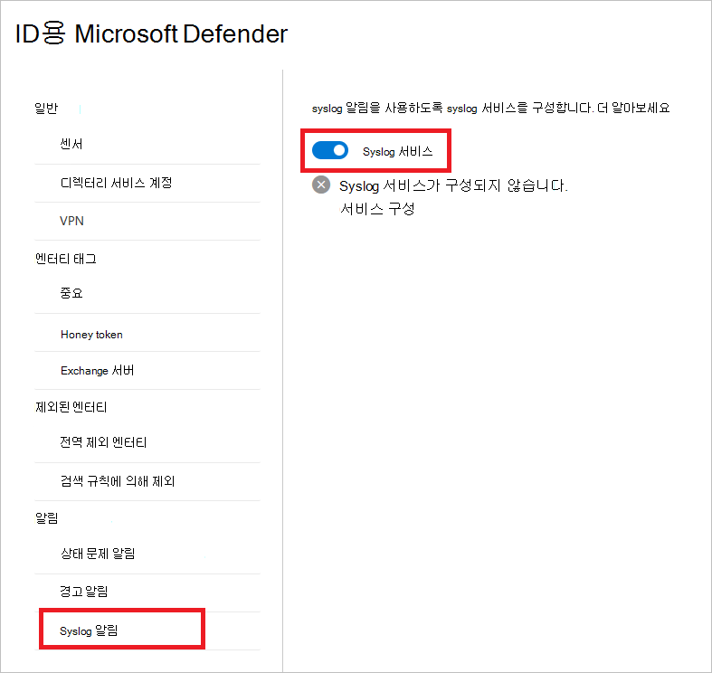

# 2013의 ID 알림에 대한 defender Microsoft 365 Defender

**적용 대상:**

- Microsoft 365 Defender
- ID용 Defender

이 문서에서는 에서 [Microsoft Defender for Identity](/defender-for-identity) 알림과 함께 작업하는 [Microsoft 365 Defender.](/microsoft-365/security/defender/overview-security-center)

> [!IMPORTANT]
> Id와의 수렴의 일부로 Microsoft 365 Defender Id 포털의 해당 위치에서 일부 옵션 및 세부 정보가 변경됩니다. 익숙한 기능과 새로운 기능을 모두 찾을 수 있는 위치를 확인하시기 바랍니다.

## 상태 문제 알림

다음 Microsoft 365 Defender Id에 대한 Defender의 상태 문제 전자 메일 알림에 대한 받는 사람을 추가할 수 있습니다.

1. 에서 [Microsoft 365 Defender](https://security.microsoft.com/)에서  설정 **ID로 이동합니다.**

    

1. 상태 **문제 알림 을 선택합니다.**

1. 받는 사람의 전자 메일 주소를 입력합니다. **추가** 를 선택합니다.

    

1. ID에 대한 Defender가 상태 문제를 감지하면 받는 사람은 세부 정보가 있는 전자 메일 알림을 받게 됩니다.

    

    > [!NOTE]
    > 이 전자 메일은 이 문제를 자세히 설명하는 두 개의 링크를 제공합니다. **MDI** 상태 센터 또는 **M365D의** 새 상태 센터로 이동하면 될 수 있습니다.

## 경고 알림

검색된 Microsoft 365 Defender 전자 메일 알림에 대한 받는 사람을 추가할 수 있습니다.

1. 에서 [Microsoft 365 Defender](https://security.microsoft.com/)에서  설정 **ID로 이동합니다.**

    

1. 알림 **을 선택합니다.**

1. 받는 사람의 전자 메일 주소를 입력합니다. **추가** 를 선택합니다.

    

## Syslog 알림

ID에 대한 Defender는 지명된 센서를 통해 Syslog 서버에 보안 및 상태 알림을 보내 의심스러운 활동을 감지할 때 이를 알릴 수 있습니다.

1. 에서 [Microsoft 365 Defender](https://security.microsoft.com/)에서  설정 **ID로 이동합니다.**

    

1. **Syslog 알림 을 선택합니다.**

1. syslog 알림을 사용하도록 설정하려면 **Syslog 서비스** 토글을 **설정 위치로** 설정해야 합니다.

    

1. 서비스 **구성 을 선택합니다.** syslog 서비스에 대한 세부 정보를 입력할 수 있는 창이 열립니다.

    

1. 다음 세부 정보를 입력합니다.

    - **센서** - 드롭다운 목록에서 경고를 보낼 센서를 선택합니다.
    - **서비스 끝점** 및 **포트** - syslog 서버의 IP 주소 또는 FQDN(정식 도메인 이름)을 입력하고 포트 번호를 지정합니다.
    - **Transport** -  전송 프로토콜(TCP 또는 UDP)을 선택합니다.
    - **Format** - 형식(RFC 3164 또는 RFC 5424)을 선택합니다.

1. 테스트 **SIEM 알림 보내기** 를 선택한 다음 Syslog 인프라 솔루션에서 메시지가 수신된지 확인을 선택합니다.

1. **저장** 을 선택합니다.

1. Syslog 서비스를 구성한 후 **Syslog** 서버로 보낼 알림 유형(경고 또는 상태 문제)을 선택할 수 있습니다.

    

## 참고 항목

- [ID 보안 경고에 대한 Defender 관리](manage-security-alerts.md)
