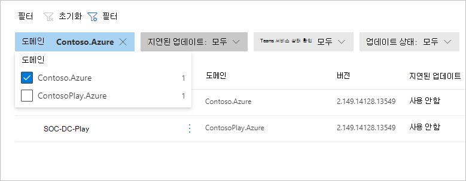
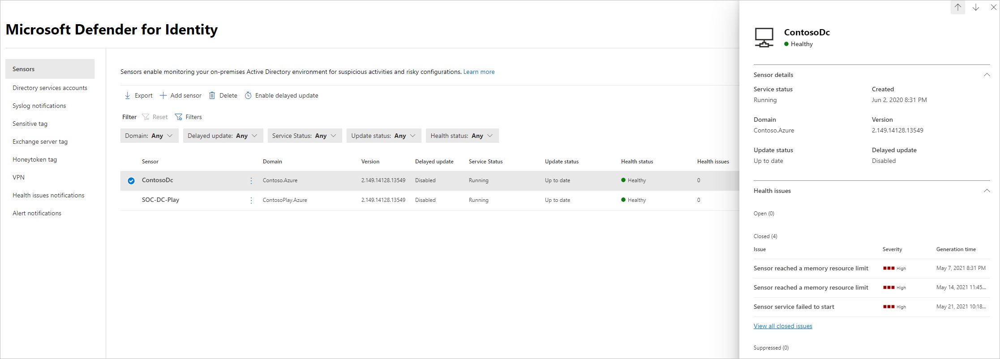
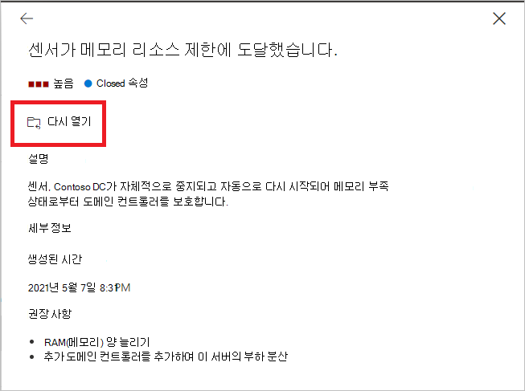
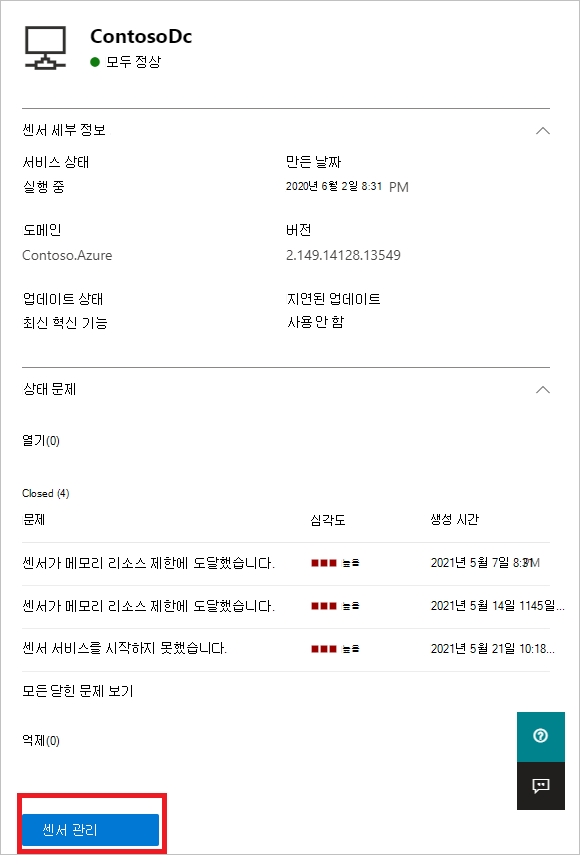
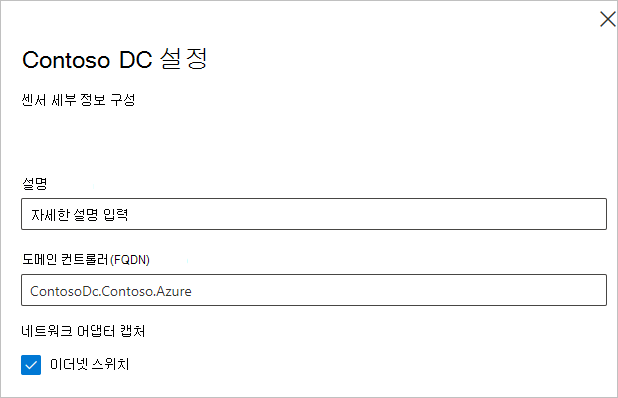
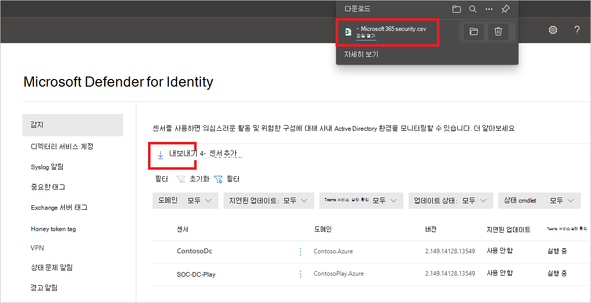
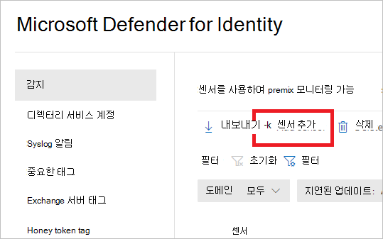
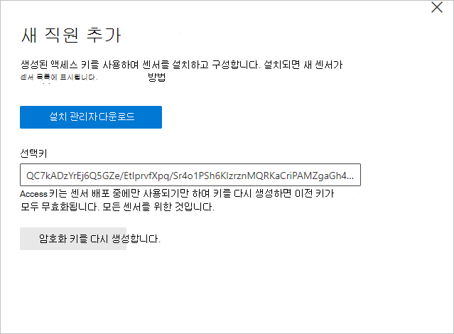

# Microsoft Defender for Identity 센서 상태 및 설정 Microsoft 365 Defender

**적용 대상:**

- Microsoft 365 Defender
- ID용 Defender

이 문서에서는 에서 [Microsoft Defender에서](/defender-for-identity) ID 센서를 [구성하고 모니터링하는 Microsoft 365 Defender.](/microsoft-365/security/defender/overview-security-center)

>[!IMPORTANT]
>Id와의 수렴의 일부로 Microsoft 365 Defender Id 포털의 해당 위치에서 일부 옵션 및 세부 정보가 변경됩니다. 익숙한 기능과 새로운 기능을 모두 찾을 수 있는 위치를 확인하시기 바랍니다.

## ID 센서 설정 및 상태에 대한 Defender 보기

1. 에서 <a href="https://go.microsoft.com/fwlink/p/?linkid=2077139" target="_blank">Microsoft 365 Defender</a>에서  설정 **ID로 이동합니다.**

    

1. ID **센서에** 대한 모든 Defender를 표시하는 센서 페이지를 선택합니다. 각 센서에 대해 이름, 도메인 멤버 자격, 버전 번호, 업데이트가 지연되는 경우, 서비스 상태, 업데이트 상태, 상태, 상태 문제 수 및 센서를 만든 시간이 표시됩니다.

    

    >[!NOTE]
    >ID용 Defender 포털에서 센서 설정 및 상태 정보는 별도의 위치에 있습니다. 이 Microsoft 365 Defender 동일한 페이지에 있습니다.

1. 필터를 **선택하는** 경우 사용할 수 있는 필터를 선택할 수 있습니다. 그런 다음 각 필터를 사용하여 표시할 센서를 선택할 수 있습니다.

    

    

1. 센서 중 하나를 선택하면 센서 및 해당 상태에 대한 정보가 있는 창이 표시됩니다.

    

1. 상태 문제를 선택하면 해당 문제에 대한 자세한 정보가 있는 창이 있습니다. 닫힌 문제를 선택하면 여기에서 다시 열 수 있습니다.

    

1. 센서 관리를 **선택하면** 센서 세부 정보를 구성할 수 있는 창이 열립니다.

    

    

1. 센서 **페이지에서** 내보내기 를 선택하여 센서 목록을 .csv 수 **있습니다.**

    

## 센서 추가

센서 **페이지에서** 새 센서를 추가할 수 있습니다.

1. 센서 **추가를 선택합니다.**

    

1. 창이 열리며 센서 설치 관리자 및 생성된 선택키를 다운로드할 수 있는 단추를 제공합니다.

    

1. 설치 **관리자 다운로드를 선택하여** 패키지를 로컬로 저장합니다. zip 파일에는 다음 파일이 포함됩니다.

    - Id용 Defender 센서 설치 관리자

    - ID용 Defender 클라우드 서비스에 연결하는 데 필요한 정보가 있는 구성 설정 파일

1. Access 키를 **복사합니다.** ID용 Defender 센서가 ID 인스턴스에 대한 Defender에 연결하려면 선택키가 필요합니다. 이 액세스 키는 센서 배포를 위한 일회용 암호로, 인증 및 TLS 암호화를 위해 인증서를 사용하여 모든 통신이 수행됩니다. 새 **선택키를** 다시 생성해야 하는 경우 Regenerate 키 단추를 사용하세요. 이전에 배포된 센서에는 영향을 주지 않습니다. 센서는 센서의 초기 등록에만 사용되지 않습니다.

1. ID용 Defender 센서를 설치하는 전용 서버 또는 도메인 컨트롤러에 패키지를 복사합니다.

## 참고 항목

- [ID 보안 경고에 대한 Defender 관리](manage-security-alerts.md)
