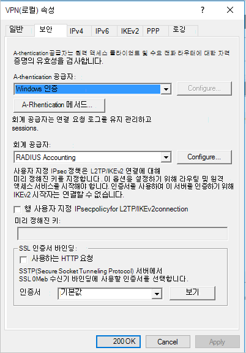
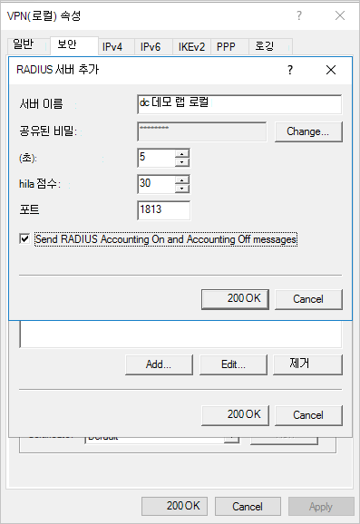
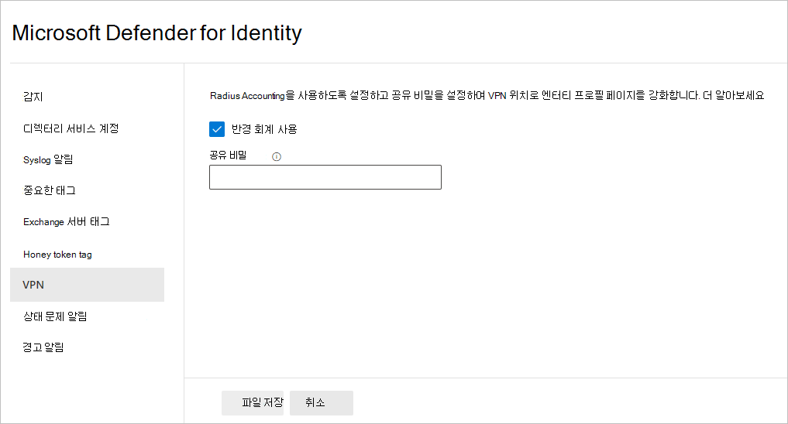

# ID VPN 통합을 위한 Defender Microsoft 365 Defender

**적용 대상:**

- Microsoft 365 Defender
- ID용 Defender

이 문서에서는 에서 VPN과 [ID에 대한 Microsoft Defender를](/defender-for-identity) [통합하는 Microsoft 365 Defender.](/microsoft-365/security/defender/overview-security-center)

>[!IMPORTANT]
>Id와의 수렴의 일부로 Microsoft 365 Defender 일부 옵션 및 세부 사항은 ID용 Defender 포털의 해당 위치에서 변경했습니다.  익숙한 기능과 새로운 기능을 모두 찾을 수 있는 위치를 확인하시기 바랍니다.

[!INCLUDE [Product long](includes/product-long.md)] 는 VPN 솔루션에서 회계 정보를 수집할 수 있습니다. 이 구성 시 사용자의 프로필 페이지에는 VPN 연결의 정보(예: 연결이 시작된 IP 주소 및 위치)가 포함됩니다. 이 기능은 비정상 VPN 연결에 대한 새로운 검색뿐만 아니라 사용자 활동에 대한 추가 정보를 제공하여 조사 프로세스를 보완합니다. 위치에 대한 외부 IP 주소를 확인하기 위한 호출은 익명입니다. 이 호출에는 개인 식별자가 전송되지 않습니다.

[!INCLUDE [Product short](includes/product-short.md)] 센서로 전달된 RADIUS 회계 이벤트를 수신하여 VPN 솔루션과 [!INCLUDE [Product short](includes/product-short.md)] 통합합니다. 이 메커니즘은 표준 RADIUS[Accounting(RFC 2866)을](https://tools.ietf.org/html/rfc2866)기반으로 하며 다음 VPN 공급업체가 지원됩니다.

- Microsoft
- F5
- 검사점
- Cisco ASA

## 필수 조건

VPN 통합을 사용하도록 설정하려면 다음 매개 변수를 설정해야 합니다.

- 센서 및/또는 독립 실행형 센서에서 포트 UDP 1813을 [!INCLUDE [Product short](includes/product-short.md)] [!INCLUDE [Product short](includes/product-short.md)] 여는 경우.

> [!NOTE]
>
> - **Radius Accounting을** 사용하도록 설정하면 센서가 Sensor라는 미리 프로비전된 Windows 방화벽 정책을 사용하도록 설정하여 [!INCLUDE [Product short](includes/product-short.md)] 포트 UDP 1813에서 RADIUS Accounting을 허용합니다. **[!INCLUDE [Product long](includes/product-long.md)]**
> - FIPS(Federal Information Processing Standards)를 준수하는 환경에서는 VPN 통합이 지원되지 않습니다.

아래 예제에서는 Microsoft 라우팅 및 RRAS(원격 액세스 서버)를 사용하여 VPN 구성 프로세스를 설명합니다.

타사 VPN 솔루션을 사용하는 경우 해당 설명서에서 RADIUS Accounting을 사용하도록 설정하는 방법에 대한 지침을 참조하세요.

## VPN 시스템에서 RADIUS 회계 구성

RRAS 서버에서 다음 단계를 수행합니다.

1. 라우팅 **및 원격 액세스 콘솔을 열** 수 있습니다.
1. 서버 이름을 마우스 오른쪽 단추로 클릭하고 속성을 **선택합니다.**
1. 보안 **탭의** 회계 **공급자에서** **RADIUS 회계를 선택하고** 구성을 **선택합니다.**

    

1. **RADIUS 서버** 추가 창에  네트워크 연결이 있는 가장 가까운 센서의 서버 [!INCLUDE [Product short](includes/product-short.md)] 이름을 입력합니다. 고가용성을 위해 RADIUS 서버로 센서를 [!INCLUDE [Product short](includes/product-short.md)] 더 추가할 수 있습니다. **포트에서** 기본값인 1813이 구성되어 있는지 확인 **변경을** 선택하고 영문자 새 공유 비밀 문자열을 입력합니다. 새 공유 비밀 문자열은 구성 중에 나중에 작성해야 하기 때문에 해당 문자열을 [!INCLUDE [Product short](includes/product-short.md)] 메모해 두면 됩니다. **RADIUS 계정** 설정 및 계정 해제 메시지 보내기 확인란을 선택하고 열려 있는 모든 대화 상자에서 확인을 선택합니다. 

    

## ID에 대한 Defender에서 VPN 구성

[!INCLUDE [Product short](includes/product-short.md)] 컴퓨터가 네트워크에 연결되는 위치를 프로필로 작성하고 의심스러운 VPN 연결을 검색할 수 있는 VPN 데이터를 수집합니다.

2016에서 VPN 데이터를 [!INCLUDE [Product short](includes/product-short.md)] 구성 Microsoft 365 Defender.

1. 에서 <a href="https://go.microsoft.com/fwlink/p/?linkid=2077139" target="_blank">Microsoft 365 Defender</a>에서  설정 **ID로 이동합니다.**

    

1. **VPN 을 선택합니다.**
1. 반경 **회계 사용** 을  선택하고 이전에 RRAS VPN 서버에서 구성한 공유 비밀을 입력합니다. 그런 다음 **저장** 을 선택합니다.

    

이 기능을 사용하도록 설정하면 ID용 모든 Defender 센서가 RADIUS 회계 이벤트를 포트 1813에서 수신하고 VPN 설정이 완료됩니다.

ID용 Defender 센서가 VPN 이벤트를 수신하고 처리를 위해 ID 클라우드 서비스로 전송한 후 엔터티 프로필은 액세스한 고유한 VPN 위치와 프로필의 활동을 나타냅니다.

## 참고 항목

- [2013에서 경고 Microsoft 365 Defender](../defender/investigate-alerts.md)
