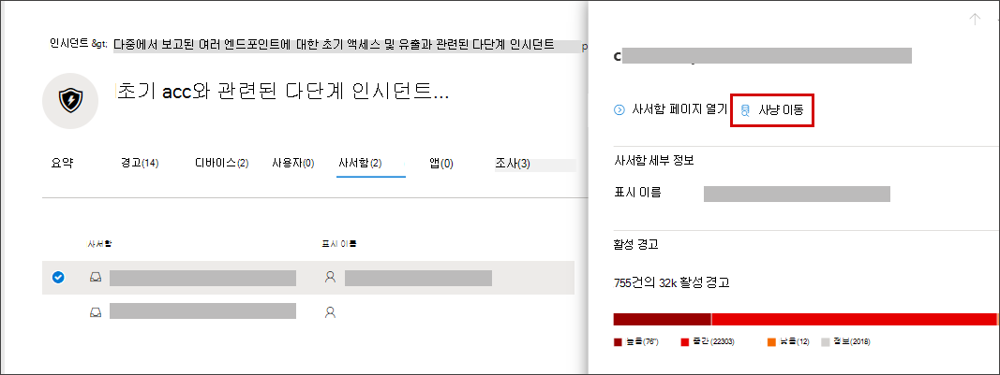

# <a name="quickly-hunt-for-entity-or-event-information-with-go-hunt"></a>이동 헌트로 엔터티 또는 이벤트 정보를 빠르게 헌팅

[!INCLUDE [Microsoft 365 Defender rebranding](../includes/microsoft-defender.md)]


**적용 대상:**
- Microsoft 365 Defender
- 끝점용 Microsoft Defender

이동 *헌트 작업을* 사용하면 강력한 쿼리 기반 고급 헌팅 기능을 사용하여 이벤트 및 다양한 엔터티 유형을 신속하게 조사할 [수](advanced-hunting-overview.md) 있습니다. 이 작업은 고급 헌팅 쿼리를 자동으로 실행하여 선택한 이벤트 또는 엔터티에 대한 관련 정보를 검색합니다.

이동 *헌트* 작업은 이벤트 또는 엔터티 세부 정보가 표시될 때마다 보안 센터의 다양한 섹션에서 사용할 수 있습니다. 예를 들어 다음 섹션에서 *이동 헌트* 기능을 사용할 수 있습니다.

- [인시던트 페이지에서](investigate-incidents.md#summary)인시던트와 관련된 사용자, 장치 및 기타 여러 엔터티에 대한 세부 정보를 검토할 수 있습니다. 엔터티를 선택하면 해당 엔터티에 대해 수행할 수 있는 다양한 작업뿐만 아니라 추가 정보도 얻을 수 있습니다. 아래 예에서는 사서함에 대한 세부 정보와 사서함에 대한 자세한 정보를 헌팅할 수 있는 옵션을 표시하는 사서함이 선택되어 있습니다.

    

- 인시던트 페이지에서 증거 탭의 엔터티 목록에 액세스할 수도 있습니다. 이러한 엔터티 중 하나를 선택하면 해당 엔터티에 대한 정보를 빠르게 찾을 수 있습니다.

    


- 디바이스의 타임라인을 볼 때 타임라인에서 이벤트를 선택하여 해당 이벤트에 대한 추가 정보를 볼 수 있습니다. 이벤트를 선택하면 고급 헌팅에서 다른 관련 이벤트를 헌팅할 수 있습니다.

    

이동 **헌트 또는** 헌트와 관련된 이벤트에 대한 헌트를 **선택하면** 엔터티 또는 이벤트를 선택 여부에 따라 다른 쿼리가 전달됩니다.

## <a name="query-for-entity-information"></a>엔터티 정보에 대한 쿼리
이동 *헌트에서* 사용자, 장치 또는 기타 엔터티 유형에 대한 정보를 쿼리할 때 쿼리는 해당 엔터티와 관련된 모든 이벤트에 대한 모든 관련 스마마 테이블을 확인합니다. 결과를 관리하기 위해 쿼리의 범위는 엔터티와 관련이 있으며 인시던트와 연관된 지난 30일 동안의 가장 빠른 활동과 같은 기간으로 지정됩니다.

다음은 장치에 대한 이동 헌트 쿼리의 예입니다.

```kusto
let selectedTimestamp = datetime(2020-06-02T02:06:47.1167157Z);
let deviceName = "fv-az770.example.com";
let deviceId = "device-guid";
search in (DeviceLogonEvents, DeviceProcessEvents, DeviceNetworkEvents, DeviceFileEvents, DeviceRegistryEvents, DeviceImageLoadEvents, DeviceEvents, DeviceImageLoadEvents, IdentityLogonEvents, IdentityQueryEvents)
Timestamp between ((selectedTimestamp - 1h) .. (selectedTimestamp + 1h))
and DeviceName == deviceName
// or RemoteDeviceName == deviceName
// or DeviceId == deviceId
| take 100
```
### <a name="supported-entity-types"></a>지원되는 엔터티 유형
다음 엔터티 유형을 선택한 후 *이동* 헌트 기능을 사용할 수 있습니다.

- 파일
- 전자 메일
- 전자 메일 클러스터
- 사서함
- 사용자
- 디바이스
- IP 주소
- URL

## <a name="query-for-event-information"></a>이벤트 정보 쿼리
이동 *헌트에서* 타임라인 이벤트에 대한 정보를 쿼리할 때 쿼리는 모든 관련 스마마 테이블에서 선택한 이벤트 시간의 다른 이벤트를 검사합니다. 예를 들어 다음 쿼리는 동일한 장치에서 같은 기간 동안 발생한 여러 가지 스마마 테이블의 이벤트를 나열합니다.

```kusto
// List relevant events 30 minutes before and after selected LogonAttempted event
let selectedEventTimestamp = datetime(2020-06-04T01:29:09.2496688Z);
search in (DeviceFileEvents, DeviceProcessEvents, DeviceEvents, DeviceRegistryEvents, DeviceNetworkEvents, DeviceImageLoadEvents, DeviceLogonEvents)
    Timestamp between ((selectedEventTimestamp - 30m) .. (selectedEventTimestamp + 30m))
    and DeviceId == "079ecf9c5798d249128817619606c1c47369eb3e"
| sort by Timestamp desc
| extend Relevance = iff(Timestamp == selectedEventTimestamp, "Selected event", iff(Timestamp < selectedEventTimestamp, "Earlier event", "Later event"))
| project-reorder Relevance
```

## <a name="adjust-the-query"></a>쿼리 조정
쿼리 언어에 대한 [지식이](advanced-hunting-query-language.md)있는 경우 쿼리를 기본 설정에 맞게 조정할 수 있습니다. 예를 들어 시간 창의 크기를 결정하는 이 줄을 조정할 수 있습니다.

```kusto
Timestamp between ((selectedTimestamp - 1h) .. (selectedTimestamp + 1h))
```

쿼리를 수정하여 보다 관련성 높은 결과를 얻을 수 있습니다.
- [결과를 차트로 보기](advanced-hunting-query-results.md#view-query-results-as-a-table-or-chart)
- [사용자 지정 검색 규칙 만들기](custom-detection-rules.md)

>[!NOTE]
>이 문서의 일부 테이블은 끝점용 Microsoft Defender에서 사용할 수 없습니다. [더 많은 Microsoft 365 Defender](m365d-enable.md) 사용하여 위협을 헌팅할 수 있습니다. Endpoint용 Microsoft Defender에서 고급 헌팅 Microsoft 365 Defender [Microsoft Defender에서](advanced-hunting-migrate-from-mde.md)고급 헌팅 쿼리 마이그레이션의 단계를 수행하여 고급 헌팅 워크플로를 끝점으로 이동할 수 있습니다.

## <a name="related-topics"></a>관련 항목
- [지능형 헌팅 개요](advanced-hunting-overview.md)
- [쿼리 언어 배우기](advanced-hunting-query-language.md)
- [쿼리 결과로 작업](advanced-hunting-query-results.md)
- [사용자 지정 검색 규칙](custom-detection-rules.md)
