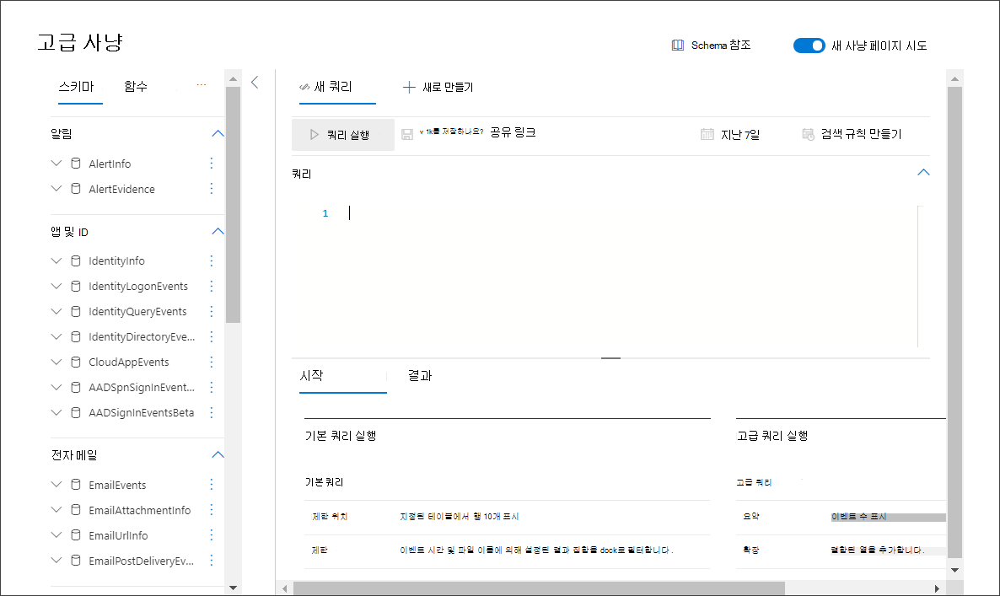
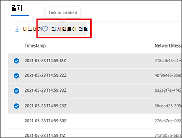
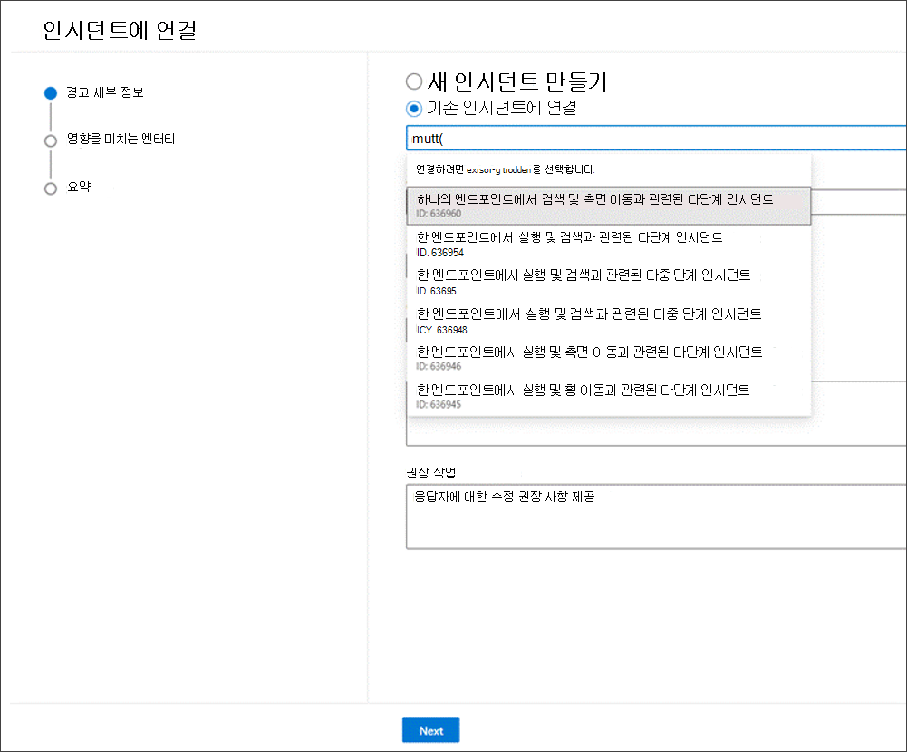
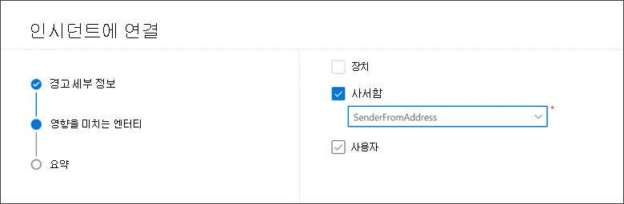
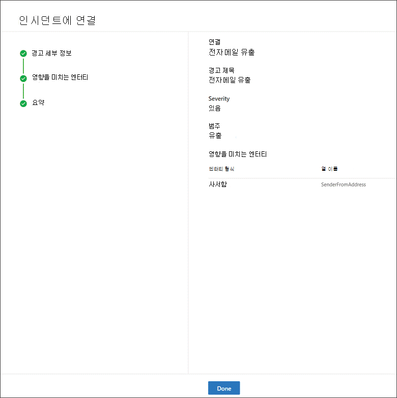

# 쿼리 결과를 인시던트에 연결

[!INCLUDE [Microsoft 365 Defender rebranding](../includes/microsoft-defender.md)]

**적용 대상:**
- Microsoft 365 Defender
- 끝점용 Microsoft Defender

인시던트 기능에 대한 링크를 사용하면 조사를 진행하는 새 인시던트 또는 기존 인시던트에 고급 헌팅 쿼리 결과를 추가할 수 있습니다. 이 기능을 사용하면 고급 헌팅 활동에서 레코드를 쉽게 캡처할 수 있으므로 인시던트와 관련하여 보다 풍부한 타임라인이나 이벤트 컨텍스트를 만들 수 있습니다. 

## 새 인시던트 또는 기존 인시던트에 결과 연결

1. 고급 헌팅 쿼리 페이지에서 먼저 제공된 쿼리 필드에  쿼리를 입력한 다음 쿼리 실행을 선택하여 결과를 얻습니다.

    
2. 결과 페이지에서 작업 중인 새 조사 또는 현재 조사와 관련된 이벤트 또는 레코드를 선택한 다음 인시던트에 **연결 을 선택합니다.**

    
3. **인시던트 링크 창에서** 경고 세부 정보  섹션을 찾은 다음 새 인시던트 만들기를 선택하여 이벤트를 경고로 변환하고 새 인시던트로 그룹화합니다.

 
       
    
    또는 **기존 인시던트에 연결 을** 선택하여 선택한 레코드를 기존 인시던트에 추가합니다. 기존 인시던트 드롭다운 목록에서 관련 인시던트 선택 또한 인시던트 이름 또는 ID의 처음 몇 문자를 입력하여 기존 인시던트가 발견될 수도 있습니다. 

    
4. 두 선택 중 하나에 대해 다음 세부 정보를 입력하고 다음을 **선택합니다.**
      - **경고 제목** - 인시던트 응답자가 이해할 수 있는 결과에 대한 설명 제목을 제공합니다. 이 제목은 경고 제목이 됩니다.
      - **심각도** - 경고 그룹에 적용할 심각도 선택
      - **범주** - 경고에 적합한 위협 범주를 선택합니다.
      - **설명** - 그룹화된 경고에 대한 유용한 설명을 제공합니다.
      - **권장 작업** - 수정 작업을 제공 합니다.

5. 영향을 **받는 엔터티 섹션에서** 영향을 받거나 영향을 받는 주 엔터티를 선택합니다. 쿼리 결과에 기반한 해당 엔터티만 이 섹션에 표시됩니다. 이 예제에서는 쿼리를 사용하여 가능한 전자 메일 유출 인시던트와 관련된 이벤트를 찾아서 보낸 사람이 영향을 미치는 엔터티입니다. 예를 들어 보낸 사람이 4명인 경우 4개의 알림이 만들어지며 선택한 인시던트에 연결됩니다. 
        
6. **다음** 을 선택합니다.
7. 요약 섹션에서 제공한 세부 **정보를 검토합니다.**
      
8. **완료** 를 선택합니다.

## 인시던트에서 연결된 레코드 보기

인시던트 이름을 선택하여 이벤트가 연결된 인시던트를 볼 수 있습니다.
      

이 예제에서는 4개의 선택된 이벤트를 나타내는 4개의 경고가 새 인시던트에 성공적으로 연결되었습니다. 

각 경고 페이지에서 타임라인 보기(사용 가능한 경우) 및 쿼리 결과 보기에서 이벤트 또는 이벤트에 대한 전체 정보를 찾을 수 있습니다.
      

이벤트를 선택하여 레코드 검사 **창을 열** 수 있습니다.
 

## 고급 헌팅을 사용하여 추가된 이벤트 필터링
수동 검색 원본을 통해 인시던트 큐 및 경고 큐를 필터링하여 고급 헌팅에서 생성된 경고를 볼 **수** 있습니다.

 