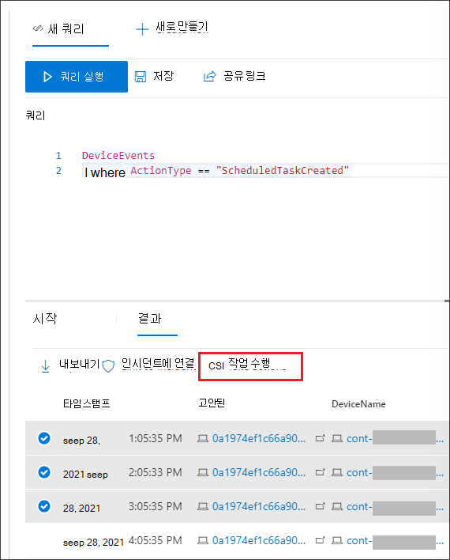

# 고급 헌팅 쿼리 결과에 대한 작업 수행

[!INCLUDE [Microsoft 365 Defender rebranding](../includes/microsoft-defender.md)]

**적용 대상:**
- Microsoft 365 Defender
- 끝점용 Microsoft Defender

[!INCLUDE [Prerelease information](../includes/prerelease.md)]

강력하고 포괄적인 작업 옵션을 사용하여 고급 헌팅에서 발견한 위협을 빠르게 포함하거나 손상된 자산을 해결할 수 있습니다.  이러한 옵션을 사용하여 다음을 할 수 있습니다.

- 디바이스에서 다양한 작업 수행
- 파일 Quarantine files

## 필요한 사용 권한
고급 헌팅을 통해 작업을 수행하려면 장치에서 수정 작업을 제출할 수 있는 권한이 있는 끝점용 Microsoft [Defender의 역할이 필요합니다.](/windows/security/threat-protection/microsoft-defender-atp/user-roles#permission-options) 조치를 취할 수 없는 경우 전역 관리자에게 문의하여 다음 권한을 부여합니다.

*위협 및 > 조치 취약성 관리 - 수정 처리*

## 디바이스에서 다양한 작업 수행
쿼리 결과의 열로 식별된 장치에 대해 다음 `DeviceId` 작업을 수행할 수 있습니다.

- 감염을 포함하거나 공격이 후방으로 이동하지 않도록 영향을 받는 장치를 격리
- 조사 패키지를 수집하여 추가 포렌식 정보 얻기
- 바이러스 백신 검사 실행을 통해 최신 보안 인텔리전스 업데이트를 사용하여 위협 찾기 및 제거
- 자동화된 조사를 시작하여 장치 및 기타 영향을 받는 장치에 대한 위협을 확인하고 수정합니다.
- 앱 실행을 Microsoft 서명된 실행 파일로만 제한하여 맬웨어 또는 기타 트러블되지 않은 실행 파일을 통한 후속 위협 활동 방지

끝점용 Microsoft Defender를 통해 이러한 응답 작업이 수행되는 방법에 대한 자세한 내용은 장치의 응답 [작업에 대해 읽어 보아야 합니다.](/windows/security/threat-protection/microsoft-defender-atp/respond-machine-alerts)
   
## 파일 Quarantine files
발생할 때  자동으로 검리될 수 있도록 파일에 대한 검지 작업을 배포할 수 있습니다. 이 작업을 선택할 때 다음 열 중 선택하여 쿼리 결과에서 검사할 파일을 식별할 수 있습니다.

- `SHA1` - 대부분의 고급 헌팅 테이블에서 기록된 작업의 영향을 받은 파일의 SHA-1입니다. 예를 들어 파일을 복사한 경우 복사된 파일이 됩니다.
- `InitiatingProcessSHA1` — 대부분의 고급 헌팅 테이블에서 이 파일은 기록된 작업을 시작하는 데 사용할 수 있습니다. 예를 들어 자식 프로세스가 시작된 경우 이는 상위 프로세스가 됩니다. 
- `SHA256` — 열로 식별된 파일의 SHA-256에 해당하는 `SHA1` 것입니다.
- `InitiatingProcessSHA256` — 열로 식별된 파일의 SHA-256에 해당하는 `InitiatingProcessSHA1` 것입니다.

검사 작업을 수행 하는 방법 및 파일을 복원 하는 방법에 대 한 자세한 내용은 파일에 대 한 [응답 작업에 대 한 읽기.](/windows/security/threat-protection/microsoft-defender-atp/respond-file-alerts)

>[!NOTE]
>파일을 찾아서 이를 검지하려면 쿼리 결과에 장치 식별자 `DeviceId` 값도 포함되어야 합니다.  

## 작업 수행
설명된 작업을 수행하려면 쿼리 결과에서 하나 이상의 레코드를 선택한 다음 작업 **실행을 선택합니다.** 마법사가 기본 작업을 선택한 다음 제출하는 프로세스를 안내합니다.

## 수행한 작업 검토
각 작업은 각각 동작 센터  기록( 또는 )의 security.microsoft.com/action-center/history  >   기록됩니다. 작업 센터로 이동하여 각 작업의 상태를 검사합니다.
 
>[!NOTE]
>이 문서의 일부 테이블은 끝점용 Microsoft Defender에서 사용할 수 없습니다. [더 많은 Microsoft 365 Defender](m365d-enable.md) 사용하여 위협을 헌팅할 수 있습니다. Endpoint용 Microsoft Defender에서 고급 헌팅 Microsoft 365 Defender [Microsoft Defender에서](advanced-hunting-migrate-from-mde.md)고급 헌팅 쿼리 마이그레이션의 단계를 수행하여 고급 헌팅 워크플로를 끝점으로 이동할 수 있습니다.

## 관련 항목
- [지능형 헌팅 개요](advanced-hunting-overview.md)
- [쿼리 언어 배우기](advanced-hunting-query-language.md)
- [쿼리 결과로 작업](advanced-hunting-query-results.md)
- [스키마에 대한 이해](advanced-hunting-schema-tables.md)
- [Action Center 개요](m365d-action-center.md)
