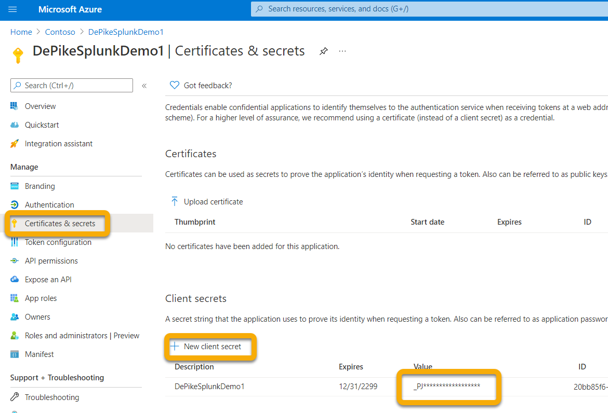
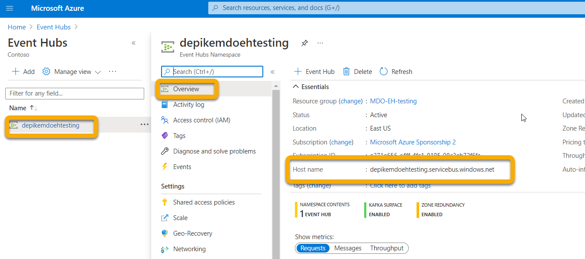
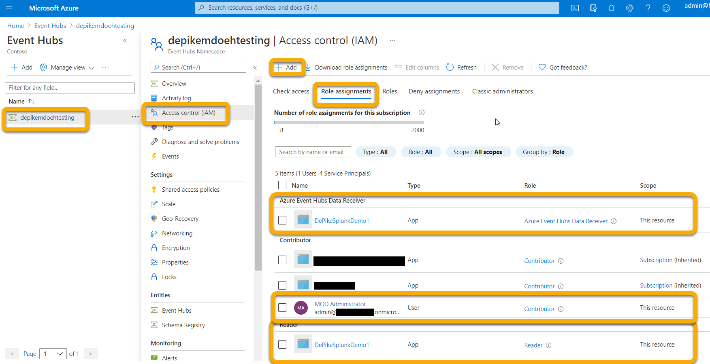
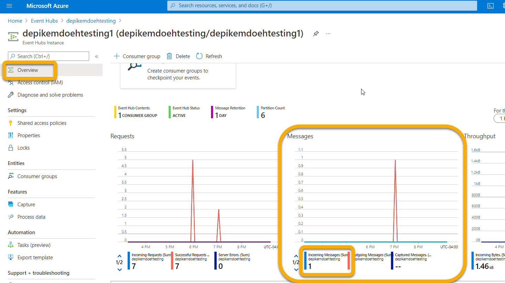

# <a name="configure-your-event-hub"></a>이벤트 허브 구성

[!INCLUDE [Microsoft 365 Defender rebranding](../../includes/microsoft-defender.md)]

**적용 대상:**
- [Microsoft 365 Defender](https://go.microsoft.com/fwlink/?linkid=2118804)

이벤트 허브가 사용자 계정에서 이벤트를 인제스트할 수 있도록 이벤트 허브를 구성하는 Microsoft 365 Defender.

## <a name="set-up-the-required-resource-provider-in-the-event-hub-subscription"></a>이벤트 허브 구독에서 필수 리소스 공급자 설정

1. [Azure 포털](https://portal.azure.com)에 로그인합니다.
1. 구독 **선택**{ 이벤트 허브가 } 리소스 공급자에 배포될  >    >  **구독을 선택합니다.**
1. **Microsoft.Insights** 공급자가 등록되어 있는지 확인하십시오. 그렇지 않으면 등록합니다.


## <a name="set-up-azure-active-directory-app-registration"></a>앱 등록 Azure Active Directory 설정

> ! [참고] 관리자가 아닌 사용자가 앱을 등록할 수 있도록 관리자 역할 또는 Azure Active Directory(AAD)를 설정해야 합니다. 서비스 사용자에게 역할을 할당하려면 소유자 또는 사용자 액세스 관리자 역할도 있어야 합니다. 자세한 내용은 [Create an Azure AD app & service principal in the portal - Microsoft ID 플랫폼 Microsoft \| Docs를 참조하세요.](/azure/active-directory/develop/howto-create-service-principal-portal)

1. 앱 등록에 새 등록(본질적으로 서비스 사용자 **생성)을** Azure Active Directory 새 \>  \> **등록을 만듭니다.**

1. 이름만 입력하여 양식을 작성합니다(리디렉션 URI는 필요하지 않습니다).

    

    

1. 인증서 인증서를 클릭하여  비밀을 & 새 \> **클라이언트** 비밀:

    

> [!WARNING]
> 클라이언트 비밀에 다시 액세스할 수 **없습니다. 따라서 를 저장해야 합니다.**

## <a name="set-up-event-hub-namespace"></a>이벤트 허브 네임스페이스 설정

1. 이벤트 허브 네임스페이스 만들기:

    이벤트 **허브 \>** 추가로 이동하여 예상되는 부하에 적합한 가격 계층, 처리 장치 및 자동 고가용성(표준 가격 책정 및 기능 필요)을 선택합니다. 자세한 내용은 [가격 책정 - \| ](https://azure.microsoft.com/pricing/details/event-hubs/) 이벤트 허브 Microsoft Azure

    > [!NOTE]
    > 기존 이벤트 허브를 사용할 수 있지만, 해당 네임스페이스에 이벤트 허브를 두는 것이 좋습니다.

   

1. 이 이벤트 허브 네임스페이스의 리소스 ID도 필요합니다. Azure 이벤트 허브 네임스페이스 페이지 속성으로 \> 이동합니다. 아래 구성 섹션에서 리소스 ID 아래에 텍스트를 복사하고 Microsoft 365 기록합니다.

    

1. 이벤트 허브 네임스페이스를 만든 후 앱 등록 서비스 사용자를 읽기 프로그램, Azure 이벤트 허브 데이터 수신기로 추가하고 Microsoft 365 Defender 참가자로 로그인할 사용자를 추가해야 합니다(리소스 그룹 또는 구독 수준에서도 이 작업을 할 수 있습니다).

    이 단계는 역할 할당에서 이벤트 허브 **IAM(네임스페이스** \> **액세스 제어)** 추가 및 \>  **확인에서 수행됩니다.**

    

## <a name="set-up-event-hub"></a>이벤트 허브 설정

**옵션 1:**

네임스페이스 내에 이벤트 허브를 만들  수 있으며 내보내기 위해 선택한 모든 이벤트 유형(테이블)이 이 하나의 이벤트 허브에 **기록됩니다.**

**옵션 2:**

모든 이벤트 유형(테이블)을 하나의 이벤트 허브로 내보내는 대신 이벤트 허브 네임스페이스 내에서 각 테이블을 다른 이벤트 허브(이벤트 유형당 하나의 이벤트 허브)로 내보낼 수 있습니다.

이 옵션에서는 Microsoft 365 Defender 허브를 만들 수 있습니다.

> [!NOTE]
> 이벤트 허브 클러스터에 없는 이벤트 허브  네임스페이스를 사용하는 경우 이벤트 허브 네임스페이스당 이벤트 허브가 10개로 제한되어 정의한 각 내보내기 작업에서 내보낼 이벤트 유형(테이블)설정 수 있습니다.

예제:


이 옵션을 선택하는 경우 전자 메일 테이블을 보내도록 Microsoft 365 Defender [섹션으로 건너뛸 수](#configure-microsoft-365-defender-to-send-email-tables) 있습니다.

이벤트 허브 + 이벤트 허브를 선택하여  네임스페이스 내에 이벤트 \> **허브를 만들 수 있습니다.**

파티션 개수를 사용하면 병렬 처리를 통해 처리량도 증가할 수 있으므로 예상되는 부하에 따라 이 수를 늘리는 것이 좋습니다. 기본 메시지 보존 및 캡처 값이 1 및 끄기인 것이 좋습니다.


이 이벤트 허브(네임스페이스 아미기)의 경우 보내기, 수신 클레임 수신을 통해 공유 액세스 정책을 구성해야 합니다. 이벤트 허브  공유 액세스 정책 + 추가를 클릭한 다음 정책 이름(다른 곳에서 사용되지 않습니다)을 지정하고 \>  \>  **보내기 및** **수신을 검사합니다.**


## <a name="configure-microsoft-365-defender-to-send-email-tables"></a>전자 Microsoft 365 Defender 보내도록 구성

### <a name="set-up-microsoft-365-defender-send-email-tables-to-splunk-via-event-hub"></a>이벤트 Microsoft 365 Defender Splunk로 전자 메일 테이블 보내기 설정

1. 다음 역할 Microsoft 365 Defender 충족하는 계정으로 에 <https://security.microsoft.com> 로그인합니다.

    - 내보낼 이벤트 *허브에* 대한 이벤트 허브 네임스페이스 리소스 수준 이상에 대한 참가자 역할 이 권한이 없는 경우 설정을 저장하려고 하면 내보내기 오류가 발생합니다.

    - 전역 관리자 또는 Azure와 Microsoft 365 Defender 테넌트에 대한 보안 관리자 역할

    

1. 원시 데이터 **내보내기 \> +추가를 클릭합니다.**

    이제 위에서 기록한 데이터를 사용하게 됩니다.

    **이름:** 이 값은 로컬 값으로, 해당 환경에서 작동하는 모든 값으로 지정해야 합니다.

    **이벤트 허브로 이벤트 전달:** 이 확인란을 선택합니다.

    **이벤트 허브 리소스 ID:** 이 값은 이벤트 허브를 설정하는 경우 기록한 이벤트 허브 네임스페이스 리소스 ID입니다.

    **이벤트 허브 이름:** 이벤트 허브 네임스페이스 내에서 이벤트 허브를 만든 경우 위에서 기록한 이벤트 허브 이름을 붙여 넣습니다.

    이벤트 유형(테이블Microsoft 365 Defender당 이벤트 허브를 만들 수 있는 경우 이 필드를 비워 두면 됩니다.

    **이벤트 유형:** 이벤트 허브로 전달할 고급 헌팅 테이블을 선택한 다음 사용자 지정 앱으로 을 선택합니다. 경고 테이블은 Microsoft 365 Defender, 장치 테이블은 Microsoft Defender for Endpoint(EDR) 및 Microsoft Defender for Office 365. 전자 메일 이벤트는 모든 전자 메일 트랜잭션을 기록합니다. URL(금고 Links), Attachment(금고 Attachments) 및 ZAP(Post Delivery Events)도 기록되어 NetworkMessageId 필드의 전자 메일 이벤트에 참가할 수 있습니다.

    

1. 제출을 **클릭해야 합니다.**

### <a name="verify-that-the-events-are-being-exported-to-the-event-hub"></a>이벤트가 이벤트 허브로 내보내지고 있는지 확인

기본 고급 헌팅 쿼리를 실행하여 이벤트가 이벤트 허브로 전송되고 있는지 확인할 수 있습니다. 고급 **헌팅** 쿼리 \> **헌팅을** \> **선택하고** 다음 쿼리를 입력합니다.

```console
EmailEvents
|joinkind=fullouterEmailAttachmentInfoonNetworkMessageId
|joinkind=fullouterEmailUrlInfoonNetworkMessageId
|joinkind=fullouterEmailPostDeliveryEventsonNetworkMessageId
|whereTimestamp\>ago(1h)
|count
```

이렇게 하면 다른 모든 테이블에서 지난 한 시간 동안 수신된 전자 메일 수가 표시됩니다. 또한 이벤트 허브로 내보낼 수 있는 이벤트가 표시될 경우도 표시됩니다. 이 개수에 0이 표시하면 이벤트 허브로 데이터가 전송되지 않습니다.


내보낼 데이터가 있는지 확인한 후 이벤트 허브를 확인하여 메시지가 수신되는지 확인할 수 있습니다. 최대 1시간이 걸릴 수 있습니다.

1. Azure에서 이벤트  허브 네임스페이스 이벤트 허브 클릭 이벤트 허브 \>  \>  \> **클릭으로 이동하여 이벤트 허브 를 클릭합니다.**
1. 개요 **아래에서** 아래로 스크롤하고 메시지 그래프에 들어오는 메시지가 표시됩니다. 결과가 없는 경우 사용자 지정 앱을 인스트링할 메시지가 없습니다.

    
