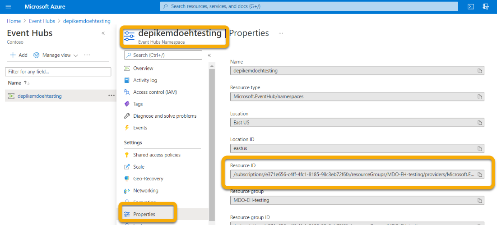
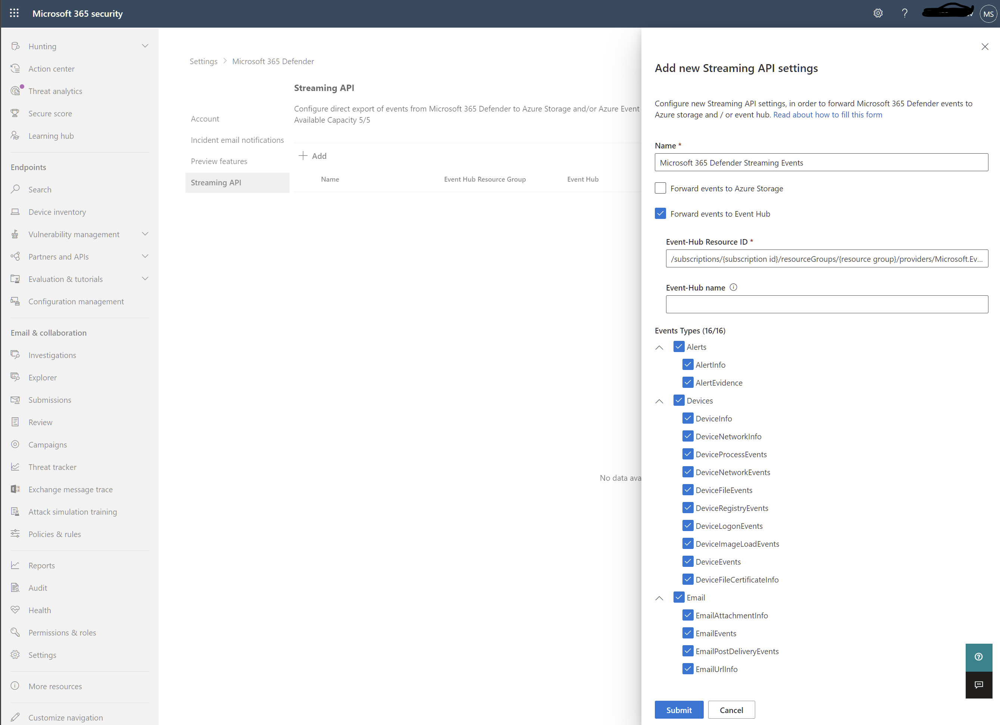

# <a name="configure-your-event-hub"></a><span data-ttu-id="31eee-104">이벤트 허브 구성</span><span class="sxs-lookup"><span data-stu-id="31eee-104">Configure your Event Hub</span></span>

[!INCLUDE [Microsoft 365 Defender rebranding](../../includes/microsoft-defender.md)]

<span data-ttu-id="31eee-105">**적용 대상:**</span><span class="sxs-lookup"><span data-stu-id="31eee-105">**Applies to:**</span></span>
- [<span data-ttu-id="31eee-106">Microsoft 365 Defender</span><span class="sxs-lookup"><span data-stu-id="31eee-106">Microsoft 365 Defender</span></span>](https://go.microsoft.com/fwlink/?linkid=2118804)

<span data-ttu-id="31eee-107">이벤트 허브가 사용자 계정에서 이벤트를 인제스트할 수 있도록 이벤트 허브를 구성하는 Microsoft 365 Defender.</span><span class="sxs-lookup"><span data-stu-id="31eee-107">Learn how to configure your Event Hub so that it can ingest events from Microsoft 365 Defender.</span></span>


## <a name="setup-the-required-resource-provider-in-the-event-hub-subscription"></a><span data-ttu-id="31eee-108">이벤트 허브 구독에서 필수 리소스 공급자 설정</span><span class="sxs-lookup"><span data-stu-id="31eee-108">Setup the required Resource Provider in the Event Hub subscription</span></span>


1. <span data-ttu-id="31eee-109">[Azure 포털](https://portal.azure.com)에 로그인합니다.</span><span class="sxs-lookup"><span data-stu-id="31eee-109">Sign in to the [Azure portal](https://portal.azure.com).</span></span>
1. <span data-ttu-id="31eee-110">구독 선택 { 이벤트 허브가 } 리소스 공급자에 배포될 **\> \> 구독을 선택합니다.**</span><span class="sxs-lookup"><span data-stu-id="31eee-110">Select **Subscriptions \> {***Select the subscription the event hub will be deployed to***} \> Resource providers**.</span></span>
1. <span data-ttu-id="31eee-111">**Microsoft.Insights** 공급자가 등록되어 있는지 확인하십시오.</span><span class="sxs-lookup"><span data-stu-id="31eee-111">Verify that the **Microsoft.Insights** Provider is registered.</span></span> <span data-ttu-id="31eee-112">그렇지 않으면 등록합니다.</span><span class="sxs-lookup"><span data-stu-id="31eee-112">Otherwise, register it.</span></span>


## <a name="setup-azure-active-directory-app-registration"></a><span data-ttu-id="31eee-114">앱 Azure Active Directory 설정</span><span class="sxs-lookup"><span data-stu-id="31eee-114">Setup Azure Active Directory App Registration</span></span>


><span data-ttu-id="31eee-115">! [참고] 관리자가 아닌 사용자가 앱을 등록할 수 Azure Active Directory AAD(관리자 역할 또는 사용자 계정)가 설정되어 있어야 합니다.</span><span class="sxs-lookup"><span data-stu-id="31eee-115">![NOTE] You must have Administrator role or Azure Active Directory (AAD) must be set to allow non-Administrators to register apps.</span></span> <span data-ttu-id="31eee-116">서비스 사용자에게 역할을 할당하려면 소유자 또는 사용자 액세스 관리자 역할도 있어야 합니다.</span><span class="sxs-lookup"><span data-stu-id="31eee-116">You must also have an Owner or User Access Administrator role to assign the service principal a role.</span></span>  
><span data-ttu-id="31eee-117">자세한 내용은 [Create an Azure AD app & service principal in the portal - Microsoft ID 플랫폼 Microsoft \| Docs를 참조하세요.](/azure/active-directory/develop/howto-create-service-principal-portal)</span><span class="sxs-lookup"><span data-stu-id="31eee-117">For more information, see [Create an Azure AD app & service principal in the portal - Microsoft identity platform \| Microsoft Docs](/azure/active-directory/develop/howto-create-service-principal-portal).</span></span>

1. <span data-ttu-id="31eee-118">앱 등록에 새 등록(본질적으로 서비스 사용자 생성)을 Azure Active Directory 새 **\> \> 등록을 만듭니다.**</span><span class="sxs-lookup"><span data-stu-id="31eee-118">Create a new registration (which inherently creates a service principal) in **Azure Active Directory \> App registrations \> New registration.**</span></span>

1. <span data-ttu-id="31eee-119">이름만 입력하여 양식을 작성합니다(리디렉션 URI는 필요하지 않습니다).</span><span class="sxs-lookup"><span data-stu-id="31eee-119">Fill out the form with just the Name (no Redirect URI is required).</span></span>

    

    

1. <span data-ttu-id="31eee-122">인증서 인증서를 클릭하여 비밀을 & **\> 새 클라이언트 비밀:**</span><span class="sxs-lookup"><span data-stu-id="31eee-122">Create a secret by clicking on **Certificates & secrets \> New client secret**:</span></span>

    

>[!WARNING]
><span data-ttu-id="31eee-124">클라이언트 비밀에 다시 액세스할 수 **없습니다. 따라서 를 저장해야 합니다.**</span><span class="sxs-lookup"><span data-stu-id="31eee-124">**You won't be able to access the client secret again so make sure to save it**.</span></span>

## <a name="setup-event-hub-namespace"></a><span data-ttu-id="31eee-125">이벤트 허브 네임스페이스 설정</span><span class="sxs-lookup"><span data-stu-id="31eee-125">Setup Event Hub namespace</span></span>


1. <span data-ttu-id="31eee-126">이벤트 허브 네임스페이스 만들기:</span><span class="sxs-lookup"><span data-stu-id="31eee-126">Create an Event Hub Namespace:</span></span>

    <span data-ttu-id="31eee-127">이벤트 **허브 \>** 추가로 이동하여 예상되는 부하에 적합한 가격 계층, 처리 장치 및 자동 고가용성(표준 가격 책정 및 기능 필요)을 선택합니다.</span><span class="sxs-lookup"><span data-stu-id="31eee-127">Go **to Event Hubs \> Add** and select the pricing tier, throughput units and Auto-Inflate (requires standard pricing and under features) appropriate for the load you are expecting.</span></span>  
    <span data-ttu-id="31eee-128">자세한 내용은 [가격 책정 - \| ](https://azure.microsoft.com/en-us/pricing/details/event-hubs/) 이벤트 허브 Microsoft Azure</span><span class="sxs-lookup"><span data-stu-id="31eee-128">For more information, see [Pricing - Event Hubs \| Microsoft Azure](https://azure.microsoft.com/en-us/pricing/details/event-hubs/)</span></span>

    >[!NOTE]
    > <span data-ttu-id="31eee-129">기존 이벤트 허브를 사용할 수 있지만, 해당 네임스페이스에 이벤트 허브를 두는 것이 좋습니다.</span><span class="sxs-lookup"><span data-stu-id="31eee-129">You can use an existing event hub, but the throughput and scaling are set at the namespace level so it is recommended to place an event hub in itsown namespace.</span></span>

   

1. <span data-ttu-id="31eee-131">이 이벤트 허브 네임스페이스의 리소스 ID도 필요합니다.</span><span class="sxs-lookup"><span data-stu-id="31eee-131">You will also need the Resource ID of this Event Hub Namespace.</span></span> <span data-ttu-id="31eee-132">Azure 이벤트 허브 네임스페이스 페이지 속성으로 \> 이동합니다.</span><span class="sxs-lookup"><span data-stu-id="31eee-132">Go to your Azure Event Hubs namespace page \> Properties.</span></span> <span data-ttu-id="31eee-133">아래의 M365 구성 섹션에서 리소스 ID 아래에 텍스트를 복사하고 사용할 수 있는 텍스트를 기록합니다.</span><span class="sxs-lookup"><span data-stu-id="31eee-133">Copy the text under Resource ID and record it for use during the M365 Configuration section below.</span></span> 

    

1. <span data-ttu-id="31eee-135">이벤트 허브 네임스페이스가 생성되면 앱 등록 서비스 사용자를 읽기 프로그램, Azure 이벤트 허브 데이터 수신기 및 참가자로 로그인할 Microsoft 365 Defender 추가해야 합니다(리소스 그룹 또는 구독 수준에서도 이 작업을 수행 할 수 있습니다).</span><span class="sxs-lookup"><span data-stu-id="31eee-135">Once the Event Hub Namespace is created you will need to add the App Registration Service Principal as Reader, Azure Event Hubs Data Receiver, and the user who will be logging into Microsoft 365 Defender as Contributor (this can also be done at Resource Group or Subscription level).</span></span>

    <span data-ttu-id="31eee-136">이 작업은 이벤트 허브 **IAM(네임스페이스 \> 액세스 제어) \> 역할** 할당에서 추가 및 **확인에서 수행됩니다.**</span><span class="sxs-lookup"><span data-stu-id="31eee-136">This is done in **Event Hubs Namespace \> Access Control (IAM) \> Add** and verify under **Role assignments**:</span></span>

    

## <a name="setup-event-hub"></a><span data-ttu-id="31eee-138">설치 이벤트 허브</span><span class="sxs-lookup"><span data-stu-id="31eee-138">Setup Event Hub</span></span>


<span data-ttu-id="31eee-139">**옵션 1:**</span><span class="sxs-lookup"><span data-stu-id="31eee-139">**Option 1:**</span></span>

<span data-ttu-id="31eee-140">네임스페이스 내에 이벤트 허브를 만들  수 있으며 내보내기 위해 선택한 모든 이벤트 유형(테이블)이 이 하나의 이벤트 허브에 **기록됩니다.**</span><span class="sxs-lookup"><span data-stu-id="31eee-140">You can create an Event Hub within your Namespace and **all** the Event Types (Tables) you select to export will be written into this **one** Event Hub.</span></span>

<span data-ttu-id="31eee-141">**옵션 2:**</span><span class="sxs-lookup"><span data-stu-id="31eee-141">**Option 2:**</span></span>

<span data-ttu-id="31eee-142">모든 이벤트 유형(테이블)을 하나의 이벤트 허브로 내보내는 대신 이벤트 허브 네임스페이스 내에서 각 테이블을 다른 이벤트 허브(이벤트 유형당 하나의 이벤트 허브)로 내보낼 수 있습니다.</span><span class="sxs-lookup"><span data-stu-id="31eee-142">Instead of exporting all the Event Types (Tables) into one Event Hub, you can export each table into a different Event Hub inside your Event Hub Namespace (one Event Hub per Event Type).</span></span>  

<span data-ttu-id="31eee-143">이 옵션에서는 Microsoft 365 Defender 허브를 만들 수 있습니다.</span><span class="sxs-lookup"><span data-stu-id="31eee-143">In this option, Microsoft 365 Defender will create Event Hubs for you.</span></span>  
>[!NOTE]
> <span data-ttu-id="31eee-144">이벤트 허브 클러스터에 없는 이벤트 허브  네임스페이스를 사용하는 경우 이벤트 허브 네임스페이스당 이벤트 허브가 10개로 제한되어 정의한 각 내보내기 작업에서 내보낼 이벤트 유형(테이블)설정 수 있습니다.</span><span class="sxs-lookup"><span data-stu-id="31eee-144">If you are using an Event Hub Namespace that is **not** part of an Event Hub Cluster, you will only be able to choose up to 10 Event Types (Tables) to export in each Export Settings you define, due to an Azure limitation of 10 Event Hubs per Event Hub Namespace.</span></span>

<span data-ttu-id="31eee-145">예제:</span><span class="sxs-lookup"><span data-stu-id="31eee-145">For example:</span></span>


<span data-ttu-id="31eee-147">이 옵션을 선택하는 경우 전자 메일 테이블을 보내도록 Microsoft 365 Defender [섹션으로 건너뛸 수](#configure-microsoft-365-defender-to-send-email-tables) 있습니다.</span><span class="sxs-lookup"><span data-stu-id="31eee-147">If you choose this option, you can skip to the [Configure Microsoft 365 Defender to send email tables](#configure-microsoft-365-defender-to-send-email-tables) section.</span></span>

<span data-ttu-id="31eee-148">이벤트 허브 + 이벤트 허브를 선택하여 네임스페이스 내에 이벤트 **\> 허브를 만들 수 있습니다.**</span><span class="sxs-lookup"><span data-stu-id="31eee-148">Create an Event Hub within your Namespace by selecting **Event Hubs \> + Event Hub**.</span></span>

<span data-ttu-id="31eee-149">파티션 개수를 사용하면 병렬 처리를 통해 추가 처리량에 사용할 수 있으므로 예상되는 부하에 따라 이 수를 늘리는 것이 좋습니다.</span><span class="sxs-lookup"><span data-stu-id="31eee-149">The Partition Count allows for additional throughput via parallelism, so it is recommended to increase this number based on the load you are expecting.</span></span>  
<span data-ttu-id="31eee-150">기본 메시지 보존 및 캡처 값이 1 및 끄기인 것이 좋습니다.</span><span class="sxs-lookup"><span data-stu-id="31eee-150">Default Message Retention and Capture values of 1 and Off are recommended.</span></span>


<span data-ttu-id="31eee-152">이 이벤트 허브(네임스페이스 아미기)의 경우 보내기, 수신 클레임 수신을 통해 공유 액세스 정책을 구성해야 합니다.</span><span class="sxs-lookup"><span data-stu-id="31eee-152">For this Event Hub (not namespace) you will need to configure a Shared Access Policy with Send, Listen Claims.</span></span> <span data-ttu-id="31eee-153">이벤트 허브 공유 액세스 정책 **\> \> +** 추가를 클릭한 다음 정책 이름(다른 곳에서 사용되지 않습니다)을 지정하고 **보내기 및** **수신을 검사합니다.**</span><span class="sxs-lookup"><span data-stu-id="31eee-153">Click on your **Event Hub \> Shared access policies \> + Add** and then give it a Policy name (not used elsewhere) and check **Send** and **Listen**.</span></span>


## <a name="configure-microsoft-365-defender-to-send-email-tables"></a><span data-ttu-id="31eee-155">전자 Microsoft 365 Defender 보내도록 구성</span><span class="sxs-lookup"><span data-stu-id="31eee-155">Configure Microsoft 365 Defender to send email tables</span></span>


### <a name="setup-microsoft-365-defender-send-email-tables-to-splunk-via-event-hub"></a><span data-ttu-id="31eee-156">설치 Microsoft 365 Defender 허브를 통해 Splunk로 전자 메일 테이블 보내기</span><span class="sxs-lookup"><span data-stu-id="31eee-156">Setup Microsoft 365 Defender send Email tables to Splunk via Event Hub</span></span>


1. <span data-ttu-id="31eee-157">다음 역할 Microsoft 365 Defender 충족하는 계정으로 <https://security.microsoft.com> 로그인합니다.</span><span class="sxs-lookup"><span data-stu-id="31eee-157">Login to Microsoft 365 Defender at <https://security.microsoft.com> with an account that meets all the following role requirements:</span></span>

    - <span data-ttu-id="31eee-158">내보낼 이벤트 *허브에* 대한 이벤트 허브 네임스페이스 리소스 수준 이상에 대한 참가자 역할</span><span class="sxs-lookup"><span data-stu-id="31eee-158">Contributor role at the Event Hub *Namespace* Resource level or higher for the Event Hub that you will be exporting to.</span></span> <span data-ttu-id="31eee-159">이렇게 하지 않으면 설정을 저장하려고 할 때 내보내기 오류가 발생합니다.</span><span class="sxs-lookup"><span data-stu-id="31eee-159">Without this you will get an export error when you try to save the settings.</span></span>

    - <span data-ttu-id="31eee-160">전역 관리자 또는 Azure와 Microsoft 365 Defender 테넌트에 대한 보안 관리자 역할</span><span class="sxs-lookup"><span data-stu-id="31eee-160">Global Admin or Security Admin Role on the tenant tied to Microsoft 365 Defender and Azure.</span></span>

    

1. <span data-ttu-id="31eee-162">원시 데이터 **내보내기 \> +추가를 클릭합니다.**</span><span class="sxs-lookup"><span data-stu-id="31eee-162">Click on **Raw Data Export \> +Add**.</span></span>

    <span data-ttu-id="31eee-163">이제 위에서 기록한 데이터를 사용하게 됩니다.</span><span class="sxs-lookup"><span data-stu-id="31eee-163">You will now use the data that your recorded above.</span></span>

    <span data-ttu-id="31eee-164">**이름:** 로컬이기 때문에 사용자 환경에서 작동하는 모든 것이 좋습니다.</span><span class="sxs-lookup"><span data-stu-id="31eee-164">**Name**: This is local and should be whatever works in your environment.</span></span>

    <span data-ttu-id="31eee-165">**이벤트 허브로 이벤트 전달:** 이 확인란을 선택합니다.</span><span class="sxs-lookup"><span data-stu-id="31eee-165">**Forward events to event hub**: Select this checkbox.</span></span>

    <span data-ttu-id="31eee-166">**이벤트 허브 리소스 ID:** 이벤트 허브를 설정하는 경우 위에서 기록한 이벤트 허브 네임스페이스 리소스 ID입니다.</span><span class="sxs-lookup"><span data-stu-id="31eee-166">**Event-Hub Resource ID**: This is the Event Hub Namespace Resource ID you  recorded above when you setup the Event Hub.</span></span>

    <span data-ttu-id="31eee-167">**이벤트 허브 이름:** 이벤트 허브 네임스페이스 내에서 이벤트 허브를 만든 경우 위에 기록한 이벤트 허브 이름을 붙여 넣습니다.</span><span class="sxs-lookup"><span data-stu-id="31eee-167">**Event-Hub name**:  If you created an Event Hub inside your Event Hub Namespace, paste the Event Hub  name you recorded above.</span></span>

    <span data-ttu-id="31eee-168">이벤트 유형(테이블Microsoft 365 Defender당 이벤트 허브를 만들 수 있는 경우 이 필드를 비워 두면 됩니다.</span><span class="sxs-lookup"><span data-stu-id="31eee-168">If you choose to let Microsoft 365 Defender to create Event Hubs per Event Types  (Tables) for you, leave this field empty.</span></span>

    <span data-ttu-id="31eee-169">**이벤트 유형:** 이벤트 허브로 전달할 고급 헌팅 테이블을 선택한 다음 사용자 지정 앱으로 을 선택합니다.</span><span class="sxs-lookup"><span data-stu-id="31eee-169">**Event Types**: Select the Advanced Hunting tables that you want to forward to the Event Hub and then on to your custom app.</span></span> <span data-ttu-id="31eee-170">경고 테이블은 Microsoft 365 Defender, 장치 테이블은 Microsoft Defender for Endpoint(EDR) 및 Microsoft Defender for Office 365.</span><span class="sxs-lookup"><span data-stu-id="31eee-170">Alert tables are from Microsoft 365 Defender, Devices tables are from Microsoft Defender for Endpoint (EDR), and Email tables are from Microsoft Defender for Office 365.</span></span> <span data-ttu-id="31eee-171">전자 메일 이벤트는 모든 전자 메일 트랜잭션을 기록합니다.</span><span class="sxs-lookup"><span data-stu-id="31eee-171">Email Events records all Email Transactions.</span></span> <span data-ttu-id="31eee-172">URL(SafeLinks), 첨부 파일(Safe 첨부 파일) 및 ZAP(배달 후 이벤트)도 기록되어 NetworkMessageId 필드의 전자 메일 이벤트에 참가할 수 있습니다.</span><span class="sxs-lookup"><span data-stu-id="31eee-172">The URL (SafeLinks), Attachment (Safe Attachments) and Post Delivery Events (ZAP) are also recorded and can be joined to the Email Events on the NetworkMessageId field.</span></span>

    

1. <span data-ttu-id="31eee-174">제출을 **클릭해야 합니다.**</span><span class="sxs-lookup"><span data-stu-id="31eee-174">Make sure to click **Submit**.</span></span>

### <a name="verify-that-the-events-are-being-exported-to-the-event-hub"></a><span data-ttu-id="31eee-175">이벤트가 이벤트 허브로 내보내지고 있는지 확인</span><span class="sxs-lookup"><span data-stu-id="31eee-175">Verify that the events are being exported to the Event Hub</span></span>


<span data-ttu-id="31eee-176">기본 고급 헌팅 쿼리를 실행하여 이벤트가 이벤트 허브로 전송되고 있는지 확인할 수 있습니다.</span><span class="sxs-lookup"><span data-stu-id="31eee-176">You can verify that events are being sent to the Event Hub by running a basic Advanced Hunting query.</span></span> <span data-ttu-id="31eee-177">고급 **헌팅 쿼리 헌팅을 \> \> 선택하고** 다음 쿼리를 입력합니다.</span><span class="sxs-lookup"><span data-stu-id="31eee-177">Select **Hunting \> Advanced Hunting \> Query** and enter the following query:</span></span>

```
EmailEvents
|joinkind=fullouterEmailAttachmentInfoonNetworkMessageId
|joinkind=fullouterEmailUrlInfoonNetworkMessageId
|joinkind=fullouterEmailPostDeliveryEventsonNetworkMessageId
|whereTimestamp\>ago(1h)
|count
```

<span data-ttu-id="31eee-178">이렇게 하면 다른 모든 테이블에서 지난 한 시간 동안 수신된 전자 메일 수가 표시됩니다.</span><span class="sxs-lookup"><span data-stu-id="31eee-178">This will show you how many emails were received in the last hour joined across all the other tables.</span></span> <span data-ttu-id="31eee-179">또한 이벤트 허브로 내보낼 수 있는 이벤트가 표시될 경우도 표시됩니다.</span><span class="sxs-lookup"><span data-stu-id="31eee-179">It will also show you if you are seeing events that could be exported to the event hub.</span></span> <span data-ttu-id="31eee-180">이 개수가 0으로 표시하면 이벤트 허브로 데이터가 전송되지 않습니다.</span><span class="sxs-lookup"><span data-stu-id="31eee-180">If this count shows 0 then you won't see any data going out to the Event Hub.</span></span>


<span data-ttu-id="31eee-182">내보낼 데이터가 있는지 확인한 후 이벤트 허브를 확인하여 메시지가 수신되는지 확인할 수 있습니다.</span><span class="sxs-lookup"><span data-stu-id="31eee-182">Once you have verified there is data to export, you can view the Event Hub to verify that messages are incoming.</span></span> <span data-ttu-id="31eee-183">최대 1시간이 걸릴 수 있습니다.</span><span class="sxs-lookup"><span data-stu-id="31eee-183">This can take up to one hour.</span></span> 
 
1. <span data-ttu-id="31eee-184">Azure에서 이벤트 허브 네임스페이스 이벤트 허브 클릭 이벤트 허브 **\> \> \> 클릭으로 이동하여 이벤트 허브 를 클릭합니다.**</span><span class="sxs-lookup"><span data-stu-id="31eee-184">In Azure, go to **Event Hubs \> Click on the Namespace \> Event Hubs \> Click on the Event Hub**.</span></span>  
1. <span data-ttu-id="31eee-185">개요 **아래에서** 아래로 스크롤하고 메시지 그래프에 들어오는 메시지가 표시됩니다.</span><span class="sxs-lookup"><span data-stu-id="31eee-185">Under **Overview**, scroll down and in the Messages graph you should see Incoming Messages.</span></span> <span data-ttu-id="31eee-186">결과가 없는 경우 사용자 지정 앱을 인스트링할 메시지가 없습니다.</span><span class="sxs-lookup"><span data-stu-id="31eee-186">If you don't see any results, then there will be no messages for your custom app to ingest.</span></span>

    
