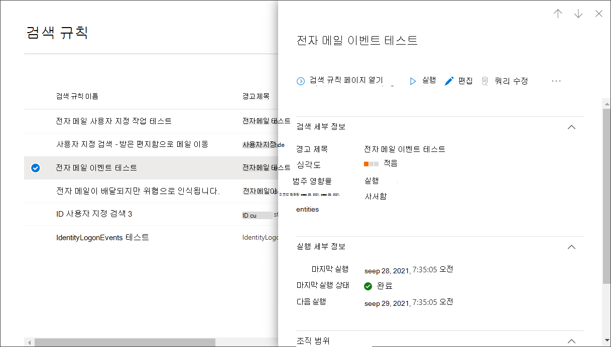

# <a name="create-and-manage-custom-detections-rules"></a>사용자 지정 검색 규칙 만들기 및 관리

[!INCLUDE [Microsoft 365 Defender rebranding](../includes/microsoft-defender.md)]


**적용 대상:**
- Microsoft 365 Defender
- 끝점용 Microsoft Defender

사용자 지정 검색 규칙은 고급 헌팅 쿼리를 사용하여 디자인하고 [조정하는 규칙입니다.](advanced-hunting-overview.md) 이러한 규칙을 사용하면 위반 활동 및 잘못 구성된 끝점을 포함하여 다양한 이벤트 및 시스템 상태 등을 사전 예방적으로 모니터링할 수 있습니다. 정기적으로 실행되도록 설정하여 일치하는 항목이 있을 때마다 경고를 생성하고 대응 조치를 취할 수 있습니다.

## <a name="required-permissions-for-managing-custom-detections"></a>사용자 지정 탐지를 관리하는 데 필요한 권한

사용자 지정 탐지를 관리하려면 다음 역할 중 하나를 할당해야 합니다.

- **보안 관리자**-이 역할이 [Azure Active Directory](/azure/active-directory/roles/permissions-reference#security-administrator) 사용자는 Microsoft 365 Defender 포털 및 서비스에서 보안 설정을 관리할 수 있습니다.

- **보안 운영자**—이 Azure Active Directory 역할이 있는 사용자는 경고를 관리하고 보안 관련 기능에 대한 전역 읽기 전용 액세스 권한을 가지며, 보안 포털의 모든 정보를 Microsoft 365 Defender 있습니다. [](/azure/active-directory/roles/permissions-reference#security-operator) 이 역할은 Microsoft Defender for Endpoint에서 RBAC(역할 기반 액세스 제어)가 꺼져 있는 경우만 사용자 지정 검색을 관리하기에 충분합니다. RBAC를 구성한 경우 끝점용  Defender에 대한 보안 설정 관리 권한도 필요합니다.

사용 권한이 있는 경우 특정 솔루션 솔루션의 데이터에 적용되는 사용자 지정 Microsoft 365 Defender 관리할 수도 있습니다. 예를 들어 테이블에 대한 관리 권한만 있는 Microsoft 365 Defender Office 테이블을 사용하여 사용자 지정 검색을 만들 수 있지만 테이블은 사용하여 만들 `Email` `Identity` 수 없습니다.  

필요한 사용 권한을 관리하려면 전역 **관리자가 다음을 할 수** 있습니다.

- 역할 **보안** 관리자 **아래에서** Microsoft 365 관리 센터 [보안](https://admin.microsoft.com/) 관리자 **또는** 보안 운영자 역할을  >  **할당합니다.**
- 사용 권한 역할에서 Microsoft Defender for [Endpoint에 Microsoft Defender 보안 센터](https://securitycenter.windows.com/) RBAC **설정**  >    >  **확인합니다.** 해당 역할을 선택하여 보안 설정 관리 **권한을 할당합니다.**

> [!NOTE]
> 사용자 지정 검색을 **관리하려면** RBAC가 켜져 있는 경우 보안 운영자가 끝점용 Microsoft Defender의 보안 설정 관리 권한이 필요합니다. 

## <a name="create-a-custom-detection-rule"></a>사용자 지정 검색 규칙 만들기
### <a name="1-prepare-the-query"></a>1. 쿼리를 준비합니다.

Microsoft 365 Defender 포털에서 고급 헌팅으로 이동하여 기존 쿼리를 선택하거나 새 쿼리를 만드실 수 있습니다.  새 쿼리를 사용할 때 쿼리를 실행하여 오류를 식별하고 가능한 결과를 이해합니다.

>[!IMPORTANT]
>서비스가 너무 많은 경고를 반환하지 않도록 각 규칙은 실행할 때마다 100개의 경고만 생성하도록 제한됩니다. 규칙을 만들기 전에 쿼리를 조정하여 일상적인 일상 활동에 대한 경고를 피하세요.


#### <a name="required-columns-in-the-query-results"></a>쿼리 결과의 필수 열
사용자 지정 감지 규칙을 만들려면 쿼리가 다음 열을 반드시 반환해야 합니다.

- `Timestamp`-생성된 경고에 대한 타임스탬프를 설정하는 데 사용됩니다.
- `ReportId`-를 사용하면 원본 레코드에 대한 검색을 사용할 수 있습니다.
- 특정 장치, 사용자 또는 사서함을 식별하는 다음 열 중 하나:
    - `DeviceId`
    - `DeviceName`
    - `RemoteDeviceName`
    - `RecipientEmailAddress`
    - `SenderFromAddress`(봉투 발신인 또는 반송 경로 주소)
    - `SenderMailFromAddress`(이메일 클라이언트에 표시되는 발신자 주소)
    - `RecipientObjectId`
    - `AccountObjectId`
    - `AccountSid`
    - `AccountUpn`
    - `InitiatingProcessAccountSid`
    - `InitiatingProcessAccountUpn`
    - `InitiatingProcessAccountObjectId`

>[!NOTE]
>고급 헌팅 계획에 새 테이블이 추가될 때 추가 엔터티에 대한 [지원이 추가됩니다.](advanced-hunting-schema-tables.md)

또는 연산자를 사용하여 결과를 사용자 지정하거나 집계하지 않는 쿼리와 같은 단순 쿼리는 일반적으로 이러한 공통 `project` `summarize` 열을 반환합니다.

보다 복잡한 쿼리에서 이러한 열을 반환하는 방법에는 여러 가지가 있습니다. 예를 들어 과 같은 열 아래에서 엔터티별로 집계 및 개수를 계산하고 를 원하는 경우 각 고유 을 포함하는 가장 최근 이벤트에서 를 반환하여 반환할 `DeviceId` `Timestamp` 수 `ReportId` `DeviceId` 있습니다.


> [!IMPORTANT]
> 열을 사용하여 사용자 지정 검색을 필터링하지 `Timestamp` 않도록 합니다. 사용자 지정 검색에 사용되는 데이터는 검색 빈도에 따라 미리 필터링됩니다.


아래 샘플 쿼리는 바이러스 백신 검색이 있는 고유 장치( )의 수를 계산하고 이 개수를 사용하여 5개가 넘게 검색된 장치만 `DeviceId` 검색합니다. 최신 및 해당 `Timestamp` 을 반환하기 위해 `ReportId` 함수와 함께 `summarize` 연산자를 `arg_max` 사용 합니다.

```kusto
DeviceEvents
| where ingestion_time() > ago(1d)
| where ActionType == "AntivirusDetection"
| summarize (Timestamp, ReportId)=arg_max(Timestamp, ReportId), count() by DeviceId
| where count_ > 5
```

> [!TIP]
> 쿼리 성능을 향상하기 위해 규칙에 대해 의도한 실행 빈도와 일치하는 시간 필터를 설정하십시오. 최소 자주 실행은 _24시간마다 이기_ 때문에 지난 날에 대한 필터링은 모든 새 데이터를 처리합니다.

### <a name="2-create-new-rule-and-provide-alert-details"></a>2. 새 규칙을 만들고 경고 세부 정보를 제공합니다.

쿼리 편집기에서 쿼리를 사용하여 검색 규칙 만들기를 **선택하고** 다음 경고 세부 정보를 지정합니다.

- **검색 이름**- 검색 규칙의 이름
- **빈도**- 쿼리를 실행하고 작업을 수행하기 위한 간격입니다. [아래 추가 지침을 참조하세요.](#rule-frequency)
- **경고 제목**- 규칙에 의해 트리거된 경고와 함께 표시되는 제목
- **심각도**- 규칙으로 식별된 구성 요소 또는 활동의 잠재적 위험
- **범주**-규칙으로 식별된 위협 구성 요소 또는 활동
- **MITRE ATT&CK** 기술 - [MITRE ATT](https://attack.mitre.org/)&CK 프레임워크에 설명된 규칙으로 식별된 하나 이상의 공격 기술입니다. 이 섹션은 맬웨어, 랜섬웨어, 의심스러운 활동 및 원치 않는 소프트웨어를 비롯한 특정 경고 범주에 대해 숨겨집니다.
- **설명**- 규칙으로 식별된 구성 요소 또는 활동에 대한 자세한 정보 
- **권장 작업**- 경고에 대한 응답으로 응답할 수 있는 추가 작업

#### <a name="rule-frequency"></a>규칙 빈도
새 규칙을 저장하면 규칙이 실행된 후 지난 30일 동안의 데이터와 일치하는지 검사합니다. 그런 다음 규칙은 고정된 간격으로 다시 실행되어 선택한 빈도에 따라 콜백 기간을 적용합니다.

- **24시간마다**-지난 30일간의 데이터를 확인하여 24시간마다 실행
- **12시간마다**-지난 24시간의 데이터를 확인하여 12시간마다 실행
- **3시간마다**-지난 6시간의 데이터를 확인하여 3시간마다 실행
- **매시간**-매시간 실행, 지난 2시간의 데이터 확인

규칙을 편집하면 설정한 빈도에 따라 예약된 다음 실행 시간에 적용된 변경 사항으로 실행됩니다.


>[!TIP]
> 쿼리의 시간 필터를 조회 기간과 일치합니다. 콜백 기간 외의 결과는 무시됩니다.  

검색을 모니터링하려는 빈도와 일치하는 빈도를 선택합니다. 조직의 경고에 응답할 수 있는 용량을 고려합니다.

### <a name="3-choose-the-impacted-entities"></a>3. 영향을 미치는 엔터티를 선택 합니다.
영향을 받거나 영향을 받는 주 엔터티를 찾을 것으로 예상되는 쿼리 결과의 열을 식별합니다. 예를 들어 쿼리는 보낸 사람( 또는 ) 및 받는 사람( ) 주소를 `SenderFromAddress` `SenderMailFromAddress` `RecipientEmailAddress` 반환할 수 있습니다. 이러한 열 중 어떤 열이 주요 영향을 받는 엔터티를 나타내는지 식별하면 서비스에서 관련 경고를 집계하고, 인시던트의 상관 관계를 지정하고, 대응 조치를 목표로 삼는 데 도움이 됩니다.

각 엔터티 유형(사서함, 사용자 또는 장치)에 대해 하나의 열만 선택할 수 있습니다. 쿼리에서 반환되지 않은 열은 선택할 수 없습니다.

### <a name="4-specify-actions"></a>4. 작업을 지정합니다.
사용자 지정 탐지 규칙은 쿼리에서 반환된 장치, 파일 또는 사용자에 대해 자동으로 작업을 수행할 수 있습니다.

#### <a name="actions-on-devices"></a>장치에 대한 작업
다음 작업은 쿼리 결과의 `DeviceId` 열에 있는 장치에 적용됩니다.
- **장치 격리**- 끝점용 Microsoft Defender를 사용하여 전체 네트워크 격리 적용을 통해 장치가 응용 프로그램 또는 서비스에 연결하지 못하게 합니다. [끝점 컴퓨터의 Microsoft Defender에 대해 자세히 알아보시고](/windows/security/threat-protection/microsoft-defender-atp/respond-machine-alerts#isolate-devices-from-the-network)
- **조사 패키지 수집**- ZIP 파일에 장치 정보를 수집합니다. [Endpoint용 Microsoft Defender 조사 패키지에 대해 자세히 알아보시겠습니다.](/windows/security/threat-protection/microsoft-defender-atp/respond-machine-alerts#collect-investigation-package-from-devices)
- **바이러스 백신 검사 실행**- 장치에서 Windows Defender 바이러스 백신 전체 검사 수행
- **조사 시작**- 디바이스에서 [자동화된](m365d-autoir.md) 조사 시작
- **앱 실행 제한**- Microsoft에서 발급한 인증서로 서명된 파일만 실행할 수 있도록 장치에 대한 제한을 설정합니다. [끝점용 Microsoft Defender의 앱 제한에 대해 자세히 알아보시고](/microsoft-365/security/defender-endpoint/respond-machine-alerts#restrict-app-execution)

#### <a name="actions-on-files"></a>파일에 대한 작업
이 옵션을 선택하면 쿼리 결과의 , , 또는 열에 있는 파일에 대해 **Quarantine** 파일 `SHA1` `InitiatingProcessSHA1` 작업을 `SHA256` `InitiatingProcessSHA256` 적용하기로 선택할 수 있습니다. 이 작업은 현재 위치에서 파일을 삭제하고 복사본을 격리 상태로 만듭니다.

#### <a name="actions-on-users"></a>사용자에 대한 작업
선택하면 쿼리 결과의 `AccountObjectId`, `InitiatingProcessAccountObjectId` 또는 `RecipientObjectId` 열에 있는 사용자에 대해 **사용자를 침해된 것으로 표시** 작업이 수행됩니다. 이 작업은 에서 사용자 위험 수준을 "높음"으로 Azure Active Directory ID 보호 정책을 [트리거합니다.](/azure/active-directory/identity-protection/overview-identity-protection)

> [!NOTE]
> 사용자 지정 검색 규칙에 대한 허용 또는 차단 작업은 현재 사용자 지정 규칙에서 지원되지 Microsoft 365 Defender.

### <a name="5-set-the-rule-scope"></a>5. 규칙 범위를 설정합니다.
범위를 설정하여 규칙에서 다루는 장치를 지정합니다. 범위는 장치를 확인하는 규칙에 영향을 미치며 사서함과 사용자 계정 또는 ID만 확인하는 규칙에는 영향을 미치지 않습니다.

범위를 설정할 때 다음을 선택할 수 있습니다.

- 모든 장치
- 특정 장치 그룹

범위 내 장치의 데이터만 쿼리됩니다. 또한 해당 장치에서만 작업이 수행됩니다.

### <a name="6-review-and-turn-on-the-rule"></a>6. 규칙을 검토하고 켜기.
규칙을 검토한 후 **만들기** 를 선택하여 저장합니다. 사용자 지정 탐지 규칙이 즉시 실행됩니다. 구성된 빈도에 따라 다시 실행되어 일치 항목을 확인하고, 경고를 생성하고, 대응 조치를 취합니다.


>[!Important] 
>사용자 지정 검색은 효율성과 효율성을 위해 정기적으로 검토해야 합니다. 실제 경고를 트리거하는 검색을 만들 수 있도록 기존 사용자 지정 검색 규칙 관리의 단계에 따라 기존 사용자 지정 검색을 [검토합니다.](#manage-existing-custom-detection-rules) <br>  
사용자 지정 검색에서 생성되는 모든 거짓 경고는 규칙의 특정 매개 변수를 수정해야 하도록 사용자 지정 검색의 광범위성 또는 특정성에 대한 제어를 유지 관리합니다.


## <a name="manage-existing-custom-detection-rules"></a>기존 사용자 지정 탐지 규칙 관리
기존 사용자 지정 검색 규칙 목록을 보고, 이전 실행을 확인하고, 트리거된 경고를 검토할 수 있습니다. 필요한 경우 규칙을 실행하고 수정할 수도 있습니다.

>[!TIP]
> 사용자 지정 검색으로 발생된 경고는 경고 및 인시던트 API를 통해 사용할 수 있습니다. 자세한 내용은 지원되는 [api를 Microsoft 365 Defender 참조하세요.](api-supported.md)

### <a name="view-existing-rules"></a>기존 규칙 보기

기존 사용자 지정 검색 규칙을 모두 보기 위해 사용자 지정 검색 규칙 **헌팅으로**  >  **이동합니다.** 페이지에는 다음 실행 정보가 있는 모든 규칙이 나열됩니다.

- **마지막 실행**- 쿼리 일치를 확인하고 경고를 생성하기 위해 규칙을 마지막으로 실행한 경우
- **마지막 실행 상태**- 규칙이 성공적으로 실행된지 여부
- **다음 실행**-다음 예약된 실행
- **상태**- 규칙이 켜져 있는지 여부

### <a name="view-rule-details-modify-rule-and-run-rule"></a>규칙 세부 정보 보기, 규칙 수정 및 규칙 실행

사용자 지정 검색 규칙에 대한 포괄적인 정보를 보기 위해 사용자 지정 검색 규칙 **헌팅으로** 이동한 다음 규칙 이름을  >   선택합니다. 그런 다음 실행 상태 및 범위 정보를 포함하여 규칙에 대한 일반 정보를 볼 수 있습니다. 이 페이지는 트리거된 경고 및 작업 목록도 제공합니다.

<br>
*사용자 지정 검색 규칙 세부 정보*

이 페이지에서 규칙에 대해 다음 작업을 수행할 수도 있습니다.

- **를** 실행하여 규칙을 즉시 실행합니다. 이것은 또한 다음 실행을 위한 간격을 재설정합니다.
- **편집**- 쿼리를 변경하지 않고 규칙 수정
- **쿼리 수정**-고급 헌팅에서 쿼리 편집
- **켜기**  /  **끄기**-규칙 사용 또는 실행 중지
- **삭제**- 규칙을 끄고 제거

### <a name="view-and-manage-triggered-alerts"></a>트리거된 경고 보기 및 관리

규칙 세부 정보 **화면(사용자** 지정 검색  >    >  **[규칙 이름]** 헌팅)에서 트리거된 경고로 이동하여 규칙과 일치하여 생성된 경고를 나열합니다. 경고를 선택하여 경고에 대한 자세한 정보를 보고 다음과 같은 조치를 취하세요.

- 상태 및 분류(참 또는 거짓 경고)를 설정하여 경고를 관리합니다.
- 경고를 인시던트에 연결
- 고급 헌팅에 대한 경고를 트리거한 쿼리 실행

### <a name="review-actions"></a>작업 검토
규칙 세부 정보 **화면(사용자** 지정 검색  >    >  **[규칙 이름]** 헌팅)에서 트리거된 작업으로 이동하여 규칙과 일치하는 일치를 기반으로 수행된 작업을 나열합니다.

>[!TIP]
>정보를 빠르게 보고 표의 항목에 대한 작업을 수행하기 위해 표 왼쪽에 있는 [&#10003;] 열을 사용하세요.

>[!NOTE]
>이 문서의 일부 열은 Microsoft Defender for Endpoint에서 사용할 수 없습니다. [더 많은 Microsoft 365 Defender](m365d-enable.md) 사용하여 위협을 헌팅할 수 있습니다. Endpoint용 Microsoft Defender에서 고급 헌팅 Microsoft 365 Defender [Microsoft Defender에서](advanced-hunting-migrate-from-mde.md)고급 헌팅 쿼리 마이그레이션의 단계를 수행하여 고급 헌팅 워크플로를 끝점으로 이동할 수 있습니다.

## <a name="see-also"></a>기타 참고 항목
- [사용자 지정 검색 개요](custom-detections-overview.md)
- [지능형 헌팅 개요](advanced-hunting-overview.md)
- [고급 헌팅 쿼리 언어 알아보기](advanced-hunting-query-language.md)
- [끝점용 Microsoft Defender에서 고급 헌팅 쿼리 마이그레이션](advanced-hunting-migrate-from-mde.md)
