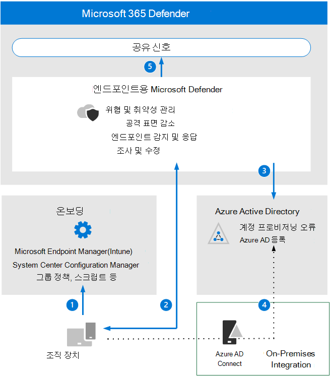

# 끝점 아키텍처 요구 사항 및 주요 개념에 대한 Microsoft Defender 검토

**적용 사항: Microsoft 365 Defender**

이 문서에서는 끝점 환경용 Microsoft Defender에 대한 평가를 설정하는 과정을 안내합니다.

이 프로세스에 대한 자세한 내용은 개요 문서를 [참조하세요.](eval-defender-endpoint-overview.md)

끝점에 대해 Microsoft Defender를 사용하도록 설정하기 전에 아키텍처를 이해하고 요구 사항을 충족할 수 있는지 확인합니다.

## 아키텍처 이해

다음 다이어그램에서는 끝점 아키텍처 및 통합을 위한 Microsoft Defender를 보여 제공합니다. 

다음 표에서는 그림에 대해 설명하고 있습니다.

Call-out | 설명
:---|:---|
1 | 디바이스는 지원되는 관리 도구 중 하나를 통해 보드됩니다. 
2 | On-boarded devices provide and respond to Microsoft Defender for Endpoint signal data.
3  | 관리되는 디바이스가 가입 및/또는 등록된 Azure Active Directory.
4  | 도메인에 가입된 Windows 장치를 사용하여 Azure Active Directory 동기화 Azure Active Directory 커넥트.
5 | 끝점 경고, 조사 및 응답에 대한 Microsoft Defender는 모든 Microsoft 365 Defender.

## 주요 개념 이해

다음 표에서는 끝점용 Microsoft Defender를 평가, 구성 및 배포할 때 이해해야 하는 주요 개념을 확인했습니다. 

개념 | 설명 | 추가 정보
:---|:---|:---|
관리 포털 | Microsoft 365 Defender 잠재적인 지속적인 위협 활동 또는 데이터 위반 경고에 대한 대응을 모니터링하고 지원할 수 있는 포털입니다. | [끝점용 Microsoft Defender 포털 개요](/microsoft-365/security/defender-endpoint/portal-overview)
공격 표면 감소 | 조직이 사이버 위협 및 공격에 취약한 장소를 최소화하여 공격 표면을 줄이는 데 도움을 줄 수 있습니다. | [공격 표면 감소 개요](/microsoft-365/security/defender-endpoint/overview-attack-surface-reduction)
끝점 검색 및 응답 | 끝점 감지 및 응답 기능은 거의 실시간으로 실행 가능한 고급 공격 감지 기능을 제공합니다. | [끝점 검색 및 응답 기능 개요](/microsoft-365/security/defender-endpoint/overview-endpoint-detection-response)
동작 차단 및 포함 | 동작 차단 및 포함 기능은 위협이 실행을 시작한 경우에도 동작 및 처리 트리에 따라 위협을 식별하고 중지하는 데 도움이 될 수 있습니다. | [동작 차단 및 제약](/microsoft-365/security/defender-endpoint/behavioral-blocking-containment)
자동화된 조사 및 대응 | 자동화된 조사는 보안 분석가가 사용하는 프로세스에 따라 다양한 검사 알고리즘을 사용하며 경고를 검사하고 위반을 해결하기 위해 즉각적인 조치를 취하도록 디자인되었습니다. | [자동화된 조사를 사용하여 위협 조사 및 수정](/microsoft-365/security/defender-endpoint/automated-investigations)
고급 헌팅 | 고급 헌팅은 네트워크에서 이벤트를 사전 검사하여 위협 표시기 및 엔터티를 찾을 수 있도록 최대 30일의 원시 데이터를 탐색할 수 있는 쿼리 기반 위협 헌팅 도구입니다. | [고급 헌팅 개요](/microsoft-365/security/defender-endpoint/advanced-hunting-overview)
위협 분석 | 위협 분석은 가장 관련성이 높은 위협을 다루는 전문 Microsoft 보안 연구원의 보고서 집합입니다. | [새로운 위협 추적 및 대응](/microsoft-365/security/defender-endpoint/threat-analytics)

끝점용 Microsoft Defender에 포함된 기능에 대한 자세한 내용은 [Endpoint용 Microsoft Defender 를 참조하세요.](/microsoft-365/security/defender-endpoint/microsoft-defender-endpoint)

## SIEM 통합

끝점용 Microsoft Defender를 Azure Sentinel과 통합하여 조직 전체의 보안 이벤트를 보다 포괄적으로 분석하고 효과적이고 즉각적인 응답을 위해 플레이북을 빌드할 수 있습니다. 

끝점용 Microsoft Defender를 다른 SIEM(보안 정보 및 이벤트 관리) 솔루션에 통합할 수도 있습니다. 자세한 내용은 [Enable SIEM integration in Microsoft Defender for Endpoint을 참조하세요.](/microsoft-365/security/defender-endpoint/enable-siem-integration)

## 다음 단계
[평가 사용](eval-defender-endpoint-enable-eval.md)

[끝점용 Microsoft Defender 평가 개요로 돌아가기](eval-defender-endpoint-overview.md)

평가 및 파일럿 테스트 [개요로 Microsoft 365 Defender](eval-overview.md)
