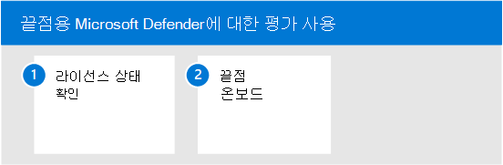
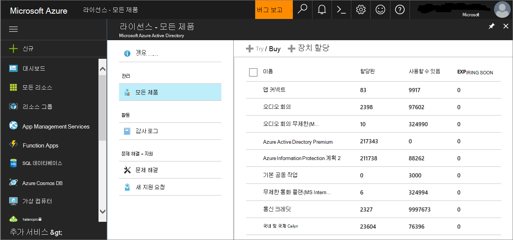
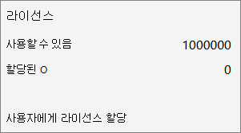

# 끝점 평가 환경에 Microsoft Defender 사용

이 문서에서는 프로덕션 장치를 사용하여 끝점용 Microsoft Defender의 평가 환경을 설정하는 단계를 안내합니다. 

> [!TIP]
> 끝점용 Microsoft Defender에는 미리 구성된 장치를 추가하고 시뮬레이션을 실행하여 플랫폼의 기능을 평가할 수 있는 제품 내 평가 랩도 함께 제공합니다. 이 랩에는 고급 헌팅 및 위협 분석과 같은 많은 기능에 대한 지침을 포함하여 끝점용 Microsoft Defender의 가치를 빠르게 보여 줄 수 있는 간소화된 설정 환경이 제공됩니다. 자세한 내용은 [기능 평가를 참조하세요.](../defender-endpoint/evaluation-lab.md)   이 문서에서 제공하는 지침과 평가 랩의 주요 차이점은 평가 환경은 프로덕션 장치를 사용하는 반면, 평가 랩은 프로덕션이 아닌 장치를 사용하다는 것입니다. 

다음 단계를 사용하여 끝점용 Microsoft Defender에 대한 평가를 사용하도록 설정할 수 있습니다.

- [1단계. 라이선스 상태 확인](#step-1-check-license-state)
- [2단계. 끝점 온보드](#step-2-onboard-endpoints-using-any-of-the-supported-management-tools)

## 1단계. 라이선스 상태 확인

먼저 라이선스 상태를 확인하여 라이선스가 제대로 프로비전되었는지 확인해야 합니다. 이 작업을 관리 센터 또는 관리 포털을 통해 Microsoft Azure **있습니다.**

1. 라이선스를 확인하기 위해 Microsoft Azure **포털로** 이동하여 Microsoft Azure 포털 라이선스 섹션으로 [이동합니다.](https://portal.azure.com/#blade/Microsoft_AAD_IAM/LicensesMenuBlade/Products)

   

1. 또는 관리 센터에서 청구 **구독으로**  >  **이동합니다.**

    화면에 프로비전된 모든 라이선스 및 해당 현재 상태가 **표시됩니다.**

    

## 2단계. 지원되는 관리 도구를 사용하여 끝점 온보드

라이선스 상태가 올바르게 프로비전되었는지 확인한 후 장치에 서비스 등록을 시작할 수 있습니다. 

끝점용 Microsoft Defender를 평가하기 위해 평가를 수행하기 위해 몇 Windows 10 장치를 선택하는 것이 좋습니다.

지원되는 관리 도구를 사용할 수 있지만 Intune은 최적의 통합을 제공합니다. 자세한 내용은 [Configure Microsoft Defender for Endpoint in Microsoft Intune.](/mem/intune/protect/advanced-threat-protection-configure#enable-microsoft-defender-for-endpoint-in-intune)

배포 [계획 항목에서는](../defender-endpoint/deployment-strategy.md) 끝점용 Defender를 배포하는 데 필요한 일반적인 단계를 간략하게 설명합니다.  

이 비디오를 시청하여 온보더링 프로세스에 대한 간략한 개요를 알아보고 사용 가능한 도구 및 방법에 대해 자세히 알아보습니다.

> [!VIDEO https://www.microsoft.com/videoplayer/embed/RE4bGqr]

### 온보더링 도구 옵션

다음 표에는 온보드해야 하는 끝점에 따라 사용 가능한 도구가 나열됩니다.

끝점 | 도구 옵션
:---|:---
**Windows** | [로컬 스크립트(최대 10대의 장치),](../defender-endpoint/configure-endpoints-script.md)그룹 [정책, Microsoft Endpoint Manager/ 모바일](../defender-endpoint/configure-endpoints-mdm.md)장치 관리자, Microsoft Endpoint Configuration Manager, [VDI](../defender-endpoint/configure-endpoints-vdi.md)스크립트, [Azure Defender와의](../defender-endpoint/configure-server-endpoints.md#integration-with-azure-defender) 통합  
**macOS** | [로컬 스크립트](../defender-endpoint/mac-install-manually.md) [,](../defender-endpoint/mac-install-with-intune.md)Microsoft Endpoint Manager , [JAMF Pro](../defender-endpoint/mac-install-with-jamf.md), 모바일 장치 [관리](../defender-endpoint/mac-install-with-other-mdm.md)
**Linux Server** | [로컬 스크립트,](../defender-endpoint/linux-install-manually.md)  [Puppet](../defender-endpoint/linux-install-with-puppet.md),  [Ansible](../defender-endpoint/linux-install-with-ansible.md)
**iOS** | [앱 기반](../defender-endpoint/ios-install.md)
**Android** | [Microsoft Endpoint Manager ](../defender-endpoint/android-intune.md)

## 다음 단계
[끝점용 Microsoft Defender에 대한 파일럿 설정](eval-defender-endpoint-pilot.md)
 
[끝점용 Microsoft Defender 평가 개요로 돌아가기](eval-defender-endpoint-overview.md)

평가 및 파일럿 테스트 [개요로 Microsoft 365 Defender](eval-overview.md)
