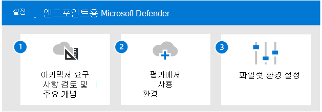

# 끝점용 Microsoft Defender 개요 평가

**적용 대상:**

- Microsoft 365 Defender

이 문서에서는 끝점용 Microsoft Defender를 사용하도록 설정하고 파일럿하는 프로세스를 간략하게 설명합니다. 이 프로세스를 시작하기 전에 전체 프로세스를 검토하여 Microsoft 365 Defender  평가 환경을 Microsoft 365 Defender [합니다.](eval-create-eval-environment.md) 
 

다음 단계에 따라 끝점용 Microsoft Defender를 사용하도록 설정하고 파일럿합니다.

다음 표에서는 그림의 단계에 대해 설명합니다.

 |단계   |설명
|---------|---------|
| [1단계. 아키텍처 요구 사항 및 주요 개념 검토](eval-defender-endpoint-architecture.md)    | 끝점용 Defender 아키텍처 및 사용 가능한 기능을 이해합니다.       |
|[2단계. 평가 환경 사용](eval-defender-office-365-enable-eval.md)     |   단계에 따라 평가 환경을 설치합니다.      |
|[3단계. 파일럿 설정 ](eval-defender-office-365-pilot.md)    |    파일럿 그룹을 확인하고 시뮬레이션을 실행하며 주요 기능 및 대시보드에 익숙해지기.     |

